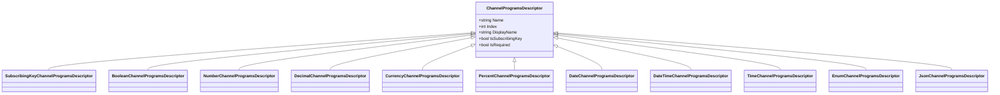

# ChannelProgramsDescriptors

> Field type descriptors for channel metadata

## Contents

- [Overview](#overview)
- [Architecture](#architecture)
- [Public Types](#public-types)
- [Files](#files)
- [Submodules](#submodules)
- [Usage](#usage)

## Overview

Channel program descriptors define the schema and behavior of channel fields including data types, formatting, validation, and whether fields are subscribing keys.

**Key Features:**
- 📊 Type-safe field descriptors
- 🔑 Subscribing key marking
- 🎨 Display formatting
- ✅ Validation rules
- 📝 Metadata annotations

## Architecture



## Public Types

### ChannelProgramsDescriptor

**Kind:** Abstract Class  
**Namespace:** `ThunderPropagator.Application.Channels.ChannelProgramsDescriptors`

Base descriptor for all channel field types.

**Key Members:**
- `string Name` - Field name (unique identifier)
- `int Index` - Field index for ordering
- `string DisplayName` - Human-readable name
- `string? Description` - Field description
- `bool IsSubscribingKey` - Whether field is a subscribing key
- `bool IsRequired` - Whether field is required
- `object? DefaultValue` - Default value if not provided

**Usage Recipe:**
```csharp
// Abstract - use derived types
```

### ChannelProgramsDescriptorCollection

**Kind:** Class  
**Namespace:** `ThunderPropagator.Application.Channels.ChannelProgramsDescriptors`

Collection managing channel field descriptors.

**Key Members:**
- `void Add(ChannelProgramsDescriptor descriptor)` - Add descriptor
- `ChannelProgramsDescriptor? this[string name]` - Get by name
- `IEnumerable<ChannelProgramsDescriptor> this[int index]` - Get by index
- `int Count` - Descriptor count

**Usage Recipe:**
```csharp
var descriptors = new ChannelProgramsDescriptorCollection();

descriptors.Add(new SubscribingKeyChannelProgramsDescriptor
{
    Name = "symbol",
    Index = 0,
    DisplayName = "Stock Symbol",
    IsRequired = true
});

descriptors.Add(new DecimalChannelProgramsDescriptor
{
    Name = "price",
    Index = 1,
    DisplayName = "Price",
    DecimalPlaces = 2
});
```

## Files

| File | LOC | Responsibility |
|------|-----|---------------|
| [ChannelProgramsDescriptor.cs](../../src/ThunderPropagator.Application/Channels/ChannelProgramsDescriptors/ChannelProgramsDescriptor.cs) | 47 | Base descriptor class |
| [ChannelProgramsDescriptorCollection.cs](../../src/ThunderPropagator.Application/Channels/ChannelProgramsDescriptors/ChannelProgramsDescriptorCollection.cs) | 162 | Descriptor collection management |

**Total Files (excluding DataTypes):** 2  
**Total LOC:** 209

## Submodules

- [📁 DataTypes](DataTypes/README.md) - Specific data type descriptors (313 LOC, 11 files)

## Usage

### Defining Channel Schema

```csharp
public class StockMetadata : AbstractChannelMetadata
{
    public override string ChannelName => "stocks";
    
    public StockMetadata()
    {
        // Subscribing key
        ChannelProgramsDescriptors.Add(new SubscribingKeyChannelProgramsDescriptor
        {
            Name = "symbol",
            Index = 0,
            DisplayName = "Symbol",
            IsRequired = true
        });
        
        // Decimal field
        ChannelProgramsDescriptors.Add(new DecimalChannelProgramsDescriptor
        {
            Name = "price",
            Index = 1,
            DisplayName = "Price",
            DecimalPlaces = 2,
            MinValue = 0
        });
        
        // Number field
        ChannelProgramsDescriptors.Add(new NumberChannelProgramsDescriptor
        {
            Name = "volume",
            Index = 2,
            DisplayName = "Volume"
        });
        
        // Percent field
        ChannelProgramsDescriptors.Add(new PercentChannelProgramsDescriptor
        {
            Name = "change_percent",
            Index = 3,
            DisplayName = "Change %",
            DecimalPlaces = 2
        });
        
        // DateTime field
        ChannelProgramsDescriptors.Add(new DateTimeChannelProgramsDescriptor
        {
            Name = "timestamp",
            Index = 4,
            DisplayName = "Timestamp",
            Format = "yyyy-MM-dd HH:mm:ss"
        });
    }
}
```

### Accessing Descriptors

```csharp
var channel = serviceProvider.GetRequiredService<StockChannel>();
var metadata = channel.Metadata;

// Get by name
var priceDescriptor = metadata.ChannelProgramsDescriptors["price"];
Console.WriteLine($"Display: {priceDescriptor.DisplayName}");

// Get subscribing keys
var keys = metadata.ChannelProgramsDescriptors
    .Where(d => d.IsSubscribingKey)
    .ToArray();

// Get required fields
var required = metadata.ChannelProgramsDescriptors
    .Where(d => d.IsRequired)
    .ToArray();
```

---

**Navigation:**  
[⬆️ Channels](../README.md) | [DataTypes](DataTypes/README.md) | [⬆️ Application Layer](../../README.md)

---

**Statistics:** 2 public types · 2 files · 209 LOC · 1 submodule  
**Diagrams:** ✓ Class hierarchy
