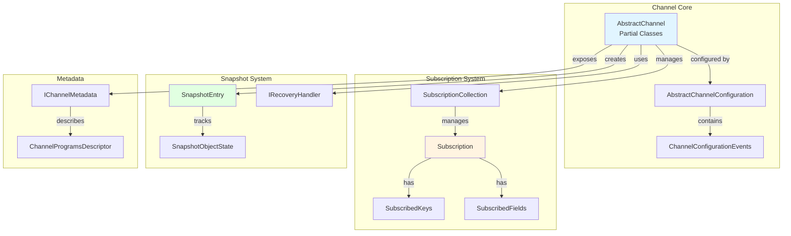
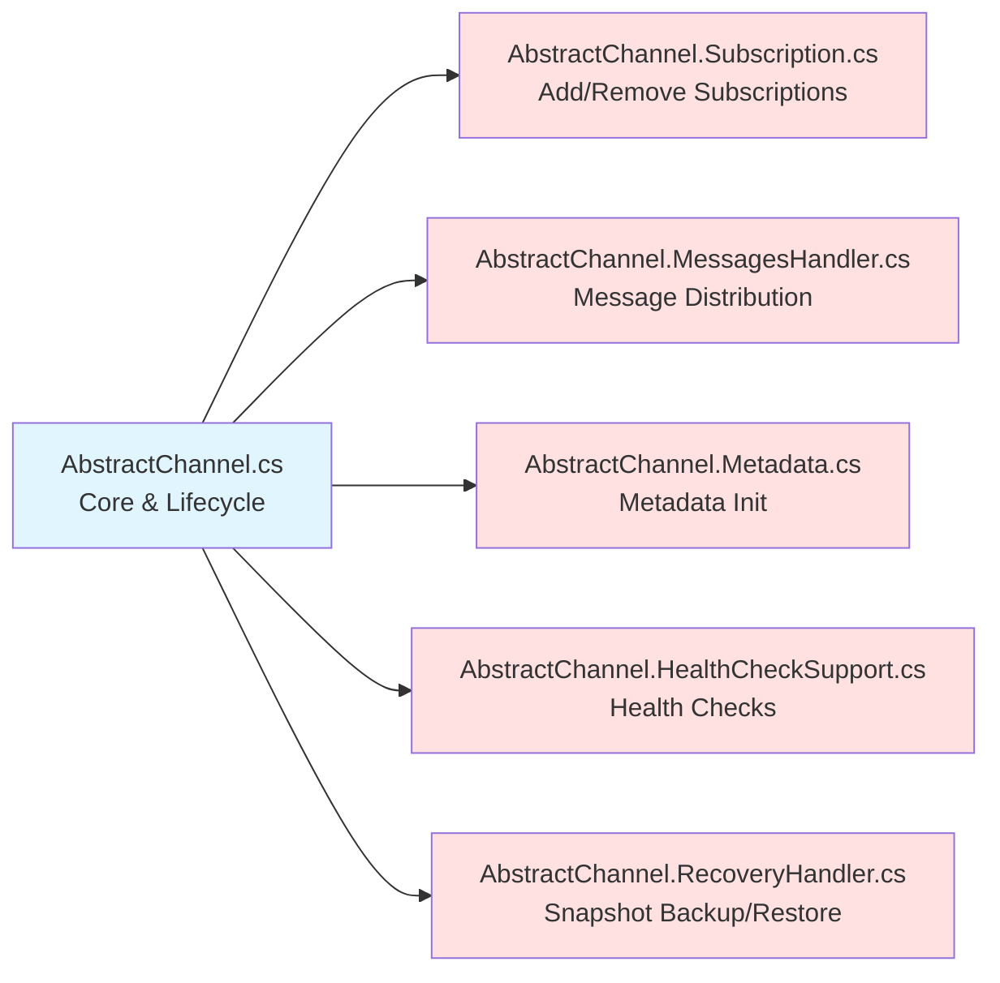

# Channels

> Protocol-agnostic channel abstractions for real-time message distribution with subscription management

## Contents

- [Overview](#overview)
- [Architecture](#architecture)
- [Public Types](#public-types)
- [Files](#files)
- [Submodules](#submodules)
- [Design Patterns](#design-patterns)
- [Usage](#usage)

## Overview

The Channels module provides the core abstraction for managing real-time data streams in ThunderPropagator. Channels act as named distribution points where feeders emit messages and subscribed connections receive filtered data based on keys and fields.

**Key Features:**
- 🔑 Key-based subscription filtering
- 📋 Field-level selection (Full/Incremental modes)
- 💾 Snapshot backup/restore for state recovery
- 🔐 Encryption and authentication metadata
- 📊 Built-in health checks and telemetry
- 🎯 C# script hooks for lifecycle events
- 📝 Program descriptors for field metadata

## Architecture



## Design Patterns

### 1. Partial Class Organization

`AbstractChannel` splits implementation across 6 files for separation of concerns:



### 2. Three-Level Inheritance

```csharp
// Level 1: Base (no generics)
AbstractChannel : DisposableObject, IChannel

// Level 2: Typed metadata
AbstractChannel<TChannelMetadata> : AbstractChannel

// Level 3: Full specialization
AbstractChannel<TChannelMetadata, TChannelConfiguration> : AbstractChannel<TChannelMetadata>
```

### 3. Event-Driven Configuration

C# script hooks compiled at runtime:

```csharp
ChannelConfiguration.Events.MessageEmitting = @"
    (channel, message) => {
        message[""timestamp""] = DateTime.UtcNow;
    }
";
```

## Public Types

### IChannel

**Kind:** Interface  
**Namespace:** `ThunderPropagator.Application.Channels`  
**Implements:** `IDisposable`

Primary channel interface for message distribution and subscription management.

**Key Members:**
- `Guid Key` - Unique channel identifier
- `IChannelMetadata Metadata` - Channel metadata (name, descriptions, programs)
- `Func<string, string> MessageEncryptor` - Encryption function
- `event EventHandler<Subscription>? SubscriptionAdded` - Subscription added event
- `event EventHandler<Subscription>? SubscriptionRemoved` - Subscription removed event
- `IEnumerable<Subscription> Subscribe(...)` - Add subscriptions for connection
- `void Unsubscribe(...)` - Remove subscriptions
- `void EmitMessage(FeederMessage)` - Emit message to subscribers
- `Task<SnapshotEntry[]> SnapshotsToSendAsync(...)` - Get snapshots for subscription
- `Task<SnapshotEntry[]> SearchSnapshotsAsync(...)` - Search snapshot entries

**Usage Recipe:**
```csharp
public class StockChannel : AbstractChannel<StockMetadata, StockConfiguration>
{
    public StockChannel(IServiceProvider serviceProvider) 
        : base(serviceProvider)
    {
    }
}

// Usage
var subscriptions = channel.Subscribe(
    connectionInfo,
    requestId: "REQ-001",
    subscribeRequest: new MySubscribeRequest 
    {
        SubscribingKeys = new Dictionary<string, IReadOnlyDictionary<string, string>>
        {
            ["symbol"] = new Dictionary<string, string> { ["="] = "AAPL" }
        },
        SubscribingFields = ["price", "volume"]
    }
);
```

### AbstractChannel

**Kind:** Abstract Partial Class  
**Namespace:** `ThunderPropagator.Application.Channels`  
**Inherits:** `DisposableObject`, `IChannel`

Base implementation providing subscription management, snapshot handling, and message distribution.

**Partial Files:**
- [AbstractChannel.cs](../../src/ThunderPropagator.Application/Channels/AbstractChannel.cs) - Core properties and lifecycle (216 LOC)
- [AbstractChannel.Subscription.cs](../../src/ThunderPropagator.Application/Channels/AbstractChannel.Subscription.cs) - Subscription operations (206 LOC)
- [AbstractChannel.MessagesHandler.cs](../../src/ThunderPropagator.Application/Channels/AbstractChannel.MessagesHandler.cs) - Message routing (374 LOC)
- [AbstractChannel.Metadata.cs](../../src/ThunderPropagator.Application/Channels/AbstractChannel.Metadata.cs) - Metadata initialization (67 LOC)
- [AbstractChannel.HealthCheckSupport.cs](../../src/ThunderPropagator.Application/Channels/AbstractChannel.HealthCheckSupport.cs) - Health check integration (52 LOC)
- [AbstractChannel.RecoveryHandler.cs](../../src/ThunderPropagator.Application/Channels/AbstractChannel.RecoveryHandler.cs) - Snapshot backup/restore (123 LOC)

**Key Members:**
- `AbstractChannelConfiguration ChannelConfiguration` - Channel configuration
- `Func<string, string> MessageEncryptor` - Message encryption function
- `void Initialize(CancellationToken)` - Initialize subscriptions, metadata, snapshots
- `void EmitMessage(FeederMessage)` - Distribute message to matching subscriptions

**Usage Recipe:**
```csharp
[MaxAllowedSnapshotEntries(100000)]
public class MyChannel : AbstractChannel<MyMetadata, MyConfiguration>
{
    public MyChannel(IServiceProvider serviceProvider) 
        : base(serviceProvider)
    {
    }
}
```

### AbstractChannelConfiguration

**Kind:** Abstract Class  
**Namespace:** `ThunderPropagator.Application.Channels`  
**Implements:** `INotifyPropertyChanged`

Base configuration class with event script support.

**Key Members:**
- `bool IsEnabled` - Channel enabled status
- `ChannelConfigurationEvents Events` - C# script event hooks

**Usage Recipe:**
```csharp
public class StockConfiguration : AbstractChannelConfiguration
{
    public StockConfiguration()
    {
        IsEnabled = true;
        Events.MessageEmitting = @"
            (channel, message) => {
                message[""server_time""] = DateTime.UtcNow;
            }
        ";
    }
}
```

### ChannelConfigurationEvents

**Kind:** Sealed Class  
**Namespace:** `ThunderPropagator.Application.Channels`  
**Implements:** `INotifyPropertyChanged`

Container for C# script event hooks executed during channel lifecycle.

**Key Members:**
- `string? MessageEmitting` - Before message emission
- `string? MessageEmitted` - After message emission
- `string? BeforeBackup` - Before snapshot backup
- `string? AfterBackup` - After snapshot backup
- `string? BeforeRestore` - Before snapshot restore
- `string? AfterRestore` - After snapshot restore
- `string? BeforeCleanup` - Before snapshot cleanup
- `string? AfterCleanup` - After snapshot cleanup
- `string? BeforeHibernate` - Before entry hibernation
- `string? AfterHibernate` - After entry hibernation
- `string? SubscriptionAdded` - When subscription added
- `string? SubscriptionRemoved` - When subscription removed

**Script Signatures:**
- Message events: `Action<IChannel, IReadOnlyDictionary<string, object?>>`
- Backup/Restore: `Action<IChannel, int?>`
- Hibernate: `Action<IChannel, int, IReadOnlyDictionary<string, object?>>`
- Subscription: `Action<IChannel, Subscription>`

### IChannelManager

**Kind:** Interface (Internal)  
**Namespace:** `ThunderPropagator.Application.Channels`

Internal interface for channel registration and pipeline resolution.

**Key Members:**
- `IEnumerable<IReceivePipeline> GetChannelReceiverPipelines(Type, IServiceProvider)`

### ISubscribeRequest

**Kind:** Interface  
**Namespace:** `ThunderPropagator.Application.Channels`

Contract for subscription requests from clients.

**Key Members:**
- `IReadOnlyDictionary<string, IReadOnlyDictionary<string, string>> SubscribingKeys` - Key filters
- `IReadOnlyCollection<string> SubscribingFields` - Field selection
- `SubscriptionMode? SubscriptionMode` - Full or Incremental

**Usage Recipe:**
```csharp
public class MySubscribeRequest : ISubscribeRequest
{
    public IReadOnlyDictionary<string, IReadOnlyDictionary<string, string>> SubscribingKeys { get; set; }
    public IReadOnlyCollection<string> SubscribingFields { get; set; }
    public SubscriptionMode? SubscriptionMode { get; set; }
}
```

### IUnsubscribeRequest

**Kind:** Interface  
**Namespace:** `ThunderPropagator.Application.Channels`

Contract for unsubscription requests.

**Key Members:**
- `IReadOnlyCollection<IReadOnlyDictionary<string, string>>? SubscribedKeys` - Keys to unsubscribe

### MaxAllowedSnapshotEntriesAttribute

**Kind:** Sealed Attribute  
**Namespace:** `ThunderPropagator.Application.Channels`

Decorates channel classes to set maximum snapshot dictionary capacity.

**Key Members:**
- `int Count` - Maximum snapshot entries

**Usage Recipe:**
```csharp
[MaxAllowedSnapshotEntries(50000)]
public class HighVolumeChannel : AbstractChannel<MyMetadata, MyConfig>
{
    // Channel will initialize snapshot dictionary with capacity of 50,000
}
```

## Files

| File | LOC | Responsibility |
|------|-----|---------------|
| [AbstractChannel.cs](../../src/ThunderPropagator.Application/Channels/AbstractChannel.cs) | 216 | Core channel lifecycle and three-level inheritance |
| [AbstractChannel.Subscription.cs](../../src/ThunderPropagator.Application/Channels/AbstractChannel.Subscription.cs) | 206 | Add/remove subscription operations |
| [AbstractChannel.MessagesHandler.cs](../../src/ThunderPropagator.Application/Channels/AbstractChannel.MessagesHandler.cs) | 374 | Message distribution and filtering |
| [AbstractChannel.Metadata.cs](../../src/ThunderPropagator.Application/Channels/AbstractChannel.Metadata.cs) | 67 | Metadata initialization and scripts |
| [AbstractChannel.HealthCheckSupport.cs](../../src/ThunderPropagator.Application/Channels/AbstractChannel.HealthCheckSupport.cs) | 52 | Health check integration |
| [AbstractChannel.RecoveryHandler.cs](../../src/ThunderPropagator.Application/Channels/AbstractChannel.RecoveryHandler.cs) | 123 | Snapshot backup/restore |
| [AbstractChannelConfiguration.cs](../../src/ThunderPropagator.Application/Channels/AbstractChannelConfiguration.cs) | 51 | Base configuration with INotifyPropertyChanged |
| [ChannelConfigurationEvents.cs](../../src/ThunderPropagator.Application/Channels/ChannelConfigurationEvents.cs) | 112 | C# script event hooks |
| [IChannel.cs](../../src/ThunderPropagator.Application/Channels/IChannel.cs) | 36 | Primary channel interface |
| [IChannelManager.cs](../../src/ThunderPropagator.Application/Channels/IChannelManager.cs) | 9 | Internal channel manager interface |
| [ISubscribeRequest.cs](../../src/ThunderPropagator.Application/Channels/ISubscribeRequest.cs) | 11 | Subscribe request contract |
| [IUnsubscribeRequest.cs](../../src/ThunderPropagator.Application/Channels/IUnsubscribeRequest.cs) | 7 | Unsubscribe request contract |
| [MaxAllowedSnapshotEntriesAttribute.cs](../../src/ThunderPropagator.Application/Channels/MaxAllowedSnapshotEntriesAttribute.cs) | 17 | Snapshot capacity attribute |

**Total Files:** 13  
**Total LOC:** 1,281

## Submodules

- [📁 ChannelProgramsDescriptors](ChannelProgramsDescriptors/README.md) - Field type descriptors (322 LOC, 13 files)
- [📁 Contexts](Contexts/README.md) - Request/response contexts (124 LOC, 4 files)
- [📁 Exceptions](Exceptions/README.md) - Channel-specific exceptions (84 LOC, 6 files)
- [📁 Metadata](Metadata/README.md) - Channel metadata types (401 LOC, 8 files)
- [📁 Snapshots](Snapshots/README.md) - Snapshot and recovery system (544 LOC, 6 files)
- [📁 Subscribers](Subscribers/README.md) - Subscription management (857 LOC, 8 files)

## Usage

### Creating a Custom Channel

```csharp
// 1. Define metadata
public class StockMetadata : IChannelMetadata
{
    public string ChannelName => "stocks";
    public string ChannelDisplayName => "Stock Prices";
    // ... other metadata
}

// 2. Define configuration
public class StockConfiguration : AbstractChannelConfiguration
{
    public StockConfiguration()
    {
        IsEnabled = true;
        Events.MessageEmitting = @"
            (channel, message) => {
                message[""timestamp""] = DateTime.UtcNow.Ticks;
            }
        ";
    }
}

// 3. Implement channel
[MaxAllowedSnapshotEntries(10000)]
public class StockChannel : AbstractChannel<StockMetadata, StockConfiguration>
{
    public StockChannel(IServiceProvider serviceProvider) 
        : base(serviceProvider)
    {
    }
}

// 4. Register in DI
services.TryAddSingleton<StockChannel>();
services.TryAddSingleton<StockConfiguration>();
```

### Subscribing to Channel

```csharp
var channel = serviceProvider.GetRequiredService<StockChannel>();

var subscriptions = channel.Subscribe(
    connectionInfo,
    requestId: Guid.NewGuid().ToString(),
    subscribeRequest: new StockSubscribeRequest
    {
        SubscribingKeys = new Dictionary<string, IReadOnlyDictionary<string, string>>
        {
            ["symbol"] = new Dictionary<string, string> 
            { 
                ["="] = "AAPL,MSFT,GOOGL" 
            }
        },
        SubscribingFields = new[] { "price", "volume", "change" },
        SubscriptionMode = SubscriptionMode.Full
    }
);

foreach (var subscription in subscriptions)
{
    Console.WriteLine($"Subscribed: {subscription.RequestId}");
}
```

### Emitting Messages

```csharp
var message = new FeederMessage
{
    ["symbol"] = "AAPL",
    ["price"] = 150.25m,
    ["volume"] = 1000000,
    ["change"] = 2.5m
};

channel.EmitMessage(message);
// Message automatically filtered and sent to matching subscriptions
```

### Using Snapshot Recovery

```csharp
// Search snapshots
var snapshots = await channel.SearchSnapshotsAsync(
    entry => entry.FeederMessageFieldValues.ContainsKey("symbol") &&
             (string)entry.FeederMessageFieldValues["symbol"] == "AAPL",
    page: 0,
    pageSize: 100
);

foreach (var snapshot in snapshots)
{
    Console.WriteLine($"Symbol: {snapshot.FeederMessageFieldValues["symbol"]}");
    Console.WriteLine($"Price: {snapshot.FeederMessageFieldValues["price"]}");
}
```

---

**Navigation:**  
[⬆️ Application Layer](../README.md) | 🔧 Submodules: [Subscribers](Subscribers/README.md) · [Metadata](Metadata/README.md) · [Snapshots](Snapshots/README.md)

---

**Statistics:** 8 public types · 13 files · 1,281 LOC · 6 submodules  
**Diagrams:** ✓ Architecture · ✓ Partial class structure · ✓ Inheritance levels
