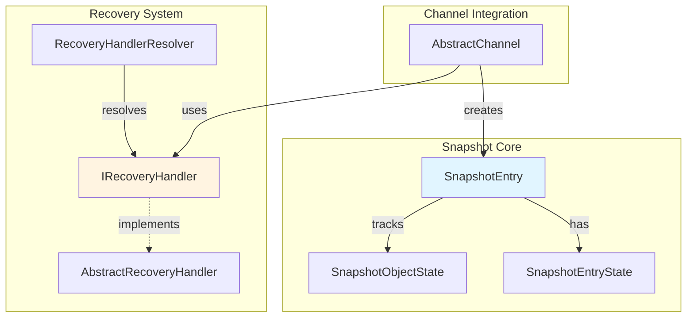

# Snapshots

> State persistence and recovery system for channel data

## Contents

- [Overview](#overview)
- [Architecture](#architecture)
- [Public Types](#public-types)
- [Files](#files)
- [Submodules](#submodules)
- [Usage](#usage)

## Overview

The Snapshots module provides state persistence for channel messages, enabling recovery, historical queries, and initial state transmission to new subscribers. Each snapshot entry represents a message's state with tracking for additions, modifications, and hibernation.

**Key Features:**
- 💾 In-memory snapshot storage
- 🔄 State tracking (Added, Modified, Hibernated)
- 🔍 Search and query support
- 📦 Backup/restore capabilities
- ⏰ Time-series support
- 🧹 Automatic cleanup of hibernated entries

## Architecture



## Public Types

### SnapshotEntry

**Kind:** Class  
**Namespace:** `ThunderPropagator.Application.Channels.Snapshots`

Represents a single snapshot of message state with change tracking.

**Key Members:**
- `int HashKey` - Unique hash key for entry
- `IReadOnlyDictionary<string, object?> Keys` - Key fields
- `IReadOnlyDictionary<string, object?> Snapshot` - Current snapshot
- `IReadOnlyDictionary<string, object?> ChangedValues` - Changed fields since last snapshot
- `SnapshotObjectState LastSnapshotState` - Last state (Added/Modified)
- `SnapshotEntryState SnapshotEntryState` - Entry state (Active/Hibernated)
- `DateTime? UpdatedAt` - Last update timestamp
- `DateTime? CreatedAt` - Creation timestamp
- `CastType CastType` - Broadcast or specific cast type

**Usage Recipe:**
```csharp
var entry = new SnapshotEntry(
    hashKey: 12345,
    keys: new Dictionary<string, object?> { ["symbol"] = "AAPL" },
    snapshot: new Dictionary<string, object?> 
    { 
        ["symbol"] = "AAPL",
        ["price"] = 150.25m,
        ["volume"] = 1000000
    },
    castType: CastType.Broadcast
);

// Check if modified
if (entry.LastSnapshotState == SnapshotObjectState.Modified)
{
    // Get only changed fields
    var changes = entry.ChangedValues;
}
```

### SnapshotObjectState

**Kind:** Enum  
**Namespace:** `ThunderPropagator.Application.Channels.Snapshots`

Tracks message modification state.

**Values:**
- `Neutral = 0` - Unchanged
- `Added = 1` - Newly added message
- `Modified = 2` - Modified existing message

### SnapshotEntryState

**Kind:** Enum  
**Namespace:** `ThunderPropagator.Application.Channels.Snapshots`

Tracks entry lifecycle state.

**Values:**
- `Active = 0` - Entry is active
- `Hibernated = 1` - Entry is hibernated (pending cleanup)

## Files

| File | LOC | Responsibility |
|------|-----|---------------|
| [SnapshotEntry.cs](../../src/ThunderPropagator.Application/Channels/Snapshots/SnapshotEntry.cs) | 217 | Snapshot entry with change tracking |
| [SnapshotObjectState.cs](../../src/ThunderPropagator.Application/Channels/Snapshots/SnapshotObjectState.cs) | 9 | Object state enumeration |
| [SnapshotEntryState.cs](../../src/ThunderPropagator.Application/Channels/Snapshots/SnapshotEntryState.cs) | 9 | Entry state enumeration |

**Total Files (excluding Recovery):** 3  
**Total LOC:** 235

## Submodules

- [📁 Recovery](Recovery/README.md) - Backup/restore handlers (309 LOC, 3 files)

## Usage

### Working with Snapshots

```csharp
// Snapshots are automatically managed by AbstractChannel
var channel = serviceProvider.GetRequiredService<StockChannel>();

// Search snapshots
var snapshots = await channel.SearchSnapshotsAsync(
    entry => entry.Keys.ContainsKey("symbol") &&
             (string)entry.Keys["symbol"] == "AAPL",
    page: 0,
    pageSize: 100
);

foreach (var snapshot in snapshots)
{
    Console.WriteLine($"Symbol: {snapshot.Keys["symbol"]}");
    Console.WriteLine($"Price: {snapshot.Snapshot["price"]}");
    Console.WriteLine($"State: {snapshot.LastSnapshotState}");
    Console.WriteLine($"Updated: {snapshot.UpdatedAt}");
}
```

### Snapshot for New Subscriber

```csharp
// When new subscription is created
var subscription = subscriptions.First();

// Get snapshots to send
var snapshotsToSend = await channel.SnapshotsToSendAsync(
    subscription,
    cancellationToken
);

// Send initial state
foreach (var snapshot in snapshotsToSend)
{
    var message = new ConnectionSubscriptionPushingMessage(
        channel,
        subscription,
        snapshot.Snapshot,
        leftSubscribedKeys: new Dictionary<int, object?>(),
        fromSnapshot: true, // Mark as snapshot
        state: snapshot.LastSnapshotState,
        DateTime.UtcNow,
        null,
        null
    );
    
    subscription.ConnectionInfo.Enqueue(message);
}
```

### Change Tracking

```csharp
// First message - Added
var message1 = new FeederMessage
{
    ["symbol"] = "AAPL",
    ["price"] = 150.00m,
    ["volume"] = 1000000
};
channel.EmitMessage(message1);
// Snapshot state: Added
// ChangedValues: All fields

// Second message - Modified
var message2 = new FeederMessage
{
    ["symbol"] = "AAPL",
    ["price"] = 150.25m,  // Changed
    ["volume"] = 1000000  // Unchanged
};
channel.EmitMessage(message2);
// Snapshot state: Modified
// ChangedValues: { "price": 150.25 } (only changed field)
```

### Overwriting Snapshots

```csharp
// Manually overwrite snapshot (advanced)
var entry = new SnapshotEntry(
    hashKey: 12345,
    keys: new Dictionary<string, object?> { ["symbol"] = "AAPL" },
    snapshot: new Dictionary<string, object?> 
    { 
        ["symbol"] = "AAPL",
        ["price"] = 200.00m
    },
    castType: CastType.Broadcast
);

channel.OverwriteSnapshot(entry);
```

---

**Navigation:**  
[⬆️ Channels](../README.md) | [Recovery](Recovery/README.md) | [⬆️ Application Layer](../../README.md)

---

**Statistics:** 3 public types · 3 files · 235 LOC · 1 submodule  
**Diagrams:** ✓ Snapshot architecture · ✓ State tracking
