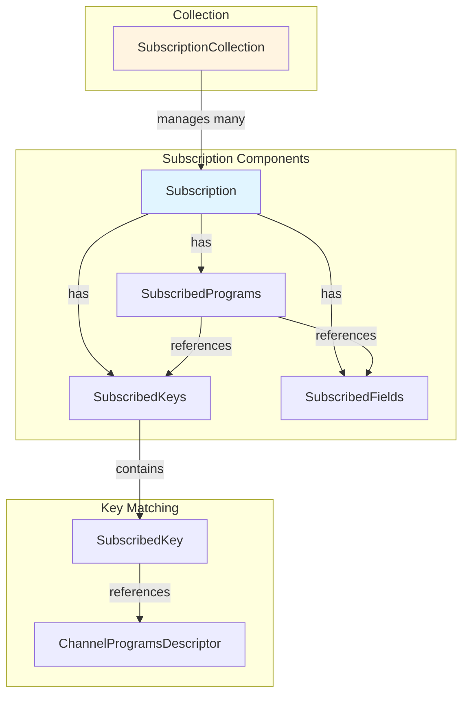

# Subscribers

> Subscription management and filtering system

## Contents

- [Overview](#overview)
- [Architecture](#architecture)
- [Public Types](#public-types)
- [Files](#files)
- [Usage](#usage)

## Overview

The Subscribers module manages channel subscriptions with key-based filtering and field selection. Each subscription represents a client's interest in specific data based on key values and selected fields.

**Key Features:**
- 🔑 Multi-key subscription matching
- 📋 Field-level selection
- 🔄 Full vs Incremental (Modified) modes
- ⚡ Optimized comparison (1-5 key fast paths)
- 🎯 Program descriptor integration
- 📊 Feature flags support

## Architecture



## Public Types

### Subscription

**Kind:** Sealed Class  
**Namespace:** `ThunderPropagator.Application.Channels.Subscribers`  
**Inherits:** `DisposableObject`

Represents a single subscription with key filtering and field selection.

**Key Members:**
- `IConnectionInfo ConnectionInfo` - Associated connection
- `string ChannelName` - Channel name
- `string RequestId` - Client request ID
- `string SubscriptionId` - Unique subscription ID
- `SubscriptionMode SubscriptionMode` - Full or Modified
- `SubscribedPrograms SubscribedPrograms` - Programs (keys + fields)

**Usage Recipe:**
```csharp
// Created by AbstractChannel.Subscribe()
var subscriptions = channel.Subscribe(
    connectionInfo,
    requestId: "REQ-001",
    subscribeRequest: new MySubscribeRequest
    {
        SubscribingKeys = new Dictionary<string, IReadOnlyDictionary<string, string>>
        {
            ["symbol"] = new Dictionary<string, string> { ["="] = "AAPL" }
        },
        SubscribingFields = new[] { "price", "volume" },
        SubscriptionMode = SubscriptionMode.Full
    }
);
```

### SubscriptionCollection

**Kind:** Class  
**Namespace:** `ThunderPropagator.Application.Channels.Subscribers`  
**Implements:** `IDisposable`

Thread-safe collection managing all subscriptions for a channel.

**Key Members:**
- `int Count` - Subscription count
- `void Add(Subscription)` - Add subscription
- `bool Remove(Subscription)` - Remove subscription
- `IEnumerable<Subscription> GetSubscriptions(IConnectionInfo)` - Get connection's subscriptions
- `IEnumerable<Subscription> GetMatchingSubscriptions(FeederMessage)` - Get matching subscriptions

**Usage Recipe:**
```csharp
var collection = new SubscriptionCollection();

// Add subscription
collection.Add(subscription);

// Find matching subscriptions for message
var message = new FeederMessage { ["symbol"] = "AAPL", ["price"] = 150.25m };
var matching = collection.GetMatchingSubscriptions(message);

foreach (var sub in matching)
{
    // Send message to sub.ConnectionInfo
}
```

### SubscribedKeys

**Kind:** Sealed Class  
**Namespace:** `ThunderPropagator.Application.Channels.Subscribers`  
**Implements:** `IReadOnlyDictionary<string, string>`, `IEquatable<IReadOnlyDictionary<string, string>>`

Immutable set of key-value pairs for subscription matching with optimized comparison.

**Key Members:**
- `SubscribedKey[] Keys` - Key array
- `string[] Values` - Value array
- `int Length` - Key count
- `string FormattedKeys` - Pipe-delimited formatted keys
- `bool Matches(IReadOnlyDictionary<string, object?>)` - Check if message matches

**Performance Optimization:**
- 1-5 keys: Specialized fast-path comparers (no loops)
- 6+ keys: Loop-based comparer

**Usage Recipe:**
```csharp
// Automatically created by Subscription
// Fast matching using optimized comparers
var matches = subscribedKeys.Matches(feederMessage);
```

### SubscribedKey

**Kind:** Record  
**Namespace:** `ThunderPropagator.Application.Channels.Subscribers`

Single key-value pair in a subscription.

**Key Members:**
- `ChannelProgramsDescriptor ChannelProgramsDescriptor` - Field descriptor
- `string Value` - Key value

### SubscribedFields

**Kind:** Sealed Class  
**Namespace:** `ThunderPropagator.Application.Channels.Subscribers`

Selected fields for subscription (determines which fields to send).

**Key Members:**
- `SubscribedPrograms SubscribedPrograms` - Parent programs
- `IEnumerable<ChannelProgramsDescriptor> Fields` - Field descriptors
- `int Length` - Field count
- `Span<KeyValuePair<string, ChannelProgramsDescriptor>> AsSpan()` - Get as span

**Usage Recipe:**
```csharp
// Filter message to only subscribed fields
var filteredMessage = new Dictionary<string, object?>();
foreach (var field in subscribedFields.Fields)
{
    if (feederMessage.TryGetValue(field.Name, out var value))
    {
        filteredMessage[field.Name] = value;
    }
}
```

### SubscribedPrograms

**Kind:** Class  
**Namespace:** `ThunderPropagator.Application.Channels.Subscribers`

Combines keys and fields for a subscription, provides message field extraction.

**Key Members:**
- `Subscription Subscription` - Parent subscription
- `SubscribedKeys SubscribedKeys` - Subscribed keys
- `SubscribedFields SubscribedFields` - Subscribed fields
- `IReadOnlyDictionary<int, object?> MessageFields(IReadOnlyDictionary<string, object?>)` - Extract subscribed fields from message

**Usage Recipe:**
```csharp
// Extract only subscribed fields
var fields = subscription.SubscribedPrograms.MessageFields(feederMessage);
// Returns dictionary with only the fields client subscribed to
```

### SubscriptionMode

**Kind:** Enum  
**Namespace:** `ThunderPropagator.Application.Channels.Subscribers`

Subscription update mode.

**Values:**
- `Full = 0` - Send all subscribed fields every time
- `Modified = 1` - Send only changed fields (incremental updates)

**Usage Recipe:**
```csharp
var subscription = new Subscription(
    connectionInfo,
    channel,
    requestId: "REQ-001",
    subscriptionId: Guid.NewGuid().ToString(),
    subscribedKeys: keys,
    subscribedFields: fields,
    subscriptionMode: SubscriptionMode.Modified // Only send changes
);
```

### Features

**Kind:** Class  
**Namespace:** `ThunderPropagator.Application.Channels.Subscribers`

Feature flags for subscription capabilities.

**Key Members:**
- `bool SupportsIncremental` - Supports Modified mode
- `bool SupportsFieldSelection` - Supports field filtering

## Files

| File | LOC | Responsibility |
|------|-----|---------------|
| [Subscription.cs](../../src/ThunderPropagator.Application/Channels/Subscribers/Subscription.cs) | 222 | Core subscription with key/field management |
| [SubscriptionCollection.cs](../../src/ThunderPropagator.Application/Channels/Subscribers/SubscriptionCollection.cs) | 210 | Thread-safe subscription collection |
| [SubscribedKeys.cs](../../src/ThunderPropagator.Application/Channels/Subscribers/SubscribedKeys.cs) | 237 | Optimized key matching with fast paths |
| [SubscribedFields.cs](../../src/ThunderPropagator.Application/Channels/Subscribers/SubscribedFields.cs) | 43 | Field selection management |
| [SubscribedKey.cs](../../src/ThunderPropagator.Application/Channels/Subscribers/SubscribedKey.cs) | 6 | Single key-value pair record |
| [SubscribedPrograms.cs](../../src/ThunderPropagator.Application/Channels/Subscribers/SubscribedPrograms.cs) | 73 | Keys + fields combination |
| [SubscriptionMode.cs](../../src/ThunderPropagator.Application/Channels/Subscribers/SubscriptionMode.cs) | 8 | Full/Modified enumeration |
| [Features.cs](../../src/ThunderPropagator.Application/Channels/Subscribers/Features.cs) | 58 | Feature flags |

**Total Files:** 8  
**Total LOC:** 857

## Usage

### Creating Subscription

```csharp
// Typically done through channel.Subscribe()
var channel = serviceProvider.GetRequiredService<StockChannel>();

var subscriptions = channel.Subscribe(
    connectionInfo,
    requestId: "REQ-001",
    subscribeRequest: new StockSubscribeRequest
    {
        SubscribingKeys = new Dictionary<string, IReadOnlyDictionary<string, string>>
        {
            ["symbol"] = new Dictionary<string, string> 
            { 
                ["="] = "AAPL" 
            },
            ["exchange"] = new Dictionary<string, string>
            {
                ["="] = "NASDAQ"
            }
        },
        SubscribingFields = new[] { "price", "volume", "change" },
        SubscriptionMode = SubscriptionMode.Modified
    }
);
```

### Matching Messages

```csharp
var message = new FeederMessage
{
    ["symbol"] = "AAPL",
    ["exchange"] = "NASDAQ",
    ["price"] = 150.25m,
    ["volume"] = 1000000,
    ["change"] = 2.5m
};

// Find matching subscriptions
var matching = subscriptionCollection.GetMatchingSubscriptions(message);

foreach (var subscription in matching)
{
    // Extract only subscribed fields
    var fields = subscription.SubscribedPrograms.MessageFields(message);
    
    // Create push message
    var pushMessage = new ConnectionSubscriptionPushingMessage(
        channel,
        subscription,
        fields,
        leftSubscribedKeys: new Dictionary<int, object?>(),
        fromSnapshot: false,
        state: SnapshotObjectState.Modified,
        DateTime.UtcNow,
        null,
        message.CorrelationId
    );
    
    subscription.ConnectionInfo.Enqueue(pushMessage);
}
```

### Incremental Updates

```csharp
// With Modified mode, only changed fields are sent
var subscription = new Subscription(
    connectionInfo,
    channel,
    requestId: "REQ-001",
    subscriptionId: Guid.NewGuid().ToString(),
    subscribedKeys: keys,
    subscribedFields: fields,
    subscriptionMode: SubscriptionMode.Modified
);

// First message: All fields
// { "price": 150.25, "volume": 1000000 }

// Second message: Only changed fields
// { "price": 150.50 }  // volume unchanged, not sent
```

---

**Navigation:**  
[⬆️ Channels](../README.md) | [⬆️ Application Layer](../../README.md)

---

**Statistics:** 8 public types · 8 files · 857 LOC  
**Diagrams:** ✓ Subscription architecture · ✓ Key matching optimization
