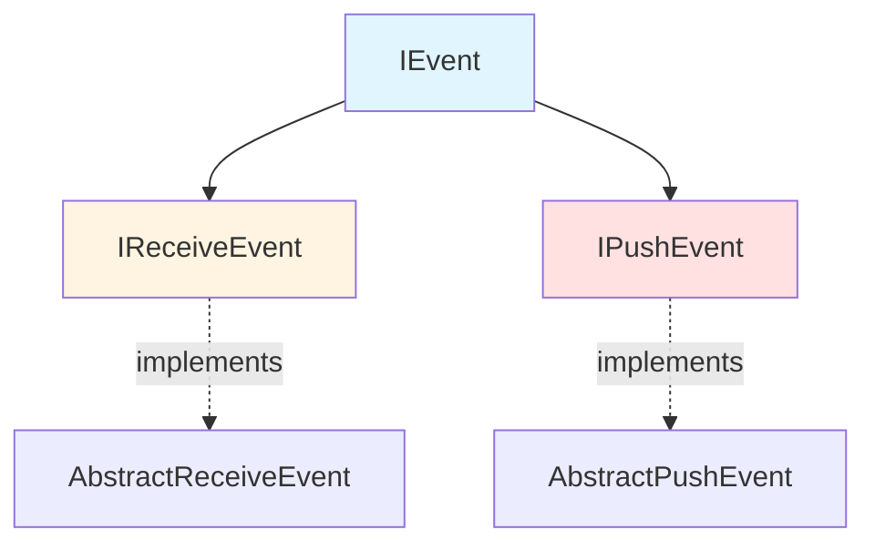

# Events

> Event handling abstractions for pushers and receivers

## Contents

- [Overview](#overview)
- [Architecture](#architecture)
- [Public Types](#public-types)
- [Files](#files)
- [Submodules](#submodules)
- [Usage](#usage)

## Overview

Base abstractions for event handling in push and receive scenarios. Events provide lifecycle hooks and extensibility points for message processing.

**Key Features:**
- 📥 Receive event abstractions
- 📤 Push event abstractions
- 🎯 Channel-specific events
- 🔌 Extensible event system

## Architecture



## Public Types

### IEvent

**Kind:** Interface  
**Namespace:** `ThunderPropagator.Application.Events`

Base marker interface for all event types.

**Key Members:**
- `Guid Id` - Unique event identifier
- `DateTime Timestamp` - Event timestamp

**Usage Recipe:**
```csharp
public interface IMyEvent : IEvent
{
    string EventData { get; }
}
```

## Files

| File | LOC | Responsibility |
|------|-----|---------------|
| [IEvent.cs](../../src/ThunderPropagator.Application/Events/IEvent.cs) | 9 | Base event interface |

**Total Files:** 1  
**Total LOC:** 9

## Submodules

- [📁 Receivers](Receivers/README.md) - Receive event abstractions (41 LOC, 2 files)
- [📁 Pushers](Pushers/README.md) - Push event abstractions (37 LOC, 2 files)

## Usage

### Implementing Custom Event

```csharp
public class DataReceivedEvent : IEvent
{
    public Guid Id { get; } = Guid.NewGuid();
    public DateTime Timestamp { get; } = DateTime.UtcNow;
    public byte[] Data { get; set; }
}
```

---

**Navigation:**  
[⬆️ Application Layer](../README.md) | [Receivers](Receivers/README.md) · [Pushers](Pushers/README.md)

---

**Statistics:** 1 public type · 1 file · 9 LOC · 2 submodules  
**Diagrams:** ✓ Event hierarchy
