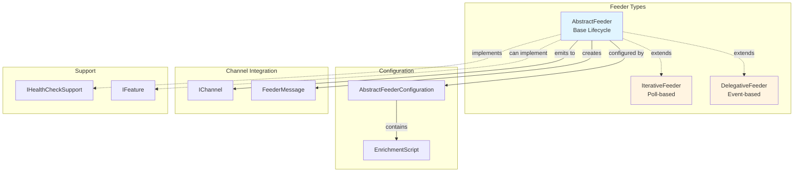
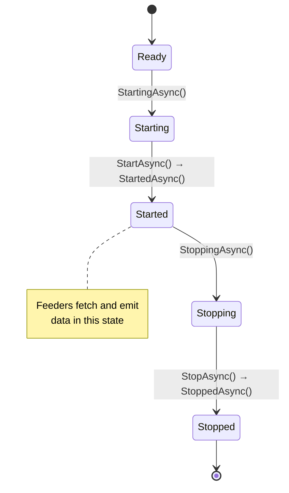

# Feeders

> Data source integration abstractions for feeding messages into channels

## Contents

- [Overview](#overview)
- [Architecture](#architecture)
- [Public Types](#public-types)
- [Files](#files)
- [Design Patterns](#design-patterns)
- [Usage](#usage)

## Overview

The Feeders module provides base abstractions for integrating external data sources with ThunderPropagator channels. Feeders fetch, transform, and emit data as `FeederMessage` objects to their associated channels, which then distribute to subscribed connections.

**Key Features:**
- 🔄 Lifecycle management (Starting → Started → Stopping → Stopped)
- 🏥 Built-in health check integration
- 📊 Telemetry and metrics reporting
- 🔐 License validation support via `IFeature`
- 🎯 Two feeder patterns: Iterative and Delegative
- 📝 Enrichment script support

## Architecture



## Design Patterns

### 1. Feeder Lifecycle



### 2. Two Feeder Patterns

**Iterative Feeder:** Poll-based data fetching
```csharp
protected override async Task<IEnumerable<MyMessage>> FetchAsync()
{
    return await _dataSource.GetLatestAsync();
}
```

**Delegative Feeder:** Event-driven data handling
```csharp
protected override void OnMessageReceived(FeederReceivedMessage message)
{
    var parsed = ParseMessage(message.RawMessage);
    EmitMessage(parsed);
}
```

## Public Types

### IFeeder

**Kind:** Interface  
**Namespace:** `ThunderPropagator.Application.Feeders`  
**Implements:** `IDisposable`, `IAsyncDisposable`

Core feeder interface defining lifecycle methods.

**Key Members:**
- `Guid Id` - Unique feeder identifier
- `FeederState State` - Current lifecycle state
- `Guid ChannelKey` - Associated channel key
- `Task StartingAsync(CancellationToken)` - Pre-start initialization
- `Task StartAsync(CancellationToken)` - Start data fetching
- `Task StartedAsync(CancellationToken)` - Post-start operations
- `Task StoppingAsync(CancellationToken)` - Pre-stop cleanup
- `Task StopAsync(CancellationToken)` - Stop data fetching
- `Task StoppedAsync(CancellationToken)` - Post-stop cleanup

### IFeeder<TChannel>

**Kind:** Generic Interface  
**Namespace:** `ThunderPropagator.Application.Feeders`  
**Inherits:** `IFeeder`

Type-safe feeder interface bound to specific channel type.

**Usage Recipe:**
```csharp
public class StockFeeder : IFeeder<StockChannel>
{
    public Guid Id { get; }
    public FeederState State { get; private set; }
    public Guid ChannelKey => _channel.Key;
    
    // Lifecycle methods...
}
```

### AbstractFeeder<TChannel, TFeederMessage, TFeederConfiguration>

**Kind:** Abstract Partial Class  
**Namespace:** `ThunderPropagator.Application.Feeders`  
**Inherits:** `DisposableObject`, `IFeeder<TChannel>`

Base feeder implementation with lifecycle management and health checks.

**Generic Constraints:**
- `TChannel : class, IChannel`
- `TFeederMessage : FeederMessage`
- `TFeederConfiguration : class, IAbstractFeederConfiguration`

**Key Members:**
- `IServiceProvider ServiceProvider` - Dependency injection
- `TFeederConfiguration FeederConfiguration` - Feeder configuration
- `TChannel Channel` - Associated channel
- `ILogger Logger` - Logger instance
- `Guid Id` - Feeder identifier
- `FeederState State` - Current state
- `bool IsStopped` - Whether feeder is stopped/stopping

**Partial Files:**
- [AbstractFeeder.cs](../../src/ThunderPropagator.Application/Feeders/AbstractFeeder.cs) - Core lifecycle (161 LOC)
- [AbstractFeeder.HealthCheckSupport.cs](../../src/ThunderPropagator.Application/Feeders/AbstractFeeder.HealthCheckSupport.cs) - Health check integration (49 LOC)

**Virtual Methods:**
- `Task StartingAsync(CancellationToken)` - Override for initialization
- `Task StartAsync(CancellationToken)` - Override for starting
- `Task StartedAsync(CancellationToken)` - Override for post-start
- `Task StoppingAsync(CancellationToken)` - Override for pre-stop
- `Task StopAsync(CancellationToken)` - Override for stopping
- `Task StoppedAsync(CancellationToken)` - Override for post-stop

**Usage Recipe:**
```csharp
public class MyFeeder : AbstractFeeder<MyChannel, MyMessage, MyConfig>
{
    private readonly IDataSource _dataSource;
    
    public MyFeeder(
        MyChannel channel,
        MyConfig config,
        IServiceProvider serviceProvider,
        IDataSource dataSource)
        : base(channel, config, serviceProvider)
    {
        _dataSource = dataSource;
    }
    
    protected override async Task StartAsync(CancellationToken cancellationToken)
    {
        await _dataSource.ConnectAsync(cancellationToken);
        _dataSource.DataReceived += OnDataReceived;
    }
    
    private void OnDataReceived(object data)
    {
        var message = new MyMessage { Data = data };
        Channel.EmitMessage(message);
    }
}
```

### IterativeFeeder<TChannel, TFeederMessage, TFeederConfiguration>

**Kind:** Abstract Class  
**Namespace:** `ThunderPropagator.Application.Feeders`  
**Inherits:** `AbstractFeeder<TChannel, TFeederMessage, TFeederConfiguration>`

Poll-based feeder using background task to fetch data at intervals.

**Key Members:**
- `Task ExecuteAsync(CancellationToken)` - Background execution loop
- `abstract Task<IEnumerable<TFeederMessage>> FetchAsync()` - Override to fetch data

**Usage Recipe:**
```csharp
public class StockPriceFeeder : IterativeFeeder<StockChannel, StockMessage, StockConfig>
{
    private readonly IStockApi _api;
    
    protected override async Task<IEnumerable<StockMessage>> FetchAsync()
    {
        var prices = await _api.GetLatestPricesAsync();
        return prices.Select(p => new StockMessage
        {
            ["symbol"] = p.Symbol,
            ["price"] = p.Price,
            ["volume"] = p.Volume
        });
    }
}
```

### DelegativeFeeder<TChannel, TFeederConfiguration>

**Kind:** Abstract Class  
**Namespace:** `ThunderPropagator.Application.Feeders`  
**Inherits:** `AbstractFeeder<TChannel, FeederMessage, TFeederConfiguration>`

Event-driven feeder for external data sources with push notifications.

**Key Members:**
- `void EmitMessage(FeederMessage)` - Emit message to channel
- `virtual void OnMessageReceived(FeederReceivedMessage)` - Override for message handling
- `event EventHandler<EnrichmentScriptEventArgs>? EnrichmentScript` - Message enrichment event

**Usage Recipe:**
```csharp
public class WebSocketFeeder : DelegativeFeeder<MyChannel, MyConfig>
{
    private WebSocketClient _client;
    
    protected override async Task StartAsync(CancellationToken cancellationToken)
    {
        _client = new WebSocketClient();
        _client.MessageReceived += OnWebSocketMessage;
        await _client.ConnectAsync(cancellationToken);
    }
    
    private void OnWebSocketMessage(string rawMessage)
    {
        var feederMessage = FeederReceivedMessage.Parse(rawMessage);
        OnMessageReceived(feederMessage);
    }
    
    protected override void OnMessageReceived(FeederReceivedMessage message)
    {
        var parsed = ParseMessage(message.RawMessage);
        EmitMessage(parsed);
    }
}
```

### AbstractFeederConfiguration

**Kind:** Abstract Class  
**Namespace:** `ThunderPropagator.Application.Feeders`  
**Implements:** `IAbstractFeederConfiguration`

Base configuration for feeders with enrichment script support.

**Key Members:**
- `Guid Id` - Feeder identifier
- `string? EnrichmentScript` - C# script for message enrichment

**Usage Recipe:**
```csharp
public class MyFeederConfiguration : AbstractFeederConfiguration
{
    public MyFeederConfiguration()
    {
        Id = Guid.NewGuid();
        EnrichmentScript = @"
            (message) => {
                message[""enriched_at""] = DateTime.UtcNow;
                return message;
            }
        ";
    }
}
```

### FeederState

**Kind:** Enum  
**Namespace:** `ThunderPropagator.Application.Feeders`

Represents feeder lifecycle state.

**Values:**
- `Ready` - Initial state
- `Starting` - Initialization in progress
- `Started` - Running and fetching data
- `Stopping` - Shutdown in progress
- `Stopped` - Fully stopped

### FeederReceivedMessage

**Kind:** Class  
**Namespace:** `ThunderPropagator.Application.Feeders`

Wrapper for raw received messages in delegative feeders.

**Key Members:**
- `string RawMessage` - Original message text
- `DateTime ReceivedAt` - Reception timestamp

### EnrichmentScriptEventArgs

**Kind:** Class  
**Namespace:** `ThunderPropagator.Application.Feeders`  
**Inherits:** `EventArgs`

Event args for enrichment script execution.

**Key Members:**
- `FeederMessage Message` - Message to enrich

### IFeederManager

**Kind:** Interface  
**Namespace:** `ThunderPropagator.Application.Feeders`

Manages feeder lifecycle across application.

**Key Members:**
- `IEnumerable<IFeeder> GetFeeders()` - Get all feeders
- `Task StartAllAsync(CancellationToken)` - Start all feeders
- `Task StopAllAsync(CancellationToken)` - Stop all feeders

### IFeederHandler

**Kind:** Interface (Internal)  
**Namespace:** `ThunderPropagator.Application.Feeders`

Internal handler for feeder operations.

### IFeederMessageDeserializer

**Kind:** Interface  
**Namespace:** `ThunderPropagator.Application.Feeders`

Deserializes raw messages into `FeederMessage` objects.

**Key Members:**
- `FeederMessage Deserialize(string rawMessage)` - Deserialize message

## Files

| File | LOC | Responsibility |
|------|-----|---------------|
| [AbstractFeeder.cs](../../src/ThunderPropagator.Application/Feeders/AbstractFeeder.cs) | 161 | Core feeder lifecycle with health checks |
| [AbstractFeeder.HealthCheckSupport.cs](../../src/ThunderPropagator.Application/Feeders/AbstractFeeder.HealthCheckSupport.cs) | 49 | Health check integration partial class |
| [AbstractFeederConfiguration.cs](../../src/ThunderPropagator.Application/Feeders/AbstractFeederConfiguration.cs) | 63 | Base configuration with enrichment script |
| [DelegativeFeeder.cs](../../src/ThunderPropagator.Application/Feeders/DelegativeFeeder.cs) | 111 | Event-driven feeder implementation |
| [IterativeFeeder.cs](../../src/ThunderPropagator.Application/Feeders/IterativeFeeder.cs) | 98 | Poll-based feeder implementation |
| [IFeeder.cs](../../src/ThunderPropagator.Application/Feeders/IFeeder.cs) | 24 | Core feeder interface |
| [IFeederManager.cs](../../src/ThunderPropagator.Application/Feeders/IFeederManager.cs) | 51 | Feeder lifecycle manager |
| [IFeederHandler.cs](../../src/ThunderPropagator.Application/Feeders/IFeederHandler.cs) | 17 | Internal feeder handler |
| [IFeederMessageDeserializer.cs](../../src/ThunderPropagator.Application/Feeders/IFeederMessageDeserializer.cs) | 17 | Message deserialization interface |
| [FeederState.cs](../../src/ThunderPropagator.Application/Feeders/FeederState.cs) | 11 | Feeder state enumeration |
| [FeederReceivedMessage.cs](../../src/ThunderPropagator.Application/Feeders/FeederReceivedMessage.cs) | 30 | Raw message wrapper |
| [EnrichmentScriptEventArgs.cs](../../src/ThunderPropagator.Application/Feeders/EnrichmentScriptEventArgs.cs) | 14 | Enrichment event arguments |

**Total Files:** 12  
**Total LOC:** 561

## Usage

### Creating an Iterative Feeder

```csharp
public class StockPriceFeeder : IterativeFeeder<StockChannel, StockMessage, StockConfig>
{
    private readonly IStockApiClient _apiClient;
    
    public StockPriceFeeder(
        StockChannel channel,
        StockConfig config,
        IServiceProvider serviceProvider,
        IStockApiClient apiClient)
        : base(channel, config, serviceProvider)
    {
        _apiClient = apiClient;
    }
    
    protected override async Task<IEnumerable<StockMessage>> FetchAsync()
    {
        // Fetch latest stock prices
        var stocks = await _apiClient.GetLatestPricesAsync();
        
        return stocks.Select(stock => new StockMessage
        {
            ["symbol"] = stock.Symbol,
            ["price"] = stock.Price,
            ["volume"] = stock.Volume,
            ["timestamp"] = DateTime.UtcNow
        });
    }
    
    protected override async Task StartedAsync(CancellationToken cancellationToken)
    {
        Logger.LogInformation("Stock price feeder started");
        await base.StartedAsync(cancellationToken);
    }
}
```

### Creating a Delegative Feeder

```csharp
public class KafkaFeeder : DelegativeFeeder<EventChannel, EventConfig>
{
    private readonly IConsumer<string, string> _consumer;
    
    public KafkaFeeder(
        EventChannel channel,
        EventConfig config,
        IServiceProvider serviceProvider,
        IConsumer<string, string> consumer)
        : base(channel, config, serviceProvider)
    {
        _consumer = consumer;
    }
    
    protected override async Task StartAsync(CancellationToken cancellationToken)
    {
        _consumer.Subscribe("events-topic");
        
        // Start consumption loop
        _ = Task.Run(() => ConsumeLoop(cancellationToken), cancellationToken);
        
        await base.StartAsync(cancellationToken);
    }
    
    private async Task ConsumeLoop(CancellationToken cancellationToken)
    {
        while (!cancellationToken.IsCancellationRequested)
        {
            var result = _consumer.Consume(cancellationToken);
            
            var message = new FeederMessage
            {
                ["key"] = result.Message.Key,
                ["value"] = result.Message.Value,
                ["timestamp"] = result.Message.Timestamp.UtcDateTime
            };
            
            Channel.EmitMessage(message);
        }
    }
    
    protected override async Task StopAsync(CancellationToken cancellationToken)
    {
        _consumer.Close();
        await base.StopAsync(cancellationToken);
    }
}
```

### Using Enrichment Scripts

```csharp
public class MyConfig : AbstractFeederConfiguration
{
    public MyConfig()
    {
        EnrichmentScript = @"
            (message) => {
                // Add server timestamp
                message[""server_timestamp""] = DateTime.UtcNow;
                
                // Calculate derived field
                if (message.ContainsKey(""price"") && message.ContainsKey(""quantity""))
                {
                    message[""total""] = (decimal)message[""price""] * (int)message[""quantity""];
                }
                
                return message;
            }
        ";
    }
}
```

### License-Gated Feeder

```csharp
public class PremiumFeeder : IterativeFeeder<MyChannel, MyMessage, MyConfig>, IFeature
{
    // IFeature marker enables license validation in AbstractFeeder.StartingAsync
    
    protected override async Task<IEnumerable<MyMessage>> FetchAsync()
    {
        // Premium data source
        return await _premiumApi.GetDataAsync();
    }
}
```

---

**Navigation:**  
[⬆️ Application Layer](../README.md)

---

**Statistics:** 11 public types · 12 files · 561 LOC  
**Diagrams:** ✓ Architecture · ✓ Lifecycle state machine · ✓ Pattern comparison
