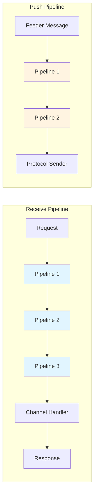

# Pipelines

> Middleware abstractions for request/response and push message processing

## Contents

- [Overview](#overview)
- [Architecture](#architecture)
- [Public Types](#public-types)
- [Files](#files)
- [Submodules](#submodules)
- [Usage](#usage)

## Overview

The Pipelines module provides middleware-style processing chains for handling incoming requests (receive pipelines) and outgoing messages (push pipelines). Pipelines enable extensible request/response processing, authentication, authorization, validation, and message transformation.

**Key Features:**
- 🔗 Chain-of-responsibility pattern
- 📥 Receive pipelines for request processing
- 📤 Push pipelines for message transformation
- 🎯 Channel-specific pipeline registration
- 📝 Attribute-based schema documentation
- ⚠️ Exception handling attributes

## Architecture



## Public Types

### IPipeline<TChannel>

**Kind:** Interface  
**Namespace:** `ThunderPropagator.Application.Pipelines`

Marker interface for channel-specific pipelines.

**Usage Recipe:**
```csharp
public class MyPipeline : IPipeline<MyChannel>
{
    // Pipeline implementation
}
```

## Files

| File | LOC | Responsibility |
|------|-----|---------------|
| [IPipeline.cs](../../src/ThunderPropagator.Application/Pipelines/IPipeline.cs) | 9 | Base pipeline marker interface |

**Total Files:** 1  
**Total LOC:** 9

## Submodules

- [📁 Receivers](Receivers/README.md) - Receive pipeline abstractions (82 LOC, 7 files)
- [📁 Pushers](Pushers/README.md) - Push pipeline abstractions (34 LOC, 3 files)

## Usage

### Receive Pipeline Example

```csharp
public class AuthenticationPipeline : AbstractReceivePipeline<MyChannel>
{
    public override string RequestKey => "authenticate";
    
    public AuthenticationPipeline(ILoggerFactory loggerFactory) 
        : base(loggerFactory)
    {
    }
    
    public async Task InvokeAsync(ReceiveContext context, ReceivePipelineDelegate next)
    {
        // Validate credentials
        if (!ValidateCredentials(context.Request))
        {
            context.Response.StatusCode = 401;
            return;
        }
        
        // Continue pipeline
        await next(context);
    }
}
```

### Push Pipeline Example

```csharp
public class CompressionPipeline : AbstractPushPipeline<MyChannel>
{
    public CompressionPipeline(ILoggerFactory loggerFactory) 
        : base(loggerFactory)
    {
    }
    
    public async Task InvokeAsync(PushContext context, PushPipelineDelegate next)
    {
        // Compress message if large
        if (context.Message.Length > 1024)
        {
            context.Message = Compress(context.Message);
        }
        
        await next(context);
    }
}
```

---

**Navigation:**  
[⬆️ Application Layer](../README.md) | [Receivers](Receivers/README.md) · [Pushers](Pushers/README.md)

---

**Statistics:** 1 public type · 1 file · 9 LOC · 2 submodules  
**Diagrams:** ✓ Pipeline flow
