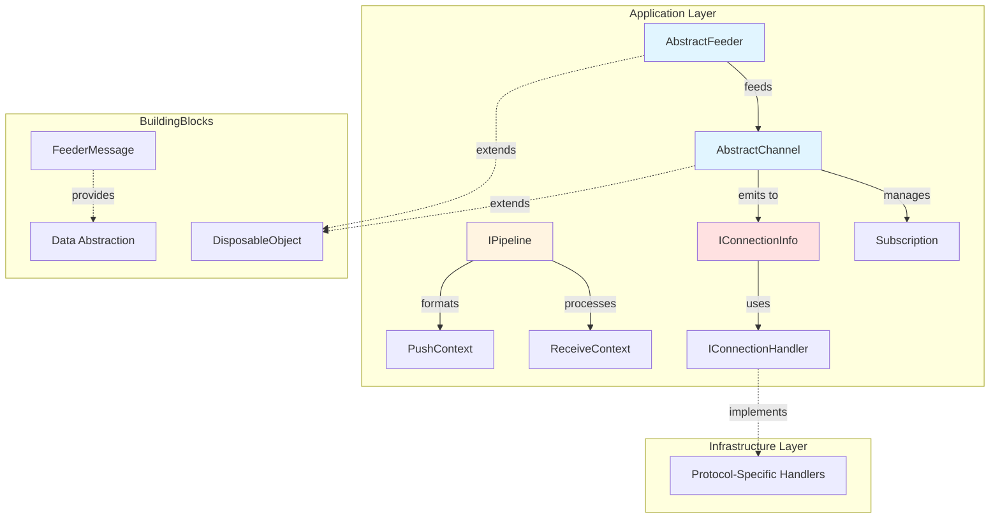

# Application Layer

> Protocol-agnostic abstractions for real-time data streaming in ThunderPropagator

## Contents

- [Overview](#overview)
- [Architecture](#architecture)
- [Core Components](#core-components)
- [Public Types](#public-types)
- [Files](#files)
- [Submodules](#submodules)
- [Dependencies](#dependencies)
- [Usage](#usage)

## Overview

The Application layer provides the foundational abstractions for ThunderPropagator's real-time data streaming system. It defines protocol-agnostic interfaces and base implementations for channels, feeders, pipelines, and connection management that work across WebSocket, MQTT 5.0, QUIC, and WebTransport protocols.

**Key Features:**
- 📡 Channel-based message distribution with subscription management
- 🔄 Feeder abstractions for data source integration
- 🔌 Pipeline middleware for request/response processing
- 🔐 Connection handling with security support
- 📊 Built-in telemetry and health check integration
- 💾 Snapshot/recovery system for state persistence

## Architecture



## Core Components

### Connection Management

Core types for managing protocol connections and message pushing:

| Type | Kind | Purpose |
|------|------|---------|
| [`IConnectionInfo`](IConnectionInfo.cs) | Interface | Represents active client connection with queuing support |
| [`IConnectionHandler`](IConnectionHandler.cs) | Interface | Internal protocol-specific message sender |
| [`ConnectionPushingMessage`](ConnectionPushingMessage.cs) | Abstract Class | Base for outbound messages with metadata |
| [`ConnectionJsonPushingMessage`](ConnectionJsonPushingMessage.cs) | Class | JSON-serialized message wrapper |
| [`ConnectionTextPushingMessage`](ConnectionTextPushingMessage.cs) | Class | Plain text message wrapper |
| [`ConnectionSubscriptionPushingMessage`](ConnectionSubscriptionPushingMessage.cs) | Class | Subscription-aware message formatter |

### Configuration & Features

| Type | Kind | Purpose |
|------|------|---------|
| [`IPushMessageConfiguration`](IPushMessageConfiguration.cs) | Interface | Message size limits configuration |
| [`IFeature`](IFeature.cs) | Interface | Marker for license-controlled features |

## Public Types

### IConnectionInfo

**Kind:** Interface  
**Namespace:** `ThunderPropagator.Application`

Represents an active client connection with queuing and identity information.

**Key Members:**
- `string ConnectionId` - Unique connection identifier
- `bool IsAvailable` - Connection availability status
- `string ClientIPAddress` - Client IP address
- `int ClientPort` - Client port number
- `ClaimsPrincipal User` - Authenticated user principal
- `void Enqueue(ConnectionPushingMessage)` - Queue message for sending
- `IConnectionHandler ConnectionHandler` - Internal protocol handler

**Usage Recipe:**
```csharp
void SendToConnection(IConnectionInfo connection, object data)
{
    if (!connection.IsAvailable)
        return;
        
    var message = new ConnectionJsonPushingMessage(
        channel: null,
        message: data,
        initiateDateTime: DateTime.UtcNow,
        receivedDateTime: null,
        correlationId: Guid.NewGuid().ToString()
    );
    
    connection.Enqueue(message);
}
```

### ConnectionPushingMessage

**Kind:** Abstract Class  
**Namespace:** `ThunderPropagator.Application`  
**Inherits:** `DisposableObject` (from BuildingBlocks)

Base class for all outbound messages with tracking metadata.

**Key Members:**
- `IChannel? Channel` - Associated channel (if any)
- `IConnectionInfo ConnectionInfo` - Target connection
- `ReadOnlyMemory<byte> Message` - Serialized message payload
- `DateTime? InitiateDateTime` - Message initiation time
- `DateTime? ReceivedDateTime` - Feeder reception time
- `string? CorrelationId` - Message correlation ID

**Usage Recipe:**
```csharp
public class CustomPushingMessage : ConnectionPushingMessage
{
    public CustomPushingMessage(IChannel channel, byte[] data)
        : base(channel, data, DateTime.UtcNow, null, Guid.NewGuid().ToString())
    {
    }
}
```

### ConnectionJsonPushingMessage

**Kind:** Sealed Class  
**Namespace:** `ThunderPropagator.Application`  
**Inherits:** `ConnectionPushingMessage`

Convenience wrapper for JSON-serialized messages.

**Usage Recipe:**
```csharp
var message = new ConnectionJsonPushingMessage(
    channel: myChannel,
    message: new { symbol = "AAPL", price = 150.25 },
    initiateDateTime: DateTime.UtcNow,
    receivedDateTime: null,
    correlationId: correlationId
);

connection.Enqueue(message);
```

### ConnectionTextPushingMessage

**Kind:** Sealed Class  
**Namespace:** `ThunderPropagator.Application`  
**Inherits:** `ConnectionPushingMessage`

Convenience wrapper for plain text messages.

**Usage Recipe:**
```csharp
var message = new ConnectionTextPushingMessage(
    channel: myChannel,
    message: "Hello, client!",
    initiateDateTime: DateTime.UtcNow,
    receivedDateTime: null,
    correlationId: correlationId
);

connection.Enqueue(message);
```

### ConnectionSubscriptionPushingMessage

**Kind:** Sealed Class  
**Namespace:** `ThunderPropagator.Application`  
**Inherits:** `ConnectionPushingMessage`

Advanced message formatter supporting subscription-based field filtering, key matching, and snapshot state tracking.

**Key Members:**
- `Subscription Subscription` - Associated subscription
- `bool FromSnapshot` - Whether message originates from snapshot
- `List<string> Format(long maxPushSize)` - Formats message respecting size limits

**Usage Recipe:**
```csharp
var message = new ConnectionSubscriptionPushingMessage(
    channel: myChannel,
    subscription: subscription,
    feederMessageFields: messageData,
    leftSubscribedKeys: keyValues,
    fromSnapshot: false,
    state: SnapshotObjectState.Modified,
    initiateDateTime: DateTime.UtcNow,
    receivedDateTime: null,
    correlationId: correlationId
);

var formattedMessages = message.Format(maxPushSize: 65536);
```

### IPushMessageConfiguration

**Kind:** Interface  
**Namespace:** `ThunderPropagator.Application`  
**Implements:** `IServiceConfiguration` (from BuildingBlocks)

Configuration interface for message size limits.

**Key Members:**
- `long MaxPushSize` - Maximum message size in bytes

### IFeature

**Kind:** Interface  
**Namespace:** `ThunderPropagator.Application`

Marker interface for types requiring license validation. Used by feeders and channels to restrict functionality based on licensing.

## Files

| File | LOC | Responsibility |
|------|-----|---------------|
| [ConnectionPushingMessage.cs](../../src/ThunderPropagator.Application/ConnectionPushingMessage.cs) | 33 | Base class for outbound messages |
| [ConnectionJsonPushingMessage.cs](../../src/ThunderPropagator.Application/ConnectionJsonPushingMessage.cs) | 17 | JSON message wrapper |
| [ConnectionTextPushingMessage.cs](../../src/ThunderPropagator.Application/ConnectionTextPushingMessage.cs) | 17 | Text message wrapper |
| [ConnectionSubscriptionPushingMessage.cs](../../src/ThunderPropagator.Application/ConnectionSubscriptionPushingMessage.cs) | 172 | Subscription-aware message formatter |
| [IConnectionHandler.cs](../../src/ThunderPropagator.Application/IConnectionHandler.cs) | 11 | Protocol handler interface |
| [IConnectionInfo.cs](../../src/ThunderPropagator.Application/IConnectionInfo.cs) | 16 | Connection information interface |
| [IPushMessageConfiguration.cs](../../src/ThunderPropagator.Application/IPushMessageConfiguration.cs) | 9 | Message configuration interface |
| [IFeature.cs](../../src/ThunderPropagator.Application/IFeature.cs) | 4 | License feature marker |

**Total Files:** 8  
**Total LOC:** 279

## Submodules

- [📁 Channels](Channels/README.md) - Channel abstractions and subscription management (2,568 LOC)
- [📁 Feeders](Feeders/README.md) - Data source integration abstractions (561 LOC)
- [📁 Pipelines](Pipelines/README.md) - Request/response middleware (108 LOC)
- [📁 PushModules/Formatters](PushModules/Formatters/README.md) - Pluggable push notification serializers (14 files)
- [📁 Collections](Collections/README.md) - Specialized collection types (349 LOC)
- [📁 Events](Events/README.md) - Event handling abstractions (87 LOC)
- [📁 HealthChecks](HealthChecks/README.md) - Health check support (27 LOC)
- [📁 Helpers](Helpers/README.md) - Utility helpers (124 LOC)
- [📁 Metrics](Metrics/README.md) - Telemetry and metrics (57 LOC)
- [📁 Logging](Logging/README.md) - Logging utilities (31 LOC)
- [📁 LicenseManagers](LicenseManagers/README.md) - License validation (198 LOC)

## Dependencies

**From ThunderPropagator.BuildingBlocks:**
- `DisposableObject` - Base disposal pattern
- `FeederMessage` - Dictionary-based message abstraction
- `IServiceConfiguration` - Configuration interface
- Helper extensions for serialization

**External:**
- `Microsoft.Extensions.DependencyInjection` - DI abstractions
- `Microsoft.Extensions.Logging` - Logging abstractions
- `System.Security.Claims` - Authentication support

## Usage

### Creating Custom Connection Handler

```csharp
internal class MyProtocolConnectionHandler : IConnectionHandler<MyProtocolGateway>
{
    public KeyValuePair<string, object?> HistogramTag => 
        new("protocol", "myprotocol");
        
    public async Task SendAsync(
        ConnectionPushingMessage message, 
        CancellationToken cancellationToken)
    {
        // Protocol-specific sending logic
        var bytes = message.Message.ToArray();
        await _connection.SendAsync(bytes, cancellationToken);
    }
    
    public void Dispose() => _connection.Dispose();
    public ValueTask DisposeAsync() => _connection.DisposeAsync();
}
```

### Using Connection Info

```csharp
public class MyService
{
    public void BroadcastToConnection(IConnectionInfo connection, object data)
    {
        if (!connection.IsAvailable)
        {
            _logger.LogWarning(
                "Connection {ConnectionId} is not available", 
                connection.ConnectionId
            );
            return;
        }
        
        var message = new ConnectionJsonPushingMessage(
            channel: null,
            message: data,
            initiateDateTime: DateTime.UtcNow,
            receivedDateTime: null,
            correlationId: Activity.Current?.Id
        );
        
        connection.Enqueue(message);
    }
}
```

### Implementing Feature-Gated Component

```csharp
public class PremiumFeeder : AbstractFeeder<MyChannel, MyMessage, MyConfig>, IFeature
{
    // IFeature marker enables license checking in AbstractFeeder.StartingAsync
    protected override async Task StartAsync(CancellationToken cancellationToken)
    {
        // This will only execute if license includes this feature type
        await base.StartAsync(cancellationToken);
    }
}
```

---

**Navigation:**  
🏠 [Documentation Home](../README.md) | 🔧 [Infrastructure Layer](../Infrastructure/README.md)

---

**Statistics:** 8 types · 8 files · 279 LOC · 10 submodules  
**Diagrams:** ✓ Architecture · ✓ Component relationships
