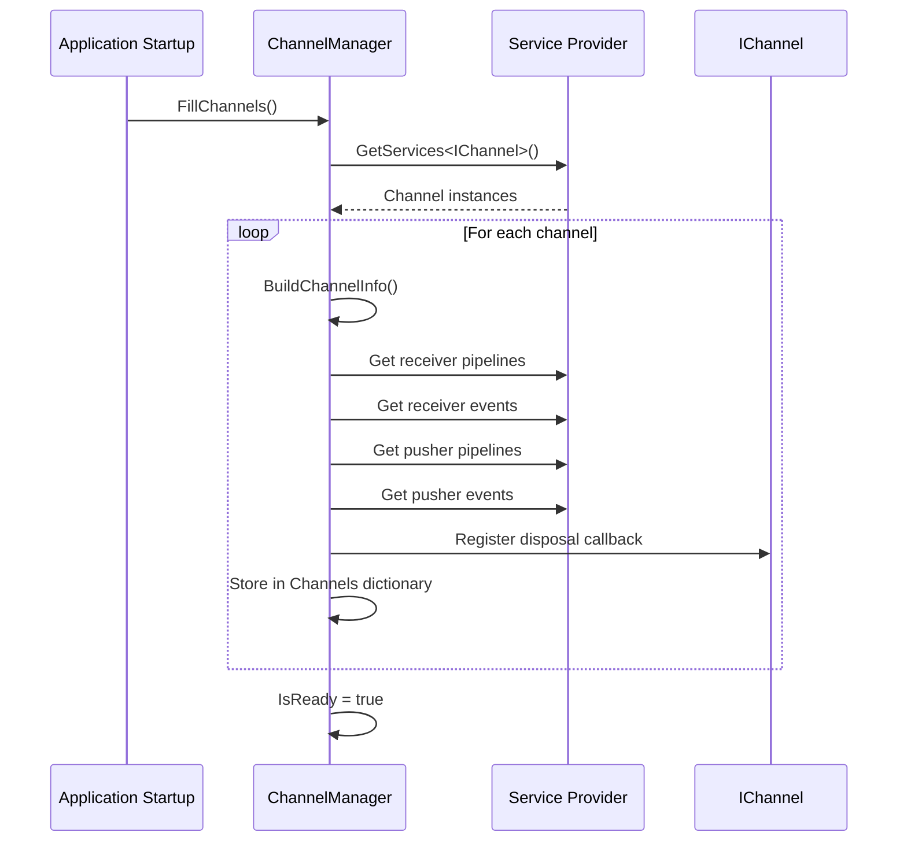
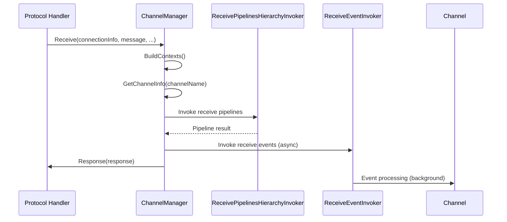

# Infrastructure.Channels

## Overview
The Infrastructure.Channels namespace provides channel management infrastructure, resolution strategies, and runtime exceptions. The `ChannelManager` is the central orchestrator connecting channels with pipelines, events, feeders, and subscriptions.

## Contents
- [Architecture](#architecture)
- [Public Types](#public-types)
- [Key Components](#key-components)
- [Files](#files)
- [Usage Examples](#usage-examples)
- [Related Documentation](#related-documentation)

## Architecture

```mermaid
graph TB
    subgraph "Channel Management"
        CM[ChannelManager]
        CI[ChannelInfo]
        CR[ChannelResolver&lt;T&gt;]
    end
    
    subgraph "Application Layer"
        IC[IChannel]
        ICM[IChannelManager]
    end
    
    subgraph "Partial Classes"
        CMR[ChannelManager.Receive.cs]
        CMS[ChannelManager.Subscription.cs]
        CMRP[ChannelManager.Receivers.Pipelines.cs]
        CMRE[ChannelManager.Receivers.Events.cs]
        CMPP[ChannelManager.Pushers.Pipelines.cs]
        CMPE[ChannelManager.Pushers.Events.cs]
    end
    
    subgraph "Metadata & Attributes"
        CKP[ChannelKeyParameterAttribute]
    end
    
    subgraph "Exceptions"
        ICK[InvalidChannelKeyException]
    end
    
    CM -.->|implements| ICM
    CM -->|manages| IC
    CM -->|returns| CI
    CM -->|uses| CR
    
    CM -->|includes| CMR
    CM -->|includes| CMS
    CM -->|includes| CMRP
    CM -->|includes| CMRE
    CM -->|includes| CMPP
    CM -->|includes| CMPE
    
    CM -->|throws| ICK
```



## Public Types

### ChannelManager
**Kind**: Public sealed class (non-sealed in DEBUG builds)  
**Implements**: `IChannelManager`  
**Summary**: Central orchestrator for channel lifecycle, pipeline/event management, and subscription routing.

**Key Members**:
```csharp
// Channel Resolution
IChannel GetChannel(Type channelType);
IChannel GetChannel(string channelName);
IChannel GetChannel(Guid channelKey);
IChannel[] ListChannels();

// Channel Info Resolution
ChannelInfo GetChannelInfo(Type channelType);
ChannelInfo GetChannelInfo(string channelName);
ChannelInfo GetChannelInfo(Guid channelKey);

// Pipeline Management
IEnumerable<IPushPipeline> GetChannelPusherPipelines(Guid channelKey, IServiceProvider serviceProvider);
IEnumerable<IPushEvent> GetChannelPusherEvents(Guid channelKey, IServiceProvider serviceProvider);

// Subscription Management (internal)
IEnumerable<Subscription> Subscribe(Guid channelKey, IConnectionInfo connectionInfo, string requestId, ISubscribeRequest subscribeRequest);
void Unsubscribe(IConnectionInfo connectionInfo);

// Message Receiving (internal)
void Receive(IConnectionInfo connectionInfo, byte[] receivedMessage, DateTime receivedDateTime, CancellationToken cancellationToken);

// Initialization (internal)
void FillChannels();
bool IsReady { get; }
```

**Partial Class Structure**:
- **ChannelManager.cs** - Core channel resolution, lifecycle, initialization
- **ChannelManager.Receive.cs** - Message receiving orchestration, context building, response handling
- **ChannelManager.Subscription.cs** - Subscription delegation to channels
- **ChannelManager.Receivers.Pipelines.cs** - Receive pipeline resolution and invocation
- **ChannelManager.Receivers.Events.cs** - Receive event resolution and invocation
- **ChannelManager.Pushers.Pipelines.cs** - Push pipeline resolution and invocation
- **ChannelManager.Pushers.Events.cs** - Push event resolution and invocation

**Usage Recipe**:
```csharp
public class StockService
{
    private readonly ChannelManager _channelManager;
    
    public StockService(ChannelManager channelManager)
    {
        _channelManager = channelManager;
    }
    
    public void ProcessStock(string symbol)
    {
        // Get channel by name
        var stockChannel = _channelManager.GetChannel("StockChannel");
        
        // Access channel info
        var channelInfo = _channelManager.GetChannelInfo("StockChannel");
        Console.WriteLine($"Channel has {channelInfo.ReceivePipelinesDefined} receive pipelines");
        
        // List all channels
        var allChannels = _channelManager.ListChannels();
    }
}
```

---

### ChannelInfo
**Kind**: Public sealed class (non-sealed in DEBUG builds)  
**Summary**: Metadata wrapper for channel instances with pipeline availability flags.

**Key Members**:
```csharp
public IChannel Channel { get; }
public bool ReceivePipelinesDefined { get; }
public bool PushPipelinesDefined { get; }
public Type ChannelType { get; }
public Guid ChannelKey { get; }
public string ChannelName { get; }
```

**Usage Recipe**:
```csharp
var channelInfo = channelManager.GetChannelInfo("StockChannel");

if (channelInfo.ReceivePipelinesDefined)
{
    // Process incoming requests
}

if (channelInfo.PushPipelinesDefined)
{
    // Transform outgoing messages
}

var channel = channelInfo.Channel;
```

---

### ChannelResolver&lt;TChannel&gt;
**Kind**: Public delegate  
**Summary**: Factory delegate for dynamic channel creation based on key and arguments.

**Signature**:
```csharp
public delegate TChannel ChannelResolver<out TChannel>(Guid channelKey, object args)
    where TChannel : class, IChannel;
```

**Usage Recipe**:
```csharp
services.AddSingleton<ChannelResolver<StockChannel>>(
    (channelKey, args) => new StockChannel(channelKey, (StockConfiguration)args)
);

// Use resolver
var resolver = serviceProvider.GetRequiredService<ChannelResolver<StockChannel>>();
var channel = resolver(Guid.NewGuid(), new StockConfiguration { ... });
```

---

### ChannelKeyParameterAttribute
**Kind**: Public sealed attribute (non-sealed in DEBUG builds)  
**Inherits**: `Attribute`  
**Target**: Parameter  
**Summary**: Marks parameter as channel key for automatic injection in event handlers.

**Usage Recipe**:
```csharp
public class StockReceiveEvent : IReceiveEvent<StockChannel>
{
    public Task Invoke(
        [ChannelKeyParameter] string channelName,
        ReceiveContext context,
        CancellationToken cancellationToken = default)
    {
        Console.WriteLine($"Event for channel: {channelName}");
        return Task.CompletedTask;
    }
}
```

---

### InvalidChannelKeyException
**Kind**: Public sealed exception (non-sealed in DEBUG builds)  
**Inherits**: `HttpRequestException`  
**Summary**: Thrown when channel key lookup fails.

**Constructor**:
```csharp
public InvalidChannelKeyException(Guid channelKey, Exception? inner = null)
    : base($"Invalid channel key {channelKey}", inner, HttpStatusCode.NotFound)
```

**Usage Recipe**:
```csharp
try
{
    var channel = channelManager.GetChannel(unknownKey);
}
catch (InvalidChannelKeyException ex)
{
    // Handle missing channel (returns 404)
    logger.LogWarning(ex, "Channel not found");
}
```

## Key Components

### Channel Lifecycle Management



### Message Receiving Flow



### Pipeline & Event Resolution

The `ChannelManager` uses a **3-pass system** to resolve pipelines/events:

1. **Bypass Check**: Channels in `ThunderPropagator.Channels.*` namespace bypass license checks
2. **License Check**: Check if feature is allowed (`AddPushersPipelinesFeature`, etc.)
3. **DI Resolution**: Resolve generic `IPushPipeline<TChannel>` or `IPushEvent<TChannel>`

```csharp
// Cached in static ConcurrentDictionary
private static readonly ConcurrentDictionary<Type, IEnumerable<IPushPipeline>> PushPipelines = new();

private IEnumerable<IPushPipeline> GetChannelPusherPipelines(Type channelType, IServiceProvider serviceProvider)
{
    var isBypassed = ChannelsBypassedPushPipelines.GetOrAdd(channelType, 
        type => ChannelsByPassPushPipelines.Any(func => func(type)));
    
    var rtn = isBypassed
        ? PushPipelines.GetOrAdd(channelType, _ => ChannelPusherPipelines())
        : LicenseManagerInterop.IsAllowed<AddPushersPipelinesFeature>()
            ? PushPipelines.GetOrAdd(channelType, _ => ChannelPusherPipelines())
            : [];
    
    return rtn;
    
    IEnumerable<IPushPipeline> ChannelPusherPipelines()
    {
        var inputPipelineType = typeof(IPushPipeline<>);
        var genericInputPipelineType = inputPipelineType.MakeGenericType(channelType);
        return serviceProvider.GetServices(genericInputPipelineType).Cast<IPushPipeline>();
    }
}
```

## Files

| File | LOC | Responsibility |
|------|-----|---------------|
| [ChannelManager.cs](../../src/ThunderPropagator.Infrastructure/Channels/ChannelManager.cs) | 234 | Core channel resolution, lifecycle, `FillChannels()` initialization |
| [ChannelManager.Receive.cs](../../src/ThunderPropagator.Infrastructure/Channels/ChannelManager.Receive.cs) | 193 | Message receiving orchestration, context building, exception handling |
| [ChannelManager.Subscription.cs](../../src/ThunderPropagator.Infrastructure/Channels/ChannelManager.Subscription.cs) | 62 | Subscription delegation to channels, connection unsubscribe |
| [ChannelManager.Receivers.Pipelines.cs](../../src/ThunderPropagator.Infrastructure/Channels/ChannelManager.Receivers.Pipelines.cs) | 257 | Receive pipeline resolution, hierarchy builder |
| [ChannelManager.Receivers.Events.cs](../../src/ThunderPropagator.Infrastructure/Channels/ChannelManager.Receivers.Events.cs) | 104 | Receive event resolution, invoker builder |
| [ChannelManager.Pushers.Pipelines.cs](../../src/ThunderPropagator.Infrastructure/Channels/ChannelManager.Pushers.Pipelines.cs) | 124 | Push pipeline resolution, hierarchy builder |
| [ChannelManager.Pushers.Events.cs](../../src/ThunderPropagator.Infrastructure/Channels/ChannelManager.Pushers.Events.cs) | 104 | Push event resolution, invoker builder |
| [ChannelInfo.cs](../../src/ThunderPropagator.Infrastructure/Channels/ChannelInfo.cs) | 35 | Channel metadata wrapper |
| [ChannelResolver.cs](../../src/ThunderPropagator.Infrastructure/Channels/ChannelResolver.cs) | 7 | Delegate for dynamic channel creation |
| [ChannelKeyParameterAttribute.cs](../../src/ThunderPropagator.Infrastructure/Channels/ChannelKeyParameterAttribute.cs) | 9 | Attribute for channel key injection |
| [InvalidChannelKeyException.cs](../../src/ThunderPropagator.Infrastructure/Channels/InvalidChannelKeyException.cs) | 15 | Exception for channel lookup failures |

**Total**: 11 files, 1144 LOC

## Usage Examples

### Accessing Channel Manager in Services
```csharp
public class StockBroadcastService
{
    private readonly ChannelManager _channelManager;
    private readonly ILogger<StockBroadcastService> _logger;
    
    public StockBroadcastService(
        ChannelManager channelManager,
        ILogger<StockBroadcastService> logger)
    {
        _channelManager = channelManager;
        _logger = logger;
    }
    
    public async Task BroadcastPrice(string symbol, decimal price)
    {
        var stockChannel = _channelManager.GetChannel("StockChannel");
        
        var message = new StockMessage
        {
            Symbol = symbol,
            Price = price,
            Timestamp = DateTime.UtcNow
        };
        
        await stockChannel.EmitMessageAsync(message);
        _logger.LogInformation("Broadcasted {Symbol} at {Price}", symbol, price);
    }
}
```

### Custom Channel Resolver
```csharp
services.AddSingleton<ChannelResolver<DynamicChannel>>((channelKey, args) =>
{
    var config = (DynamicChannelConfig)args;
    return new DynamicChannel(channelKey, config);
});
```

### Checking Pipeline Availability
```csharp
var channelInfo = channelManager.GetChannelInfo("StockChannel");

if (channelInfo.ReceivePipelinesDefined)
{
    // Custom subscribe/unsubscribe logic available
}

if (channelInfo.PushPipelinesDefined)
{
    // Message transformation pipelines available
}
```

### Exception Handling
```csharp
try
{
    var channel = channelManager.GetChannel(channelKey);
}
catch (InvalidChannelKeyException ex) when (ex.StatusCode == HttpStatusCode.NotFound)
{
    return Results.Problem("Channel not found", statusCode: 404);
}
```

## Related Documentation
- [Parent: Infrastructure Layer](../README.md)
- [Sibling: Channels/Snapshots/Recovery](Snapshots/Recovery/README.md)
- [Application: Channels](../../Application/Channels/README.md)
- [Extension Registration](../Extensions/README.md)

---

**Namespace**: `ThunderPropagator.Infrastructure.Channels`  
**Types**: 7 public types  
**Files**: 11 files (1144 LOC)  
**Diagrams**: ✓ Architecture, ✓ Sequence  
**Last Updated**: December 28, 2025
