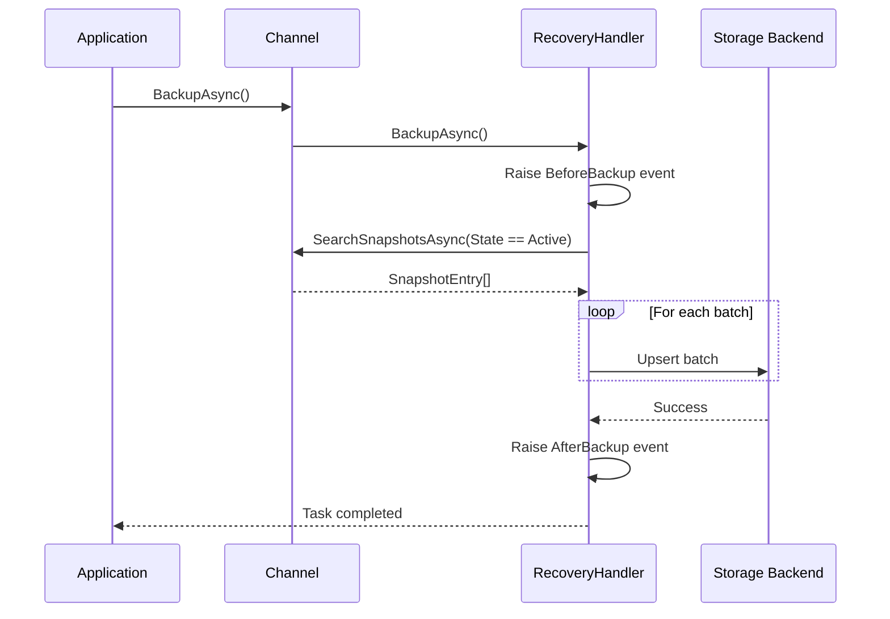
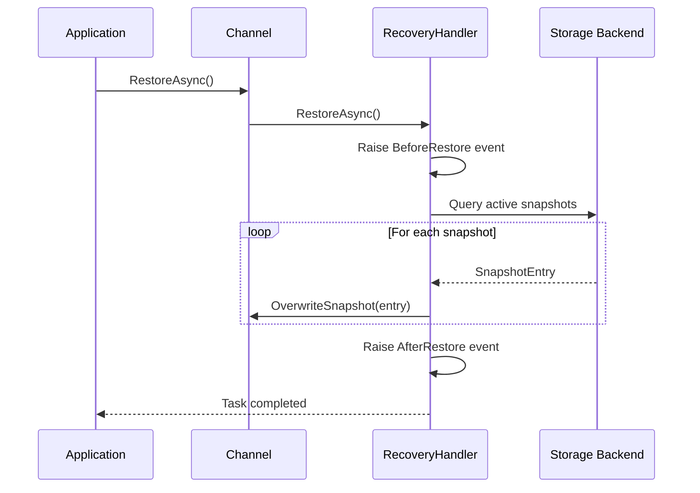

# Infrastructure.Channels.Snapshots.Recovery

## Overview
The Recovery namespace provides persistent storage implementations for channel snapshots, enabling recovery after application restarts or failures. Supports MongoDB, PostgreSQL, Redis, and a no-op handler for ephemeral scenarios.

## Contents
- [Architecture](#architecture)
- [Public Types](#public-types)
- [Storage Implementations](#storage-implementations)
- [Files](#files)
- [Usage Examples](#usage-examples)
- [Related Documentation](#related-documentation)

## Architecture

```mermaid
graph TB
    subgraph "Application Layer"
        IRH[IRecoveryHandler]
        ARH[AbstractRecoveryHandler]
        CH[IChannel]
    end
    
    subgraph "Infrastructure Implementations"
        NONE[NoneRecoveryHandler]
        MONGO[MongoDbRecoveryHandler]
        REDIS[RedisRecoveryHandler]
        PG[PostgresqlRecoveryHandler]
    end
    
    subgraph "License Features"
        MF[MongoDbRecoveryStorageFeature]
        RF[RedisRecoveryStorageFeature]
        PF[PostgresqlRecoveryStorageFeature]
    end
    
    subgraph "External Dependencies"
        MD[MongoDB.Driver]
        RD[StackExchange.Redis]
        NPG[Npgsql + Dapper]
    end
    
    IRH <|.. ARH
    ARH <|-- NONE
    ARH <|-- MONGO
    ARH <|-- REDIS
    ARH <|-- PG
    
    MONGO -->|uses| MD
    REDIS -->|uses| RD
    PG -->|uses| NPG
    
    MONGO -.->|requires| MF
    REDIS -.->|requires| RF
    PG -.->|requires| PF
    
    CH -->|configures| IRH
```

## Public Types

### Feature Classes

#### MongoDbRecoveryStorageFeature
**Kind**: Internal sealed feature class (non-sealed in DEBUG builds)  
**Implements**: `IFeature`  
**Summary**: Enables MongoDB as recovery storage backend. Requires license activation.

**Description Attribute**:
> "Supports MongoDB as a recovery storage solution for reliable data recovery and persistence."

---

#### PostgresqlRecoveryStorageFeature
**Kind**: Internal sealed feature class (non-sealed in DEBUG builds)  
**Implements**: `IFeature`  
**Summary**: Enables PostgreSQL as recovery storage backend. Requires license activation.

**Description Attribute**:
> "Supports PostgreSQL as a recovery storage solution for reliable data recovery and persistence."

---

#### RedisRecoveryStorageFeature
**Kind**: Internal sealed feature class (non-sealed in DEBUG builds)  
**Implements**: `IFeature`  
**Summary**: Enables Redis as recovery storage backend. Requires license activation.

**Description Attribute**:
> "Supports Redis as a recovery storage solution for fast and reliable data recovery."

---

### Recovery Handlers

#### NoneRecoveryHandler
**Kind**: Internal sealed class (non-sealed in DEBUG builds)  
**Implements**: `IRecoveryHandler`  
**Summary**: No-op recovery handler for channels without persistence requirements.

**Key Members**:
```csharp
// All methods are no-op (return Task.CompletedTask or null)
public Task Initialize(CancellationToken cancellationToken = default);
public Task BackupAsync(CancellationToken cancellationToken = default);
public Task RestoreAsync(CancellationToken cancellationToken = default);
public Task<SnapshotEntry?> RestoreAsync(int hashKey, CancellationToken cancellationToken = default);
public Task CleanupAsync(CancellationToken cancellationToken = default);
public void Cleanup(int hashKey);
public void Hibernate(SnapshotEntry snapshotEntry);
public void Hibernate(int hashKey, IReadOnlyDictionary<string, object?> snapshot);

// Events (never invoked)
public event EventHandler? BeforeBackup;
public event EventHandler? AfterBackup;
public event EventHandler<int?>? BeforeRestore;
public event EventHandler<int?>? AfterRestore;
public event EventHandler<int?>? BeforeCleanup;
public event EventHandler<int?>? AfterCleanup;
public event EventHandler<(int HashKey, IReadOnlyDictionary<string, object?> Snapshot)>? BeforeHibernate;
public event EventHandler<(int HashKey, IReadOnlyDictionary<string, object?> Snapshot)>? AfterHibernate;
```

**Usage Recipe**:
```csharp
// Automatically used when RecoveryStorage.None
var channel = new StockChannel
{
    Metadata =
    {
        Snapshot =
        {
            RecoveryStorage = RecoveryStorage.None
        }
    }
};
```

---

#### MongoDbRecoveryHandler
**Kind**: Internal sealed class (non-sealed in DEBUG builds)  
**Inherits**: `AbstractRecoveryHandler`  
**Summary**: MongoDB-backed recovery storage using MongoDB.Driver.

**Key Implementation Details**:
- Uses `MongoClient` with connection string from `channel.Metadata.Snapshot.ConnectionString`
- Collection name = `channel.Metadata.ChannelName`
- Registers `SnapshotEntry` BSON class map with `HashKey` as `_id`
- Backup: Bulk upserts in batches of 100 using `ReplaceOneModel<SnapshotEntry>`
- Restore: Cursor-based streaming with batch size 100
- Cleanup: `DeleteManyAsync` for full cleanup, `DeleteOneAsync` for single entry
- Hibernate: Upsert individual `SnapshotEntry`

**Protected Members**:
```csharp
protected override async Task InternalBackupAsync(CancellationToken cancellationToken = default);
protected override async Task InternalRestoreAsync(CancellationToken cancellationToken = default);
protected override async Task<SnapshotEntry?> InternalRestoreAsync(int hashKey, CancellationToken cancellationToken = default);
protected override Task InternalCleanupAsync(CancellationToken cancellationToken = default);
protected override Task InternalCleanupAsync(int hashKey, CancellationToken cancellationToken = default);
protected override Task InternalHibernateAsync(SnapshotEntry snapshotEntry, CancellationToken cancellationToken = default);
protected internal override async Task InternalHibernateAsync(int hashKey, IReadOnlyDictionary<string, object?> snapshot, CancellationToken cancellationToken = default);
```

**Usage Recipe**:
```csharp
var channel = new StockChannel
{
    Metadata =
    {
        Snapshot =
        {
            RecoveryStorage = RecoveryStorage.MongoDb,
            ConnectionString = "mongodb://localhost:27017/ThunderPropagator"
        }
    }
};
```

---

#### RedisRecoveryHandler
**Kind**: Internal sealed class (non-sealed in DEBUG builds)  
**Inherits**: `AbstractRecoveryHandler`  
**Summary**: Redis-backed recovery storage using StackExchange.Redis.

**Key Implementation Details**:
- Uses `ConnectionMultiplexer` with connection string from `channel.Metadata.Snapshot.ConnectionString`
- Redis key = `channel.Metadata.ChannelName`
- Stores snapshots as JSON in Redis Hash: `HSET {channelName} {hashKey} {json}`
- Backup: `HashSetAsync` with array of `HashEntry` for all active snapshots
- Restore: `HashGetAll` and deserialize each entry
- Cleanup: `KeyDeleteAsync` for full cleanup, `HashDeleteAsync` for single entry
- Hibernate: `HashSetAsync` for individual snapshot

**Protected Members**:
```csharp
protected override async Task InternalBackupAsync(CancellationToken cancellationToken = default);
protected override Task InternalRestoreAsync(CancellationToken cancellationToken = default);
protected override async Task<SnapshotEntry?> InternalRestoreAsync(int hashKey, CancellationToken cancellationToken = default);
protected override Task InternalCleanupAsync(CancellationToken cancellationToken = default);
protected override Task InternalCleanupAsync(int hashKey, CancellationToken cancellationToken = default);
protected override Task InternalHibernateAsync(SnapshotEntry snapshotEntry, CancellationToken cancellationToken = default);
protected internal override async Task InternalHibernateAsync(int hashKey, IReadOnlyDictionary<string, object?> snapshot, CancellationToken cancellationToken = default);
protected override async ValueTask DisposeManagedResourcesAsync();
```

**Usage Recipe**:
```csharp
var channel = new StockChannel
{
    Metadata =
    {
        Snapshot =
        {
            RecoveryStorage = RecoveryStorage.Redis,
            ConnectionString = "localhost:6379"
        }
    }
};
```

---

#### PostgresqlRecoveryHandler
**Kind**: Internal sealed class (non-sealed in DEBUG builds)  
**Inherits**: `AbstractRecoveryHandler`  
**Summary**: PostgreSQL-backed recovery storage using Npgsql + Dapper.

**Key Implementation Details**:
- Schema: `Snapshots`
- Tables:
  - `{ChannelName}` - Main table with `HashKey`, `Keys`, `CastType`, `State`
  - `{ChannelName}_SnapshotEntries` - Snapshot data with `HashKey`, `Key`, `Type`, `Value`
- Type handling:
  - Primitive types stored by `TypeCode` enum
  - Complex types stored as JSON with `AssemblyQualifiedName`
- Backup: Upsert queries with `ON CONFLICT ... DO UPDATE`
- Restore: SQL query with JOIN on both tables
- Cleanup: `DELETE FROM` for full or filtered cleanup
- Hibernate: Upserts both main entry and snapshot items
- Auto-creates schema/tables if not exists

**Protected Members**:
```csharp
protected override async Task InternalBackupAsync(CancellationToken cancellationToken = default);
protected override async Task InternalRestoreAsync(CancellationToken cancellationToken = default);
protected override async Task<SnapshotEntry?> InternalRestoreAsync(int hashKey, CancellationToken cancellationToken = default);
protected override Task InternalCleanupAsync(CancellationToken cancellationToken = default);
protected override Task InternalCleanupAsync(int hashKey, CancellationToken cancellationToken = default);
protected override Task InternalHibernateAsync(SnapshotEntry snapshotEntry, CancellationToken cancellationToken = default);
protected internal override async Task InternalHibernateAsync(int hashKey, IReadOnlyDictionary<string, object?> snapshot, CancellationToken cancellationToken = default);
```

**SQL Schema**:
```sql
CREATE SCHEMA IF NOT EXISTS "Snapshots";

CREATE TABLE IF NOT EXISTS "Snapshots"."StockChannel" (
    "HashKey" INTEGER PRIMARY KEY,
    "Keys" TEXT NOT NULL,
    "CastType" TEXT NOT NULL,
    "State" INTEGER NOT NULL
);

CREATE TABLE IF NOT EXISTS "Snapshots"."StockChannel_SnapshotEntries" (
    "HashKey" INTEGER NOT NULL,
    "Key" TEXT NOT NULL,
    "Type" TEXT NOT NULL,
    "Value" TEXT,
    PRIMARY KEY ("HashKey", "Key"),
    FOREIGN KEY ("HashKey") REFERENCES "Snapshots"."StockChannel"("HashKey") ON DELETE CASCADE
);
```

**Usage Recipe**:
```csharp
var channel = new StockChannel
{
    Metadata =
    {
        Snapshot =
        {
            RecoveryStorage = RecoveryStorage.Postgresql,
            ConnectionString = "Host=localhost;Database=ThunderPropagator;Username=postgres;Password=secret"
        }
    }
};
```

## Storage Implementations

### Comparison Matrix

| Feature | NoneRecoveryHandler | RedisRecoveryHandler | MongoDbRecoveryHandler | PostgresqlRecoveryHandler |
|---------|---------------------|----------------------|------------------------|---------------------------|
| **Persistence** | ❌ In-memory only | ✅ Durable | ✅ Durable | ✅ Durable |
| **License Required** | ❌ Free | ✅ RedisRecoveryStorageFeature | ✅ MongoDbRecoveryStorageFeature | ✅ PostgresqlRecoveryStorageFeature |
| **Performance** | Instant | Very Fast (ms) | Fast (ms) | Moderate (ms-s) |
| **Batch Restore** | N/A | Single GET | Cursor streaming | SQL streaming |
| **Batch Backup** | N/A | Single SET | Bulk upsert (100/batch) | Bulk upsert |
| **Transactional** | N/A | ❌ No | ✅ Yes | ✅ Yes |
| **Schema Management** | N/A | N/A | ✅ Auto-indexes | ✅ Auto-creates tables |
| **Type Handling** | N/A | JSON serialization | BSON serialization | TypeCode + JSON for complex |
| **Cleanup** | N/A | Key delete | Collection delete | Table truncate/delete |

### Sequence Diagrams

#### Backup Flow


#### Restore Flow


## Files

| File | LOC | Responsibility |
|------|-----|---------------|
| [Features.cs](../../../src/ThunderPropagator.Infrastructure/Channels/Snapshots/Recovery/Features.cs) | 36 | Feature flags for MongoDB, PostgreSQL, Redis recovery |
| [NoneRecoveryHandler.cs](../../../src/ThunderPropagator.Infrastructure/Channels/Snapshots/Recovery/NoneRecoveryHandler.cs) | 58 | No-op recovery handler |
| [MongoDbRecoveryHandler.cs](../../../src/ThunderPropagator.Infrastructure/Channels/Snapshots/Recovery/MongoDbRecoveryHandler.cs) | 122 | MongoDB recovery implementation |
| [RedisRecoveryHandler.cs](../../../src/ThunderPropagator.Infrastructure/Channels/Snapshots/Recovery/RedisRecoveryHandler.cs) | 87 | Redis recovery implementation |
| [PostgresqlRecoveryHandler.cs](../../../src/ThunderPropagator.Infrastructure/Channels/Snapshots/Recovery/PostgresqlRecoveryHandler.cs) | 491 | PostgreSQL recovery implementation with auto-schema |

**Total**: 5 files, 794 LOC

## Usage Examples

### Configuring Recovery in Channel Metadata
```csharp
public class StockChannelMetadata : AbstractChannelMetadata
{
    public StockChannelMetadata()
    {
        ChannelName = "StockChannel";
        Snapshot = new SnapshotMetadata
        {
            RecoveryStorage = RecoveryStorage.Postgresql,
            ConnectionString = "Host=localhost;Database=ThunderPropagator;Username=postgres;Password=secret",
            BackupPolicy = BackupPolicy.OnInterval,
            BackupInterval = TimeSpan.FromMinutes(5)
        };
    }
}
```

### Manual Backup & Restore
```csharp
public class ChannelMaintenanceService
{
    private readonly IChannel _channel;
    
    public async Task PerformBackup()
    {
        var recoveryHandler = _channel.RecoveryHandler;
        
        recoveryHandler.BeforeBackup += (sender, args) => Console.WriteLine("Starting backup...");
        recoveryHandler.AfterBackup += (sender, args) => Console.WriteLine("Backup complete");
        
        await recoveryHandler.BackupAsync();
    }
    
    public async Task PerformRestore()
    {
        var recoveryHandler = _channel.RecoveryHandler;
        
        recoveryHandler.BeforeRestore += (sender, hashKey) => 
            Console.WriteLine($"Restoring {(hashKey.HasValue ? $"entry {hashKey}" : "all entries")}");
        
        await recoveryHandler.RestoreAsync();
    }
    
    public async Task HibernateSpecificEntry(int hashKey, Dictionary<string, object?> snapshot)
    {
        var recoveryHandler = _channel.RecoveryHandler;
        await recoveryHandler.Hibernate(hashKey, snapshot);
    }
}
```

### Registering Custom Recovery Handler
```csharp
services.TryAddSingleton<RecoveryHandlerResolver>(serviceProvider =>
{
    return channel => channel.Metadata.Snapshot.RecoveryStorage switch
    {
        RecoveryStorage.None => new NoneRecoveryHandler(),
        RecoveryStorage.Redis => new RedisRecoveryHandler(serviceProvider, channel),
        RecoveryStorage.MongoDb => new MongoDbRecoveryHandler(serviceProvider, channel),
        RecoveryStorage.Postgresql => new PostgresqlRecoveryHandler(serviceProvider, channel),
        RecoveryStorage.Custom => new MyCustomRecoveryHandler(serviceProvider, channel),
        _ => throw new ArgumentOutOfRangeException()
    };
});
```

### PostgreSQL Type Handling Example
```csharp
// PostgresqlRecoveryHandler stores types as:
// - TypeCode for primitives: "Int32", "String", "Decimal"
// - AssemblyQualifiedName for complex: "MyApp.StockData, MyApp, Version=1.0.0.0, ..."

var snapshot = new Dictionary<string, object?>
{
    ["Symbol"] = "AAPL",           // Stored as TypeCode.String
    ["Price"] = 150.25m,           // Stored as TypeCode.Decimal
    ["Volume"] = 1000000,          // Stored as TypeCode.Int32
    ["Details"] = new StockDetails // Stored as JSON with AssemblyQualifiedName
    {
        Exchange = "NASDAQ",
        Sector = "Technology"
    }
};
```

## Related Documentation
- [Parent: Infrastructure.Channels](../README.md)
- [Application: Channels.Snapshots.Recovery](../../../Application/Channels/Snapshots/Recovery/README.md)
- [Application: IRecoveryHandler](../../../Application/Channels/Snapshots/README.md)
- [Extension Registration](../../Extensions/README.md)

---

**Namespace**: `ThunderPropagator.Infrastructure.Channels.Snapshots.Recovery`  
**Types**: 5 types (3 features, 4 handlers)  
**Files**: 5 files (794 LOC)  
**Diagrams**: ✓ Architecture, ✓ Sequences  
**Last Updated**: December 28, 2025
