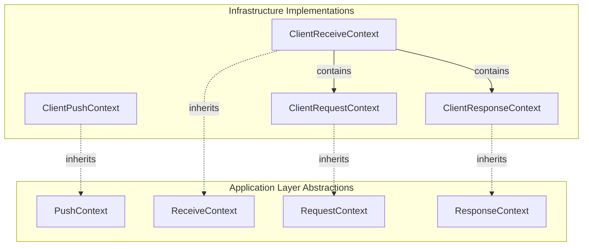
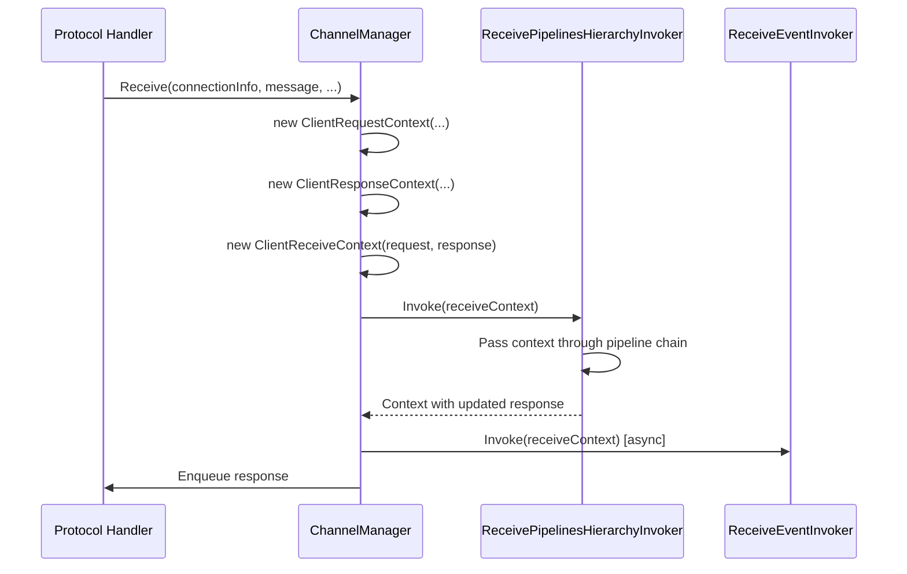
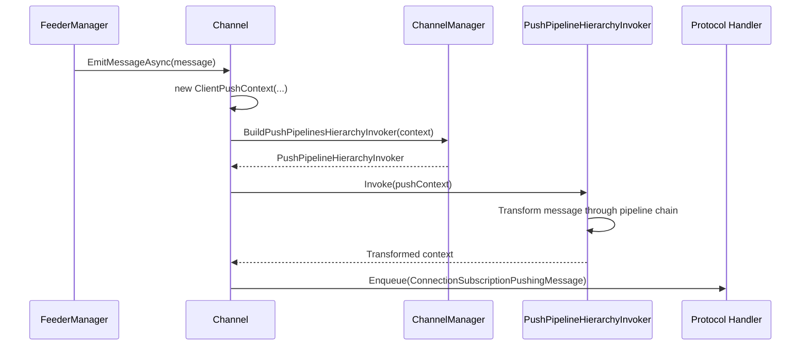

# Infrastructure.Contexts

## Overview
The Infrastructure.Contexts namespace provides concrete implementations of context abstractions from the Application layer. These context types wrap connection information, request/response data, and are used throughout pipeline and event invocation.

## Contents
- [Architecture](#architecture)
- [Public Types](#public-types)
- [Files](#files)
- [Usage Examples](#usage-examples)
- [Related Documentation](#related-documentation)

## Architecture



## Public Types

### ClientPushContext
**Kind**: Internal sealed class (non-sealed in DEBUG builds)  
**Inherits**: `PushContext` (from Application layer)  
**Summary**: Infrastructure implementation of push context for outgoing messages.

**Key Members**:
```csharp
// Inherited from PushContext:
public IConnectionInfo ConnectionInfo { get; }
public FeederMessage Message { get; }
public Subscription Subscription { get; }
```

**Usage Recipe**:
```csharp
// Created internally by ChannelManager during push pipeline invocation
var pushContext = new ClientPushContext
{
    ConnectionInfo = connectionInfo,
    Message = feederMessage,
    Subscription = subscription
};

// Used in push pipelines/events
public class LoggingPushPipeline : AbstractPushPipeline<StockChannel>
{
    protected override async Task InvokeAsync(PushContext context, PushPipelineDelegate next)
    {
        // context is ClientPushContext
        _logger.LogInformation("Pushing to {ConnectionId}", context.ConnectionInfo.ConnectionId);
        await next(context);
    }
}
```

---

### ClientReceiveContext
**Kind**: Internal sealed class (non-sealed in DEBUG builds)  
**Inherits**: `ReceiveContext` (from Application layer)  
**Summary**: Infrastructure implementation of receive context for incoming messages.

**Constructor**:
```csharp
public ClientReceiveContext(
    IConnectionInfo connectionInfo,
    RequestContext request,
    ResponseContext response)
    : base(connectionInfo, request, response)
```

**Key Members**:
```csharp
// Inherited from ReceiveContext:
public IConnectionInfo ConnectionInfo { get; }
public RequestContext Request { get; }
public ResponseContext Response { get; }
```

**Usage Recipe**:
```csharp
// Created internally by ChannelManager during message receiving
var receiveContext = new ClientReceiveContext(
    connectionInfo,
    new ClientRequestContext(connectionInfo, (receivedMessage, receivedMessage.Length)),
    new ClientResponseContext(connectionInfo, requestContext)
);

// Used in receive pipelines/events
public class SubscribeReceivePipeline : AbstractReceivePipeline<StockChannel>
{
    protected override async Task InvokeAsync(ReceiveContext context, ReceivePipelineDelegate next)
    {
        // context is ClientReceiveContext
        var requestType = context.Request.RouteTable[nameof(IRouteTableCollection.RequestType)];
        
        if (requestType.Equals("Subscribe"))
        {
            // Process subscription
        }
        
        await next(context);
    }
}
```

---

### ClientRequestContext
**Kind**: Internal sealed class (non-sealed in DEBUG builds)  
**Inherits**: `RequestContext` (from Application layer)  
**Summary**: Infrastructure implementation of request context containing incoming message data.

**Key Members**:
```csharp
// Inherited from RequestContext:
public string RequestId { get; }
public string ConnectionId { get; }
public IConnectionInfo ConnectionInfo { get; }
public IRouteTableCollection RouteTable { get; }
public IRequestContentFormCollection Content { get; }
public IQueryStringFormCollection QueryStrings { get; }
```

**Usage Recipe**:
```csharp
var requestContext = new ClientRequestContext(
    connectionInfo, 
    (receivedMessage, receivedMessage.Length)
);

// Access route table
var channelName = (string)requestContext.RouteTable[nameof(IRouteTableCollection.Channel)];
var requestType = (string)requestContext.RouteTable[nameof(IRouteTableCollection.RequestType)];

// Access request content
var body = requestContext.Content["Body"];
var fields = requestContext.Content["Fields"];

// Access query strings
var filterParam = requestContext.QueryStrings["filter"];
```

---

### ClientResponseContext
**Kind**: Internal sealed class (non-sealed in DEBUG builds)  
**Inherits**: `ResponseContext` (from Application layer)  
**Summary**: Infrastructure implementation of response context for outgoing responses.

**Key Members**:
```csharp
// Inherited from ResponseContext:
public string RequestId { get; }
public string ConnectionId { get; }
public IConnectionInfo ConnectionInfo { get; }
public int ResponseCode { get; set; }
public string ResponseContent { get; set; }
```

**Usage Recipe**:
```csharp
var responseContext = new ClientResponseContext(connectionInfo, requestContext);

// Set response in pipeline
public class SubscribeReceivePipeline : AbstractReceivePipeline<StockChannel>
{
    protected override async Task InvokeAsync(ReceiveContext context, ReceivePipelineDelegate next)
    {
        // Process subscription...
        
        context.Response.ResponseCode = 200;
        context.Response.ResponseContent = new
        {
            Success = true,
            SubscriptionIds = subscriptions.Select(s => s.Id).ToArray()
        }.ToNJson();
        
        await next(context);
    }
}
```

## Context Flow

### Receive Context Flow


### Push Context Flow


## Files

| File | LOC | Responsibility |
|------|-----|---------------|
| [ClientPushContext.cs](../../src/ThunderPropagator.Infrastructure/Contexts/ClientPushContext.cs) | 12 | Infrastructure push context implementation |
| [ClientReceiveContext.cs](../../src/ThunderPropagator.Infrastructure/Contexts/ClientReceiveContext.cs) | 20 | Infrastructure receive context implementation |
| [ClientRequestContext.cs](../../src/ThunderPropagator.Infrastructure/Contexts/ClientRequestContext.cs) | 22 | Infrastructure request context implementation |
| [ClientResponseContext.cs](../../src/ThunderPropagator.Infrastructure/Contexts/ClientResponseContext.cs) | 18 | Infrastructure response context implementation |

**Total**: 4 files, 72 LOC

## Usage Examples

### Accessing Context in Receive Pipelines
```csharp
public class AuthenticationReceivePipeline : AbstractReceivePipeline<StockChannel>
{
    protected override async Task InvokeAsync(ReceiveContext context, ReceivePipelineDelegate next)
    {
        // Access request data
        var token = context.Request.QueryStrings["token"]?.ToString();
        
        if (string.IsNullOrEmpty(token))
        {
            context.Response.ResponseCode = StatusCodes.Status401Unauthorized;
            context.Response.ResponseContent = new { Error = "Missing token" }.ToNJson();
            return; // Short-circuit pipeline
        }
        
        // Validate token...
        var user = await _authService.ValidateTokenAsync(token);
        context.Request.RouteTable["User"] = user;
        
        await next(context); // Continue to next pipeline
    }
}
```

### Accessing Context in Push Pipelines
```csharp
public class FieldFilteringPushPipeline : AbstractPushPipeline<StockChannel>
{
    protected override async Task InvokeAsync(PushContext context, PushPipelineDelegate next)
    {
        var subscription = context.Subscription;
        
        // Filter message fields based on subscription
        if (subscription.SubscribedFields != null)
        {
            var filteredMessage = new FeederMessage();
            foreach (var field in subscription.SubscribedFields.Keys)
            {
                if (context.Message.ContainsKey(field))
                    filteredMessage[field] = context.Message[field];
            }
            context.Message = filteredMessage;
        }
        
        await next(context);
    }
}
```

### Accessing Context in Events
```csharp
public class StockReceiveEvent : IReceiveEvent<StockChannel>
{
    public async Task Invoke(
        ReceiveContext context,
        [FromServices] ILogger<StockReceiveEvent> logger,
        CancellationToken cancellationToken = default)
    {
        logger.LogInformation(
            "Received request {RequestId} from connection {ConnectionId}",
            context.Request.RequestId,
            context.ConnectionInfo.ConnectionId);
        
        var requestType = context.Request.RouteTable[nameof(IRouteTableCollection.RequestType)];
        logger.LogInformation("Request type: {RequestType}", requestType);
    }
}
```

### Manual Context Creation (Testing)
```csharp
[Fact]
public async Task TestReceivePipeline()
{
    var mockConnection = new MockConnectionInfo();
    var requestContext = new ClientRequestContext(mockConnection, (Array.Empty<byte>(), 0));
    requestContext.RouteTable[nameof(IRouteTableCollection.Channel)] = "TestChannel";
    requestContext.RouteTable[nameof(IRouteTableCollection.RequestType)] = "Subscribe";
    
    var responseContext = new ClientResponseContext(mockConnection, requestContext);
    var receiveContext = new ClientReceiveContext(mockConnection, requestContext, responseContext);
    
    var pipeline = new SubscribeReceivePipeline();
    await pipeline.InvokeAsync(receiveContext, _ => Task.CompletedTask);
    
    Assert.Equal(200, receiveContext.Response.ResponseCode);
}
```

## Related Documentation
- [Parent: Infrastructure Layer](../README.md)
- [Application: Channels.Contexts](../../Application/Channels/Contexts/README.md)
- [Infrastructure: Pipelines](../Pipelines/README.md)
- [Infrastructure: Events](../Events/README.md)

---

**Namespace**: `ThunderPropagator.Infrastructure.Contexts`  
**Types**: 4 internal types  
**Files**: 4 files (72 LOC)  
**Diagrams**: ✓ Architecture, ✓ Sequences  
**Last Updated**: December 28, 2025
