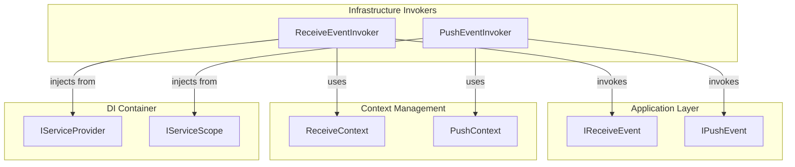
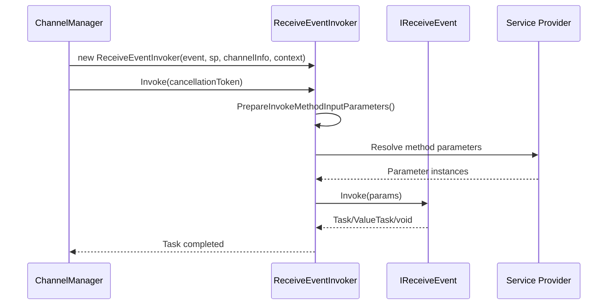
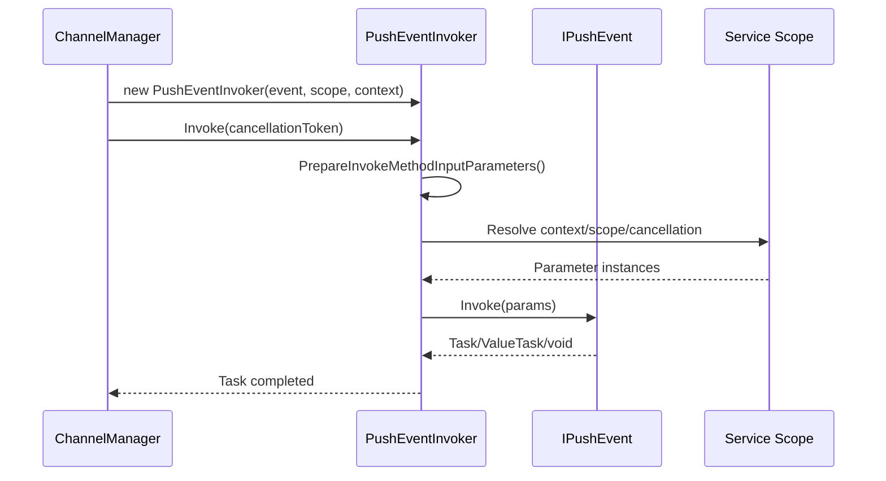

# Infrastructure.Events

## Overview
The Infrastructure.Events namespace provides invoker classes that execute pipeline and event handlers with flexible dependency injection. These invokers prepare method parameters, invoke handlers, and support both synchronous and asynchronous execution.

## Contents
- [Architecture](#architecture)
- [Public Types](#public-types)
- [Files](#files)
- [Usage Examples](#usage-examples)
- [Related Documentation](#related-documentation)

## Architecture



## Public Types

### ReceiveEventInvoker
**Kind**: Internal sealed class (non-sealed in DEBUG builds)  
**Summary**: Invokes `IReceiveEvent` handlers with flexible parameter injection.

**Constructor**:
```csharp
public ReceiveEventInvoker(
    IReceiveEvent pipeline,
    IServiceProvider serviceProvider,
    ChannelInfo channelInfo,
    ReceiveContext receiveContext)
```

**Key Members**:
```csharp
public async Task Invoke(CancellationToken cancellationToken = default);
```

**Parameter Injection Support**:
- **`[ChannelKeyParameter]`** - Injects channel name as `string`
- **`ChannelInfo`** - Injects current channel metadata
- **`ReceiveContext`, `RequestContext`, `ResponseContext`** - Context types
- **`CancellationToken`** - Cancellation support
- **`[FromQuery]`** - Injects query strings as typed object
- **`IServiceProvider` services** - Any registered service via DI

**Usage Recipe**:
```csharp
// Built by ChannelManager
var receiveEvents = BuildReceiveEventsInvoker(channelInfo, serviceProvider, receiveContext);

foreach (var eventInvoker in receiveEvents)
{
    await eventInvoker.Invoke(cancellationToken);
}

// Event handler example with parameter injection
public class StockReceiveEvent : IReceiveEvent<StockChannel>
{
    public async Task Invoke(
        [ChannelKeyParameter] string channelName,
        ChannelInfo channelInfo,
        ReceiveContext context,
        [FromQuery] StockQueryDto queryDto,
        [FromServices] IStockService stockService,
        CancellationToken cancellationToken = default)
    {
        _logger.LogInformation("Event for channel: {ChannelName}", channelName);
        
        var stocks = await stockService.GetStocksAsync(queryDto.Symbol, cancellationToken);
        // Process stocks...
    }
}
```

---

### PushEventInvoker
**Kind**: Internal sealed class (non-sealed in DEBUG builds)  
**Summary**: Invokes `IPushEvent` handlers with service scope injection.

**Constructor**:
```csharp
public PushEventInvoker(
    IPushEvent pipeline,
    IServiceScope serviceScope,
    PushContext pushContext)
```

**Key Members**:
```csharp
public async Task Invoke(CancellationToken cancellationToken = default);
```

**Parameter Injection Support**:
- **`PushContext`** - Push context with message/subscription
- **`IServiceScope`** - Service scope for scoped services
- **`IServiceProvider`** - Service provider from scope
- **`CancellationToken`** - Cancellation support

**Usage Recipe**:
```csharp
// Built by ChannelManager
var pushEvents = BuildPushEventsInvoker(channelInfo, serviceScope, pushContext);

foreach (var eventInvoker in pushEvents)
{
    await eventInvoker.Invoke(cancellationToken);
}

// Event handler example with parameter injection
public class LoggingPushEvent : IPushEvent<StockChannel>
{
    public async Task Invoke(
        PushContext context,
        IServiceScope serviceScope,
        CancellationToken cancellationToken = default)
    {
        var logger = serviceScope.ServiceProvider.GetRequiredService<ILogger<LoggingPushEvent>>();
        
        logger.LogInformation(
            "Pushing message to connection {ConnectionId}: {Message}",
            context.ConnectionInfo.ConnectionId,
            context.Message.ToNJson());
        
        await Task.CompletedTask;
    }
}
```

## Invocation Mechanism

### Receive Event Invocation Flow


### Push Event Invocation Flow


### Parameter Resolution Logic

```csharp
// ReceiveEventInvoker parameter resolution
var methodInputParameters = pipelineInvokeMethod.GetParameters().Select(parameterInfo =>
{
    // Check for [ChannelKeyParameter] attribute
    var channelKeyParameterAttribute = parameterInfo.GetCustomAttribute<ChannelKeyParameterAttribute>();
    if (channelKeyParameterAttribute is not null && parameterInfo.ParameterType == typeof(string))
        return _channelInfo.ChannelName;
    
    // Check for ChannelInfo type
    if (parameterInfo.ParameterType == typeof(ChannelInfo))
        return _channelInfo;
    
    // Check for context types
    if (typeof(ReceiveContext).IsAssignableFrom(parameterInfo.ParameterType))
        return _receiveContext;
    
    if (typeof(RequestContext).IsAssignableFrom(parameterInfo.ParameterType))
        return _receiveContext.Request;
    
    if (typeof(ResponseContext).IsAssignableFrom(parameterInfo.ParameterType))
        return _receiveContext.Response;
    
    // Check for CancellationToken
    if (typeof(CancellationToken).IsAssignableFrom(parameterInfo.ParameterType))
        return cancellationToken;
    
    // Check for [FromQuery] attribute
    if (parameterInfo.GetCustomAttributes<FromQueryAttribute>().Any())
    {
        var queryStrings = _receiveContext.Request.QueryStrings.ToNJson();
        return queryStrings.FromNJson(parameterInfo.ParameterType)!;
    }
    
    // Fallback: resolve from DI
    return _serviceProvider.GetRequiredService(parameterInfo.ParameterType);
}).ToArray();
```

## Files

| File | LOC | Responsibility |
|------|-----|---------------|
| [ReceiveEventInvoker.cs](../../src/ThunderPropagator.Infrastructure/Events/ReceiveEventInvoker.cs) | 96 | Invoke receive events with DI parameter injection |
| [PushEventInvoker.cs](../../src/ThunderPropagator.Infrastructure/Events/PushEventInvoker.cs) | 75 | Invoke push events with service scope injection |

**Total**: 2 files, 171 LOC

## Usage Examples

### Receive Event with Query Parameters
```csharp
public class StockQueryDto
{
    public string? Symbol { get; set; }
    public int? Limit { get; set; }
}

public class StockQueryReceiveEvent : IReceiveEvent<StockChannel>
{
    public async Task Invoke(
        [FromQuery] StockQueryDto queryDto,
        [FromServices] IStockService stockService,
        ReceiveContext context,
        CancellationToken cancellationToken = default)
    {
        // Query string ?symbol=AAPL&limit=10 automatically bound to queryDto
        var stocks = await stockService.GetStocksAsync(
            queryDto.Symbol, 
            queryDto.Limit ?? 100, 
            cancellationToken);
        
        context.Response.ResponseContent = stocks.ToNJson();
    }
}
```

### Push Event with Telemetry
```csharp
public class TelemetryPushEvent : IPushEvent<StockChannel>
{
    public async Task Invoke(
        PushContext context,
        IServiceScope serviceScope,
        CancellationToken cancellationToken = default)
    {
        var telemetry = serviceScope.ServiceProvider.GetRequiredService<ITelemetryService>();
        
        await telemetry.RecordPushAsync(new TelemetryData
        {
            ChannelName = context.Subscription.Channel.Metadata.ChannelName,
            ConnectionId = context.ConnectionInfo.ConnectionId,
            MessageSize = context.Message.ToNJson().Length,
            Timestamp = DateTime.UtcNow
        }, cancellationToken);
    }
}
```

### Receive Event with Channel Key Parameter
```csharp
public class LoggingReceiveEvent : IReceiveEvent<StockChannel>
{
    private readonly ILogger<LoggingReceiveEvent> _logger;
    
    public LoggingReceiveEvent(ILogger<LoggingReceiveEvent> logger)
    {
        _logger = logger;
    }
    
    public Task Invoke(
        [ChannelKeyParameter] string channelName,
        ChannelInfo channelInfo,
        RequestContext request,
        ResponseContext response,
        CancellationToken cancellationToken = default)
    {
        _logger.LogInformation(
            "Channel: {ChannelName} ({ChannelKey}), Request: {RequestId}, Response: {ResponseCode}",
            channelName,
            channelInfo.ChannelKey,
            request.RequestId,
            response.ResponseCode);
        
        return Task.CompletedTask;
    }
}
```

### Testing Event Invoker
```csharp
[Fact]
public async Task TestReceiveEventInvoker()
{
    // Arrange
    var serviceProvider = new ServiceProviderMock();
    var channelInfo = new ChannelInfo(channel, true, true);
    var receiveContext = new ClientReceiveContext(...);
    var receiveEvent = new StockReceiveEvent();
    
    var invoker = new ReceiveEventInvoker(
        receiveEvent,
        serviceProvider,
        channelInfo,
        receiveContext);
    
    // Act
    await invoker.Invoke(CancellationToken.None);
    
    // Assert
    Assert.Equal(200, receiveContext.Response.ResponseCode);
}
```

### Synchronous Event Support
```csharp
// Both async and sync methods supported
public class SyncReceiveEvent : IReceiveEvent<StockChannel>
{
    public void Invoke(ReceiveContext context)
    {
        // Synchronous processing
        Console.WriteLine($"Request ID: {context.Request.RequestId}");
    }
}

// Invoker handles both:
if (typeof(Task).IsAssignableFrom(returnType))
    await (Task)method.Invoke(event, parameters)!;
else if (typeof(ValueTask).IsAssignableFrom(returnType))
    await (ValueTask)method.Invoke(event, parameters)!;
else
    method.Invoke(event, parameters); // Synchronous
```

## Related Documentation
- [Parent: Infrastructure Layer](../README.md)
- [Application: Events.Receivers](../../Application/Events/README.md)
- [Application: Events.Pushers](../../Application/Events/Pushers/README.md)
- [Infrastructure: Contexts](../Contexts/README.md)
- [Infrastructure: Pipelines](../Pipelines/README.md)

---

**Namespace**: `ThunderPropagator.Infrastructure.Events`  
**Types**: 2 internal types  
**Files**: 2 files (171 LOC)  
**Diagrams**: ✓ Architecture, ✓ Sequences  
**Last Updated**: December 28, 2025
