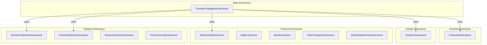
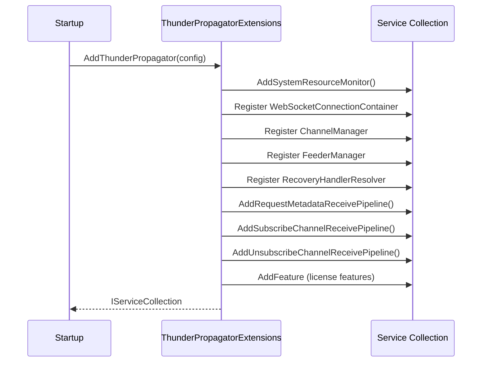
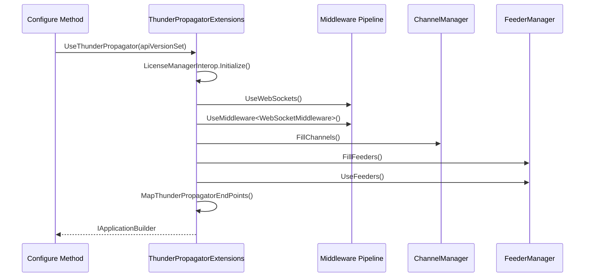

# Infrastructure.Extensions

## Overview
The Infrastructure.Extensions namespace provides extension methods for dependency injection configuration, middleware registration, and protocol setup. The `ThunderPropagatorExtensions` class is the primary entry point for configuring the entire ThunderPropagator infrastructure.

## Contents
- [Architecture](#architecture)
- [Public Types](#public-types)
- [Key Extensions](#key-extensions)
- [Files](#files)
- [Usage Examples](#usage-examples)
- [Related Documentation](#related-documentation)

## Architecture



## Public Types

### ThunderPropagatorExtensions
**Kind**: Public static class  
**Summary**: Main entry point for ThunderPropagator DI registration and middleware configuration.

**Key Members**:
```csharp
// Service registration
public static IServiceCollection AddThunderPropagator(
    this IServiceCollection services,
    IConfigurationSection configurationSection);

public static IServiceCollection AddHealthCheckSupport<THealthCheckSupport>(
    this IServiceCollection services,
    ServiceLifetime lifetime = ServiceLifetime.Singleton)
    where THealthCheckSupport : class;

// Middleware configuration
public static IApplicationBuilder UseThunderPropagator(
    this IApplicationBuilder app,
    ApiVersionSet? apiVersionSet = null);

// Endpoint mapping
public static IEndpointRouteBuilder MapThunderPropagatorEndPoints(
    this IEndpointRouteBuilder endpoints,
    ApiVersionSet apiVersionSet);

// Internal feature registration
internal static IServiceCollection AddFeature<TFeature>(
    this IServiceCollection services)
    where TFeature : class, IFeature;
```

**Usage Recipe**:
```csharp
// ConfigureServices
public void ConfigureServices(IServiceCollection services, IConfiguration configuration)
{
    services.AddThunderPropagator(configuration.GetSection("ThunderPropagator"));
}

// Configure
public void Configure(IApplicationBuilder app, IWebHostEnvironment env, ApiVersionSet apiVersionSet)
{
    app.UseThunderPropagator(apiVersionSet);
}
```

---

### ChannelsExtensions
**Kind**: Public static class  
**Summary**: Extension methods for channel-specific operations and queries.

**Key Members** (71 LOC):
- Channel metadata retrieval
- Snapshot querying
- Subscription management utilities

---

### FeedersExtensions
**Kind**: Public static class  
**Summary**: Extension methods for feeder registration and configuration.

**Key Members** (93 LOC):
- Feeder DI registration
- Feeder lifecycle management
- Feeder resolver configuration

---

### Protocol-Specific Extensions

#### WebSocketExtensions
**LOC**: Built-in (uses `Microsoft.AspNetCore.WebSockets`)

#### MqttExtensions
**LOC**: 38  
**Summary**: MQTT protocol configuration helpers.

#### QuicExtensions
**LOC**: 126  
**Summary**: QUIC protocol configuration with certificate support.

#### WebTransportExtensions
**LOC**: 31  
**Summary**: WebTransport protocol configuration.

#### InfiniteDataStreamExtensions
**LOC**: 58  
**Summary**: Long-polling alternative configuration.

---

### Pipeline & Event Extensions

#### ReceiverPipelinesExtensions
**LOC**: 74  
**Summary**: Receiver pipeline registration (`AddSubscribeChannelReceivePipeline`, `AddUnsubscribeChannelReceivePipeline`, etc.).

**Key Members**:
```csharp
public static IServiceCollection AddRequestMetadataReceivePipeline(
    this IServiceCollection services);

public static IServiceCollection AddSubscribeChannelReceivePipeline(
    this IServiceCollection services);

public static IServiceCollection AddUnsubscribeChannelReceivePipeline(
    this IServiceCollection services);

public static IServiceCollection AddAuthenticationReceivePipeline(
    this IServiceCollection services);

public static IServiceCollection AddAuthorizationReceivePipeline(
    this IServiceCollection services);
```

#### PusherPipelinesExtensions
**LOC**: 16  
**Summary**: Push pipeline registration utilities.

#### ReceiverEventsExtensions
**LOC**: 16  
**Summary**: Receiver event registration utilities.

#### PusherEventsExtensions
**LOC**: 15  
**Summary**: Push event registration utilities.

## Key Extensions

### Service Registration Flow


### Middleware Configuration Flow


## Files

| File | LOC | Responsibility |
|------|-----|---------------|
| [ThunderPropagatorExtensions.cs](../../src/ThunderPropagator.Infrastructure/Extensions/ThunderPropagatorExtensions.cs) | 259 | Main DI & middleware configuration |
| [ChannelsExtensions.cs](../../src/ThunderPropagator.Infrastructure/Extensions/ChannelsExtensions.cs) | 71 | Channel-specific utilities |
| [FeedersExtensions.cs](../../src/ThunderPropagator.Infrastructure/Extensions/FeedersExtensions.cs) | 93 | Feeder registration helpers |
| [MqttExtensions.cs](../../src/ThunderPropagator.Infrastructure/Extensions/MqttExtensions.cs) | 38 | MQTT protocol configuration |
| [QuicExtensions.cs](../../src/ThunderPropagator.Infrastructure/Extensions/QuicExtensions.cs) | 126 | QUIC protocol configuration |
| [WebTransportExtensions.cs](../../src/ThunderPropagator.Infrastructure/Extensions/WebTransportExtensions.cs) | 31 | WebTransport protocol configuration |
| [InfiniteDataStreamExtensions.cs](../../src/ThunderPropagator.Infrastructure/Extensions/InfiniteDataStreamExtensions.cs) | 58 | InfiniteDataStream protocol configuration |
| [ReceiverPipelinesExtensions.cs](../../src/ThunderPropagator.Infrastructure/Extensions/ReceiverPipelinesExtensions.cs) | 74 | Receiver pipeline registration |
| [PusherPipelinesExtensions.cs](../../src/ThunderPropagator.Infrastructure/Extensions/PusherPipelinesExtensions.cs) | 16 | Push pipeline registration |
| [ReceiverEventsExtensions.cs](../../src/ThunderPropagator.Infrastructure/Extensions/ReceiverEventsExtensions.cs) | 16 | Receiver event registration |
| [PusherEventsExtensions.cs](../../src/ThunderPropagator.Infrastructure/Extensions/PusherEventsExtensions.cs) | 15 | Push event registration |
| [SubscribingKeyFilter.cs](../../src/ThunderPropagator.Infrastructure/Extensions/Models/SubscribingKeyFilter.cs) | 8 | Query model for snapshot filtering |

**Total**: 13 files, 805 LOC

## Usage Examples

### Basic Configuration
```csharp
// appsettings.json
{
  "ThunderPropagator": {
    "KeepAliveInterval": "00:02:00",
    "CloseTimeout": "00:00:30"
  }
}

// Startup.cs
public void ConfigureServices(IServiceCollection services)
{
    services.AddThunderPropagator(Configuration.GetSection("ThunderPropagator"));
    
    // Register custom channels
    services.AddSingleton<StockChannel>();
    services.AddSingleton<IChannel>(sp => sp.GetRequiredService<StockChannel>());
    
    // Register custom feeders
    services.AddSingleton<StockFeeder>();
    services.AddSingleton<IFeeder>(sp => sp.GetRequiredService<StockFeeder>());
}

public void Configure(IApplicationBuilder app, IWebHostEnvironment env)
{
    var apiVersionSet = app.NewApiVersionSet()
        .HasApiVersion(new ApiVersion(1, 0))
        .Build();
    
    app.UseThunderPropagator(apiVersionSet);
}
```

### Custom Health Check Registration
```csharp
services.AddHealthCheckSupport<WebSocketConnectionContainer>();
services.AddHealthCheckSupport<CustomService>(ServiceLifetime.Scoped);
```

### Adding Receiver Pipelines
```csharp
services.AddRequestMetadataReceivePipeline()
        .AddAuthenticationReceivePipeline()
        .AddAuthorizationReceivePipeline()
        .AddSubscribeChannelReceivePipeline()
        .AddUnsubscribeChannelReceivePipeline();
```

### ThunderPropagator Endpoints
```csharp
// Auto-mapped by UseThunderPropagator:
// GET /thunderpropagator/v{version}/channels
// GET /thunderpropagator/v{version}/channel/{channelName}/metadata
// GET /thunderpropagator/v{version}/channel/{channelKey:guid}/metadata

// Development-only endpoints:
// GET /thunderpropagator/v{version}/channel/{channelName}/snapshot/{page?}/{pageSize?}
// GET /thunderpropagator/v{version}/channel/{channelName}/snapshot/dump/{page?}/{pageSize?}
```

### Accessing Endpoints
```csharp
// List all channels
GET https://localhost:5001/thunderpropagator/v1/channels

// Get channel metadata
GET https://localhost:5001/thunderpropagator/v1/channel/StockChannel/metadata

// Search snapshots (dev only)
GET https://localhost:5001/thunderpropagator/v1/channel/StockChannel/snapshot/0/20?symbol=AAPL

// Download snapshot dump (dev only)
GET https://localhost:5001/thunderpropagator/v1/channel/StockChannel/snapshot/dump/0/100?symbol=AAPL
```

## Related Documentation
- [Parent: Infrastructure Layer](../README.md)
- [Infrastructure: Channels](../Channels/README.md)
- [Infrastructure: Feeders](../Feeders/README.md)
- [Infrastructure: Protocols](../Protocols/README.md)
- [Infrastructure: Receivers.Pipelines](../Receivers/Pipelines/README.md)

---

**Namespace**: `ThunderPropagator.Infrastructure.Extensions`  
**Types**: 12 extension classes  
**Files**: 13 files (805 LOC)  
**Diagrams**: ✓ Architecture, ✓ Sequences  
**Last Updated**: December 28, 2025
