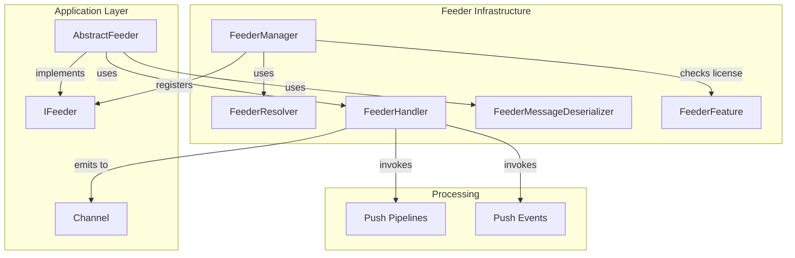
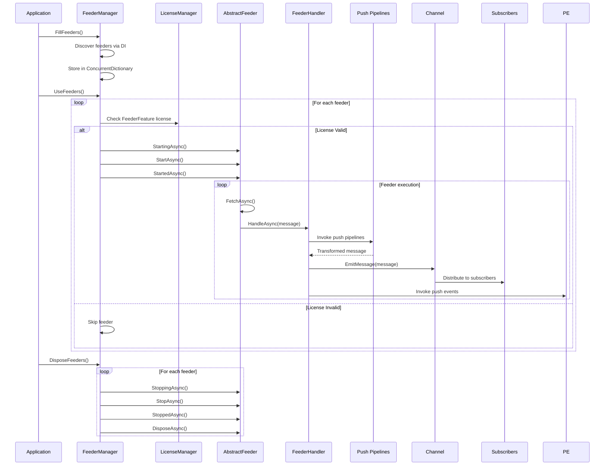

# Feeders - Infrastructure Layer

## Table of Contents
- [Overview](#overview)
- [Files](#files)
- [Types](#types)
- [Type Details](#type-details)
  - [FeederManager](#feedermanager)
  - [FeederHandler](#feederhandler)
  - [FeederMessageDeserializer](#feedermessagedeserializer)
  - [FeederResolver](#feederresolver)
  - [FeederFeature](#feederfeature)
- [Architecture](#architecture)
- [Feeder Lifecycle Flow](#feeder-lifecycle-flow)
- [Examples](#examples)
- [See Also](#see-also)

## Overview

The Feeders module provides infrastructure-level management for data feeders that populate channels with real-time content. It implements a sophisticated lifecycle management system with registration, initialization, execution, and disposal orchestration. The `FeederManager` acts as a central registry and coordinator, while `FeederHandler` processes individual feeder messages through push pipelines and events before emitting to channels.

## Files

| File | LOC | Description |
|------|-----|-------------|
| [FeederManager.cs](../../src/ThunderPropagator.Infrastructure/Feeders/FeederManager.cs) | 324 | Central feeder lifecycle manager and registry |
| [FeederHandler.cs](../../src/ThunderPropagator.Infrastructure/Feeders/FeederHandler.cs) | 104 | Processes feeder messages through pipelines and events |
| [FeederMessageDeserializer.cs](../../src/ThunderPropagator.Infrastructure/Feeders/FeederMessageDeserializer.cs) | 42 | Deserializes feeder messages from multiple formats |
| [FeederResolver.cs](../../src/ThunderPropagator.Infrastructure/Feeders/FeederResolver.cs) | 16 | Factory delegate for creating feeder instances |
| [FeederFeature.cs](../../src/ThunderPropagator.Infrastructure/Feeders/FeederFeature.cs) | 11 | Feature flag for license-gated feeder types |

**Total Files**: 5  
**Total LOC**: 497

## Types

| Type | Kind | Summary | Implements |
|------|------|---------|------------|
| `FeederManager` | Class | Central registry and lifecycle manager for all feeders | - |
| `FeederManager<TChannel>` | Class | Channel-specific feeder manager | `IFeederManager<TChannel>` |
| `FeederManager<TChannel, TFeederMessage, TFeederConfiguration>` | Class | Fully-typed feeder manager with configuration support | `IFeederManager<TChannel, TFeederMessage, TFeederConfiguration>` |
| `FeederHandler<TChannel, TFeederMessage>` | Class | Processes individual feeder messages through pipelines | `IFeederHandler<TChannel, TFeederMessage>` |
| `FeederMessageDeserializer<TFeederMessage, TFeederConfiguration>` | Class | Deserializes messages from JSON/NJson/NetJson | `IFeederMessageDeserializer<TFeederMessage, TFeederConfiguration>` |
| `FeederResolver<TChannel, TFeeder, TFeederMessage, TFeederConfiguration>` | Delegate | Factory for creating strongly-typed feeder instances | - |
| `FeederResolver<TChannel, TFeederMessage, TFeederConfiguration>` | Delegate | Factory for creating channel-specific feeder instances | - |
| `FeederFeature<TFeeder>` | Class | License-gated feature flag for specific feeder types | `IFeature` |

## Type Details

### FeederManager

**Purpose**: Central registry and lifecycle orchestrator for all feeders across all channels.

**Characteristics**:
- Thread-safe concurrent dictionary storage (`ConcurrentDictionary<Guid, ConcurrentDictionary<Guid, IFeeder>>`)
- Lock-protected initialization with `FillingState` enum (NotFilled, Filling, Filled)
- Supports three specialized generic variants for type safety
- Integrates with license management via `FeederFeature<TFeeder>`
- Automatic disposal on feeder `Disposed` event

**Key Methods**:

| Method | Purpose | Returns |
|--------|---------|---------|
| `FillFeeders()` | Discovers and registers all feeders via DI | void |
| `GetChannelFeeders(Guid channelKey)` | Retrieves all feeders for a channel | `IFeeder[]` |
| `GetFeederOrAdd(Guid channelKey, Guid feederId, IFeeder)` | Gets or adds feeder instance | `IFeeder` |
| `UseFeeder(IFeeder feeder)` | Starts feeder lifecycle (Starting → Start → Started) | `Task` |
| `UseFeeders()` | Starts all registered feeders | void |
| `DisposeFeeder(Guid channelKey, Guid feederId)` | Stops and disposes feeder (Stopping → Stop → Stopped) | `bool` |
| `DisposeFeeders()` | Disposes all feeders | void |

**Usage Recipe**:
```csharp
// Non-generic usage
var feederManager = serviceProvider.GetRequiredService<FeederManager>();
feederManager.FillFeeders(); // Discover all feeders
feederManager.UseFeeders(); // Start all feeders

// Channel-specific usage
var stockFeederManager = serviceProvider.GetRequiredService<IFeederManager<StockChannel>>();
var feeders = stockFeederManager.GetChannelFeeders(channelKey);

// Typed usage with configuration
var typedManager = serviceProvider.GetRequiredService<IFeederManager<StockChannel, StockMessage, StockFeederConfiguration>>();
var feeder = typedManager.UseFeeder(channelKey, new StockFeederConfiguration
{
    Interval = TimeSpan.FromSeconds(5),
    ApiEndpoint = "https://api.stocks.com/realtime"
});
```

### FeederHandler

**Purpose**: Processes individual feeder messages through push pipelines and events before emitting to channel.

**Characteristics**:
- Generic over `TChannel` and `TFeederMessage`
- Creates activity spans for telemetry (`ActivityKind.Consumer`)
- Executes push pipelines via `ChannelManager.BuildPushPipelinesHierarchyInvoker`
- Executes push events via `ChannelManager.BuildPushEventsInvoker`
- Injects `FeederMessage` into `PushContext` for pipeline access
- Disposes message after processing

**Processing Flow**:
1. Check `ChannelManager.IsReady`
2. Start telemetry activity
3. Create `ClientPushContext` with message
4. Invoke push pipelines (transforms message)
5. Extract transformed message
6. Emit to channel via `Channel.EmitMessage()`
7. Invoke push events
8. Dispose message

**Usage Recipe**:
```csharp
// Registered automatically via DI
services.TryAddSingleton<IFeederHandler<StockChannel, StockMessage>, FeederHandler<StockChannel, StockMessage>>();

// Used internally by feeders
public class StockFeeder : AbstractFeeder<StockChannel, StockMessage, StockFeederConfiguration>
{
    private readonly IFeederHandler<StockChannel, StockMessage> _handler;
    
    protected override async Task FetchAndProcessAsync(CancellationToken cancellationToken)
    {
        var message = await FetchFromApiAsync();
        await _handler.HandleAsync(message, cancellationToken);
    }
}
```

### FeederMessageDeserializer

**Purpose**: Deserializes feeder messages from string or byte array using configured serializer.

**Characteristics**:
- Supports three serializer types: `Json`, `NJson` (Newtonsoft.Json), `NetJson`
- Respects `TFeederConfiguration.SerializerType`
- Generic over `TFeederMessage` and `TFeederConfiguration`
- Uses extension methods from `BuildingBlocks.Application.Helpers`

**Serializer Mapping**:

| SerializerType | String Method | Bytes Method |
|----------------|---------------|--------------|
| `Json` | `FromJson<T>()` | `FromJsonBytes<T>()` |
| `NJson` | `FromNJson<T>()` | `FromNJsonBytes<T>()` |
| `NetJson` | `FromNetJson<T>()` | `FromNetJsonBytes<T>()` |

**Usage Recipe**:
```csharp
// In feeder implementation
public class ApiFeeder : AbstractFeeder<StockChannel, StockMessage, ApiFeederConfiguration>
{
    private readonly IFeederMessageDeserializer<StockMessage, ApiFeederConfiguration> _deserializer;
    
    protected override async Task FetchAndProcessAsync(CancellationToken cancellationToken)
    {
        var jsonData = await _httpClient.GetStringAsync("https://api.stocks.com/feed");
        var message = _deserializer.Deserialize(jsonData, cancellationToken);
        
        if (message != null)
        {
            await _handler.HandleAsync(message, cancellationToken);
        }
    }
}

// Configuration
public class ApiFeederConfiguration : AbstractFeederConfiguration
{
    public override SerializerType SerializerType => SerializerType.NJson;
}
```

### FeederResolver

**Purpose**: Factory delegate for creating feeder instances with dependency injection.

**Delegate Signatures**:
```csharp
// Strongly-typed variant
public delegate TFeeder FeederResolver<TChannel, TFeeder, TFeederMessage, TFeederConfiguration>(
    Guid channelKey, 
    Guid feederId, 
    TFeederConfiguration feederConfiguration);

// Interface variant
public delegate IFeeder<TChannel> FeederResolver<TChannel, TFeederMessage, TFeederConfiguration>(
    Guid channelKey, 
    Guid feederId, 
    TFeederConfiguration feederConfiguration);
```

**Usage Recipe**:
```csharp
// Registration in DI
services.AddSingleton<FeederResolver<StockChannel, StockMessage, StockFeederConfiguration>>(
    (channelKey, feederId, config) =>
    {
        var channel = channelManager.GetChannel<StockChannel>(channelKey);
        var handler = serviceProvider.GetRequiredService<IFeederHandler<StockChannel, StockMessage>>();
        return new StockFeeder(channel, handler, config);
    });

// Used by FeederManager
var feeder = _feederResolver(channelKey, feederId, configuration);
```

### FeederFeature

**Purpose**: License-gated feature flag for specific feeder types.

**Characteristics**:
- Generic over `TFeeder` where `TFeeder : IFeeder`
- Public sealed class (non-sealed in DEBUG)
- Implements `IFeature` for license management
- Decorated with `Description` attribute

**Usage Recipe**:
```csharp
// Checked automatically by FeederManager.UseFeeder
if (typeof(IFeature).IsAssignableFrom(feederType))
{
    var feederFeatureType = typeof(FeederFeature<>).MakeGenericType(feederType);
    if (!LicenseManagerInterop.IsAllowed(feederFeatureType))
        return; // Feeder not allowed by license
}

// Custom feeder with licensing
public class PremiumStockFeeder : IFeeder<StockChannel>, IFeature
{
    // Implementation
}

// License check happens automatically when calling UseFeeder
```

## Architecture



## Feeder Lifecycle Flow



## Examples

### Creating a Custom Feeder

```csharp
public class StockTickerFeeder : IterativeFeeder<StockChannel, StockTickerMessage, StockTickerFeederConfiguration>
{
    private readonly IHttpClientFactory _httpClientFactory;
    
    public StockTickerFeeder(
        StockChannel channel,
        IFeederHandler<StockChannel, StockTickerMessage> handler,
        IFeederMessageDeserializer<StockTickerMessage, StockTickerFeederConfiguration> deserializer,
        StockTickerFeederConfiguration configuration,
        IHttpClientFactory httpClientFactory)
        : base(channel, handler, deserializer, configuration)
    {
        _httpClientFactory = httpClientFactory;
    }
    
    protected override async Task<IEnumerable<StockTickerMessage>> FetchAsync(CancellationToken cancellationToken)
    {
        using var client = _httpClientFactory.CreateClient();
        var response = await client.GetStringAsync(Configuration.ApiEndpoint, cancellationToken);
        
        var messages = Deserializer.Deserialize(response, cancellationToken);
        return messages != null ? new[] { messages } : Array.Empty<StockTickerMessage>();
    }
}
```

### Registering Feeders

```csharp
// In Startup.cs or Program.cs
services.AddSingleton<FeederManager>();
services.AddSingleton<IFeederManager<StockChannel>, FeederManager<StockChannel>>();

// Register feeder
services.AddSingleton<IFeeder<StockChannel>, StockTickerFeeder>();

// Register handler and deserializer
services.AddSingleton<IFeederHandler<StockChannel, StockTickerMessage>, FeederHandler<StockChannel, StockTickerMessage>>();
services.AddSingleton<IFeederMessageDeserializer<StockTickerMessage, StockTickerFeederConfiguration>, FeederMessageDeserializer<StockTickerMessage, StockTickerFeederConfiguration>>();

// Register resolver
services.AddSingleton<FeederResolver<StockChannel, StockTickerMessage, StockTickerFeederConfiguration>>(
    serviceProvider => (channelKey, feederId, config) =>
    {
        var channel = serviceProvider.GetRequiredService<StockChannel>();
        var handler = serviceProvider.GetRequiredService<IFeederHandler<StockChannel, StockTickerMessage>>();
        var deserializer = serviceProvider.GetRequiredService<IFeederMessageDeserializer<StockTickerMessage, StockTickerFeederConfiguration>>();
        var httpClientFactory = serviceProvider.GetRequiredService<IHttpClientFactory>();
        
        return new StockTickerFeeder(channel, handler, deserializer, config, httpClientFactory);
    });
```

### Using FeederManager

```csharp
public class DataStreamingService : BackgroundService
{
    private readonly FeederManager _feederManager;
    private readonly ILogger<DataStreamingService> _logger;
    
    protected override async Task ExecuteAsync(CancellationToken stoppingToken)
    {
        _logger.LogInformation("Starting feeders...");
        
        // Initialize feeders
        _feederManager.FillFeeders();
        
        // Start all feeders
        _feederManager.UseFeeders(stoppingToken);
        
        _logger.LogInformation("All feeders started successfully");
        
        // Wait for cancellation
        await Task.Delay(Timeout.Infinite, stoppingToken);
    }
    
    public override async Task StopAsync(CancellationToken cancellationToken)
    {
        _logger.LogInformation("Stopping feeders...");
        
        _feederManager.DisposeFeeders(cancellationToken);
        
        await base.StopAsync(cancellationToken);
    }
}
```

### Dynamic Feeder Management

```csharp
public class FeederController : ControllerBase
{
    private readonly IFeederManager<StockChannel, StockTickerMessage, StockTickerFeederConfiguration> _feederManager;
    private readonly Guid _channelKey;
    
    [HttpPost("start")]
    public async Task<IActionResult> StartFeeder([FromBody] StockTickerFeederConfiguration config)
    {
        var feeder = _feederManager.UseFeeder(_channelKey, config);
        return Ok(new { FeederId = feeder.Id });
    }
    
    [HttpDelete("stop/{feederId}")]
    public IActionResult StopFeeder(Guid feederId)
    {
        bool removed = _feederManager.DisuseFeeder(_channelKey, feederId);
        return removed ? Ok() : NotFound();
    }
    
    [HttpGet("list")]
    public IActionResult ListFeeders()
    {
        var feeders = _feederManager.GetChannelFeeders(_channelKey);
        return Ok(feeders.Select(f => new { f.Id, f.ChannelKey }));
    }
}
```

### Custom Message Processing with Pipelines

```csharp
public class EnrichmentPushPipeline<TChannel> : AbstractPushPipeline<TChannel>
    where TChannel : class, IChannel
{
    public async Task Invoke(ChannelInfo channelInfo,
        PushContext context,
        PushPipelineDelegate next,
        CancellationToken cancellationToken = default)
    {
        if (context.PushContentForm.TryGetValue(nameof(FeederMessage), out var obj) && 
            obj is StockTickerMessage message)
        {
            // Enrich message with additional data
            message["MarketCap"] = await _marketDataService.GetMarketCapAsync(message.Symbol);
            message["Sector"] = await _marketDataService.GetSectorAsync(message.Symbol);
            
            context.PushContentForm[nameof(FeederMessage)] = message;
        }
        
        await next(context, cancellationToken);
    }
}

// Register pipeline
services.TryAddSingleton<EnrichmentPushPipeline<StockChannel>>();
```

## See Also

- [Application Feeders](../../Application/Feeders/README.md) - Base feeder abstractions
- [Channels](../../Application/Channels/README.md) - Channel architecture
- [Push Pipelines](../../Application/Pipelines/README.md#push-pipelines) - Pipeline abstractions
- [Push Events](../../Application/Events/Pushers/README.md) - Event-driven processing
- [BuildingBlocks Serialization](https://github.com/KiarashMinoo/ThunderPropagator/tree/develop/src/ThunderPropagator.BuildingBlocks) - Serialization helpers
- [License Management](../../Application/LicenseManagers/README.md) - Feature licensing
