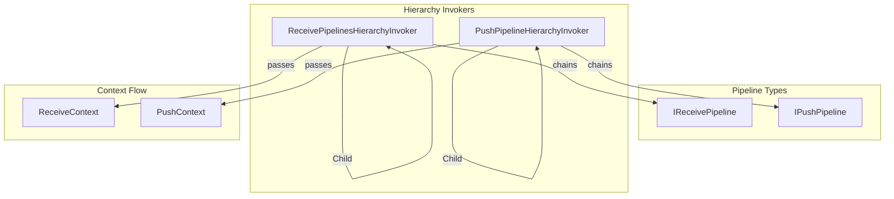
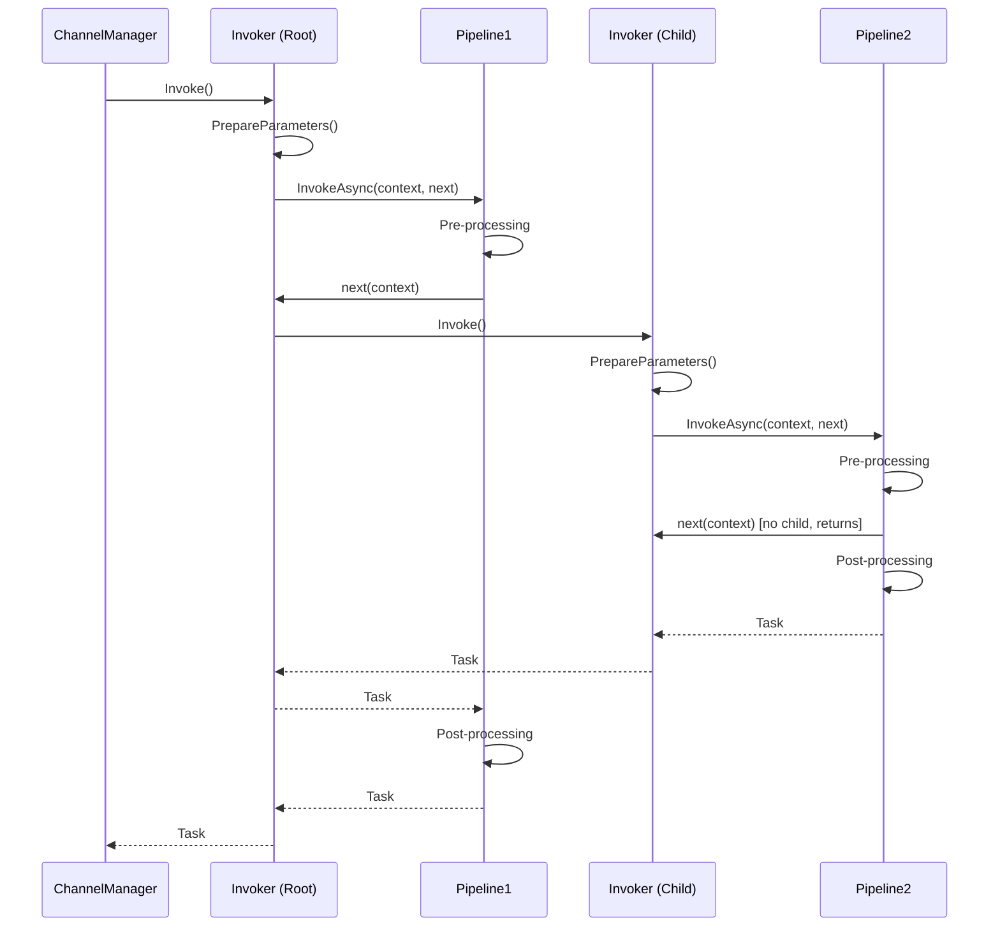
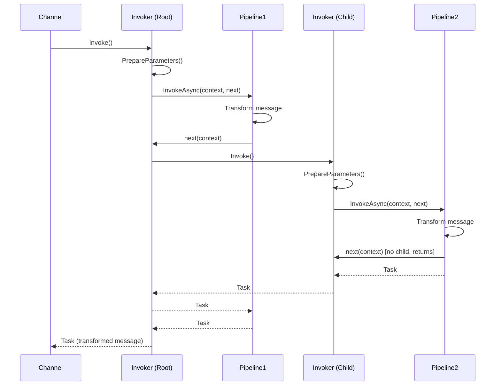

# Infrastructure.Pipelines

## Overview
The Infrastructure.Pipelines namespace provides hierarchy invoker classes that chain and execute pipeline handlers in sequence. These invokers manage the pipeline chain execution for both push and receive operations.

## Contents
- [Architecture](#architecture)
- [Public Types](#public-types)
- [Files](#files)
- [Usage Examples](#usage-examples)
- [Related Documentation](#related-documentation)

## Architecture



## Public Types

### ReceivePipelinesHierarchyInvoker
**Kind**: Internal sealed class (non-sealed in DEBUG builds)  
**Summary**: Chains and invokes receive pipelines in configured order.

**Constructor**:
```csharp
public ReceivePipelinesHierarchyInvoker(
    IReceivePipeline pipeline,
    IServiceProvider serviceProvider,
    ChannelInfo channelInfo,
    ReceiveContext receiveContext)
```

**Key Members**:
```csharp
public ReceivePipelinesHierarchyInvoker? Child { get; set; }
public async Task Invoke(CancellationToken cancellationToken = default);
```

**Parameter Injection Support**:
- **`[ChannelKeyParameter]`** - Injects channel name
- **`ChannelInfo`** - Channel metadata
- **`ReceiveContext`, `RequestContext`, `ResponseContext`** - Context types
- **`CancellationToken`** - Cancellation token
- **`[FromQuery]`** - Query string parameters
- **DI services** - Any registered service

**Usage Recipe**:
```csharp
// Build hierarchy
var root = new ReceivePipelinesHierarchyInvoker(pipeline1, sp, channelInfo, context);
var child1 = root.Child = new ReceivePipelinesHierarchyInvoker(pipeline2, sp, channelInfo, context);
child1.Child = new ReceivePipelinesHierarchyInvoker(pipeline3, sp, channelInfo, context);

// Invoke entire chain
await root.Invoke(cancellationToken);

// Each pipeline calls next(context) to continue chain
public class Pipeline1 : AbstractReceivePipeline<StockChannel>
{
    protected override async Task InvokeAsync(ReceiveContext context, ReceivePipelineDelegate next)
    {
        // Pre-processing
        _logger.LogInformation("Pipeline1: Before");
        
        await next(context); // Call next pipeline
        
        // Post-processing
        _logger.LogInformation("Pipeline1: After");
    }
}
```

---

### PushPipelineHierarchyInvoker
**Kind**: Internal sealed class (non-sealed in DEBUG builds)  
**Summary**: Chains and invokes push pipelines in configured order.

**Constructor**:
```csharp
public PushPipelineHierarchyInvoker(
    IPushPipeline pipeline,
    IServiceScope serviceScope,
    ChannelInfo channelInfo,
    PushContext pushContext)
```

**Key Members**:
```csharp
public PushPipelineHierarchyInvoker? Child { get; set; }
public async Task Invoke(CancellationToken cancellationToken = default);
```

**Parameter Injection Support**:
- **`PushContext`** - Push context with message/subscription
- **`IServiceScope`** - Service scope
- **`IServiceProvider`** - Service provider
- **`CancellationToken`** - Cancellation token

**Usage Recipe**:
```csharp
// Build hierarchy
var root = new PushPipelineHierarchyInvoker(pipeline1, scope, channelInfo, context);
var child1 = root.Child = new PushPipelineHierarchyInvoker(pipeline2, scope, channelInfo, context);
child1.Child = new PushPipelineHierarchyInvoker(pipeline3, scope, channelInfo, context);

// Invoke entire chain
await root.Invoke(cancellationToken);

// Each pipeline calls next(context) to continue chain
public class LoggingPushPipeline : AbstractPushPipeline<StockChannel>
{
    protected override async Task InvokeAsync(PushContext context, PushPipelineDelegate next)
    {
        _logger.LogInformation("Before: {Message}", context.Message.ToNJson());
        
        await next(context);
        
        _logger.LogInformation("After: {Message}", context.Message.ToNJson());
    }
}
```

## Pipeline Chain Execution

### Receive Pipeline Chain


### Push Pipeline Chain


## Files

| File | LOC | Responsibility |
|------|-----|---------------|
| [ReceivePipelinesHierarchyInvoker.cs](../../src/ThunderPropagator.Infrastructure/Pipelines/ReceivePipelinesHierarchyInvoker.cs) | 109 | Chain and invoke receive pipelines |
| [PushPipelineHierarchyInvoker.cs](../../src/ThunderPropagator.Infrastructure/Pipelines/PushPipelineHierarchyInvoker.cs) | 102 | Chain and invoke push pipelines |

**Total**: 2 files, 211 LOC

## Usage Examples

### Building Receive Pipeline Chain
```csharp
public PushPipelineHierarchyInvoker? BuildPushPipelinesHierarchyInvoker(
    ChannelInfo channelInfo,
    IServiceScope serviceScope,
    PushContext pushContext)
{
    PushPipelineHierarchyInvoker? root = null;
    PushPipelineHierarchyInvoker? temp = null;
    
    var pipelines = GetChannelPusherPipelines(channelInfo.ChannelKey, serviceScope.ServiceProvider);
    
    foreach (var pipeline in pipelines)
    {
        if (temp is null)
        {
            root = temp = new PushPipelineHierarchyInvoker(pipeline, serviceScope, channelInfo, pushContext);
        }
        else
        {
            temp = temp.Child = new PushPipelineHierarchyInvoker(pipeline, serviceScope, channelInfo, pushContext);
        }
    }
    
    return root;
}
```

### Multi-Stage Pipeline Processing
```csharp
// Pipeline 1: Authentication
public class AuthenticationReceivePipeline : AbstractReceivePipeline<StockChannel>
{
    protected override async Task InvokeAsync(ReceiveContext context, ReceivePipelineDelegate next)
    {
        var token = context.Request.QueryStrings["token"]?.ToString();
        if (string.IsNullOrEmpty(token))
        {
            context.Response.ResponseCode = 401;
            return; // Short-circuit
        }
        
        context.Request.RouteTable["User"] = await _authService.ValidateAsync(token);
        await next(context);
    }
}

// Pipeline 2: Authorization
public class AuthorizationReceivePipeline : AbstractReceivePipeline<StockChannel>
{
    protected override async Task InvokeAsync(ReceiveContext context, ReceivePipelineDelegate next)
    {
        var user = (User)context.Request.RouteTable["User"];
        if (!user.HasPermission("stocks:read"))
        {
            context.Response.ResponseCode = 403;
            return; // Short-circuit
        }
        
        await next(context);
    }
}

// Pipeline 3: Subscribe
public class SubscribeReceivePipeline : AbstractReceivePipeline<StockChannel>
{
    protected override async Task InvokeAsync(ReceiveContext context, ReceivePipelineDelegate next)
    {
        var requestDto = context.Request.Content.ToNJson().FromNJson<SubscribeRequestDto>();
        var subscriptions = await _channel.SubscribeAsync(context.ConnectionInfo, requestDto);
        
        context.Response.ResponseCode = 200;
        context.Response.ResponseContent = subscriptions.ToNJson();
        
        await next(context);
    }
}

// Execution order: Authentication → Authorization → Subscribe
```

### Cancellation Support
```csharp
var cts = new CancellationTokenSource(TimeSpan.FromSeconds(30));

try
{
    await receivePipelineInvoker.Invoke(cts.Token);
}
catch (OperationCanceledException)
{
    _logger.LogWarning("Pipeline execution cancelled after timeout");
}
```

### Testing Pipeline Chains
```csharp
[Fact]
public async Task TestPipelineChain()
{
    var pipeline1 = new LoggingPushPipeline();
    var pipeline2 = new FieldFilterPushPipeline();
    
    var root = new PushPipelineHierarchyInvoker(pipeline1, serviceScope, channelInfo, context);
    root.Child = new PushPipelineHierarchyInvoker(pipeline2, serviceScope, channelInfo, context);
    
    await root.Invoke(CancellationToken.None);
    
    // Assert message was transformed through both pipelines
    Assert.NotNull(context.Message);
    Assert.True(context.Message.ContainsKey("filtered"));
}
```

## Related Documentation
- [Parent: Infrastructure Layer](../README.md)
- [Application: Pipelines.Receivers](../../Application/Pipelines/README.md)
- [Application: Pipelines.Pushers](../../Application/Pipelines/Pushers/README.md)
- [Infrastructure: Events](../Events/README.md)
- [Infrastructure: Receivers.Pipelines](../Receivers/Pipelines/README.md)

---

**Namespace**: `ThunderPropagator.Infrastructure.Pipelines`  
**Types**: 2 internal types  
**Files**: 2 files (211 LOC)  
**Diagrams**: ✓ Architecture, ✓ Sequences  
**Last Updated**: December 28, 2025
