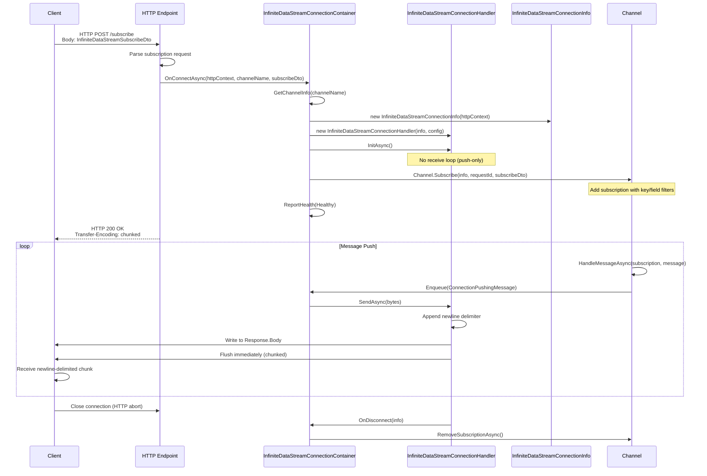
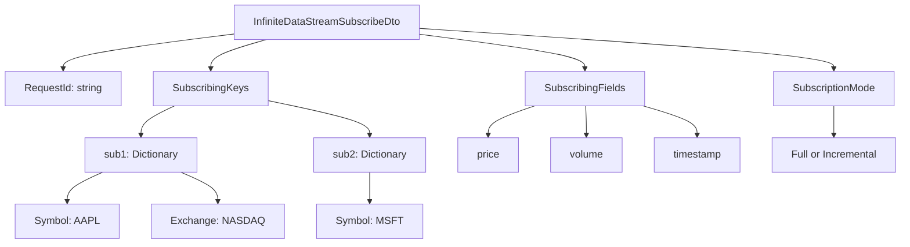
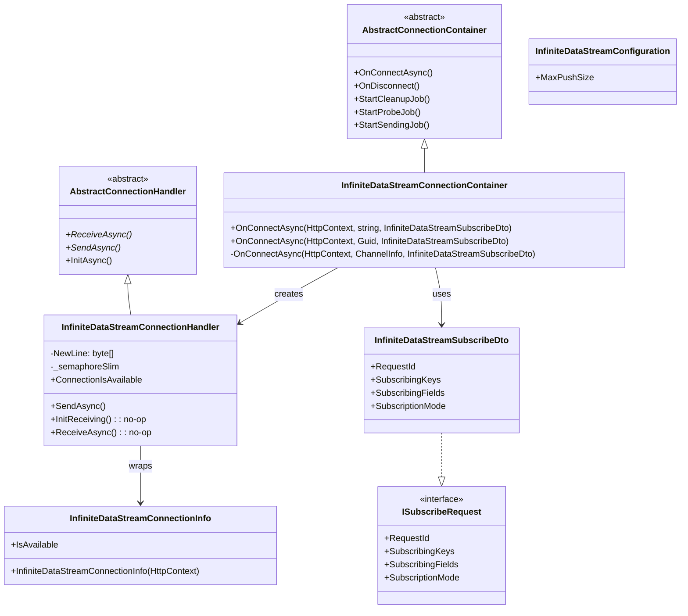

# InfiniteDataStream Protocol

## Contents
- [Overview](#overview)
- [Files](#files)
- [Types](#types)
- [Type Details](#type-details)
  - [InfiniteDataStreamConnectionContainer](#infinitedatastreamconnectioncontainer)
  - [InfiniteDataStreamConnectionHandler](#infinitedatastreamconnectionhandler)
  - [InfiniteDataStreamConnectionInfo](#infinitedatastreamconnectioninfo)
  - [InfiniteDataStreamConfiguration](#infinitedatastreamconfiguration)
  - [InfiniteDataStreamSubscribeDto](#infinitedatastreamsubscribedto)
- [Architecture Diagrams](#architecture-diagrams)
- [Performance Notes](#performance-notes)
- [Examples](#examples)
- [See Also](#see-also)

## Overview

The InfiniteDataStream protocol provides custom binary streaming over long-lived HTTP connections with chunked transfer encoding. Unlike WebSocket or WebTransport, this is a **unidirectional push-only** protocol where clients establish an HTTP connection, subscribe to channels, and receive continuous newline-delimited data streams. It's ideal for server-sent events scenarios with explicit subscription management and supports channel/key-based filtering via `InfiniteDataStreamSubscribeDto`.

## Files

| File | Primary Type(s) | LOC | Responsibility |
|------|----------------|-----|----------------|
| [InfiniteDataStreamConnectionContainer.cs](../../../../src/ThunderPropagator.Infrastructure/Protocols/InfiniteDataStream/InfiniteDataStreamConnectionContainer.cs) | `InfiniteDataStreamConnectionContainer` | 60 | Manages InfiniteDataStream connection pool, handles channel subscription at connection time |
| [InfiniteDataStreamConnectionHandler.cs](../../../../src/ThunderPropagator.Infrastructure/Protocols/InfiniteDataStream/InfiniteDataStreamConnectionHandler.cs) | `InfiniteDataStreamConnectionHandler` | 47 | Handles individual connections, implements newline-delimited streaming via `HttpContext.Response.Body` |
| [InfiniteDataStreamConnectionInfo.cs](../../../../src/ThunderPropagator.Infrastructure/Protocols/InfiniteDataStream/InfiniteDataStreamConnectionInfo.cs) | `InfiniteDataStreamConnectionInfo` | 21 | Stores HTTP connection metadata (client IP, request cancellation) |
| [InfiniteDataStreamConfiguration.cs](../../../../src/ThunderPropagator.Infrastructure/Protocols/InfiniteDataStream/InfiniteDataStreamConfiguration.cs) | `InfiniteDataStreamConfiguration` | 15 | Configuration for max push size (chunk limit) |
| [InfiniteDataStreamSubscribeDto.cs](../../../../src/ThunderPropagator.Infrastructure/Protocols/InfiniteDataStream/InfiniteDataStreamSubscribeDto.cs) | `InfiniteDataStreamSubscribeDto` | 107 | Subscription request DTO with custom JSON converter, implements `ISubscribeRequest` |

**Total LOC**: 250

## Types

| Type | Kind | Summary | Inherits/Implements | Key Members |
|------|------|---------|-------------------|-------------|
| `InfiniteDataStreamConnectionContainer` | Class | Singleton container managing InfiniteDataStream connections | `AbstractConnectionContainer<HttpContext, InfiniteDataStreamConnectionInfo, InfiniteDataStreamConnectionHandler, InfiniteDataStreamSubscribeDto, InfiniteDataStreamConfiguration>` | `OnConnectAsync(HttpContext, string, InfiniteDataStreamSubscribeDto)`, `OnConnectAsync(HttpContext, Guid, InfiniteDataStreamSubscribeDto)` |
| `InfiniteDataStreamConnectionHandler` | Class | Individual HTTP connection handler (push-only) | `AbstractConnectionHandler<HttpContext, InfiniteDataStreamConnectionInfo, InfiniteDataStreamConfiguration>` | `SendAsync()`, `ConnectionIsAvailable` |
| `InfiniteDataStreamConnectionInfo` | Class | HTTP connection metadata | `AbstractConnectionInfo<HttpContext>` | `IsAvailable` |
| `InfiniteDataStreamConfiguration` | Class | Configuration settings | `ServiceConfiguration`, `IPushMessageConfiguration` | `MaxPushSize` |
| `InfiniteDataStreamSubscribeDto` | Class | Subscription request DTO | `ISubscribeRequest` | `RequestId`, `SubscribingKeys`, `SubscribingFields`, `SubscriptionMode` |
| `InfiniteDataStreamSubscribeDtoJsonConverter` | Class | Custom JSON converter | `BuildingBlocks.Application.Serializations.Json.JsonConverter<InfiniteDataStreamSubscribeDto>` | `ReadInternal()`, `Write()` |

## Type Details

### InfiniteDataStreamConnectionContainer

**Location**: [InfiniteDataStreamConnectionContainer.cs](../../../../src/ThunderPropagator.Infrastructure/Protocols/InfiniteDataStream/InfiniteDataStreamConnectionContainer.cs)

**Purpose**: Factory and manager for InfiniteDataStream connections. Unique among protocols: **subscribes to channel at connection time** via `OnConnectAsync()` overloads accepting channel name/key and subscription DTO. Reports health status on connect/exception.

**Key Members**:
```csharp
public InfiniteDataStreamConnectionContainer(IServiceProvider serviceProvider) : base(serviceProvider)
{
    HealthName = nameof(InfiniteDataStreamConnectionContainer);
    HealthTags = [.. HealthTags, nameof(InfiniteDataStream)];
}

// Overload 1: Subscribe by channel name
internal Task OnConnectAsync(
    HttpContext httpContext, 
    string channelName, 
    InfiniteDataStreamSubscribeDto subscribeDto)
{
    var channelInfo = ChannelManager.GetChannelInfo(channelName);
    return OnConnectAsync(httpContext, channelInfo, subscribeDto);
}

// Overload 2: Subscribe by channel key (Guid)
internal Task OnConnectAsync(
    HttpContext httpContext, 
    Guid channelKey, 
    InfiniteDataStreamSubscribeDto subscribeDto)
{
    var channelInfo = ChannelManager.GetChannelInfo(channelKey);
    return OnConnectAsync(httpContext, channelInfo, subscribeDto);
}

// Internal implementation
internal async Task OnConnectAsync(
    HttpContext httpContext,
    ChannelInfo channelInfo,
    InfiniteDataStreamSubscribeDto subscribeDto)
{
    ReportHealth(HealthStatus.Healthy);

    try
    {
        InfiniteDataStreamConnectionInfo connectionInfo = new(httpContext);
        InfiniteDataStreamConnectionHandler handler = new(
            connectionInfo, 
            PushMessageConnectionConfiguration, 
            _loggerFactory, 
            _applicationLifetime
        );

        // Subscribe to channel immediately
        _ = channelInfo.Channel.Subscribe(
            connectionInfo, 
            subscribeDto.RequestId, 
            subscribeDto
        );

        await base.OnConnectAsync(connectionInfo, handler);
    }
    catch (Exception exception)
    {
        ReportHealth(HealthStatus.Unhealthy, exception);
        throw;
    }
}
```

**Usage Recipe**:
```csharp
// Registered in DI
services.TryAddSingleton<InfiniteDataStreamConnectionContainer>();
services.AddHealthCheckSupport<InfiniteDataStreamConnectionContainer>();

// Called from endpoint with subscription info
var container = serviceProvider.GetRequiredService<InfiniteDataStreamConnectionContainer>();

var subscribeDto = new InfiniteDataStreamSubscribeDto
{
    RequestId = Guid.NewGuid().ToString(),
    SubscribingKeys = new Dictionary<string, IReadOnlyDictionary<string, string>>
    {
        ["sub1"] = new Dictionary<string, string> { ["Symbol"] = "AAPL" }
    },
    SubscribingFields = new HashSet<string> { "Price", "Volume" },
    SubscriptionMode = SubscriptionMode.Incremental
};

await container.OnConnectAsync(httpContext, "stock-prices", subscribeDto);
```

---

### InfiniteDataStreamConnectionHandler

**Location**: [InfiniteDataStreamConnectionHandler.cs](../../../../src/ThunderPropagator.Infrastructure/Protocols/InfiniteDataStream/InfiniteDataStreamConnectionHandler.cs)

**Purpose**: Wraps individual HTTP connections for **push-only streaming**. No receive operations (overridden as no-op). Writes newline-delimited messages directly to `HttpContext.Response.Body` with immediate flushing for chunked transfer encoding.

**Key Members**:
```csharp
private static readonly byte[] NewLine = 
    Environment.NewLine.ToCharArray().Select(chr => (byte)chr).ToArray();

private readonly SemaphoreSlim _semaphoreSlim = new(1, 1);

protected override KeyValuePair<string, object?> HistogramTag => 
    new(nameof(Protocols), nameof(InfiniteDataStream));

protected internal override bool ConnectionIsAvailable => 
    !Gateway.RequestAborted.IsCancellationRequested;

// No-op receive operations (push-only protocol)
protected override Task InitReceiving() => Task.CompletedTask;
protected override Task ReceiveAsync(CancellationToken cancellationToken) => Task.CompletedTask;

protected override async Task SendAsync(ReadOnlyMemory<byte> message, CancellationToken cancellationToken)
{
    if (!ConnectionIsAvailable)
        return;

    await _semaphoreSlim.WaitAsync(cancellationToken);

    try
    {
        // Append newline delimiter
        byte[] buffer = [..message.ToArray(), ..NewLine];
        
        // Write to response body and flush immediately
        await Gateway.Response.Body.WriteAsync(buffer, cancellationToken);
        await Gateway.Response.Body.FlushAsync(cancellationToken);
    }
    finally
    {
        _semaphoreSlim.Release();
    }
}
```

**Usage Recipe**:
```csharp
// Created by container
var handler = new InfiniteDataStreamConnectionHandler(
    connectionInfo,
    configuration,
    loggerFactory,
    applicationLifetime
);

await handler.InitAsync(); // No receive loop, immediately ready for sends
```

---

### InfiniteDataStreamConnectionInfo

**Location**: [InfiniteDataStreamConnectionInfo.cs](../../../../src/ThunderPropagator.Infrastructure/Protocols/InfiniteDataStream/InfiniteDataStreamConnectionInfo.cs)

**Purpose**: Stores metadata for HTTP connections used in InfiniteDataStream. Checks availability via `HttpContext.RequestAborted` cancellation token.

**Key Members**:
```csharp
public override bool IsAvailable => !Gateway.RequestAborted.IsCancellationRequested;

public InfiniteDataStreamConnectionInfo(HttpContext httpContext) : base(httpContext)
{
    if (httpContext.Connection.RemoteIpAddress is not null)
        SetClientIPAddress(httpContext.Connection.RemoteIpAddress);

    if (httpContext.Connection.RemotePort > 0)
        SetClientPort(httpContext.Connection.RemotePort);
}
```

**Usage Recipe**:
```csharp
var connectionInfo = new InfiniteDataStreamConnectionInfo(httpContext);

Logger.LogInformation(
    "InfiniteDataStream connection from {IP}:{Port}",
    connectionInfo.ClientIPAddress,
    connectionInfo.ClientPort
);
```

---

### InfiniteDataStreamConfiguration

**Location**: [InfiniteDataStreamConfiguration.cs](../../../../src/ThunderPropagator.Infrastructure/Protocols/InfiniteDataStream/InfiniteDataStreamConfiguration.cs)

**Purpose**: Minimal configuration class with single property `MaxPushSize` controlling maximum chunk size for streamed messages.

**Key Members**:
```csharp
public long MaxPushSize { get; set; } = 524288;  // 512 KB default
```

**Usage Recipe**:
```csharp
services.Configure<InfiniteDataStreamConfiguration>(config =>
{
    config.MaxPushSize = 1048576;  // 1 MB chunks
});
```

---

### InfiniteDataStreamSubscribeDto

**Location**: [InfiniteDataStreamSubscribeDto.cs](../../../../src/ThunderPropagator.Infrastructure/Protocols/InfiniteDataStream/InfiniteDataStreamSubscribeDto.cs)

**Purpose**: Subscription request DTO implementing `ISubscribeRequest`. Contains subscription keys (filtering), fields (column selection), and subscription mode (Full/Incremental). Includes custom `JsonConverter` for parsing subscription requests with PascalCase key conversion.

**Key Members**:
```csharp
public class InfiniteDataStreamSubscribeDto : ISubscribeRequest
{
    public string RequestId { get; init; }
    
    // Dictionary: subscriptionId -> key-value pairs for filtering
    IReadOnlyDictionary<string, IReadOnlyDictionary<string, string>> ISubscribeRequest.SubscribingKeys => SubscribingKeys;
    private Dictionary<string, IReadOnlyDictionary<string, string>> SubscribingKeys { get; init; } = [];
    
    // Fields to include in response
    public ISet<string> SubscribingFields { get; init; } = new HashSet<string>();
    
    // Full (all fields) or Incremental (changed fields only)
    public SubscriptionMode SubscriptionMode { get; init; } = SubscriptionMode.Full;

    // Custom JSON converter
    [JsonConverter(typeof(InfiniteDataStreamSubscribeDtoJsonConverter))]
    internal class InfiniteDataStreamSubscribeDtoJsonConverter 
        : BuildingBlocks.Application.Serializations.Json.JsonConverter<InfiniteDataStreamSubscribeDto>
    {
        protected override InfiniteDataStreamSubscribeDto ReadInternal(
            ref Utf8JsonReader reader, 
            Type typeToConvert, 
            JsonSerializerOptions options)
        {
            InfiniteDataStreamSubscribeDto rtn = new();

            while (reader.Read())
            {
                if (reader.TokenType != JsonTokenType.PropertyName)
                    continue;

                var propertyName = reader.GetString()!;
                reader.Read();

                if (propertyName.Equals(nameof(SubscribingKeys), StringComparison.InvariantCultureIgnoreCase))
                {
                    // Parse nested structure: { "sub1": { "symbol": "AAPL" } }
                    while (reader.Read() && reader.TokenType != JsonTokenType.EndObject)
                    {
                        var subscriptionId = reader.GetString();
                        reader.Read();

                        var subscribingKeys = new Dictionary<string, string>();
                        while (reader.TokenType != JsonTokenType.EndObject)
                        {
                            reader.Read();
                            var key = reader.GetString();
                            reader.Read();
                            var value = reader.GetString();
                            reader.Read();

                            if (!string.IsNullOrWhiteSpace(key) && !string.IsNullOrWhiteSpace(value))
                                subscribingKeys.Add(key.ToPascalCase(), value);  // CaseConverter

                            if (subscribingKeys.Count > 0)
                                rtn.SubscribingKeys.Add(subscriptionId!, subscribingKeys);
                        }
                    }
                }
                else if (propertyName.Equals(nameof(SubscribingFields), StringComparison.InvariantCultureIgnoreCase))
                {
                    if (ReadValue(ref reader, options) is List<object> subscribingFields)
                    {
                        foreach (var field in subscribingFields)
                            rtn.SubscribingFields.Add(Guard.Against.NullOrWhiteSpace(field.ToString()));
                    }
                }
                else if (propertyName.Equals(nameof(SubscriptionMode), StringComparison.InvariantCultureIgnoreCase))
                {
                    var mode = ReadValue(ref reader, options)?.ToString();
                    if (!string.IsNullOrWhiteSpace(mode))
                        rtn.SubscriptionMode = Enum.Parse<SubscriptionMode>(mode);
                }
                else if (propertyName.Equals(nameof(RequestId), StringComparison.InvariantCultureIgnoreCase))
                {
                    rtn.RequestId = Guard.Against.NullOrWhiteSpace(ReadValue(ref reader, options)?.ToString());
                }
            }

            return rtn;
        }

        public override void Write(Utf8JsonWriter writer, InfiniteDataStreamSubscribeDto value, JsonSerializerOptions options)
        {
            throw new NotImplementedException();
        }
    }
}
```

**Usage Recipe**:
```csharp
// JSON subscription request
var json = @"{
    ""requestId"": ""req-123"",
    ""subscribingKeys"": {
        ""sub1"": { ""symbol"": ""AAPL"", ""exchange"": ""NASDAQ"" },
        ""sub2"": { ""symbol"": ""MSFT"" }
    },
    ""subscribingFields"": [""price"", ""volume"", ""timestamp""],
    ""subscriptionMode"": ""incremental""
}";

var subscribeDto = JsonSerializer.Deserialize<InfiniteDataStreamSubscribeDto>(json);

// Keys are automatically converted to PascalCase:
// "symbol" -> "Symbol", "exchange" -> "Exchange"
```

## Architecture Diagrams

### InfiniteDataStream Connection Flow



### Subscription Request Structure



### Container/Handler Class Diagram



## Performance Notes

- **Push-Only**: No receive loop overhead, handler immediately ready for sending
- **Chunked Transfer Encoding**: HTTP/1.1 chunked encoding enables infinite streaming without Content-Length
- **Newline Delimited**: Simple `\r\n` delimiter allows line-based parsing on client
- **Immediate Flush**: Each message flushed immediately to minimize latency
- **SemaphoreSlim**: Thread-safe sending with `SemaphoreSlim(1, 1)`
- **No Handshake**: HTTP connection directly transitions to streaming (unlike WebSocket upgrade)
- **Subscription at Connect**: Channel subscription happens during `OnConnectAsync()`, reducing round-trips
- **RequestAborted Tracking**: Uses `HttpContext.RequestAborted` for efficient connection state checking
- **MaxPushSize**: Limits chunk size to prevent memory exhaustion (512 KB default)
- **PascalCase Conversion**: `CaseConverter.ToPascalCase()` on subscription keys for consistency

## Examples

### HTTP Endpoint for InfiniteDataStream

```csharp
// In Program.cs or controller
app.MapPost("/stream/{channelName}", async (
    HttpContext httpContext,
    string channelName,
    [FromBody] InfiniteDataStreamSubscribeDto subscribeDto,
    InfiniteDataStreamConnectionContainer container) =>
{
    // Set response headers for streaming
    httpContext.Response.ContentType = "application/octet-stream";
    httpContext.Response.Headers.CacheControl = "no-cache";
    httpContext.Response.Headers.Connection = "keep-alive";
    
    // Start streaming
    await container.OnConnectAsync(httpContext, channelName, subscribeDto);
    
    // Keep connection alive until client disconnects
    await httpContext.RequestAborted.WaitHandle.WaitOneAsync();
});

// Alternative: Subscribe by channel GUID
app.MapPost("/stream/by-id/{channelId:guid}", async (
    HttpContext httpContext,
    Guid channelId,
    [FromBody] InfiniteDataStreamSubscribeDto subscribeDto,
    InfiniteDataStreamConnectionContainer container) =>
{
    httpContext.Response.ContentType = "application/octet-stream";
    await container.OnConnectAsync(httpContext, channelId, subscribeDto);
    await httpContext.RequestAborted.WaitHandle.WaitOneAsync();
});
```

### Client Connection (C# HttpClient)

```csharp
using System.Net.Http;
using System.Text;
using System.Text.Json;

var httpClient = new HttpClient { Timeout = Timeout.InfiniteTimeSpan };

var subscribeRequest = new
{
    requestId = Guid.NewGuid().ToString(),
    subscribingKeys = new Dictionary<string, object>
    {
        ["sub1"] = new { symbol = "AAPL", exchange = "NASDAQ" },
        ["sub2"] = new { symbol = "MSFT" }
    },
    subscribingFields = new[] { "price", "volume", "timestamp" },
    subscriptionMode = "incremental"
};

var json = JsonSerializer.Serialize(subscribeRequest);
var content = new StringContent(json, Encoding.UTF8, "application/json");

var response = await httpClient.PostAsync(
    "https://example.com/stream/stock-prices", 
    content, 
    HttpCompletionOption.ResponseHeadersRead
);

response.EnsureSuccessStatusCode();

// Read newline-delimited stream
using var stream = await response.Content.ReadAsStreamAsync();
using var reader = new StreamReader(stream);

while (!reader.EndOfStream)
{
    var line = await reader.ReadLineAsync();
    if (!string.IsNullOrWhiteSpace(line))
    {
        var message = JsonSerializer.Deserialize<Dictionary<string, object>>(line);
        Console.WriteLine($"Received: {JsonSerializer.Serialize(message)}");
    }
}
```

### Client Connection (JavaScript/Node.js)

```javascript
const https = require('https');

const subscribeRequest = JSON.stringify({
    requestId: crypto.randomUUID(),
    subscribingKeys: {
        sub1: { symbol: 'AAPL', exchange: 'NASDAQ' },
        sub2: { symbol: 'MSFT' }
    },
    subscribingFields: ['price', 'volume', 'timestamp'],
    subscriptionMode: 'incremental'
});

const options = {
    hostname: 'example.com',
    port: 443,
    path: '/stream/stock-prices',
    method: 'POST',
    headers: {
        'Content-Type': 'application/json',
        'Content-Length': Buffer.byteLength(subscribeRequest)
    }
};

const req = https.request(options, (res) => {
    console.log(`Status: ${res.statusCode}`);
    
    let buffer = '';
    
    res.on('data', (chunk) => {
        buffer += chunk.toString();
        
        // Process newline-delimited messages
        let lines = buffer.split('\n');
        buffer = lines.pop();  // Keep incomplete line in buffer
        
        lines.forEach(line => {
            if (line.trim()) {
                const message = JSON.parse(line);
                console.log('Received:', message);
            }
        });
    });
    
    res.on('end', () => {
        console.log('Stream ended');
    });
});

req.on('error', (error) => {
    console.error('Error:', error);
});

req.write(subscribeRequest);
req.end();
```

### Custom Endpoint with Authorization

```csharp
app.MapPost("/stream/{channelName}", async (
    HttpContext httpContext,
    string channelName,
    [FromBody] InfiniteDataStreamSubscribeDto subscribeDto,
    InfiniteDataStreamConnectionContainer container,
    IAuthorizationService authService) =>
{
    // Authorize user for channel access
    var authResult = await authService.AuthorizeAsync(
        httpContext.User, 
        channelName, 
        "ChannelAccess"
    );
    
    if (!authResult.Succeeded)
    {
        return Results.Forbid();
    }
    
    // Set streaming headers
    httpContext.Response.ContentType = "application/octet-stream";
    httpContext.Response.Headers.CacheControl = "no-cache";
    
    // Start streaming
    await container.OnConnectAsync(httpContext, channelName, subscribeDto);
    await httpContext.RequestAborted.WaitHandle.WaitOneAsync();
    
    return Results.Ok();
});
```

### Health Check Monitoring

```csharp
app.MapGet("/health/infinitestream", (InfiniteDataStreamConnectionContainer container) =>
{
    return Results.Json(new
    {
        status = container.HealthStatus.ToString(),
        connections = container.ConnectionCount,
        protocol = "InfiniteDataStream",
        transport = "HTTP/1.1 Chunked",
        features = new[]
        {
            "Push-only unidirectional",
            "Newline-delimited streaming",
            "Channel subscription at connect",
            "Key/field filtering"
        }
    });
});
```

## See Also

- **Parent**: [Protocols Layer](../README.md)
- **Siblings**:
  - [MQTT Protocol](../Mqtt/README.md)
  - [QUIC Protocol](../Quic/README.md)
  - [WebSockets Protocol](../WebSockets/README.md)
  - [WebTransport Protocol](../WebTransport/README.md)
- **Related**:
  - [HTTP Chunked Transfer Encoding](https://datatracker.ietf.org/doc/html/rfc7230#section-4.1)
  - [Channels](../../../Application/Channels/README.md) — Channel subscription system
  - [ChannelManager](../../Channels/README.md)
  - [Subscriptions](../../../Application/Channels/Subscribers/README.md) — Key/field filtering
