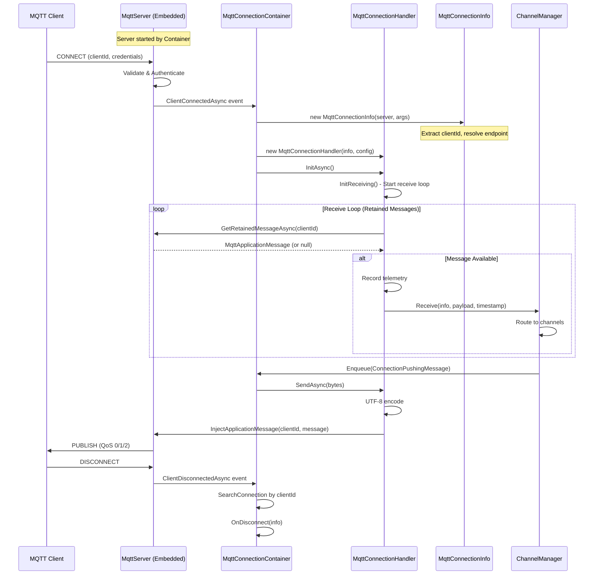
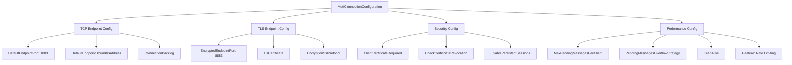
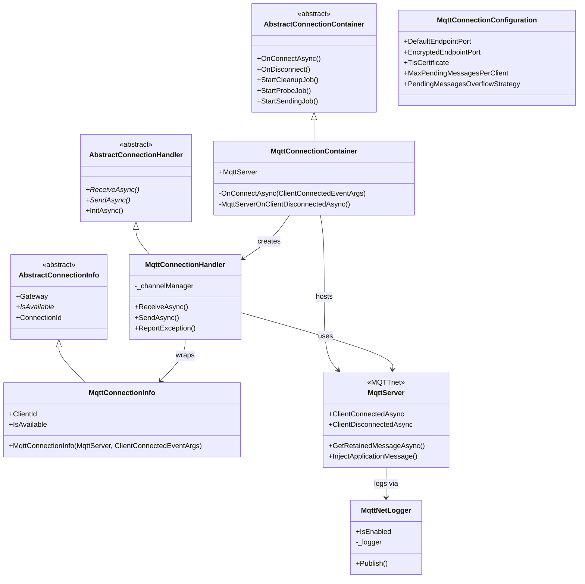

# MQTT Protocol

## Contents
- [Overview](#overview)
- [Files](#files)
- [Types](#types)
- [Type Details](#type-details)
  - [MqttConnectionContainer](#mqttconnectioncontainer)
  - [MqttConnectionHandler](#mqttconnectionhandler)
  - [MqttConnectionInfo](#mqttconnectioninfo)
  - [MqttConnectionConfiguration](#mqttconnectionconfiguration)
  - [MqttNetLogger](#mqttnetlogger)
  - [MqttConnectionFeature](#mqttconnectionfeature)
- [Architecture Diagrams](#architecture-diagrams)
- [Performance Notes](#performance-notes)
- [Examples](#examples)
- [See Also](#see-also)

## Overview

The MQTT protocol implementation provides enterprise-grade message broker integration using MQTT 5.0 via the MQTTnet library. It supports embedded broker hosting, retained message delivery, client authentication, TLS encryption, and comprehensive logging bridge. The implementation handles both TCP and TLS endpoints with configurable backlog, keepalive, and overflow strategies for pending messages.

## Files

| File | Primary Type(s) | LOC | Responsibility |
|------|----------------|-----|----------------|
| [MqttConnectionContainer.cs](../../../../src/ThunderPropagator.Infrastructure/Protocols/Mqtt/MqttConnectionContainer.cs) | `MqttConnectionContainer` | 59 | Manages MQTT broker and connection pool, handles client connect/disconnect events |
| [MqttConnectionHandler.cs](../../../../src/ThunderPropagator.Infrastructure/Protocols/Mqtt/MqttConnectionHandler.cs) | `MqttConnectionHandler` | 64 | Handles individual MQTT client connections, implements send/receive via retained messages |
| [MqttConnectionInfo.cs](../../../../src/ThunderPropagator.Infrastructure/Protocols/Mqtt/MqttConnectionInfo.cs) | `MqttConnectionInfo` | 41 | Stores MQTT connection metadata (client ID, endpoint address, DNS resolution) |
| [MqttConnectionConfiguration.cs](../../../../src/ThunderPropagator.Infrastructure/Protocols/Mqtt/MqttConnectionConfiguration.cs) | `MqttConnectionConfiguration` | 236 | Extensive configuration for MQTT broker (endpoints, TLS, keepalive, QoS, overflow) |
| [MqttNetLogger.cs](../../../../src/ThunderPropagator.Infrastructure/Protocols/Mqtt/MqttNetLogger.cs) | `MqttNetLogger` | 50 | Bridges MQTTnet logging to ASP.NET Core `ILogger` infrastructure |
| [MqttConnectionFeature.cs](../../../../src/ThunderPropagator.Infrastructure/Protocols/Mqtt/MqttConnectionFeature.cs) | `MqttConnectionFeature` | 14 | Feature marker for MQTT protocol configuration |

**Total LOC**: 464

## Types

| Type | Kind | Summary | Inherits/Implements | Key Members |
|------|------|---------|-------------------|-------------|
| `MqttConnectionContainer` | Class | Singleton container managing MQTT broker and client connections | `AbstractConnectionContainer<MqttServer, MqttConnectionInfo, MqttConnectionHandler, byte[], MqttConnectionConfiguration>` | `MqttServer`, `OnConnectAsync(ClientConnectedEventArgs)` |
| `MqttConnectionHandler` | Class | Individual MQTT client connection handler | `AbstractConnectionHandler<MqttServer, MqttConnectionInfo, MqttConnectionConfiguration>` | `ReceiveAsync()`, `SendAsync()`, `ReportException()` |
| `MqttConnectionInfo` | Class | MQTT client connection metadata | `AbstractConnectionInfo<MqttServer>` | `ClientId`, `IsAvailable` |
| `MqttConnectionConfiguration` | Class | MQTT broker configuration | `ServiceConfiguration`, `IPushMessageConfiguration` | 40+ properties for endpoints, TLS, QoS, overflow, keepalive |
| `MqttNetLogger` | Class | Logging bridge | `IMqttNetLogger` | `Publish()`, `IsEnabled` |
| `MqttConnectionFeature` | Class | Feature marker | `IFeature` | — |

## Type Details

### MqttConnectionContainer

**Location**: [MqttConnectionContainer.cs](../../../../src/ThunderPropagator.Infrastructure/Protocols/Mqtt/MqttConnectionContainer.cs)

**Purpose**: Factory and manager for MQTT connections. Hosts embedded `MqttServer` instance, subscribes to client connect/disconnect events, creates handlers for each client, and manages connection lifecycle.

**Key Members**:
```csharp
internal MqttServer MqttServer
{
    get => _mqttServer!;
    set
    {
        if (_mqttServer != null) return;
        
        _mqttServer = value;
        _mqttServer.ClientConnectedAsync += OnConnectAsync;
        _mqttServer.ClientDisconnectedAsync += MqttServerOnClientDisconnectedAsync;
        _mqttServer.StartAsync().ConfigureAwait(false).GetAwaiter().GetResult();
    }
}

public MqttConnectionContainer(IServiceProvider serviceProvider) : base(serviceProvider)
{
    HealthName = nameof(MqttConnectionContainer);
    HealthTags = [.. HealthTags, nameof(Mqtt)];
}

private Task OnConnectAsync(ClientConnectedEventArgs args)
{
    MqttConnectionInfo connectionInfo = new(MqttServer, args);
    MqttConnectionHandler handler = new(
        connectionInfo, 
        PushMessageConnectionConfiguration, 
        ChannelManager, 
        _loggerFactory, 
        _applicationLifetime
    );
    
    return base.OnConnectAsync(connectionInfo, handler);
}

private Task MqttServerOnClientDisconnectedAsync(ClientDisconnectedEventArgs arg)
{
    var connection = SearchConnection(c => c.Key.ClientId == arg.ClientId);
    if (connection is not null)
        OnDisconnect(connection.Value.Key);
    
    return Task.CompletedTask;
}
```

**Usage Recipe**:
```csharp
// Registered in DI
services.TryAddSingleton<MqttConnectionContainer>();
services.AddHealthCheckSupport<MqttConnectionContainer>();

// MQTT server injected and started
var container = serviceProvider.GetRequiredService<MqttConnectionContainer>();
container.MqttServer = mqttServerInstance;
```

---

### MqttConnectionHandler

**Location**: [MqttConnectionHandler.cs](../../../../src/ThunderPropagator.Infrastructure/Protocols/Mqtt/MqttConnectionHandler.cs)

**Purpose**: Wraps individual MQTT client connections. Uses **retained messages** pattern for receive/send operations via `GetRetainedMessageAsync()` and `InjectApplicationMessage()`. Handles UTF-8 encoding/decoding and automatic disconnect on exceptions.

**Key Members**:
```csharp
protected override KeyValuePair<string, object?> HistogramTag => 
    new(nameof(Protocols), nameof(Mqtt));

protected override async Task ReceiveAsync(CancellationToken cancellationToken)
{
    // Poll for retained message from client
    MqttApplicationMessage? message;
    do
    {
        message = await Gateway.GetRetainedMessageAsync(ConnectionInfo.ClientId);
    } while (message is null);

    // Record telemetry
    ReceivedMessageTelemetry.ReceivedMessageCounter?.Add(1, HistogramTag);
    ReceivedMessageTelemetry.ReceivedMessageSizeHistogram?.Record(message.Payload.Length, HistogramTag);

    var receivedMessage = new ConnectionReceivedMessage<byte[]>(
        message.Payload.ToArray(), 
        DateTime.UtcNow
    );

    // Forward to ChannelManager
    using var cts = CancellationTokenSource.CreateLinkedTokenSource(cancellationToken);
    _channelManager.Receive(
        ConnectionInfo, 
        receivedMessage.Message, 
        receivedMessage.DateTime, 
        cts.Token
    );
}

protected override async Task SendAsync(ReadOnlyMemory<byte> message, CancellationToken cancellationToken)
{
    // Inject message to client via broker
    await Gateway.InjectApplicationMessage(
        ConnectionInfo.ClientId, 
        Encoding.UTF8.GetString(message.Span)
    );
}

protected override void ReportException(Exception exception)
{
    base.ReportException(exception);
    
    Logger.LogInformation(
        exception,
        "Exception on gateway {GatewayType} with connectionId {ConnectionId}. Disconnecting.",
        typeof(MqttServer), 
        ConnectionInfo.ConnectionId
    );
    
    OnDisconnect(ConnectionInfo);
}
```

**Usage Recipe**:
```csharp
// Created by container on client connect
var handler = new MqttConnectionHandler(
    connectionInfo,
    configuration,
    channelManager,
    loggerFactory,
    applicationLifetime
);

await handler.InitAsync(); // Starts receive loop
```

---

### MqttConnectionInfo

**Location**: [MqttConnectionInfo.cs](../../../../src/ThunderPropagator.Infrastructure/Protocols/Mqtt/MqttConnectionInfo.cs)

**Purpose**: Stores metadata for MQTT client connections including client ID, endpoint address resolution (supports both `IPEndPoint` and `DnsEndPoint`), and broker availability checking.

**Key Members**:
```csharp
public string ClientId { get; }
public override bool IsAvailable => !Gateway.IsDisposed();

public MqttConnectionInfo(MqttServer gateway, ClientConnectedEventArgs args) : base(gateway)
{
    ClientId = args.ClientId;

    switch (args.RemoteEndPoint)
    {
        case IPEndPoint ipEndPoint:
            SetClientIPAddress(ipEndPoint.Address);
            SetClientPort(ipEndPoint.Port);
            break;
            
        case DnsEndPoint dnsEndPoint:
            var addresses = Dns.GetHostAddresses(dnsEndPoint.Host);
            if (addresses.Length > 0)
            {
                SetClientIPAddress(addresses[0]);
                SetClientPort(dnsEndPoint.Port);
            }
            break;
    }
}
```

**Usage Recipe**:
```csharp
// Created from ClientConnectedEventArgs
var connectionInfo = new MqttConnectionInfo(mqttServer, clientConnectedArgs);

Logger.LogInformation(
    "MQTT client connected: {ClientId} from {IP}:{Port}",
    connectionInfo.ClientId,
    connectionInfo.ClientIPAddress,
    connectionInfo.ClientPort
);
```

---

### MqttConnectionConfiguration

**Location**: [MqttConnectionConfiguration.cs](../../../../src/ThunderPropagator.Infrastructure/Protocols/Mqtt/MqttConnectionConfiguration.cs)

**Purpose**: Comprehensive configuration class for MQTT broker with 40+ properties controlling endpoints (TCP/TLS), security (certificates, authentication), QoS levels, message persistence, keepalive, and overflow strategies.

**Key Configuration Groups**:

**Endpoints**:
```csharp
// TCP Endpoint
public IPAddress? DefaultEndpointBoundIPAddress { get; set; }
public IPAddress? DefaultEndpointBoundIPV6Address { get; set; }
public int? DefaultEndpointPort { get; set; } = 1883;
public bool DefaultEndpointReuseAddress { get; set; }
public bool WithoutDefaultEndpoint { get; set; }

// TLS Endpoint
public bool EncryptedEndpoint { get; set; }
public IPAddress? EncryptedEndpointBoundIPAddress { get; set; }
public int? EncryptedEndpointPort { get; set; } = 8883;
public SslProtocols? EncryptionSslProtocol { get; set; }
public byte[]? TlsCertificate { get; set; }
public byte[]? TlsCertificatePassword { get; set; }
```

**Connection & Performance**:
```csharp
public int? ConnectionBacklog { get; set; }
public TimeSpan? DefaultCommunicationTimeout { get; set; }
public bool KeepAlive { get; set; }
public int? MaxPendingMessagesPerClient { get; set; }
public MqttPendingMessagesOverflowStrategy? PendingMessagesOverflowStrategy { get; set; }
```

**Security & Authentication**:
```csharp
public bool EnablePersistentSessions { get; set; }
public string? ClientCertificateRequired { get; set; }
public bool CheckCertificateRevocation { get; set; }
```

**Message Limits**:
```csharp
public long MaxRequestSize { get; set; } = 524288;  // 512 KB
public long MaxPushSize { get; set; } = 131072;     // 128 KB
public IFeature? Feature { get; set; }
```

**Usage Recipe**:
```csharp
services.Configure<MqttConnectionConfiguration>(config =>
{
    // TCP endpoint
    config.DefaultEndpointPort = 1883;
    config.DefaultEndpointBoundIPAddress = IPAddress.Any;
    
    // TLS endpoint
    config.EncryptedEndpoint = true;
    config.EncryptedEndpointPort = 8883;
    config.TlsCertificate = File.ReadAllBytes("server.pfx");
    config.TlsCertificatePassword = Encoding.UTF8.GetBytes("password");
    config.EncryptionSslProtocol = SslProtocols.Tls12 | SslProtocols.Tls13;
    
    // Performance
    config.ConnectionBacklog = 100;
    config.MaxPendingMessagesPerClient = 250;
    config.PendingMessagesOverflowStrategy = MqttPendingMessagesOverflowStrategy.DropOldestQueuedMessage;
    
    // Features
    config.Feature = new FiftyMessagesPerSecondFeature();
});
```

---

### MqttNetLogger

**Location**: [MqttNetLogger.cs](../../../../src/ThunderPropagator.Infrastructure/Protocols/Mqtt/MqttNetLogger.cs)

**Purpose**: Adapter bridging MQTTnet's `IMqttNetLogger` interface to ASP.NET Core's `ILogger<T>`. Maps MQTTnet log levels (Verbose, Info, Warning, Error) to corresponding ASP.NET Core levels (Trace, Information, Warning, Error).

**Key Members**:
```csharp
public bool IsEnabled => true;

public void Publish(
    MqttNetLogLevel logLevel, 
    string source, 
    string message, 
    object[]? parameters, 
    Exception? exception)
{
    var logMessage = parameters?.Length > 0 
        ? string.Format(message, parameters) 
        : message;

    switch (logLevel)
    {
        case MqttNetLogLevel.Verbose:
            if (_logger.IsEnabled(LogLevel.Trace))
                _logger.LogTrace(exception, logMessage);
            break;
        case MqttNetLogLevel.Info:
            if (_logger.IsEnabled(LogLevel.Information))
                _logger.LogInformation(exception, logMessage);
            break;
        case MqttNetLogLevel.Warning:
            if (_logger.IsEnabled(LogLevel.Warning))
                _logger.LogWarning(exception, logMessage);
            break;
        case MqttNetLogLevel.Error:
            if (_logger.IsEnabled(LogLevel.Error))
                _logger.LogError(exception, logMessage);
            break;
    }
}
```

**Usage Recipe**:
```csharp
// Register logger
services.TryAddSingleton<MqttNetLogger>();

// Configure MQTTnet server with logging
var mqttFactory = new MqttFactory();
var mqttLogger = serviceProvider.GetRequiredService<MqttNetLogger>();

var mqttServerOptions = mqttFactory.CreateServerOptionsBuilder()
    .WithLogger(mqttLogger)
    .Build();

var mqttServer = mqttFactory.CreateMqttServer(mqttServerOptions);
```

---

### MqttConnectionFeature

**Location**: [MqttConnectionFeature.cs](../../../../src/ThunderPropagator.Infrastructure/Protocols/Mqtt/MqttConnectionFeature.cs)

**Purpose**: Marker class implementing `IFeature` for MQTT protocol identification in configuration.

**Usage Recipe**:
```csharp
services.Configure<MqttConnectionConfiguration>(config =>
{
    config.Feature = new MqttConnectionFeature();
});
```

## Architecture Diagrams

### MQTT Broker Integration Flow



### MQTT Configuration Layers



### Container/Handler Class Diagram



## Performance Notes

- **Retained Messages Pattern**: Uses `GetRetainedMessageAsync()` polling for receive, efficient for low-frequency messages
- **Broker Hosted In-Process**: Embedded `MqttServer` reduces network hops, but requires memory/CPU allocation
- **Connection Backlog**: `ConnectionBacklog` property controls TCP listen queue size for high-concurrency scenarios
- **Overflow Strategy**: `MqttPendingMessagesOverflowStrategy` (DropOldest, DropNewst) prevents memory exhaustion on slow consumers
- **Client ID Lookup**: Uses `SearchConnection()` with lambda for disconnect event matching (O(n) scan)
- **UTF-8 Encoding**: All messages encoded/decoded as UTF-8 strings via `Encoding.UTF8`
- **TLS Overhead**: Encrypted endpoint adds CPU overhead for handshake and encryption/decryption
- **Persistent Sessions**: `EnablePersistentSessions` stores client state across reconnects (increases memory)

## Examples

### Basic MQTT Broker Configuration

```csharp
// In Program.cs or Startup.cs
var builder = WebApplication.CreateBuilder(args);

// Configure MQTT broker
builder.Services.Configure<MqttConnectionConfiguration>(config =>
{
    // TCP endpoint (unencrypted)
    config.DefaultEndpointPort = 1883;
    config.DefaultEndpointBoundIPAddress = IPAddress.Any;
    config.ConnectionBacklog = 100;
    
    // Message limits
    config.MaxRequestSize = 1048576;  // 1 MB
    config.MaxPushSize = 131072;      // 128 KB
    config.MaxPendingMessagesPerClient = 250;
    config.PendingMessagesOverflowStrategy = MqttPendingMessagesOverflowStrategy.DropOldestQueuedMessage;
    
    // Features
    config.Feature = new FiftyMessagesPerSecondFeature();
});

// Register MQTT container
builder.Services.TryAddSingleton<MqttConnectionContainer>();
builder.Services.TryAddSingleton<MqttNetLogger>();
builder.Services.AddHealthCheckSupport<MqttConnectionContainer>();

var app = builder.Build();

// Create and start MQTT server
var mqttFactory = new MqttFactory();
var mqttLogger = app.Services.GetRequiredService<MqttNetLogger>();
var mqttConfig = app.Services.GetRequiredService<IOptions<MqttConnectionConfiguration>>().Value;

var mqttServerOptions = mqttFactory.CreateServerOptionsBuilder()
    .WithDefaultEndpoint()
    .WithDefaultEndpointPort(mqttConfig.DefaultEndpointPort ?? 1883)
    .WithConnectionBacklog(mqttConfig.ConnectionBacklog ?? 100)
    .Build();

var mqttServer = mqttFactory.CreateMqttServer(mqttServerOptions, mqttLogger);
await mqttServer.StartAsync();

// Inject server into container
var mqttContainer = app.Services.GetRequiredService<MqttConnectionContainer>();
mqttContainer.MqttServer = mqttServer;

app.Run();
```

### TLS-Secured MQTT Broker

```csharp
services.Configure<MqttConnectionConfiguration>(config =>
{
    // Disable plain TCP endpoint
    config.WithoutDefaultEndpoint = true;
    
    // Enable TLS endpoint
    config.EncryptedEndpoint = true;
    config.EncryptedEndpointPort = 8883;
    config.EncryptedEndpointBoundIPAddress = IPAddress.Any;
    
    // Load certificate
    config.TlsCertificate = File.ReadAllBytes("certs/server.pfx");
    config.TlsCertificatePassword = Encoding.UTF8.GetBytes("YourSecurePassword");
    config.EncryptionSslProtocol = SslProtocols.Tls12 | SslProtocols.Tls13;
    
    // Client certificate requirement
    config.ClientCertificateRequired = "true";
    config.CheckCertificateRevocation = true;
    
    // Persistent sessions
    config.EnablePersistentSessions = true;
});

// Build server with TLS
var mqttServerOptions = mqttFactory.CreateServerOptionsBuilder()
    .WithEncryptedEndpoint()
    .WithEncryptedEndpointPort(8883)
    .WithEncryptionCertificate(config.TlsCertificate)
    .WithEncryptionSslProtocol(SslProtocols.Tls12 | SslProtocols.Tls13)
    .WithClientCertificate(CertificateSelectionCallback, ClientCertificateRequirement.Require)
    .Build();
```

### MQTT Client Connection (C#)

```csharp
using MQTTnet;
using MQTTnet.Client;

// Create MQTT client
var mqttFactory = new MqttFactory();
var mqttClient = mqttFactory.CreateMqttClient();

// Configure connection
var mqttClientOptions = new MqttClientOptionsBuilder()
    .WithClientId("MyClient_" + Guid.NewGuid())
    .WithTcpServer("localhost", 1883)
    .WithCredentials("username", "password")
    .WithCleanSession()
    .Build();

// Connect
await mqttClient.ConnectAsync(mqttClientOptions);

// Subscribe to topic
await mqttClient.SubscribeAsync(new MqttTopicFilterBuilder()
    .WithTopic("thunderpropagator/stock-prices")
    .Build());

// Handle incoming messages
mqttClient.ApplicationMessageReceivedAsync += e =>
{
    var payload = Encoding.UTF8.GetString(e.ApplicationMessage.PayloadSegment);
    Console.WriteLine($"Received: {payload}");
    return Task.CompletedTask;
};

// Publish message
var message = new MqttApplicationMessageBuilder()
    .WithTopic("thunderpropagator/commands")
    .WithPayload(JsonSerializer.Serialize(new { action = "subscribe", channel = "stocks" }))
    .WithRetainFlag()
    .Build();

await mqttClient.PublishAsync(message);
```

### Custom Authentication Handler

```csharp
var mqttServerOptions = mqttFactory.CreateServerOptionsBuilder()
    .WithDefaultEndpoint()
    .WithConnectionValidator(context =>
    {
        var username = context.UserName;
        var password = context.Password;
        
        // Validate credentials
        if (username == "admin" && password == "secret")
        {
            context.ReasonCode = MqttConnectReasonCode.Success;
        }
        else
        {
            context.ReasonCode = MqttConnectReasonCode.BadUserNameOrPassword;
        }
    })
    .Build();
```

### Monitoring Connection Count

```csharp
// In a background service or health check
public class MqttMonitoringService : BackgroundService
{
    private readonly MqttConnectionContainer _container;
    private readonly ILogger<MqttMonitoringService> _logger;

    protected override async Task ExecuteAsync(CancellationToken stoppingToken)
    {
        while (!stoppingToken.IsCancellationRequested)
        {
            _logger.LogInformation(
                "MQTT Connections: {Count}, Health: {Status}",
                _container.ConnectionCount,
                _container.HealthStatus
            );
            
            await Task.Delay(TimeSpan.FromMinutes(1), stoppingToken);
        }
    }
}
```

## See Also

- **Parent**: [Protocols Layer](../README.md)
- **Siblings**:
  - [InfiniteDataStream Protocol](../InfiniteDataStream/README.md)
  - [QUIC Protocol](../Quic/README.md)
  - [WebSockets Protocol](../WebSockets/README.md)
  - [WebTransport Protocol](../WebTransport/README.md)
- **Related**:
  - [MQTTnet Library Documentation](https://github.com/dotnet/MQTTnet)
  - [MQTT 5.0 Specification](https://docs.oasis-open.org/mqtt/mqtt/v5.0/mqtt-v5.0.html)
  - [Channels](../../../Application/Channels/README.md)
  - [ChannelManager](../../Channels/README.md)
