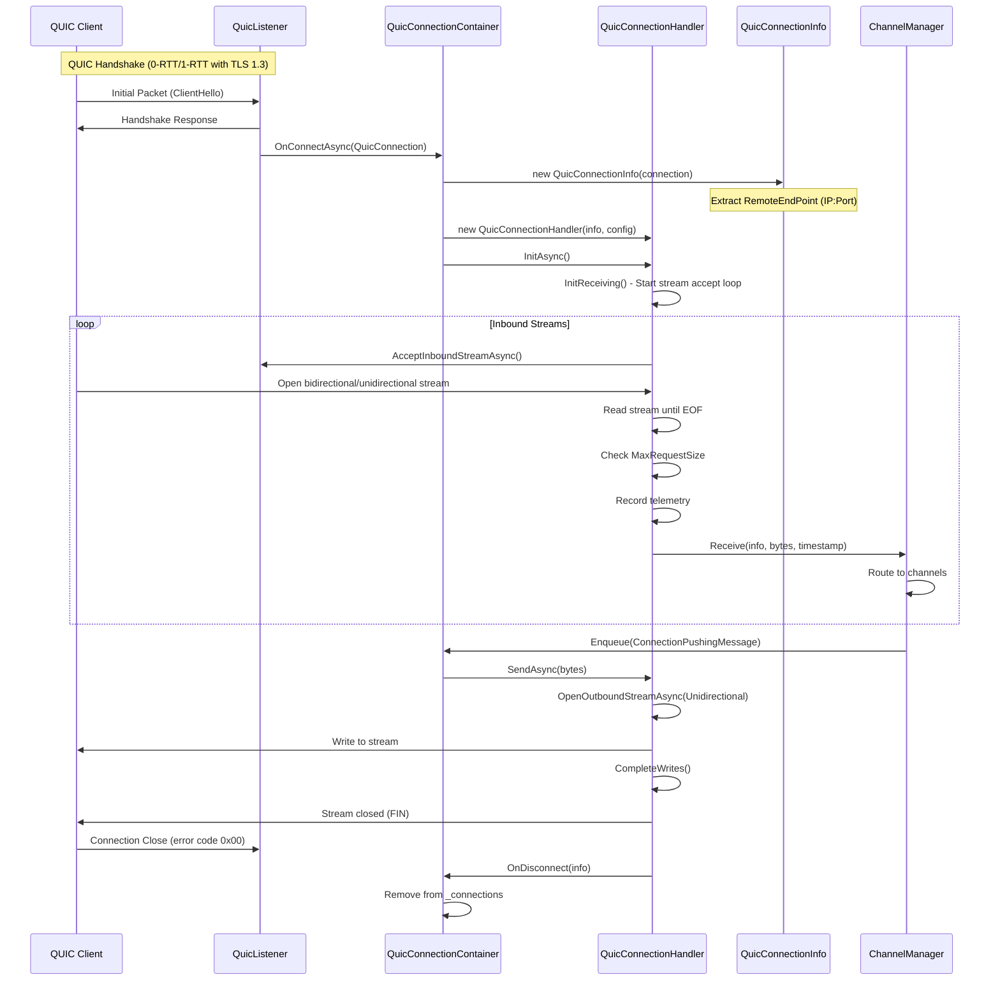
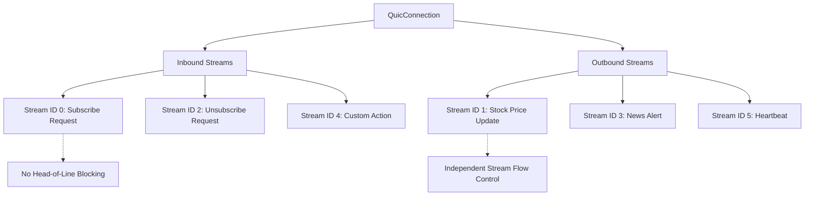
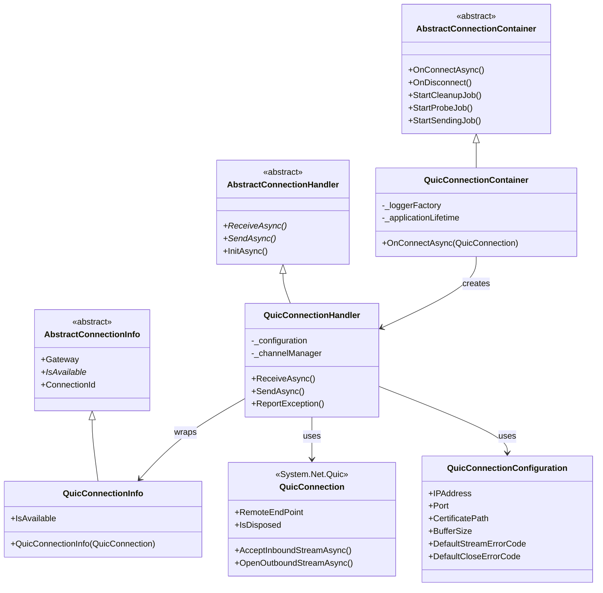

# QUIC Protocol

## Contents
- [Overview](#overview)
- [Files](#files)
- [Types](#types)
- [Type Details](#type-details)
  - [QuicConnectionContainer](#quicconnectioncontainer)
  - [QuicConnectionHandler](#quicconnectionhandler)
  - [QuicConnectionInfo](#quicconnectioninfo)
  - [QuicConnectionConfiguration](#quicconnectionconfiguration)
  - [QuicConnectionFeature](#quicconnectionfeature)
- [Architecture Diagrams](#architecture-diagrams)
- [Performance Notes](#performance-notes)
- [Examples](#examples)
- [See Also](#see-also)

## Overview

The QUIC protocol implementation provides low-latency, multiplexed transport over UDP with built-in TLS 1.3 encryption. QUIC (Quick UDP Internet Connections) offers connection migration, 0-RTT resumption, and stream-level multiplexing without head-of-line blocking. This implementation uses .NET's `System.Net.Quic` APIs and supports unidirectional streams for efficient push messaging.

## Files

| File | Primary Type(s) | LOC | Responsibility |
|------|----------------|-----|----------------|
| [QuicConnectionContainer.cs](../../../../src/ThunderPropagator.Infrastructure/Protocols/Quic/QuicConnectionContainer.cs) | `QuicConnectionContainer` | 33 | Manages QUIC connection pool, creates handlers for accepted connections |
| [QuicConnectionHandler.cs](../../../../src/ThunderPropagator.Infrastructure/Protocols/Quic/QuicConnectionHandler.cs) | `QuicConnectionHandler` | 79 | Handles individual QUIC connections, manages stream lifecycle (inbound/outbound) |
| [QuicConnectionInfo.cs](../../../../src/ThunderPropagator.Infrastructure/Protocols/Quic/QuicConnectionInfo.cs) | `QuicConnectionInfo` | 21 | Stores QUIC connection metadata (remote endpoint, availability) |
| [QuicConnectionConfiguration.cs](../../../../src/ThunderPropagator.Infrastructure/Protocols/Quic/QuicConnectionConfiguration.cs) | `QuicConnectionConfiguration` | 90 | Configuration for QUIC listener (IP, port, TLS certificate, error codes, buffers) |
| [QuicConnectionFeature.cs](../../../../src/ThunderPropagator.Infrastructure/Protocols/Quic/QuicConnectionFeature.cs) | `QuicConnectionFeature` | 14 | Feature marker for QUIC protocol configuration |

**Total LOC**: 237

## Types

| Type | Kind | Summary | Inherits/Implements | Key Members |
|------|------|---------|-------------------|-------------|
| `QuicConnectionContainer` | Class | Singleton container managing QUIC connection pool | `AbstractConnectionContainer<QuicConnection, QuicConnectionInfo, QuicConnectionHandler, byte[], QuicConnectionConfiguration>` | `OnConnectAsync(QuicConnection)` |
| `QuicConnectionHandler` | Class | Individual QUIC connection handler | `AbstractConnectionHandler<QuicConnection, QuicConnectionInfo, QuicConnectionConfiguration>` | `ReceiveAsync()`, `SendAsync()`, `ReportException()` |
| `QuicConnectionInfo` | Class | QUIC connection metadata | `AbstractConnectionInfo<QuicConnection>` | `IsAvailable` |
| `QuicConnectionConfiguration` | Class | QUIC listener configuration | `ServiceConfiguration`, `IPushMessageConfiguration` | `IPAddress`, `Port`, `CertificatePath`, `BufferSize`, `MaxRequestSize` |
| `QuicConnectionFeature` | Class | Feature marker | `IFeature` | — |

## Type Details

### QuicConnectionContainer

**Location**: [QuicConnectionContainer.cs](../../../../src/ThunderPropagator.Infrastructure/Protocols/Quic/QuicConnectionContainer.cs)

**Purpose**: Factory and manager for QUIC connections. Accepts incoming `QuicConnection` instances from a QUIC listener, creates handlers for each connection, and manages lifecycle.

**Key Members**:
```csharp
public QuicConnectionContainer(IServiceProvider serviceProvider) : base(serviceProvider)
{
    HealthName = nameof(QuicConnectionContainer);
    HealthTags = [.. HealthTags, nameof(Quic)];
}

internal Task OnConnectAsync(QuicConnection quicConnection)
{
    QuicConnectionInfo connectionInfo = new(quicConnection);
    QuicConnectionHandler handler = new(
        connectionInfo, 
        PushMessageConnectionConfiguration, 
        ChannelManager, 
        _loggerFactory, 
        _applicationLifetime
    );
    
    return base.OnConnectAsync(connectionInfo, handler);
}
```

**Usage Recipe**:
```csharp
// Registered in DI
services.TryAddSingleton<QuicConnectionContainer>();
services.AddHealthCheckSupport<QuicConnectionContainer>();

// Called when QUIC listener accepts connection
var container = serviceProvider.GetRequiredService<QuicConnectionContainer>();
await container.OnConnectAsync(quicConnection);
```

---

### QuicConnectionHandler

**Location**: [QuicConnectionHandler.cs](../../../../src/ThunderPropagator.Infrastructure/Protocols/Quic/QuicConnectionHandler.cs)

**Purpose**: Wraps individual QUIC connections, manages stream lifecycle using `AcceptInboundStreamAsync()` for receiving and `OpenOutboundStreamAsync()` for sending. Uses unidirectional streams for efficient push messaging.

**Key Members**:
```csharp
protected override KeyValuePair<string, object?> HistogramTag => 
    new(nameof(Protocols), nameof(Quic));

protected override async Task ReceiveAsync(CancellationToken cancellationToken)
{
    // Accept inbound stream
    await using var quicStream = await Gateway.AcceptInboundStreamAsync(cancellationToken);

    DateTime? startTime = null;
    var message = new List<byte>();
    var buffer = new byte[_configuration.BufferSize];

    // Read until stream closes
    int bytesRead;
    while ((bytesRead = await quicStream.ReadAsync(buffer, cancellationToken)) > 0)
    {
        if (startTime == null) startTime = DateTime.UtcNow;
        
        message.AddRange(buffer.AsSpan(0, bytesRead).ToArray());
        
        if (message.Count > _configuration.MaxRequestSize)
            throw new InvalidOperationException("Message exceeds maximum size");
    }

    // Record telemetry
    ReceivedMessageTelemetry.ReceivedMessageCounter?.Add(1, HistogramTag);
    ReceivedMessageTelemetry.ReceivedMessageSizeHistogram?.Record(message.Count, HistogramTag);

    var receivedMessage = new ConnectionReceivedMessage<byte[]>(
        message.ToArray(), 
        startTime ?? DateTime.UtcNow
    );

    // Forward to ChannelManager
    using var cts = CancellationTokenSource.CreateLinkedTokenSource(cancellationToken);
    _channelManager.Receive(
        ConnectionInfo, 
        receivedMessage.Message, 
        receivedMessage.DateTime, 
        cts.Token
    );
}

protected override async Task SendAsync(ReadOnlyMemory<byte> message, CancellationToken cancellationToken)
{
    // Open unidirectional outbound stream
    await using var quicStream = await Gateway.OpenOutboundStreamAsync(
        QuicStreamType.Unidirectional, 
        cancellationToken
    );
    
    // Write message and complete
    await quicStream.WriteAsync(message, cancellationToken);
    quicStream.CompleteWrites();
}

protected override void ReportException(Exception exception)
{
    base.ReportException(exception);
    
    Logger.LogInformation(
        exception,
        "Exception on gateway {GatewayType} with connectionId {ConnectionId}. Disconnecting.",
        typeof(QuicConnection), 
        ConnectionInfo.ConnectionId
    );
    
    OnDisconnect(ConnectionInfo);
}
```

**Usage Recipe**:
```csharp
// Created by container
var handler = new QuicConnectionHandler(
    connectionInfo,
    configuration,
    channelManager,
    loggerFactory,
    applicationLifetime
);

await handler.InitAsync(); // Starts receive loop
```

---

### QuicConnectionInfo

**Location**: [QuicConnectionInfo.cs](../../../../src/ThunderPropagator.Infrastructure/Protocols/Quic/QuicConnectionInfo.cs)

**Purpose**: Stores metadata for QUIC connections including remote endpoint address/port extraction from `QuicConnection.RemoteEndPoint` and disposal checking.

**Key Members**:
```csharp
public override bool IsAvailable => !Gateway.IsDisposed();

public QuicConnectionInfo(QuicConnection gateway) : base(gateway)
{
    SetClientIPAddress(gateway.RemoteEndPoint.Address);
    SetClientPort(gateway.RemoteEndPoint.Port);
}
```

**Usage Recipe**:
```csharp
var connectionInfo = new QuicConnectionInfo(quicConnection);

Logger.LogInformation(
    "QUIC connection from {IP}:{Port}, ConnectionId: {ConnectionId}",
    connectionInfo.ClientIPAddress,
    connectionInfo.ClientPort,
    connectionInfo.ConnectionId
);
```

---

### QuicConnectionConfiguration

**Location**: [QuicConnectionConfiguration.cs](../../../../src/ThunderPropagator.Infrastructure/Protocols/Quic/QuicConnectionConfiguration.cs)

**Purpose**: Configuration class for QUIC listener including bind address/port, TLS certificate settings, error codes for stream/connection closure, and buffer/size limits.

**Key Members**:
```csharp
// Listener Settings
public bool IsEnabled { get; set; } = false;
public string IPAddress { get; set; } = string.Empty;
public int Port { get; set; } = 0;

// TLS Settings
public string[] SslProtocols { get; set; } = Array.Empty<string>();
public string CertificatePath { get; set; } = string.Empty;
public string CertificatePassword { get; set; } = string.Empty;
public X509KeyStorageFlags X509KeyStorageFlags { get; set; } = X509KeyStorageFlags.DefaultKeySet;

// Error Codes (QUIC-specific)
public long DefaultStreamErrorCode { get; set; } = 0x0A;    // Stream-level error
public long DefaultCloseErrorCode { get; set; } = 0x0B;     // Connection-level error

// Buffer & Size Limits
public int BufferSize { get; set; } = 4096;              // 4 KB default
public long MaxRequestSize { get; set; } = 524288;       // 512 KB default
public long MaxPushSize { get; set; } = 131072;          // 128 KB default

// Rate Limiting
public IFeature? Feature { get; set; }
```

**Usage Recipe**:
```csharp
services.Configure<QuicConnectionConfiguration>(config =>
{
    config.IsEnabled = true;
    config.IPAddress = "0.0.0.0";
    config.Port = 4433;  // Standard QUIC port
    
    // TLS certificate (required for QUIC)
    config.CertificatePath = "certs/server.pfx";
    config.CertificatePassword = "YourSecurePassword";
    config.SslProtocols = new[] { "Tls13" };  // QUIC requires TLS 1.3
    
    // Buffer settings
    config.BufferSize = 8192;
    config.MaxRequestSize = 1048576;  // 1 MB
    
    // Error codes
    config.DefaultStreamErrorCode = 0x0A;  // Application error
    config.DefaultCloseErrorCode = 0x0B;   // Connection closed
    
    // Features
    config.Feature = new FiftyMessagesPerSecondFeature();
});
```

---

### QuicConnectionFeature

**Location**: [QuicConnectionFeature.cs](../../../../src/ThunderPropagator.Infrastructure/Protocols/Quic/QuicConnectionFeature.cs)

**Purpose**: Marker class implementing `IFeature` for QUIC protocol identification in configuration. Indicates "secure, low-latency communication over UDP."

**Usage Recipe**:
```csharp
services.Configure<QuicConnectionConfiguration>(config =>
{
    config.Feature = new QuicConnectionFeature();
});
```

## Architecture Diagrams

### QUIC Connection Flow



### QUIC Stream Multiplexing



### Container/Handler Class Diagram



## Performance Notes

- **UDP-Based**: QUIC runs over UDP, avoiding TCP head-of-line blocking and offering lower latency
- **0-RTT Resumption**: Supports 0-RTT connection resumption for returning clients (requires server config)
- **Stream Multiplexing**: Multiple streams share single connection without blocking each other
- **Unidirectional Streams**: Uses `QuicStreamType.Unidirectional` for push messages (lower overhead than bidirectional)
- **Stream Lifecycle**: Each receive creates new stream via `AcceptInboundStreamAsync()`, read until EOF
- **No Frame Fragmentation**: Messages read/written as complete streams (not chunked like WebSocket)
- **TLS 1.3 Required**: QUIC mandates TLS 1.3, no support for older TLS versions
- **Connection Migration**: QUIC supports client IP address changes without reconnection (not explicitly handled in code)
- **Flow Control**: Built-in stream and connection-level flow control (managed by .NET runtime)

## Examples

### Basic QUIC Listener Setup

```csharp
// In Program.cs
using System.Net;
using System.Net.Quic;
using System.Security.Cryptography.X509Certificates;

var builder = WebApplication.CreateBuilder(args);

// Configure QUIC
builder.Services.Configure<QuicConnectionConfiguration>(config =>
{
    config.IsEnabled = true;
    config.IPAddress = "0.0.0.0";
    config.Port = 4433;
    
    // TLS certificate (MANDATORY for QUIC)
    config.CertificatePath = "certs/server.pfx";
    config.CertificatePassword = "SecurePassword123";
    config.SslProtocols = new[] { "Tls13" };
    
    // Buffer and limits
    config.BufferSize = 8192;
    config.MaxRequestSize = 1048576;  // 1 MB
    config.MaxPushSize = 131072;      // 128 KB
    
    // Features
    config.Feature = new FiftyMessagesPerSecondFeature();
});

// Register QUIC container
builder.Services.TryAddSingleton<QuicConnectionContainer>();
builder.Services.AddHealthCheckSupport<QuicConnectionContainer>();

var app = builder.Build();

// Start QUIC listener
var quicConfig = app.Services.GetRequiredService<IOptions<QuicConnectionConfiguration>>().Value;

if (quicConfig.IsEnabled && QuicListener.IsSupported)
{
    var certificate = new X509Certificate2(
        quicConfig.CertificatePath, 
        quicConfig.CertificatePassword
    );
    
    var listenerOptions = new QuicListenerOptions
    {
        ListenEndPoint = new IPEndPoint(IPAddress.Parse(quicConfig.IPAddress), quicConfig.Port),
        ApplicationProtocols = new List<SslApplicationProtocol> 
        { 
            new SslApplicationProtocol("thunderpropagator") 
        },
        ConnectionOptionsCallback = (connection, ssl, token) =>
        {
            var serverOptions = new QuicServerConnectionOptions
            {
                DefaultStreamErrorCode = quicConfig.DefaultStreamErrorCode,
                DefaultCloseErrorCode = quicConfig.DefaultCloseErrorCode,
                ServerAuthenticationOptions = new SslServerAuthenticationOptions
                {
                    ApplicationProtocols = new List<SslApplicationProtocol> 
                    { 
                        new SslApplicationProtocol("thunderpropagator") 
                    },
                    ServerCertificate = certificate
                }
            };
            return ValueTask.FromResult(serverOptions);
        }
    };
    
    var listener = await QuicListener.ListenAsync(listenerOptions);
    var container = app.Services.GetRequiredService<QuicConnectionContainer>();
    
    // Accept connections in background
    _ = Task.Run(async () =>
    {
        while (true)
        {
            var connection = await listener.AcceptConnectionAsync();
            await container.OnConnectAsync(connection);
        }
    });
}
else
{
    Console.WriteLine("QUIC is not supported or not enabled");
}

app.Run();
```

### QUIC Client Connection (C#)

```csharp
using System.Net;
using System.Net.Quic;
using System.Security.Cryptography.X509Certificates;
using System.Text;

if (QuicConnection.IsSupported)
{
    var clientOptions = new QuicClientConnectionOptions
    {
        RemoteEndPoint = new IPEndPoint(IPAddress.Loopback, 4433),
        DefaultStreamErrorCode = 0x0A,
        DefaultCloseErrorCode = 0x0B,
        ClientAuthenticationOptions = new SslClientAuthenticationOptions
        {
            ApplicationProtocols = new List<SslApplicationProtocol> 
            { 
                new SslApplicationProtocol("thunderpropagator") 
            },
            RemoteCertificateValidationCallback = (sender, cert, chain, errors) => true // Dev only!
        }
    };
    
    await using var connection = await QuicConnection.ConnectAsync(clientOptions);
    Console.WriteLine($"Connected to {connection.RemoteEndPoint}");
    
    // Send subscribe request
    await using var outboundStream = await connection.OpenOutboundStreamAsync(QuicStreamType.Bidirectional);
    var subscribeMessage = Encoding.UTF8.GetBytes(JsonSerializer.Serialize(new
    {
        action = "subscribe",
        channel = "stock-prices",
        subscribingKeys = new { sub1 = new { symbol = "AAPL" } },
        subscribingFields = new[] { "price", "volume" }
    }));
    await outboundStream.WriteAsync(subscribeMessage);
    outboundStream.CompleteWrites();
    
    // Receive push messages
    while (true)
    {
        await using var inboundStream = await connection.AcceptInboundStreamAsync();
        var buffer = new byte[8192];
        var bytesRead = await inboundStream.ReadAsync(buffer);
        
        var message = Encoding.UTF8.GetString(buffer, 0, bytesRead);
        Console.WriteLine($"Received: {message}");
    }
}
else
{
    Console.WriteLine("QUIC is not supported on this platform");
}
```

### Error Handling with Custom Error Codes

```csharp
// In QuicConnectionHandler
protected override async Task SendAsync(ReadOnlyMemory<byte> message, CancellationToken cancellationToken)
{
    try
    {
        await using var quicStream = await Gateway.OpenOutboundStreamAsync(
            QuicStreamType.Unidirectional, 
            cancellationToken
        );
        
        await quicStream.WriteAsync(message, cancellationToken);
        quicStream.CompleteWrites();
    }
    catch (QuicException ex) when (ex.QuicError == QuicError.StreamAborted)
    {
        Logger.LogWarning("Stream aborted with code {ErrorCode}", ex.ApplicationErrorCode);
        OnDisconnect(ConnectionInfo);
    }
    catch (QuicException ex) when (ex.QuicError == QuicError.ConnectionAborted)
    {
        Logger.LogWarning("Connection aborted with code {ErrorCode}", ex.ApplicationErrorCode);
        OnDisconnect(ConnectionInfo);
    }
}
```

### Health Check Monitoring

```csharp
// In health check endpoint
app.MapGet("/health/quic", async (QuicConnectionContainer container) =>
{
    return Results.Json(new
    {
        status = container.HealthStatus.ToString(),
        connections = container.ConnectionCount,
        protocol = "QUIC",
        features = new[]
        {
            "0-RTT resumption",
            "Stream multiplexing",
            "Connection migration",
            "TLS 1.3 mandatory"
        }
    });
});
```

### Platform Compatibility Check

```csharp
// QUIC requires Windows 11, Linux with libmsquic, or macOS 13+
if (!QuicListener.IsSupported || !QuicConnection.IsSupported)
{
    _logger.LogWarning(
        "QUIC is not supported on this platform. " +
        "Requires: Windows 11+, Linux with libmsquic, or macOS 13+"
    );
    return;
}

// Platform-specific attributes suppress warnings
[SuppressMessage("Interoperability", "CA1416:Validate platform compatibility")]
public async Task StartQuicListener()
{
    // QUIC code here
}
```

## See Also

- **Parent**: [Protocols Layer](../README.md)
- **Siblings**:
  - [InfiniteDataStream Protocol](../InfiniteDataStream/README.md)
  - [MQTT Protocol](../Mqtt/README.md)
  - [WebSockets Protocol](../WebSockets/README.md)
  - [WebTransport Protocol](../WebTransport/README.md)
- **Related**:
  - [RFC 9000 - QUIC: A UDP-Based Multiplexed and Secure Transport](https://datatracker.ietf.org/doc/html/rfc9000)
  - [System.Net.Quic Documentation](https://learn.microsoft.com/en-us/dotnet/api/system.net.quic)
  - [Channels](../../../Application/Channels/README.md)
  - [ChannelManager](../../Channels/README.md)
