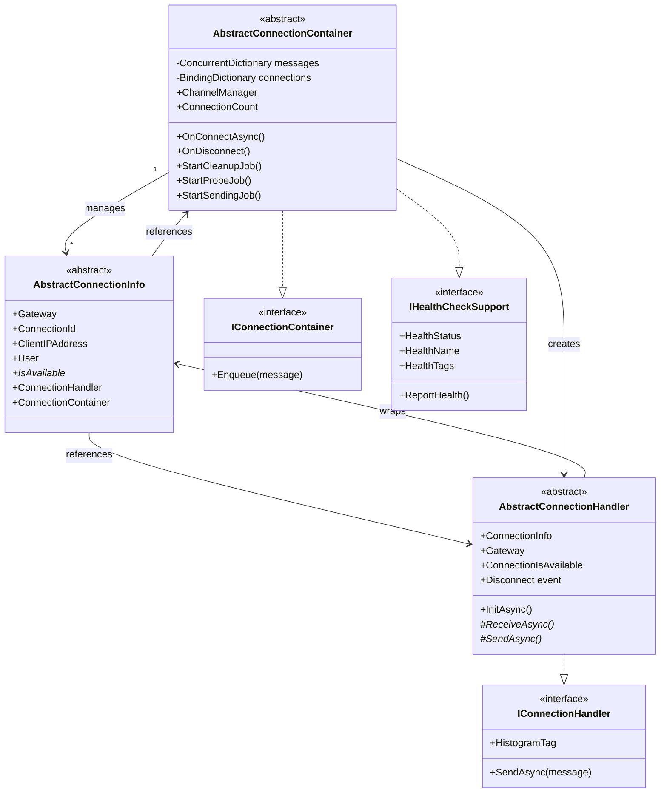
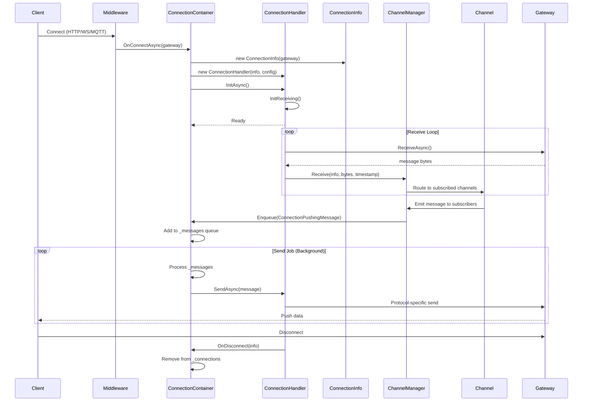
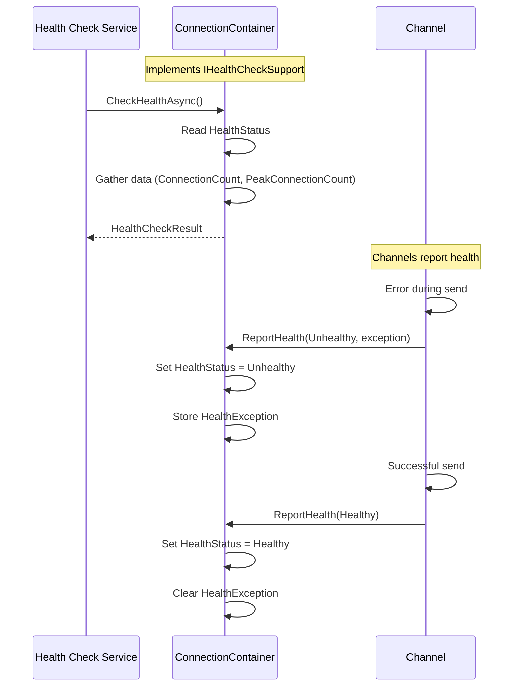

# Protocols Layer

## Contents
- [Overview](#overview)
- [Files](#files)
- [Types](#types)
- [Type Details](#type-details)
  - [AbstractConnectionContainer](#abstractconnectioncontainer)
  - [AbstractConnectionHandler](#abstractconnectionhandler)
  - [AbstractConnectionInfo](#abstractconnectioninfo)
  - [ConnectionReceivedMessage](#connectionreceivedmessage)
  - [Feature Types](#feature-types)
- [Architecture Diagrams](#architecture-diagrams)
- [Protocol Container/Handler Pattern](#protocol-containerhandler-pattern)
- [Performance Notes](#performance-notes)
- [Examples](#examples)
- [See Also](#see-also)

## Overview

The Protocols layer provides the foundational abstractions and implementations for protocol-agnostic real-time communication in ThunderPropagator. It implements a **Container/Handler** architectural pattern where containers manage connection pools, health monitoring, and background jobs, while handlers wrap individual connections and implement protocol-specific send/receive logic. This layer serves as the bridge between transport protocols (WebSocket, MQTT, QUIC, WebTransport, InfiniteDataStream) and the application's channel abstraction.

## Files

| File | Primary Type(s) | LOC | Responsibility |
|------|----------------|-----|----------------|
| [AbstractConnectionContainer.cs](../../../src/ThunderPropagator.Infrastructure/Protocols/AbstractConnectionContainer.cs) | `AbstractConnectionContainer<TGateway, TConnectionInfo, TConnectionHandler, TReceiveMessage, TPushMessageConfiguration>` | 312 | Base container managing connection pools, background jobs (cleanup, health probes, send queues), and connection lifecycle |
| [AbstractConnectionContainer.HealthCheckSupport.cs](../../../src/ThunderPropagator.Infrastructure/Protocols/AbstractConnectionContainer.HealthCheckSupport.cs) | `AbstractConnectionContainer<...>` (partial) | 56 | Health check integration implementing `IHealthCheckSupport` and `IHealthCheck` |
| [AbstractConnectionHandler.cs](../../../src/ThunderPropagator.Infrastructure/Protocols/AbstractConnectionHandler.cs) | `AbstractConnectionHandler<TGateway, TConnectionInfo, TPushMessageConfiguration>` | 125 | Base handler wrapping individual connections, managing send/receive and disposal |
| [AbstractConnectionInfo.cs](../../../src/ThunderPropagator.Infrastructure/Protocols/AbstractConnectionInfo.cs) | `AbstractConnectionInfo<TGateway>` | 79 | Connection metadata wrapper storing gateway reference, client IP, connection ID, user claims |
| [ConnectionReceivedMessage.cs](../../../src/ThunderPropagator.Infrastructure/Protocols/ConnectionReceivedMessage.cs) | `ConnectionReceivedMessage<TReceiveMessage>` | 8 | Timestamped wrapper for received protocol messages |
| [Features.cs](../../../src/ThunderPropagator.Infrastructure/Protocols/Features.cs) | `TenMessagesPerSecondFeature`, `FiftyMessagesPerSecondFeature`, `HundredMessagesPerSecondFeature` | 36 | Rate-limiting feature markers implementing `IFeature` |

**Total LOC**: 616

## Types

| Type | Kind | Summary | Inherits/Implements | Key Members |
|------|------|---------|-------------------|-------------|
| `IConnectionContainer<TGateway>` | Interface | Internal interface for connection containers | — | `Enqueue(ConnectionPushingMessage)` |
| `AbstractConnectionContainer<TGateway, TConnectionInfo, TConnectionHandler, TReceiveMessage, TPushMessageConfiguration>` | Abstract Class | Core container managing connection pools and background jobs | `EquatableObject`, `IConnectionContainer<TGateway>`, `IHealthCheckSupport` | `ConnectionCount`, `OnConnectAsync()`, `OnDisconnect()`, `SendAsync()`, `StartCleanupJob()`, `StartProbeJob()`, `StartSendingJob()` |
| `AbstractConnectionHandler<TGateway, TConnectionInfo, TPushMessageConfiguration>` | Abstract Class | Base handler for individual connections | `DisposableObject`, `IConnectionHandler<TGateway>` | `ConnectionIsAvailable`, `InitAsync()`, `ReceiveAsync()`, `SendAsync()`, `HistogramTag` |
| `AbstractConnectionInfo<TGateway>` | Abstract Class | Connection metadata wrapper | `DisposableObject`, `IConnectionInfo` | `Gateway`, `ConnectionId`, `ClientIPAddress`, `User`, `IsAvailable` |
| `ConnectionReceivedMessage<TReceiveMessage>` | Record | Timestamped received message | — | `Message`, `DateTime` |
| `TenMessagesPerSecondFeature` | Class | Rate limiter (10 msg/s) | `IFeature` | — |
| `FiftyMessagesPerSecondFeature` | Class | Rate limiter (50 msg/s) | `IFeature` | — |
| `HundredMessagesPerSecondFeature` | Class | Rate limiter (100 msg/s) | `IFeature` | — |

## Type Details

### AbstractConnectionContainer

**Location**: [AbstractConnectionContainer.cs](../../../src/ThunderPropagator.Infrastructure/Protocols/AbstractConnectionContainer.cs)

**Purpose**: Abstract base class for all protocol connection containers. Manages connection pools using thread-safe `BindingDictionary<TConnectionInfo, TConnectionHandler>`, implements three background jobs (cleanup, health probes, send queue processing), and provides health check integration.

**Generic Parameters**:
- `TGateway` — Protocol-specific gateway type (e.g., `WebSocket`, `MqttServer`, `QuicConnection`)
- `TConnectionInfo` — Connection metadata type inheriting `AbstractConnectionInfo<TGateway>`
- `TConnectionHandler` — Connection handler type inheriting `AbstractConnectionHandler<...>`
- `TReceiveMessage` — Protocol-specific received message type
- `TPushMessageConfiguration` — Push message configuration implementing `IPushMessageConfiguration`

**Key Members**:
```csharp
// Properties
protected ILogger Logger { get; }
protected ChannelManager ChannelManager { get; }
protected TPushMessageConfiguration PushMessageConnectionConfiguration { get; }
public int ConnectionCount { get; }

// Connection Management
protected Task OnConnectAsync(TConnectionInfo connectionInfo, TConnectionHandler connectionHandler)
protected virtual void OnDisconnect(TConnectionInfo connectionInfo)
protected KeyValuePair<TConnectionInfo, TConnectionHandler>? SearchConnection(Func<KeyValuePair<TConnectionInfo, TConnectionHandler>, bool> expression)

// Background Jobs
private void StartCleanupJob() // Runs every 10 minutes, removes stale connections
private void StartProbeJob()   // Runs every 30 seconds, sends PROBE messages
private void StartSendingJob() // Processes queued messages from _messages dictionary

// Message Queue
void IConnectionContainer<TGateway>.Enqueue(ConnectionPushingMessage message)
protected virtual Task SendAsync(ConnectionPushingMessage message, CancellationToken cancellationToken)

// Health Check Support (partial class)
protected HealthStatus HealthStatus { get; set; }
protected Exception? HealthException { get; set; }
public void ReportHealth(HealthStatus healthStatus, Exception? exception = null)
protected virtual Task<HealthCheckResult> CheckHealthAsync(HealthCheckContext context, CancellationToken cancellationToken)
```

**Usage Recipe**:
```csharp
// Protocol-specific container inherits and provides factory method
internal sealed class WebSocketConnectionContainer 
    : AbstractConnectionContainer<WebSocket, WebSocketConnectionInfo, WebSocketConnectionHandler, 
                                   WebSocketConnectionReceivedMessage, WebSocketConfiguration>
{
    public WebSocketConnectionContainer(IServiceProvider serviceProvider) : base(serviceProvider)
    {
        HealthName = nameof(WebSocketConnectionContainer);
        HealthTags = [.. HealthTags, nameof(WebSocket)];
    }

    // Factory method for creating handlers
    internal Task OnConnectAsync(WebSocket webSocket, HttpContext httpContext)
    {
        var connectionInfo = new WebSocketConnectionInfo(webSocket, httpContext);
        var handler = new WebSocketConnectionHandler(
            connectionInfo, 
            PushMessageConnectionConfiguration, 
            ChannelManager, 
            _loggerFactory, 
            _applicationLifetime
        );
        
        return base.OnConnectAsync(connectionInfo, handler);
    }
}
```

---

### AbstractConnectionHandler

**Location**: [AbstractConnectionHandler.cs](../../../src/ThunderPropagator.Infrastructure/Protocols/AbstractConnectionHandler.cs)

**Purpose**: Abstract base class wrapping individual protocol connections. Manages connection lifecycle, implements send/receive operations, handles telemetry tracking, and provides disposal semantics. Each handler is associated with exactly one `AbstractConnectionInfo`.

**Generic Parameters**:
- `TGateway` — Protocol-specific gateway type
- `TConnectionInfo` — Connection metadata type
- `TPushMessageConfiguration` — Push message configuration

**Key Members**:
```csharp
// Properties
protected internal TConnectionInfo ConnectionInfo { get; }
protected TGateway Gateway => ConnectionInfo.Gateway
protected virtual bool ConnectionIsAvailable { get; }
protected abstract KeyValuePair<string, object?> HistogramTag { get; } // For telemetry
protected ILogger Logger { get; }

// Events
protected internal event EventHandler<TConnectionInfo>? Disconnect;
protected virtual void OnDisconnect(TConnectionInfo connectionInfo)

// Lifecycle
internal virtual Task InitAsync()
protected virtual Task InitReceiving() // Sets up receive loop

// Protocol Operations
protected abstract Task ReceiveAsync(CancellationToken cancellationToken)
protected abstract Task SendAsync(ReadOnlyMemory<byte> message, CancellationToken cancellationToken)

// Message Handling
Task IConnectionHandler.SendAsync(ConnectionPushingMessage message, CancellationToken cancellationToken)
// ^ Formats subscription messages, handles telemetry, reports to channel
```

**Usage Recipe**:
```csharp
internal sealed class MyProtocolConnectionHandler 
    : AbstractConnectionHandler<MyGateway, MyConnectionInfo, MyConfiguration>
{
    protected override KeyValuePair<string, object?> HistogramTag => 
        new(nameof(Protocols), "MyProtocol");
    
    protected internal override bool ConnectionIsAvailable => 
        Gateway.IsConnected && !Gateway.IsClosed;

    public MyProtocolConnectionHandler(
        MyConnectionInfo connectionInfo,
        MyConfiguration configuration,
        ChannelManager channelManager,
        ILoggerFactory loggerFactory,
        IHostApplicationLifetime applicationLifetime)
        : base(connectionInfo, configuration, loggerFactory, applicationLifetime)
    {
        // Initialize protocol-specific fields
    }

    protected override async Task ReceiveAsync(CancellationToken cancellationToken)
    {
        var buffer = new byte[4096];
        var bytesRead = await Gateway.ReceiveAsync(buffer, cancellationToken);
        
        // Record telemetry
        ReceivedMessageTelemetry.ReceivedMessageCounter?.Add(1, HistogramTag);
        ReceivedMessageTelemetry.ReceivedMessageSizeHistogram?.Record(bytesRead, HistogramTag);
        
        // Forward to ChannelManager
        _channelManager.Receive(ConnectionInfo, buffer[..bytesRead], DateTime.UtcNow, cancellationToken);
    }

    protected override Task SendAsync(ReadOnlyMemory<byte> message, CancellationToken cancellationToken)
    {
        return Gateway.SendAsync(message, cancellationToken);
    }
}
```

---

### AbstractConnectionInfo

**Location**: [AbstractConnectionInfo.cs](../../../src/ThunderPropagator.Infrastructure/Protocols/AbstractConnectionInfo.cs)

**Purpose**: Metadata wrapper for individual connections. Stores protocol-specific gateway reference, generates unique connection IDs, tracks client IP/port, extracts user claims from `HttpContext`, and provides references to associated handler and container.

**Generic Parameters**:
- `TGateway` — Protocol-specific gateway type

**Key Members**:
```csharp
// Core Properties
protected internal TGateway Gateway { get; }
public string ConnectionId { get; } // Hex-encoded Unix timestamp
public string ClientIPAddress { get; private set; }
public int ClientPort { get; private set; }
public DateTime ConnectionDateTime { get; }
public ClaimsPrincipal User { get; protected init; }
public abstract bool IsAvailable { get; }

// References
protected internal IConnectionHandler? ConnectionHandler { get; private set; }
protected internal IConnectionContainer<TGateway>? ConnectionContainer { get; private set; }

// Lifecycle Methods
internal void SetConnectionHandler(IConnectionHandler connectionHandler)
internal void SetConnectionContainer(IConnectionContainer<TGateway> connectionContainer)
internal void SetClientAddress(IPAddress iPAddress, int port)
```

**Usage Recipe**:
```csharp
internal sealed class WebSocketConnectionInfo : AbstractConnectionInfo<WebSocket>
{
    public override bool IsAvailable => 
        Gateway.State == WebSocketState.Open && !IsDisposed();

    public WebSocketConnectionInfo(WebSocket webSocket, HttpContext httpContext) 
        : base(webSocket)
    {
        User = httpContext.User;
        SetClientAddress(httpContext.Connection.RemoteIpAddress!, httpContext.Connection.RemotePort);
    }
}
```

---

### ConnectionReceivedMessage

**Location**: [ConnectionReceivedMessage.cs](../../../src/ThunderPropagator.Infrastructure/Protocols/ConnectionReceivedMessage.cs)

**Purpose**: Simple timestamped wrapper for protocol-specific received messages. Used internally by handlers to pass messages with receive timestamps to `ChannelManager`.

**Generic Parameters**:
- `TReceiveMessage` — Protocol-specific message type (e.g., `byte[]`, `WebSocketConnectionReceivedMessage`)

**Usage Recipe**:
```csharp
var receivedMessage = new ConnectionReceivedMessage<byte[]>(
    buffer.ToArray(), 
    DateTime.UtcNow
);

_channelManager.Receive(
    ConnectionInfo, 
    receivedMessage.Message, 
    receivedMessage.DateTime, 
    cancellationToken
);
```

---

### Feature Types

**Location**: [Features.cs](../../../src/ThunderPropagator.Infrastructure/Protocols/Features.cs)

**Purpose**: Marker classes implementing `IFeature` for rate-limiting configuration. Used in protocol configurations to enforce message processing limits per connection.

**Available Features**:
- `TenMessagesPerSecondFeature` — Limits to 10 messages/second
- `FiftyMessagesPerSecondFeature` — Limits to 50 messages/second
- `HundredMessagesPerSecondFeature` — Limits to 100 messages/second

**Usage Recipe**:
```csharp
public class MyProtocolConfiguration : ServiceConfiguration, IPushMessageConfiguration
{
    public IFeature? Feature
    {
        get => Get<IFeature>();
        set => Set(value);
    }
}

// In configuration
services.Configure<MyProtocolConfiguration>(config =>
{
    config.Feature = new FiftyMessagesPerSecondFeature();
});
```

## Architecture Diagrams

### Container/Handler Architecture



### Protocol Message Flow Sequence



### Health Check Integration Flow



## Protocol Container/Handler Pattern

The Protocols layer implements a **Factory Pattern** for creating connection handlers:

1. **Container** acts as a factory and manager:
   - Registers with DI as singleton
   - Receives protocol-specific gateway objects (WebSocket, MQTT server, etc.)
   - Creates `ConnectionInfo` and `ConnectionHandler` instances via `OnConnectAsync()`
   - Manages handler lifecycle and connection pool
   - Runs background jobs for cleanup, probing, and message sending

2. **Handler** wraps individual connections:
   - One handler per connection
   - Implements protocol-specific `ReceiveAsync()` and `SendAsync()`
   - Reports telemetry via `HistogramTag`
   - Forwards received messages to `ChannelManager`
   - Raises `Disconnect` event when connection closes

3. **ConnectionInfo** stores metadata:
   - Lightweight data object
   - References both handler and container
   - Provides `IsAvailable` check for connection state
   - Used as subscription identifier in channels

4. **Background Jobs**:
   - **Cleanup Job** (10 min interval): Removes disposed/unavailable connections
   - **Probe Job** (30 sec interval): Sends "PROBE" messages to keep connections alive
   - **Send Job** (continuous): Processes queued `ConnectionPushingMessage` instances

## Performance Notes

- **Connection Pool**: Uses `BindingDictionary<TConnectionInfo, TConnectionHandler>` with thread-safe operations
- **Message Queue**: `ConcurrentDictionary<int, ConnectionPushingMessage>` with `SemaphoreSlim` for batch processing
- **Receive Loop**: Each handler runs asynchronous receive loop via `Task.ContinueWith()` for non-blocking operation
- **Telemetry**: Histogram tags enable per-protocol metrics tracking (message count, message size)
- **Disposal**: Handlers inherit `DisposableObject` for proper resource cleanup
- **Peak Tracking**: Container tracks `_peakConnectionCount` for capacity planning
- **Rate Limiting**: Feature types (10/50/100 msg/s) applied via `IPushMessageConfiguration.Feature`

## Examples

### Implementing Custom Protocol

```csharp
// 1. Define ConnectionInfo
internal sealed class MyProtocolConnectionInfo : AbstractConnectionInfo<MyGateway>
{
    public override bool IsAvailable => Gateway.IsConnected;

    public MyProtocolConnectionInfo(MyGateway gateway) : base(gateway)
    {
        SetClientAddress(gateway.RemoteAddress, gateway.RemotePort);
    }
}

// 2. Implement ConnectionHandler
internal sealed class MyProtocolConnectionHandler 
    : AbstractConnectionHandler<MyGateway, MyProtocolConnectionInfo, MyProtocolConfiguration>
{
    protected override KeyValuePair<string, object?> HistogramTag => 
        new(nameof(Protocols), "MyProtocol");

    public MyProtocolConnectionHandler(
        MyProtocolConnectionInfo connectionInfo,
        MyProtocolConfiguration configuration,
        ChannelManager channelManager,
        ILoggerFactory loggerFactory,
        IHostApplicationLifetime applicationLifetime)
        : base(connectionInfo, configuration, loggerFactory, applicationLifetime)
    {
        _channelManager = channelManager;
    }

    protected override async Task ReceiveAsync(CancellationToken cancellationToken)
    {
        var buffer = new byte[4096];
        var bytesRead = await Gateway.ReadAsync(buffer, cancellationToken);
        
        ReceivedMessageTelemetry.ReceivedMessageCounter?.Add(1, HistogramTag);
        ReceivedMessageTelemetry.ReceivedMessageSizeHistogram?.Record(bytesRead, HistogramTag);
        
        var receivedMessage = new ConnectionReceivedMessage<byte[]>(
            buffer[..bytesRead], 
            DateTime.UtcNow
        );
        
        using var cts = CancellationTokenSource.CreateLinkedTokenSource(cancellationToken);
        _channelManager.Receive(ConnectionInfo, receivedMessage.Message, receivedMessage.DateTime, cts.Token);
    }

    protected override Task SendAsync(ReadOnlyMemory<byte> message, CancellationToken cancellationToken)
    {
        return Gateway.WriteAsync(message, cancellationToken).AsTask();
    }
}

// 3. Create ConnectionContainer
internal sealed class MyProtocolConnectionContainer 
    : AbstractConnectionContainer<MyGateway, MyProtocolConnectionInfo, MyProtocolConnectionHandler, 
                                   byte[], MyProtocolConfiguration>
{
    private readonly ILoggerFactory _loggerFactory;
    private readonly IHostApplicationLifetime _applicationLifetime;

    public MyProtocolConnectionContainer(IServiceProvider serviceProvider) : base(serviceProvider)
    {
        _loggerFactory = serviceProvider.GetRequiredService<ILoggerFactory>();
        _applicationLifetime = serviceProvider.GetRequiredService<IHostApplicationLifetime>();
        
        HealthName = nameof(MyProtocolConnectionContainer);
        HealthTags = [.. HealthTags, "MyProtocol"];
    }

    internal Task OnConnectAsync(MyGateway gateway)
    {
        var connectionInfo = new MyProtocolConnectionInfo(gateway);
        var handler = new MyProtocolConnectionHandler(
            connectionInfo,
            PushMessageConnectionConfiguration,
            ChannelManager,
            _loggerFactory,
            _applicationLifetime
        );
        
        return base.OnConnectAsync(connectionInfo, handler);
    }
}

// 4. Register in DI
services.TryAddSingleton<MyProtocolConnectionContainer>();
services.AddHealthCheckSupport<MyProtocolConnectionContainer>();
```

### Configuring Rate Limiting

```csharp
services.Configure<WebSocketConfiguration>(config =>
{
    config.Feature = new FiftyMessagesPerSecondFeature();
    config.BufferSize = 8192;
    config.MaxRequestSize = 1048576; // 1 MB
});
```

### Accessing Connection Metadata

```csharp
// In a channel or pipeline
internal class MyChannel : AbstractChannel<MyChannelMetadata, MyChannelConfiguration>
{
    protected override async Task HandleMessageAsync(
        Subscription subscription, 
        FeederMessage message, 
        CancellationToken cancellationToken)
    {
        if (subscription.ConnectionInfo is WebSocketConnectionInfo wsInfo)
        {
            Logger.LogInformation(
                "Sending to WebSocket connection {ConnectionId} from {ClientIP}",
                wsInfo.ConnectionId,
                wsInfo.ClientIPAddress
            );
        }
        
        await EmitMessageAsync(subscription.ConnectionInfo, message, cancellationToken);
    }
}
```

## See Also

- **Parent**: [Infrastructure Layer](../README.md)
- **Children**:
  - [InfiniteDataStream Protocol](InfiniteDataStream/README.md) — Custom binary streaming over HTTP
  - [MQTT Protocol](Mqtt/README.md) — MQTT 5.0 broker integration
  - [QUIC Protocol](Quic/README.md) — QUIC connection support
  - [WebSockets Protocol](WebSockets/README.md) — WebSocket connection handling
  - [WebTransport Protocol](WebTransport/README.md) — WebTransport over HTTP/3
- **Related**:
  - [Channels](../../Application/Channels/README.md) — High-level channel abstractions using protocols
  - [ChannelManager](../Channels/README.md) — Routes messages between protocols and channels
  - [Health Checks](../../Application/HealthChecks/README.md) — Health check infrastructure
