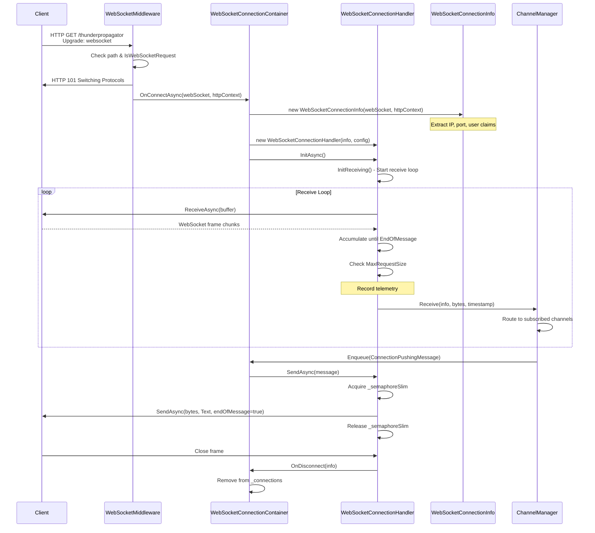
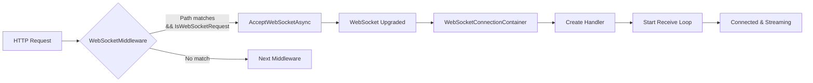
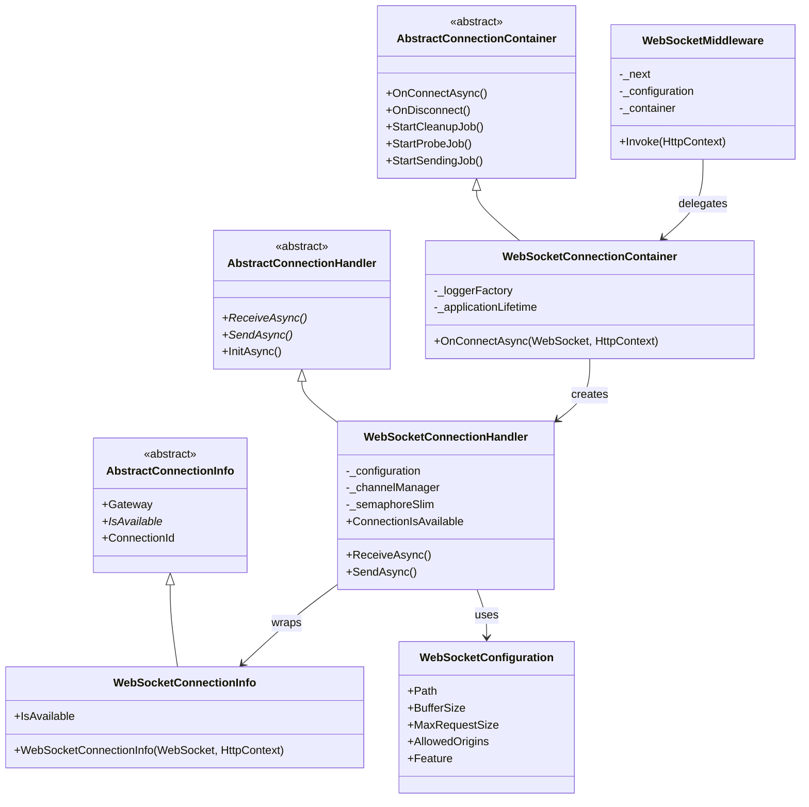

# WebSockets Protocol

## Contents
- [Overview](#overview)
- [Files](#files)
- [Types](#types)
- [Type Details](#type-details)
  - [WebSocketConnectionContainer](#websocketconnectioncontainer)
  - [WebSocketConnectionHandler](#websocketconnectionhandler)
  - [WebSocketConnectionInfo](#websocketconnectioninfo)
  - [WebSocketConfiguration](#websocketconfiguration)
  - [WebSocketConnectionReceivedMessage](#websocketconnectionreceivedmessage)
  - [WebSocketMiddleware](#websocketmiddleware)
- [Architecture Diagrams](#architecture-diagrams)
- [Performance Notes](#performance-notes)
- [Examples](#examples)
- [See Also](#see-also)

## Overview

The WebSockets protocol implementation provides real-time bidirectional communication over persistent TCP connections. It implements the standard container/handler pattern with ASP.NET Core middleware integration for automatic connection upgrades. The implementation supports configurable buffer sizes, compression (with CRIME/BREACH attack warnings), origin validation, and subprotocol negotiation.

## Files

| File | Primary Type(s) | LOC | Responsibility |
|------|----------------|-----|----------------|
| [WebSocketConnectionContainer.cs](../../../../src/ThunderPropagator.Infrastructure/Protocols/WebSockets/WebSocketConnectionContainer.cs) | `WebSocketConnectionContainer` | 31 | Manages WebSocket connection pool, creates handlers, integrates with health checks |
| [WebSocketConnectionHandler.cs](../../../../src/ThunderPropagator.Infrastructure/Protocols/WebSockets/WebSocketConnectionHandler.cs) | `WebSocketConnectionHandler` | 96 | Handles individual WebSocket connections, implements send/receive logic |
| [WebSocketConnectionInfo.cs](../../../../src/ThunderPropagator.Infrastructure/Protocols/WebSockets/WebSocketConnectionInfo.cs) | `WebSocketConnectionInfo` | 25 | Stores WebSocket connection metadata (state, client IP, user claims) |
| [WebSocketConfiguration.cs](../../../../src/ThunderPropagator.Infrastructure/Protocols/WebSockets/WebSocketConfiguration.cs) | `WebSocketConfiguration` | 77 | Configuration for WebSocket endpoints (path, origins, buffer sizes, compression) |
| [WebSocketConnectionReceivedMessage.cs](../../../../src/ThunderPropagator.Infrastructure/Protocols/WebSockets/WebSocketConnectionReceivedMessage.cs) | `WebSocketConnectionReceivedMessage` | 10 | Wraps received WebSocket message with `WebSocketReceiveResult` |
| [WebSocketMiddleware.cs](../../../../src/ThunderPropagator.Infrastructure/Protocols/WebSockets/WebSocketMiddleware.cs) | `WebSocketMiddleware` | 38 | ASP.NET Core middleware for WebSocket connection upgrade handling |

**Total LOC**: 277

## Types

| Type | Kind | Summary | Inherits/Implements | Key Members |
|------|------|---------|-------------------|-------------|
| `WebSocketConnectionContainer` | Class | Singleton container managing WebSocket connection pool | `AbstractConnectionContainer<WebSocket, WebSocketConnectionInfo, WebSocketConnectionHandler, WebSocketConnectionReceivedMessage, WebSocketConfiguration>` | `OnConnectAsync(WebSocket, HttpContext)` |
| `WebSocketConnectionHandler` | Class | Individual WebSocket connection handler | `AbstractConnectionHandler<WebSocket, WebSocketConnectionInfo, WebSocketConfiguration>` | `ReceiveAsync()`, `SendAsync()`, `ConnectionIsAvailable` |
| `WebSocketConnectionInfo` | Class | WebSocket connection metadata | `AbstractConnectionInfo<WebSocket>` | `IsAvailable`, `Gateway` |
| `WebSocketConfiguration` | Class | Configuration settings | `ServiceConfiguration`, `IPushMessageConfiguration` | `Path`, `BufferSize`, `AllowedOrigins`, `MaxRequestSize`, `MaxPushSize` |
| `WebSocketConnectionReceivedMessage` | Record | Received message wrapper | — | `Result`, `Message` |
| `WebSocketMiddleware` | Class | ASP.NET middleware | — | `Invoke(HttpContext)` |

## Type Details

### WebSocketConnectionContainer

**Location**: [WebSocketConnectionContainer.cs](../../../../src/ThunderPropagator.Infrastructure/Protocols/WebSockets/WebSocketConnectionContainer.cs)

**Purpose**: Factory and manager for WebSocket connections. Registered as singleton in DI, receives upgraded WebSocket connections from middleware, creates handlers, and manages connection lifecycle.

**Key Members**:
```csharp
public WebSocketConnectionContainer(IServiceProvider serviceProvider) : base(serviceProvider)
{
    HealthName = nameof(WebSocketConnectionContainer);
    HealthTags = [.. HealthTags, nameof(WebSocket)];
}

internal Task OnConnectAsync(WebSocket webSocket, HttpContext httpContext)
{
    WebSocketConnectionInfo connectionInfo = new(webSocket, httpContext);
    WebSocketConnectionHandler handler = new(
        connectionInfo, 
        PushMessageConnectionConfiguration, 
        ChannelManager, 
        _loggerFactory, 
        _applicationLifetime
    );
    
    return base.OnConnectAsync(connectionInfo, handler);
}
```

**Usage Recipe**:
```csharp
// Registered in DI
services.TryAddSingleton<WebSocketConnectionContainer>();
services.AddHealthCheckSupport<WebSocketConnectionContainer>();

// Called by middleware
var container = serviceProvider.GetRequiredService<WebSocketConnectionContainer>();
await container.OnConnectAsync(webSocket, httpContext);
```

---

### WebSocketConnectionHandler

**Location**: [WebSocketConnectionHandler.cs](../../../../src/ThunderPropagator.Infrastructure/Protocols/WebSockets/WebSocketConnectionHandler.cs)

**Purpose**: Wraps individual WebSocket connections, implements message receive loop with chunked reading, forwards messages to `ChannelManager`, and handles close frames.

**Key Members**:
```csharp
protected override KeyValuePair<string, object?> HistogramTag => 
    new(nameof(Protocols), nameof(WebSockets));

protected internal override bool ConnectionIsAvailable => 
    Gateway.State == WebSocketState.Open;

protected override async Task ReceiveAsync(CancellationToken cancellationToken)
{
    DateTime? startTime = null;
    List<byte> message = [];
    var buffer = new ArraySegment<byte>(new byte[_configuration.BufferSize]);
    WebSocketReceiveResult result;

    // Read chunks until EndOfMessage
    do
    {
        result = await Gateway.ReceiveAsync(buffer, cancellationToken);
        if (startTime == null) startTime = DateTime.UtcNow;
        message.AddRange(buffer.ToArray());
        
        if (message.Count > _configuration.MaxRequestSize)
            throw new InvalidOperationException("Message exceeds maximum size");
    } while (!result.EndOfMessage);

    // Record telemetry
    ReceivedMessageTelemetry.ReceivedMessageCounter?.Add(1, HistogramTag);
    ReceivedMessageTelemetry.ReceivedMessageSizeHistogram?.Record(message.Count, HistogramTag);

    var receivedMessage = new ConnectionReceivedMessage<WebSocketConnectionReceivedMessage>(
        new WebSocketConnectionReceivedMessage(result, message.ToArray()), 
        startTime.Value
    );

    // Handle message types
    switch (receivedMessage.Message.Result.MessageType)
    {
        case WebSocketMessageType.Text:
            _channelManager.Receive(ConnectionInfo, receivedMessage.Message.Message, 
                receivedMessage.DateTime, cancellationToken);
            break;
        case WebSocketMessageType.Close:
            OnDisconnect(ConnectionInfo);
            break;
    }
}

protected override async Task SendAsync(ReadOnlyMemory<byte> message, CancellationToken cancellationToken)
{
    await _semaphoreSlim.WaitAsync(cancellationToken);
    try
    {
        await Gateway.SendAsync(message, WebSocketMessageType.Text, true, cancellationToken);
    }
    finally
    {
        _semaphoreSlim.Release();
    }
}
```

**Usage Recipe**:
```csharp
// Created by container
var handler = new WebSocketConnectionHandler(
    connectionInfo,
    configuration,
    channelManager,
    loggerFactory,
    applicationLifetime
);

await handler.InitAsync(); // Starts receive loop
```

---

### WebSocketConnectionInfo

**Location**: [WebSocketConnectionInfo.cs](../../../../src/ThunderPropagator.Infrastructure/Protocols/WebSockets/WebSocketConnectionInfo.cs)

**Purpose**: Stores metadata for individual WebSocket connections including state checking via `WebSocketState`, client IP/port extraction from `HttpContext`, and user claims.

**Key Members**:
```csharp
public override bool IsAvailable => Gateway.State == WebSocketState.Open;

public WebSocketConnectionInfo(WebSocket gateway, HttpContext httpContext) : base(gateway)
{
    User = httpContext.User;
    
    if (httpContext.Connection.RemoteIpAddress is not null)
        SetClientIPAddress(httpContext.Connection.RemoteIpAddress);
    
    if (httpContext.Connection.RemotePort > 0)
        SetClientPort(httpContext.Connection.RemotePort);
}
```

**Usage Recipe**:
```csharp
var connectionInfo = new WebSocketConnectionInfo(webSocket, httpContext);
Logger.LogInformation(
    "WebSocket connected: {ConnectionId} from {IP}:{Port}, State: {State}",
    connectionInfo.ConnectionId,
    connectionInfo.ClientIPAddress,
    connectionInfo.ClientPort,
    connectionInfo.IsAvailable
);
```

---

### WebSocketConfiguration

**Location**: [WebSocketConfiguration.cs](../../../../src/ThunderPropagator.Infrastructure/Protocols/WebSockets/WebSocketConfiguration.cs)

**Purpose**: Configuration class for WebSocket endpoints including path routing, origin validation (CORS), buffer sizing, compression settings, and message size limits.

**Key Members**:
```csharp
public string Path { get; set; } = "/thunderpropagator";
public IList<string> AllowedOrigins { get; }
public int BufferSize { get; set; } = 4096;          // 4 KB default
public long MaxRequestSize { get; set; } = 524288;   // 512 KB default
public long MaxPushSize { get; set; } = 131072;      // 128 KB default
public TimeSpan KeepAliveInterval { get; set; }
public string? SubProtocol { get; set; }
public bool DangerousEnableCompression { get; set; } = false;
public bool DisableServerContextTakeover { get; set; } = false;
public int ServerMaxWindowBits { get; set; } = 15;
public IFeature? Feature { get; set; }

// Implicit conversion to WebSocketOptions
public static implicit operator WebSocketOptions(WebSocketConfiguration config)
```

**Usage Recipe**:
```csharp
services.Configure<WebSocketConfiguration>(config =>
{
    config.Path = "/ws";
    config.AllowedOrigins.Add("https://example.com");
    config.BufferSize = 8192;
    config.MaxRequestSize = 1048576; // 1 MB
    config.KeepAliveInterval = TimeSpan.FromSeconds(30);
    config.Feature = new FiftyMessagesPerSecondFeature();
});
```

---

### WebSocketConnectionReceivedMessage

**Location**: [WebSocketConnectionReceivedMessage.cs](../../../../src/ThunderPropagator.Infrastructure/Protocols/WebSockets/WebSocketConnectionReceivedMessage.cs)

**Purpose**: Simple record wrapping received WebSocket messages with `WebSocketReceiveResult` metadata (message type, end of message flag, close status).

**Key Members**:
```csharp
public record WebSocketConnectionReceivedMessage(
    WebSocketReceiveResult Result, 
    byte[] Message
);
```

**Usage Recipe**:
```csharp
var receivedMessage = new WebSocketConnectionReceivedMessage(result, messageBytes);

switch (receivedMessage.Result.MessageType)
{
    case WebSocketMessageType.Text:
        ProcessTextMessage(receivedMessage.Message);
        break;
    case WebSocketMessageType.Binary:
        ProcessBinaryMessage(receivedMessage.Message);
        break;
    case WebSocketMessageType.Close:
        HandleClose(receivedMessage.Result.CloseStatus);
        break;
}
```

---

### WebSocketMiddleware

**Location**: [WebSocketMiddleware.cs](../../../../src/ThunderPropagator.Infrastructure/Protocols/WebSockets/WebSocketMiddleware.cs)

**Purpose**: ASP.NET Core middleware for WebSocket connection upgrade. Intercepts requests to configured path, performs WebSocket handshake, and delegates connection to container.

**Key Members**:
```csharp
public async Task Invoke(HttpContext context)
{
    if (context.Request.Path.Equals(_webSocketConfiguration.Path, StringComparison.OrdinalIgnoreCase) 
        && context.WebSockets.IsWebSocketRequest)
    {
        using var webSocket = await context.WebSockets.AcceptWebSocketAsync();
        await _webSocketConnectionContainer.OnConnectAsync(webSocket, context);
        return;
    }

    await _next(context);
}
```

**Usage Recipe**:
```csharp
// In Startup.cs or Program.cs
app.UseWebSockets(serviceProvider.GetRequiredService<WebSocketConfiguration>());
app.UseMiddleware<WebSocketMiddleware>();
```

## Architecture Diagrams

### WebSocket Connection Flow



### WebSocket Middleware Integration



### Container/Handler Class Diagram



## Performance Notes

- **Chunked Reading**: Handles large messages by reading in chunks (`BufferSize` default 4KB) until `EndOfMessage` flag
- **Send Locking**: Uses `SemaphoreSlim` to ensure thread-safe sending (WebSocket requires sequential frame sending)
- **Buffer Reuse**: Reuses `ArraySegment<byte>` buffer across receive operations
- **Size Limits**: 
  - `MaxRequestSize` (512KB default) prevents memory exhaustion from large incoming messages
  - `MaxPushSize` (128KB default) splits outgoing subscription messages into chunks
- **State Checking**: `ConnectionIsAvailable` checks `WebSocketState.Open` before operations
- **Telemetry**: Records message count and size histograms with `HistogramTag` for monitoring
- **Compression Warning**: `DangerousEnableCompression` warns about CRIME/BREACH attack vectors on HTTPS

## Examples

### Basic WebSocket Server Configuration

```csharp
// In Program.cs or Startup.cs
var builder = WebApplication.CreateBuilder(args);

// Configure WebSocket settings
builder.Services.Configure<WebSocketConfiguration>(config =>
{
    config.Path = "/stream";
    config.AllowedOrigins.Add("https://app.example.com");
    config.AllowedOrigins.Add("https://admin.example.com");
    config.BufferSize = 8192;
    config.MaxRequestSize = 1048576; // 1 MB
    config.KeepAliveInterval = TimeSpan.FromSeconds(30);
    config.Feature = new FiftyMessagesPerSecondFeature();
});

// Register WebSocket container
builder.Services.TryAddSingleton<WebSocketConnectionContainer>();
builder.Services.AddHealthCheckSupport<WebSocketConnectionContainer>();

var app = builder.Build();

// Add middleware
app.UseWebSockets(app.Services.GetRequiredService<WebSocketConfiguration>());
app.UseMiddleware<WebSocketMiddleware>();

app.Run();
```

### Client Connection (JavaScript)

```javascript
// Connect to WebSocket endpoint
const ws = new WebSocket('wss://example.com/thunderpropagator');

ws.onopen = () => {
    console.log('Connected');
    
    // Subscribe to channel
    ws.send(JSON.stringify({
        action: 'subscribe',
        channel: 'stock-prices',
        subscribingKeys: {
            'sub1': { symbol: 'AAPL' }
        },
        subscribingFields: ['price', 'volume'],
        subscriptionMode: 'incremental'
    }));
};

ws.onmessage = (event) => {
    const data = JSON.parse(event.data);
    console.log('Received:', data);
};

ws.onerror = (error) => {
    console.error('WebSocket error:', error);
};

ws.onclose = () => {
    console.log('Disconnected');
};
```

### Custom Channel with WebSocket-Specific Logic

```csharp
internal sealed class StockPriceChannel 
    : AbstractChannel<StockPriceMetadata, StockPriceConfiguration>
{
    protected override async Task HandleMessageAsync(
        Subscription subscription,
        FeederMessage message,
        CancellationToken cancellationToken)
    {
        // Access WebSocket-specific connection info
        if (subscription.ConnectionInfo is WebSocketConnectionInfo wsInfo)
        {
            Logger.LogDebug(
                "Pushing stock update to WebSocket {ConnectionId} ({ClientIP})",
                wsInfo.ConnectionId,
                wsInfo.ClientIPAddress
            );
            
            // Check if connection is still open
            if (!wsInfo.IsAvailable)
            {
                Logger.LogWarning("WebSocket connection {ConnectionId} is closed", wsInfo.ConnectionId);
                await RemoveSubscriptionAsync(subscription, cancellationToken);
                return;
            }
        }
        
        await EmitMessageAsync(subscription.ConnectionInfo, message, cancellationToken);
    }
}
```

### Health Check Monitoring

```csharp
// In Program.cs
builder.Services
    .AddHealthChecks()
    .AddCheck<WebSocketConnectionContainer>("websocket");

app.MapHealthChecks("/health", new HealthCheckOptions
{
    ResponseWriter = async (context, report) =>
    {
        context.Response.ContentType = "application/json";
        var json = JsonSerializer.Serialize(new
        {
            status = report.Status.ToString(),
            checks = report.Entries.Select(e => new
            {
                name = e.Key,
                status = e.Value.Status.ToString(),
                data = e.Value.Data
            })
        });
        await context.Response.WriteAsync(json);
    }
});

// Sample response:
// {
//   "status": "Healthy",
//   "checks": [{
//     "name": "websocket",
//     "status": "Healthy",
//     "data": {
//       "ConnectionCount": 42,
//       "PeakConnectionCount": 87
//     }
//   }]
// }
```

### Compression Configuration (Use with Caution)

```csharp
services.Configure<WebSocketConfiguration>(config =>
{
    // WARNING: Compression on HTTPS can expose data to CRIME/BREACH attacks
    config.DangerousEnableCompression = true;
    config.DisableServerContextTakeover = true; // Reduces attack surface
    config.ServerMaxWindowBits = 12; // Smaller window = less memory
});
```

## See Also

- **Parent**: [Protocols Layer](../README.md)
- **Siblings**:
  - [InfiniteDataStream Protocol](../InfiniteDataStream/README.md)
  - [MQTT Protocol](../Mqtt/README.md)
  - [QUIC Protocol](../Quic/README.md)
  - [WebTransport Protocol](../WebTransport/README.md)
- **Related**:
  - [ASP.NET Core WebSockets Documentation](https://docs.microsoft.com/en-us/aspnet/core/fundamentals/websockets)
  - [RFC 6455 - WebSocket Protocol](https://datatracker.ietf.org/doc/html/rfc6455)
  - [Channels](../../../Application/Channels/README.md)
  - [ChannelManager](../../Channels/README.md)
