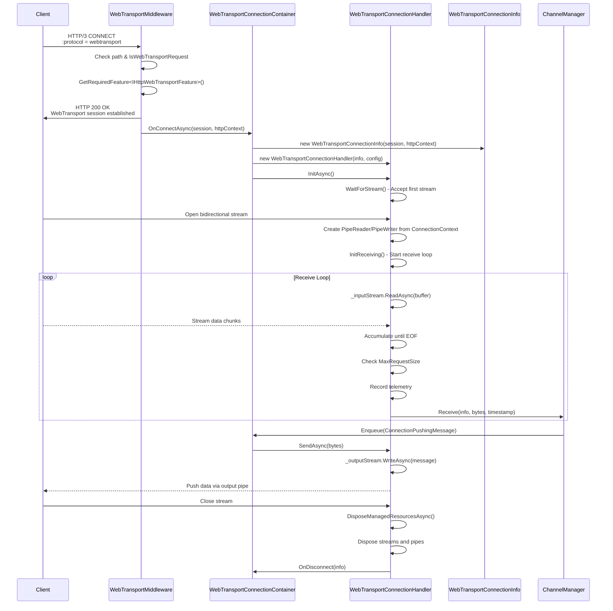
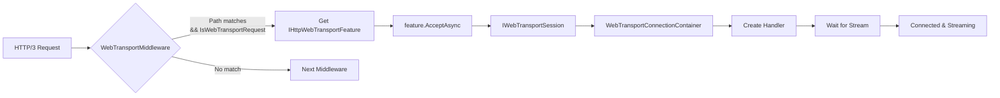
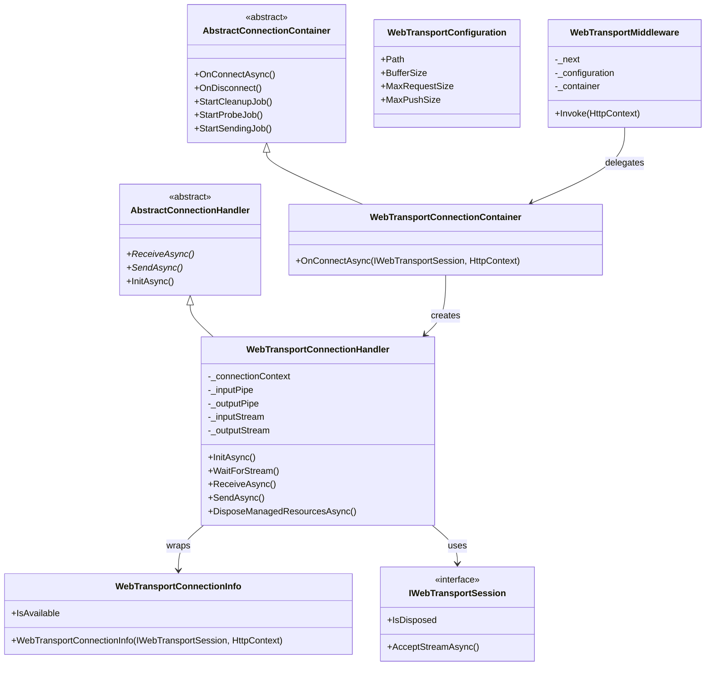

# WebTransport Protocol

## Contents
- [Overview](#overview)
- [Files](#files)
- [Types](#types)
- [Type Details](#type-details)
  - [WebTransportConnectionContainer](#webtransportconnectioncontainer)
  - [WebTransportConnectionHandler](#webtransportconnectionhandler)
  - [WebTransportConnectionInfo](#webtransportconnectioninfo)
  - [WebTransportConfiguration](#webtransportconfiguration)
  - [WebTransportFeature](#webtransportfeature)
  - [WebTransportMiddleware](#webtransportmiddleware)
- [Architecture Diagrams](#architecture-diagrams)
- [Performance Notes](#performance-notes)
- [Examples](#examples)
- [See Also](#see-also)

## Overview

The WebTransport protocol implementation provides low-latency, bidirectional communication over HTTP/3 with stream multiplexing and built-in security. WebTransport combines the reliability of HTTP with the performance benefits of QUIC (UDP-based transport) and offers a modern alternative to WebSockets. This implementation uses ASP.NET Core's `IWebTransportSession` feature for session management and `PipeReader`/`PipeWriter` for efficient stream I/O.

## Files

| File | Primary Type(s) | LOC | Responsibility |
|------|----------------|-----|----------------|
| [WebTransportConnectionContainer.cs](../../../../src/ThunderPropagator.Infrastructure/Protocols/WebTransport/WebTransportConnectionContainer.cs) | `WebTransportConnectionContainer` | 31 | Manages WebTransport session pool, creates handlers |
| [WebTransportConnectionHandler.cs](../../../../src/ThunderPropagator.Infrastructure/Protocols/WebTransport/WebTransportConnectionHandler.cs) | `WebTransportConnectionHandler` | 139 | Handles individual sessions, manages stream lifecycle via `PipeReader`/`PipeWriter` |
| [WebTransportConnectionInfo.cs](../../../../src/ThunderPropagator.Infrastructure/Protocols/WebTransport/WebTransportConnectionInfo.cs) | `WebTransportConnectionInfo` | 25 | Stores WebTransport session metadata (client IP, user claims, disposal state) |
| [WebTransportConfiguration.cs](../../../../src/ThunderPropagator.Infrastructure/Protocols/WebTransport/WebTransportConfiguration.cs) | `WebTransportConfiguration` | 41 | Configuration for WebTransport endpoint (path, buffer sizes, message limits) |
| [WebTransportFeature.cs](../../../../src/ThunderPropagator.Infrastructure/Protocols/WebTransport/WebTransportFeature.cs) | `WebTransportFeature` | 14 | Feature marker for WebTransport over HTTP/3 |
| [WebTransportMiddleware.cs](../../../../src/ThunderPropagator.Infrastructure/Protocols/WebTransport/WebTransportMiddleware.cs) | `WebTransportMiddleware` | 40 | ASP.NET Core middleware for WebTransport session negotiation |

**Total LOC**: 290

## Types

| Type | Kind | Summary | Inherits/Implements | Key Members |
|------|------|---------|-------------------|-------------|
| `WebTransportConnectionContainer` | Class | Singleton container managing WebTransport session pool | `AbstractConnectionContainer<IWebTransportSession, WebTransportConnectionInfo, WebTransportConnectionHandler, byte[], WebTransportConfiguration>` | `OnConnectAsync(IWebTransportSession, HttpContext)` |
| `WebTransportConnectionHandler` | Class | Individual WebTransport session handler | `AbstractConnectionHandler<IWebTransportSession, WebTransportConnectionInfo, WebTransportConfiguration>` | `InitAsync()`, `ReceiveAsync()`, `SendAsync()`, `WaitForStream()` |
| `WebTransportConnectionInfo` | Class | WebTransport session metadata | `AbstractConnectionInfo<IWebTransportSession>` | `IsAvailable` |
| `WebTransportConfiguration` | Class | Configuration settings | `ServiceConfiguration`, `IPushMessageConfiguration` | `Path`, `BufferSize`, `MaxRequestSize`, `MaxPushSize` |
| `WebTransportFeature` | Class | Feature marker | `IFeature` | — |
| `WebTransportMiddleware` | Class | ASP.NET middleware | — | `Invoke(HttpContext)` |

## Type Details

### WebTransportConnectionContainer

**Location**: [WebTransportConnectionContainer.cs](../../../../src/ThunderPropagator.Infrastructure/Protocols/WebTransport/WebTransportConnectionContainer.cs)

**Purpose**: Factory and manager for WebTransport sessions. Receives accepted `IWebTransportSession` instances from middleware, creates handlers, and manages lifecycle.

**Key Members**:
```csharp
public WebTransportConnectionContainer(IServiceProvider serviceProvider) : base(serviceProvider)
{
    HealthName = nameof(WebTransportConnectionContainer);
    HealthTags = [.. HealthTags, nameof(WebTransport)];
}

internal Task OnConnectAsync(IWebTransportSession webTransportSession, HttpContext httpContext)
{
    WebTransportConnectionInfo connectionInfo = new(webTransportSession, httpContext);
    WebTransportConnectionHandler handler = new(
        connectionInfo, 
        PushMessageConnectionConfiguration, 
        ChannelManager, 
        _loggerFactory, 
        _applicationLifetime
    );
    
    return base.OnConnectAsync(connectionInfo, handler);
}
```

**Usage Recipe**:
```csharp
// Registered in DI
services.TryAddSingleton<WebTransportConnectionContainer>();
services.AddHealthCheckSupport<WebTransportConnectionContainer>();

// Called by middleware
var container = serviceProvider.GetRequiredService<WebTransportConnectionContainer>();
await container.OnConnectAsync(webTransportSession, httpContext);
```

---

### WebTransportConnectionHandler

**Location**: [WebTransportConnectionHandler.cs](../../../../src/ThunderPropagator.Infrastructure/Protocols/WebTransport/WebTransportConnectionHandler.cs)

**Purpose**: Wraps individual WebTransport sessions, manages stream acceptance via `AcceptStreamAsync()`, uses `PipeReader`/`PipeWriter` for efficient I/O, and handles `ConnectionContext` lifecycle.

**Key Members**:
```csharp
protected override KeyValuePair<string, object?> HistogramTag => 
    new(nameof(Protocols), nameof(WebTransport));

protected internal override bool ConnectionIsAvailable => 
    _connectionContext is not null && !_connectionContext.ConnectionClosed.IsCancellationRequested;

internal override async Task InitAsync()
{
    await base.InitAsync();
    
    // Wait for first stream from client
    _connectionContext = await WaitForStream(Gateway);
    
    _inputPipe = _connectionContext?.Transport.Input;
    _outputPipe = _connectionContext?.Transport.Output;
    
    _inputStream = _inputPipe?.AsStream();
    _outputStream = _outputPipe?.AsStream();
}

private async Task<ConnectionContext> WaitForStream(IWebTransportSession session)
{
    while (true)
    {
        var stream = await session.AcceptStreamAsync(cancellationToken);
        if (stream is not null)
            return stream;
    }
}

protected override async Task ReceiveAsync(CancellationToken cancellationToken)
{
    if (_connectionContext is null || _inputStream?.CanRead != true)
    {
        await Task.Delay(TimeSpan.FromSeconds(1), cancellationToken);
        return;
    }

    DateTime? startTime = null;
    var message = new List<byte>();
    var buffer = new byte[_configuration.BufferSize];
    int bytesRead;

    // Read stream until EOF
    while ((bytesRead = await _inputStream.ReadAsync(buffer, cancellationToken)) > 0)
    {
        if (startTime == null) startTime = DateTime.UtcNow;
        
        message.AddRange(buffer.AsSpan(0, bytesRead).ToArray());
        
        if (message.Count > _configuration.MaxRequestSize)
            throw new InvalidOperationException("Message exceeds maximum size");
    }

    // Record telemetry
    ReceivedMessageTelemetry.ReceivedMessageCounter?.Add(1, HistogramTag);
    ReceivedMessageTelemetry.ReceivedMessageSizeHistogram?.Record(message.Count, HistogramTag);

    var receivedMessage = new ConnectionReceivedMessage<byte[]>(
        message.ToArray(), 
        startTime ?? DateTime.UtcNow
    );

    // Forward to ChannelManager
    using var cts = CancellationTokenSource.CreateLinkedTokenSource(cancellationToken);
    _channelManager.Receive(ConnectionInfo, receivedMessage.Message, receivedMessage.DateTime, cts.Token);
}

protected override async Task SendAsync(ReadOnlyMemory<byte> message, CancellationToken cancellationToken)
{
    if (_outputStream is not null)
        await _outputStream.WriteAsync(message, cancellationToken);
}

protected override async ValueTask DisposeManagedResourcesAsync()
{
    if (_inputStream is not null)
        await _inputStream.DisposeAsync();

    if (_outputStream is not null)
    {
        await _outputStream.FlushAsync();
        await _outputStream.DisposeAsync();
    }

    _inputPipe?.CancelPendingRead();
    _outputPipe?.CancelPendingFlush();

    if (_connectionContext is not null)
        await _connectionContext.DisposeAsync();
}
```

**Usage Recipe**:
```csharp
// Created by container
var handler = new WebTransportConnectionHandler(
    connectionInfo,
    configuration,
    channelManager,
    loggerFactory,
    applicationLifetime
);

await handler.InitAsync(); // Waits for first stream, starts receive loop
```

---

### WebTransportConnectionInfo

**Location**: [WebTransportConnectionInfo.cs](../../../../src/ThunderPropagator.Infrastructure/Protocols/WebTransport/WebTransportConnectionInfo.cs)

**Purpose**: Stores metadata for WebTransport sessions including client IP/port from `HttpContext`, user claims, and disposal checking.

**Key Members**:
```csharp
public override bool IsAvailable => !Gateway.IsDisposed();

public WebTransportConnectionInfo(IWebTransportSession webTransportSession, HttpContext httpContext) 
    : base(webTransportSession)
{
    User = httpContext.User;
    
    if (httpContext.Connection.RemoteIpAddress is not null)
        SetClientIPAddress(httpContext.Connection.RemoteIpAddress);
    
    if (httpContext.Connection.RemotePort > 0)
        SetClientPort(httpContext.Connection.RemotePort);
}
```

**Usage Recipe**:
```csharp
var connectionInfo = new WebTransportConnectionInfo(session, httpContext);

Logger.LogInformation(
    "WebTransport session from {IP}:{Port}, User: {User}",
    connectionInfo.ClientIPAddress,
    connectionInfo.ClientPort,
    connectionInfo.User.Identity?.Name ?? "Anonymous"
);
```

---

### WebTransportConfiguration

**Location**: [WebTransportConfiguration.cs](../../../../src/ThunderPropagator.Infrastructure/Protocols/WebTransport/WebTransportConfiguration.cs)

**Purpose**: Configuration class for WebTransport endpoints including path routing, buffer sizing, and message limits.

**Key Members**:
```csharp
public string Path { get; set; } = "/thunderPropagator";
public int BufferSize { get; set; } = 4096;          // 4 KB default
public long MaxRequestSize { get; set; } = 524288;   // 512 KB default
public long MaxPushSize { get; set; } = 131072;      // 128 KB default
public IFeature? Feature { get; set; }
```

**Usage Recipe**:
```csharp
services.Configure<WebTransportConfiguration>(config =>
{
    config.Path = "/wt";
    config.BufferSize = 8192;
    config.MaxRequestSize = 1048576;  // 1 MB
    config.MaxPushSize = 131072;      // 128 KB
    config.Feature = new FiftyMessagesPerSecondFeature();
});
```

---

### WebTransportFeature

**Location**: [WebTransportFeature.cs](../../../../src/ThunderPropagator.Infrastructure/Protocols/WebTransport/WebTransportFeature.cs)

**Purpose**: Marker class implementing `IFeature` for WebTransport protocol identification. Indicates "low-latency, bidirectional communication over HTTP/3."

**Usage Recipe**:
```csharp
services.Configure<WebTransportConfiguration>(config =>
{
    config.Feature = new WebTransportFeature();
});
```

---

### WebTransportMiddleware

**Location**: [WebTransportMiddleware.cs](../../../../src/ThunderPropagator.Infrastructure/Protocols/WebTransport/WebTransportMiddleware.cs)

**Purpose**: ASP.NET Core middleware for WebTransport session negotiation. Intercepts requests to configured path, checks `IHttpWebTransportFeature.IsWebTransportRequest`, and accepts sessions.

**Key Members**:
```csharp
public async Task Invoke(HttpContext context)
{
    if (context.Request.Path.Equals(_webTransportConfiguration.Path, StringComparison.OrdinalIgnoreCase))
    {
        var feature = context.Features.GetRequiredFeature<IHttpWebTransportFeature>();
        if (feature.IsWebTransportRequest)
        {
            var webTransportSession = await feature.AcceptAsync(context.RequestAborted);
            await _webTransportConnectionContainer.OnConnectAsync(webTransportSession, context);
            return;
        }
    }

    await _next(context);
}
```

**Usage Recipe**:
```csharp
// In Startup.cs or Program.cs
app.UseMiddleware<WebTransportMiddleware>();
```

## Architecture Diagrams

### WebTransport Session Flow



### WebTransport Middleware Integration



### Container/Handler Class Diagram



## Performance Notes

- **HTTP/3 Foundation**: Built on HTTP/3 (QUIC), inherits UDP-based low-latency benefits
- **Stream Multiplexing**: Multiple streams share single session without head-of-line blocking
- **PipeReader/PipeWriter**: Uses high-performance `System.IO.Pipelines` for zero-copy I/O
- **Stream Acceptance**: `WaitForStream()` blocks until client opens first stream
- **Efficient Buffer Management**: Reuses buffers across read operations
- **Async Disposal**: Properly disposes pipes, streams, and connection context
- **Connection Context**: Wraps stream as `ConnectionContext` for transport abstraction
- **Size Limits**: `MaxRequestSize` prevents memory exhaustion, `MaxPushSize` chunks large messages
- **TLS 1.3 Required**: WebTransport mandates TLS 1.3 (inherited from QUIC/HTTP/3)

## Examples

### Basic WebTransport Server Configuration

```csharp
// In Program.cs
var builder = WebApplication.CreateBuilder(args);

// Configure WebTransport
builder.Services.Configure<WebTransportConfiguration>(config =>
{
    config.Path = "/wt";
    config.BufferSize = 8192;
    config.MaxRequestSize = 1048576;  // 1 MB
    config.MaxPushSize = 131072;      // 128 KB
    config.Feature = new FiftyMessagesPerSecondFeature();
});

// Register WebTransport container
builder.Services.TryAddSingleton<WebTransportConnectionContainer>();
builder.Services.AddHealthCheckSupport<WebTransportConnectionContainer>();

var app = builder.Build();

// Enable WebTransport middleware
app.UseMiddleware<WebTransportMiddleware>();

app.Run();
```

### Client Connection (JavaScript)

```javascript
// WebTransport is available in modern browsers (Chrome 97+, Edge 97+)
if ('WebTransport' in window) {
    const url = 'https://example.com/wt';
    const transport = new WebTransport(url);
    
    await transport.ready;
    console.log('WebTransport session established');
    
    // Create bidirectional stream for subscribe request
    const stream = await transport.createBidirectionalStream();
    const writer = stream.writable.getWriter();
    const reader = stream.readable.getReader();
    
    // Send subscribe request
    const subscribeMessage = JSON.stringify({
        action: 'subscribe',
        channel: 'stock-prices',
        subscribingKeys: { sub1: { symbol: 'AAPL' } },
        subscribingFields: ['price', 'volume']
    });
    await writer.write(new TextEncoder().encode(subscribeMessage));
    await writer.close();
    
    // Receive push messages
    const { value, done } = await reader.read();
    if (!done) {
        const message = new TextDecoder().decode(value);
        console.log('Received:', message);
    }
    
    // Handle incoming streams from server
    const streamReader = transport.incomingBidirectionalStreams.getReader();
    while (true) {
        const { value: newStream, done } = await streamReader.read();
        if (done) break;
        
        const reader = newStream.readable.getReader();
        const { value: data } = await reader.read();
        const message = new TextDecoder().decode(data);
        console.log('Server push:', message);
    }
} else {
    console.error('WebTransport is not supported');
}
```

### Custom Channel with WebTransport-Specific Logic

```csharp
internal sealed class RealtimeChannel 
    : AbstractChannel<RealtimeMetadata, RealtimeConfiguration>
{
    protected override async Task HandleMessageAsync(
        Subscription subscription,
        FeederMessage message,
        CancellationToken cancellationToken)
    {
        if (subscription.ConnectionInfo is WebTransportConnectionInfo wtInfo)
        {
            Logger.LogDebug(
                "Pushing via WebTransport to {ConnectionId} ({ClientIP})",
                wtInfo.ConnectionId,
                wtInfo.ClientIPAddress
            );
            
            // Check session availability
            if (!wtInfo.IsAvailable)
            {
                Logger.LogWarning("WebTransport session {ConnectionId} is disposed", wtInfo.ConnectionId);
                await RemoveSubscriptionAsync(subscription, cancellationToken);
                return;
            }
        }
        
        await EmitMessageAsync(subscription.ConnectionInfo, message, cancellationToken);
    }
}
```

### Health Check Monitoring

```csharp
app.MapGet("/health/webtransport", (WebTransportConnectionContainer container) =>
{
    return Results.Json(new
    {
        status = container.HealthStatus.ToString(),
        sessions = container.ConnectionCount,
        protocol = "WebTransport",
        transport = "HTTP/3 (QUIC)",
        features = new[]
        {
            "Stream multiplexing",
            "Low latency (UDP-based)",
            "Built-in TLS 1.3",
            "Bidirectional streams"
        }
    });
});
```

### Browser Compatibility Check (JavaScript)

```javascript
function checkWebTransportSupport() {
    if (!('WebTransport' in window)) {
        console.error('WebTransport is not supported in this browser');
        console.info('Requires Chrome 97+, Edge 97+, or similar');
        return false;
    }
    
    console.log('WebTransport is supported');
    return true;
}

// Fallback to WebSocket if WebTransport unavailable
async function connectWithFallback(url) {
    if (checkWebTransportSupport()) {
        try {
            const transport = new WebTransport(`https://${url}/wt`);
            await transport.ready;
            return { type: 'webtransport', connection: transport };
        } catch (error) {
            console.warn('WebTransport connection failed, falling back to WebSocket');
        }
    }
    
    const ws = new WebSocket(`wss://${url}/thunderpropagator`);
    await new Promise((resolve, reject) => {
        ws.onopen = resolve;
        ws.onerror = reject;
    });
    return { type: 'websocket', connection: ws };
}
```

## See Also

- **Parent**: [Protocols Layer](../README.md)
- **Siblings**:
  - [InfiniteDataStream Protocol](../InfiniteDataStream/README.md)
  - [MQTT Protocol](../Mqtt/README.md)
  - [QUIC Protocol](../Quic/README.md)
  - [WebSockets Protocol](../WebSockets/README.md)
- **Related**:
  - [WebTransport W3C Specification](https://w3c.github.io/webtransport/)
  - [HTTP/3 Documentation](https://datatracker.ietf.org/doc/html/rfc9114)
  - [ASP.NET Core WebTransport Support](https://learn.microsoft.com/en-us/aspnet/core/fundamentals/servers/kestrel/http3)
  - [Channels](../../../Application/Channels/README.md)
  - [ChannelManager](../../Channels/README.md)
