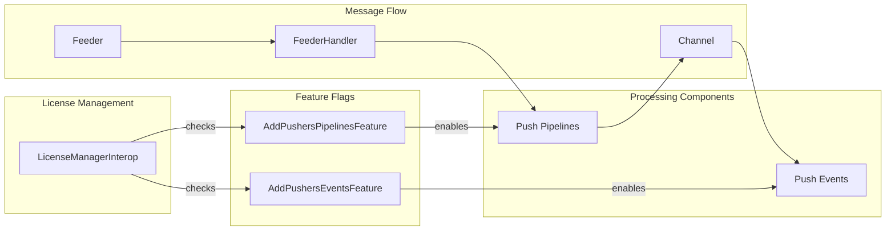
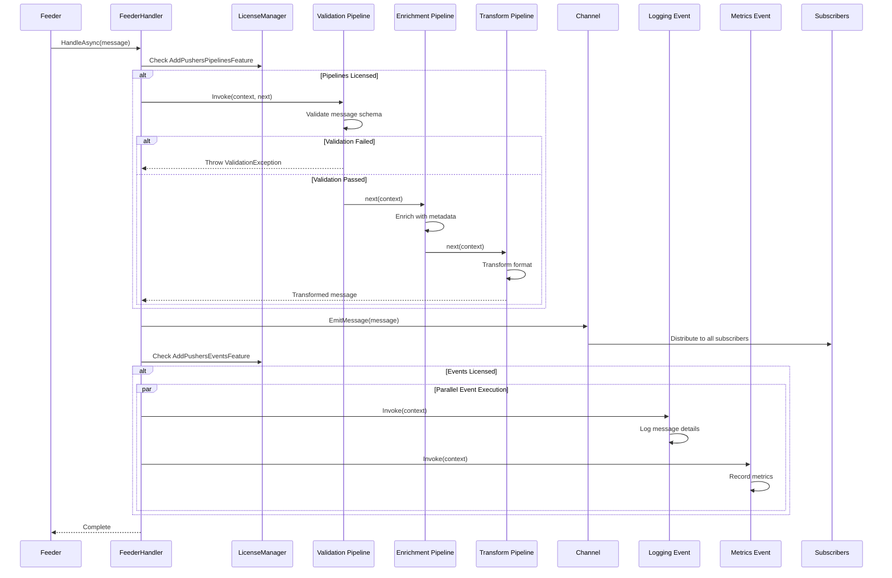

# Pushers - Infrastructure Layer

## Table of Contents
- [Overview](#overview)
- [Files](#files)
- [Types](#types)
- [Type Details](#type-details)
  - [AddPushersPipelinesFeature](#addpusherspipelinesfeature)
  - [AddPushersEventsFeature](#addpusherseventsfeature)
- [Architecture](#architecture)
- [Push Pipeline Execution Flow](#push-pipeline-execution-flow)
- [Examples](#examples)
- [See Also](#see-also)

## Overview

The Pushers module provides infrastructure-level feature flags for enabling push pipeline and event processing in the ThunderPropagator system. Push pipelines and events process outgoing messages from feeders before they are emitted to channel subscribers, enabling message transformation, enrichment, validation, and side-effect operations. This module acts as the licensing and feature enablement layer for the push processing infrastructure.

## Files

| File | LOC | Description |
|------|-----|-------------|
| [AddPushersPipelinesFeature.cs](../../src/ThunderPropagator.Infrastructure/Pushers/AddPushersPipelinesFeature.cs) | 14 | Feature flag enabling push pipeline infrastructure |
| [AddPushersEventsFeature.cs](../../src/ThunderPropagator.Infrastructure/Pushers/AddPushersEventsFeature.cs) | 14 | Feature flag enabling push event-driven processing |

**Total Files**: 2  
**Total LOC**: 28

## Types

| Type | Kind | Summary | Implements |
|------|------|---------|------------|
| `AddPushersPipelinesFeature` | Class | Enables push pipelines for real-time data processing and delivery through event-driven mechanisms | `IFeature` |
| `AddPushersEventsFeature` | Class | Enables event-driven pushers for real-time event handling and data pushing to subscribers | `IFeature` |

## Type Details

### AddPushersPipelinesFeature

**Purpose**: Feature flag that enables the push pipeline infrastructure when licensed.

**Characteristics**:
- Internal sealed class (non-sealed in DEBUG builds)
- Implements `IFeature` for license management integration
- Decorated with `Description` attribute for feature documentation
- Controls access to push pipeline processing

**License Check**:
```csharp
if (LicenseManagerInterop.IsAllowed(typeof(AddPushersPipelinesFeature)))
{
    // Push pipelines are enabled
    // FeederHandler will invoke push pipelines before emitting messages
}
```

**Usage Recipe**:
```csharp
// Automatically checked during DI registration
services.AddThunderPropagator(configuration.GetSection("ThunderPropagator"));

// When licensed, push pipelines are registered:
services.TryAddSingleton<ValidationPushPipeline<StockChannel>>();
services.TryAddSingleton<EnrichmentPushPipeline<StockChannel>>();
services.TryAddSingleton<TransformationPushPipeline<StockChannel>>();

// Pipeline execution in FeederHandler.HandleAsync:
if (channelInfo.PushPipelinesDefined)
{
    var invoker = _channelManager.BuildPushPipelinesHierarchyInvoker(channelInfo, serviceScope, pushContext);
    await invoker.Invoke(cancellationToken);
}
```

### AddPushersEventsFeature

**Purpose**: Feature flag enabling event-driven push processing for side-effects and notifications.

**Characteristics**:
- Internal sealed class (non-sealed in DEBUG builds)
- Implements `IFeature` for license management
- Enables push event handlers for logging, analytics, notifications
- Executes after pipeline processing and message emission

**License Check**:
```csharp
if (LicenseManagerInterop.IsAllowed(typeof(AddPushersEventsFeature)))
{
    // Push events are enabled
    // FeederHandler will invoke push events after message emission
}
```

**Usage Recipe**:
```csharp
// Event registration
services.AddSingleton<IClientPushEvent<StockChannel>, LoggingPushEvent<StockChannel>>();
services.AddSingleton<IClientPushEvent<StockChannel>, MetricsPushEvent<StockChannel>>();
services.AddSingleton<IClientPushEvent<StockChannel>, AuditPushEvent<StockChannel>>();

// Event execution in FeederHandler.HandleAsync:
var pushEventsInvoker = _channelManager.BuildPushEventsInvoker(channelInfo, serviceScope, pushContext);
foreach (var pushEventInvoker in pushEventsInvoker)
{
    await pushEventInvoker.Invoke(cancellationToken);
}
```

## Architecture



### Push Processing vs Receive Processing

| Aspect | Receive Processing | Push Processing |
|--------|-------------------|----------------|
| **Direction** | Client → Server | Server → Subscribers |
| **Trigger** | Client request | Feeder message |
| **Feature Flags** | `AddReceiversPipelinesFeature`, `AddReceiversEventsFeature` | `AddPushersPipelinesFeature`, `AddPushersEventsFeature` |
| **Pipeline Context** | `ReceiveContext` | `PushContext` |
| **Typical Operations** | Authentication, authorization, routing | Validation, enrichment, transformation |
| **Event Operations** | Request logging, audit | Message logging, analytics, notifications |

## Push Pipeline Execution Flow



## Examples

### Validation Push Pipeline

```csharp
public class ValidationPushPipeline<TChannel> : AbstractPushPipeline<TChannel>
    where TChannel : class, IChannel
{
    public async Task Invoke(ChannelInfo channelInfo,
        PushContext context,
        PushPipelineDelegate next,
        CancellationToken cancellationToken = default)
    {
        if (context.PushContentForm.TryGetValue(nameof(FeederMessage), out var obj) && 
            obj is StockTickerMessage message)
        {
            // Validate required fields
            if (string.IsNullOrWhiteSpace(message.Symbol))
                throw new ValidationException("Symbol is required");
            
            if (message.LastPrice <= 0)
                throw new ValidationException("LastPrice must be positive");
            
            if (message.Timestamp == default)
                message.Timestamp = DateTime.UtcNow;
        }
        
        await next(context, cancellationToken);
    }
}

// Register pipeline
services.TryAddSingleton<ValidationPushPipeline<StockChannel>>();
```

### Enrichment Push Pipeline

```csharp
public class EnrichmentPushPipeline<TChannel> : AbstractPushPipeline<TChannel>
    where TChannel : class, IChannel
{
    private readonly IMarketDataService _marketDataService;
    
    public async Task Invoke(ChannelInfo channelInfo,
        PushContext context,
        PushPipelineDelegate next,
        CancellationToken cancellationToken = default)
    {
        if (context.PushContentForm.TryGetValue(nameof(FeederMessage), out var obj) && 
            obj is StockTickerMessage message)
        {
            // Enrich with additional data
            var marketData = await _marketDataService.GetMarketDataAsync(message.Symbol, cancellationToken);
            
            message["MarketCap"] = marketData.MarketCap;
            message["Sector"] = marketData.Sector;
            message["PE_Ratio"] = marketData.PriceToEarnings;
            message["52WeekHigh"] = marketData.High52Week;
            message["52WeekLow"] = marketData.Low52Week;
            
            context.PushContentForm[nameof(FeederMessage)] = message;
        }
        
        await next(context, cancellationToken);
    }
}
```

### Transformation Push Pipeline

```csharp
public class CurrencyConversionPushPipeline<TChannel> : AbstractPushPipeline<TChannel>
    where TChannel : class, IChannel
{
    private readonly ICurrencyConverter _currencyConverter;
    
    public async Task Invoke(ChannelInfo channelInfo,
        PushContext context,
        PushPipelineDelegate next,
        CancellationToken cancellationToken = default)
    {
        if (context.PushContentForm.TryGetValue(nameof(FeederMessage), out var obj) && 
            obj is StockTickerMessage message)
        {
            // Convert prices to multiple currencies
            var usdPrice = message.LastPrice;
            
            message["LastPrice_USD"] = usdPrice;
            message["LastPrice_EUR"] = await _currencyConverter.ConvertAsync(usdPrice, "USD", "EUR", cancellationToken);
            message["LastPrice_GBP"] = await _currencyConverter.ConvertAsync(usdPrice, "USD", "GBP", cancellationToken);
            message["LastPrice_JPY"] = await _currencyConverter.ConvertAsync(usdPrice, "USD", "JPY", cancellationToken);
            
            context.PushContentForm[nameof(FeederMessage)] = message;
        }
        
        await next(context, cancellationToken);
    }
}
```

### Logging Push Event

```csharp
public class LoggingPushEvent<TChannel> : IClientPushEvent<TChannel>
    where TChannel : class, IChannel
{
    private readonly ILogger<LoggingPushEvent<TChannel>> _logger;
    
    public Task Invoke(ClientPushContext pushContext, CancellationToken cancellationToken = default)
    {
        if (pushContext.PushContentForm.TryGetValue(nameof(FeederMessage), out var obj) && 
            obj is FeederMessage message)
        {
            _logger.LogInformation(
                "Message pushed to channel - CorrelationId: {CorrelationId}, CastType: {CastType}, FieldCount: {FieldCount}",
                message.CorrelationId,
                message.CastType,
                message.Count);
        }
        
        return Task.CompletedTask;
    }
}
```

### Metrics Push Event

```csharp
public class MetricsPushEvent<TChannel> : IClientPushEvent<TChannel>
    where TChannel : class, IChannel
{
    private readonly Counter<long> _messageCounter;
    private readonly Histogram<double> _messageSizeHistogram;
    
    public MetricsPushEvent()
    {
        _messageCounter = Telemetry.CreateCounter<long>("push_messages_total");
        _messageSizeHistogram = Telemetry.CreateHistogram<double>("push_message_size_bytes");
    }
    
    public Task Invoke(ClientPushContext pushContext, CancellationToken cancellationToken = default)
    {
        if (pushContext.PushContentForm.TryGetValue(nameof(FeederMessage), out var obj) && 
            obj is FeederMessage message)
        {
            _messageCounter.Add(1, 
                new KeyValuePair<string, object?>("cast_type", message.CastType.ToString()));
            
            var messageSize = System.Text.Json.JsonSerializer.Serialize(message).Length;
            _messageSizeHistogram.Record(messageSize);
        }
        
        return Task.CompletedTask;
    }
}
```

### Audit Push Event

```csharp
public class AuditPushEvent<TChannel> : IClientPushEvent<TChannel>
    where TChannel : class, IChannel
{
    private readonly IAuditService _auditService;
    
    public async Task Invoke(ClientPushContext pushContext, CancellationToken cancellationToken = default)
    {
        if (pushContext.PushContentForm.TryGetValue(nameof(FeederMessage), out var obj) && 
            obj is StockTickerMessage message)
        {
            await _auditService.LogAsync(new AuditEntry
            {
                Timestamp = DateTime.UtcNow,
                EventType = "MessagePushed",
                CorrelationId = message.CorrelationId,
                Details = new
                {
                    message.Symbol,
                    message.LastPrice,
                    message.Volume,
                    message.CastType
                }
            }, cancellationToken);
        }
    }
}
```

### Complete Registration Example

```csharp
// In ThunderPropagatorExtensions.cs or Startup.cs
public static IServiceCollection AddStockChannelPushers(this IServiceCollection services)
{
    // Feature flags registered automatically by AddThunderPropagator
    
    // Register push pipelines
    services.TryAddSingleton<ValidationPushPipeline<StockChannel>>();
    services.TryAddSingleton<EnrichmentPushPipeline<StockChannel>>();
    services.TryAddSingleton<CurrencyConversionPushPipeline<StockChannel>>();
    
    // Register push events
    services.AddSingleton<IClientPushEvent<StockChannel>, LoggingPushEvent<StockChannel>>();
    services.AddSingleton<IClientPushEvent<StockChannel>, MetricsPushEvent<StockChannel>>();
    services.AddSingleton<IClientPushEvent<StockChannel>, AuditPushEvent<StockChannel>>();
    
    return services;
}

// Usage in Program.cs
var builder = WebApplication.CreateBuilder(args);
builder.Services.AddThunderPropagator(builder.Configuration.GetSection("ThunderPropagator"));
builder.Services.AddStockChannelPushers();
```

### Dynamic Pipeline Configuration

```csharp
public class StockChannelConfiguration : AbstractChannelConfiguration
{
    public StockChannelConfiguration()
    {
        // Configure push pipeline order via scripting
        Events.PushPipelineBuilding = @"(channel, pipelineBuilder) => {
            pipelineBuilder
                .Use<ValidationPushPipeline>()
                .Use<EnrichmentPushPipeline>()
                .Use<CurrencyConversionPushPipeline>();
        }";
        
        // Configure event execution
        Events.MessagePushing = @"(channel, message) => {
            message[""PushTimestamp""] = DateTime.UtcNow;
        }";
        
        Events.MessagePushed = @"(channel, message) => {
            Console.WriteLine($""Message pushed: {message.CorrelationId}"");
        }";
    }
}
```

## See Also

- [Application Push Pipelines](../../Application/Pipelines/README.md#push-pipelines) - Base pipeline abstractions
- [Application Push Events](../../Application/Events/Pushers/README.md) - Event interfaces
- [Feeders](Feeders/README.md) - Feeder infrastructure and FeederHandler
- [Channels](../../Application/Channels/README.md) - Channel architecture
- [License Management](../../Application/LicenseManagers/README.md) - Feature licensing
- [FeederHandler](Feeders/README.md#feederhandler) - Pipeline and event invocation
- [BuildingBlocks](https://github.com/KiarashMinoo/ThunderPropagator/tree/develop/src/ThunderPropagator.BuildingBlocks) - Core utilities
