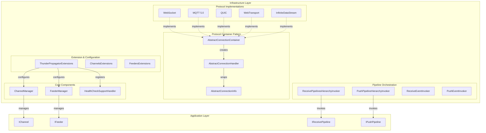
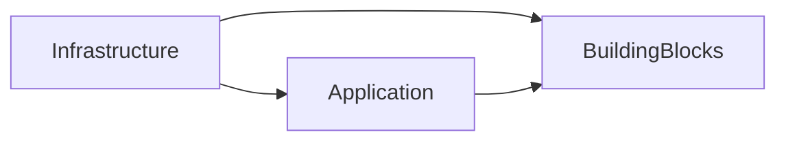

# Infrastructure Layer

## Overview
The Infrastructure layer of ThunderPropagator provides concrete implementations of protocol-specific connection handling, pipeline orchestration, event invocation, and dependency injection configuration. This layer translates the abstract streaming concepts from the Application layer into working implementations for WebSocket, MQTT, QUIC, WebTransport, and InfiniteDataStream protocols.

## Contents
- [Architecture](#architecture)
- [Key Components](#key-components)
- [Protocol Implementations](#protocol-implementations)
- [Documentation Index](#documentation-index)
- [Package Dependencies](#package-dependencies)

## Architecture



## Key Components

### Core Management

| Component | Responsibility | Public Types |
|-----------|---------------|--------------|
| **ChannelManager** | Channel lifecycle, pipeline/event orchestration, subscription routing | `ChannelManager`, `ChannelInfo` |
| **FeederManager** | Feeder lifecycle, resolution, message deserialization | `FeederManager`, `FeederHandler<,>` |
| **HealthCheckSupportHandler** | Dynamic health check registration/removal | `HealthCheckSupportHandler` |

### Protocol Container Pattern

The Infrastructure layer implements a three-tier protocol abstraction:

1. **AbstractConnectionContainer** - Manages connection pool, background jobs (cleanup, health probes, send queues), implements `IHealthCheckSupport`
2. **AbstractConnectionHandler** - Wraps individual connection, protocol-specific send/receive logic
3. **AbstractConnectionInfo** - Connection metadata, enqueue interface, equality support

Each protocol (WebSocket, MQTT, QUIC, WebTransport) provides concrete implementations of all three.

### Pipeline & Event Invocation

| Invoker | Purpose |
|---------|---------|
| **ReceivePipelinesHierarchyInvoker** | Chains receive pipelines in configured order, manages context flow |
| **PushPipelineHierarchyInvoker** | Chains push pipelines in configured order, transforms outgoing messages |
| **ReceiveEventInvoker** | Invokes receive events with dependency injection, extracts route/query parameters |
| **PushEventInvoker** | Invokes push events with service scope injection |

## Protocol Implementations

### Supported Protocols

| Protocol | Container | Handler | Configuration | Features |
|----------|-----------|---------|---------------|----------|
| **WebSocket** | `WebSocketConnectionContainer` | `WebSocketConnectionHandler` | `WebSocketConfiguration` | Middleware, automatic ping/pong |
| **MQTT 5.0** | `MqttConnectionContainer` | `MqttConnectionHandler` | `MqttConnectionConfiguration` | Broker integration, topic-based |
| **QUIC** | `QuicConnectionContainer` | `QuicConnectionHandler` | `QuicConnectionConfiguration` | UDP-based, multiplexed streams |
| **WebTransport** | `WebTransportConnectionContainer` | `WebTransportConnectionHandler` | `WebTransportConfiguration` | HTTP/3-based, bidirectional |
| **InfiniteDataStream** | `InfiniteDataStreamConnectionContainer` | `InfiniteDataStreamConnectionHandler` | `InfiniteDataStreamConfiguration` | Long-polling alternative |

See [Protocols/README.md](Protocols/README.md) for detailed protocol documentation.

## Documentation Index

### Component Documentation

| Path | Description | Types | Files | Diagrams |
|------|-------------|-------|-------|----------|
| [Channels/](Channels/README.md) | Channel management, resolution, exceptions | 7 | 11 | ✓ |
| [Channels/Snapshots/Recovery/](Channels/Snapshots/Recovery/README.md) | Recovery storage implementations | 5 | 5 | ✓ |
| [Contexts/](Contexts/README.md) | Infrastructure context implementations | 4 | 4 | ✓ |
| [Events/](Events/README.md) | Event invocation infrastructure | 2 | 2 | ✓ |
| [Exceptions/](Exceptions/README.md) | Infrastructure-specific exceptions | 1 | 1 | ✗ |
| [Extensions/](Extensions/README.md) | DI registration, configuration | 12 | 13 | ✓ |
| [Feeders/](Feeders/README.md) | Feeder lifecycle management | 5 | 5 | ✓ |
| [Pipelines/](Pipelines/README.md) | Pipeline hierarchy invokers | 2 | 2 | ✓ |
| [Protocols/](Protocols/README.md) | Protocol abstractions & implementations | 28 | 28 | ✓ |
| [Pushers/](Pushers/README.md) | Push feature registration | 2 | 2 | ✗ |
| [Receivers/](Receivers/README.md) | Receive pipelines & authentication/authorization | 24 | 24 | ✓ |

### Top-Level Files

| File | LOC | Responsibility |
|------|-----|---------------|
| [ApiExplorerGroupPerVersionConvention.cs](ApiExplorerGroupPerVersionConvention.cs) | 12 | API versioning group name constants |
| [HealthCheckSupportHandler.cs](HealthCheckSupportHandler.cs) | 74 | Dynamic health check registration |

## Package Dependencies

### NuGet Dependencies
- **ThunderPropagator.BuildingBlocks** - Core utilities (DisposableObject, EquatableObject, BindingDictionary)
- **ThunderPropagator.Application** - Application layer abstractions
- **Microsoft.Extensions.DependencyInjection** - DI container
- **Microsoft.Extensions.Diagnostics.HealthChecks** - Health check infrastructure
- **Microsoft.AspNetCore.WebSockets** - WebSocket support
- **MQTTnet** - MQTT 5.0 client library
- **System.Net.Quic** - QUIC protocol support
- **Microsoft.CodeAnalysis.CSharp.Scripting** - C# script compilation for channel events

### Internal Dependencies


## Design Patterns

### 1. Protocol Container Pattern
Each protocol uses container/handler separation for scalability:
- **Container** manages pool of connections, shared background jobs
- **Handler** wraps individual connection, protocol-specific logic
- Factory method `CreateConnectionHandler()` in container creates handlers

### 2. Partial Class Organization
`ChannelManager` splits across multiple files by responsibility:
- `ChannelManager.cs` - Core channel resolution and lifecycle
- `ChannelManager.Receive.cs` - Message receiving orchestration
- `ChannelManager.Subscription.cs` - Subscription delegation
- `ChannelManager.Receivers.Pipelines.cs` - Receive pipeline management
- `ChannelManager.Receivers.Events.cs` - Receive event management
- `ChannelManager.Pushers.Pipelines.cs` - Push pipeline management
- `ChannelManager.Pushers.Events.cs` - Push event management

### 3. Hierarchy Invoker Pattern
Pipelines chain via linked invokers:
```csharp
// Build chain
var root = new Invoker(pipeline1);
var child = root.Child = new Invoker(pipeline2);
child.Child = new Invoker(pipeline3);

// Invoke entire chain
await root.Invoke(cancellationToken);
```

### 4. Service Scope Injection
Event and pipeline invokers accept flexible parameter injection:
- `PushContext`, `ReceiveContext`, `RequestContext`, `ResponseContext`
- `IServiceScope`, `IServiceProvider`
- `CancellationToken`
- Custom services via `[FromQuery]`, `[FromServices]`, `[ChannelKeyParameter]`

## Usage Patterns

### Registering Infrastructure
```csharp
public void ConfigureServices(IServiceCollection services, IConfiguration configuration)
{
    services.AddThunderPropagator(configuration.GetSection("ThunderPropagator"));
    
    // Optional: Add protocol-specific configuration
    services.AddMqttProtocol(configuration.GetSection("Mqtt"));
    services.AddQuicProtocol(configuration.GetSection("Quic"));
    services.AddWebTransportProtocol(configuration.GetSection("WebTransport"));
}

public void Configure(IApplicationBuilder app, IWebHostEnvironment env)
{
    app.UseThunderPropagator(apiVersionSet);
}
```

### Accessing Channel Manager
```csharp
public class MyService
{
    private readonly ChannelManager _channelManager;
    
    public MyService(ChannelManager channelManager)
    {
        _channelManager = channelManager;
    }
    
    public IChannel GetChannel(string name) => _channelManager.GetChannel(name);
}
```

### Manual Channel Registration
```csharp
services.AddSingleton<StockChannel>();
services.AddSingleton<IChannel>(sp => sp.GetRequiredService<StockChannel>());
```

## Testing Strategy

Infrastructure components use **NetArchTest.Rules** for architecture validation:
- Enforce dependency flow: Infrastructure → Application → BuildingBlocks
- Validate no circular dependencies
- Ensure proper use of internal visibility

Mock implementations:
- `ServiceProviderMock` - Simulates DI container
- `ChannelMock` - Test channel implementation

## Performance Considerations

### Connection Pooling
- `AbstractConnectionContainer` maintains `ConcurrentDictionary` of connections
- Cleanup job runs every 10 minutes to remove stale connections
- Probe job pings clients every 30 seconds

### Message Throughput
License-gated sending rates:
- **Free**: 3 messages/second
- **TenMessagesPerSecondFeature**: 10 msg/s
- **FiftyMessagesPerSecondFeature**: 50 msg/s
- **HundredMessagesPerSecondFeature**: 100 msg/s

### Message Batching
`ConnectionSubscriptionPushingMessage` supports field-level incremental updates:
- Only changed fields sent (when `SubscriptionMode.Incremental`)
- Messages split if exceeding `MaxPushSize`
- Field filtering per subscription reduces bandwidth

## Related Documentation
- [Application Layer Documentation](../Application/README.md)
- [BuildingBlocks Documentation](https://github.com/KiarashMinoo/ThunderPropagator.BuildingBlocks)
- [Architecture Decision Records](../ADR/)

---

**Last Updated**: December 28, 2025  
**Layer**: Infrastructure  
**Total Files**: 116  
**Total Types**: 85+
