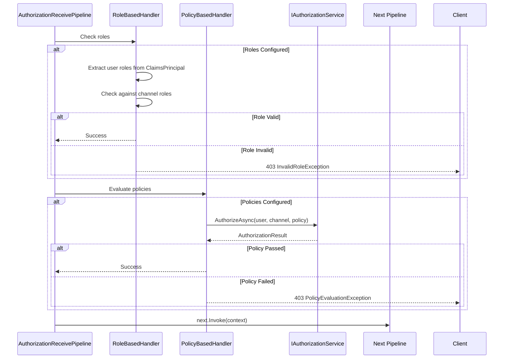

# Authorization Pipeline

## Overview
The Authorization Pipeline checks user permissions after authentication, supporting role-based and policy-based authorization strategies.

## Files (10 files, 349 LOC)

| File | LOC | Description |
|------|-----|-------------|
| AuthorizationReceivePipeline.cs | 67 | Main authorization pipeline |
| AuthorizationReceivePipelineHandlerInvoker.cs | 70 | Handler invoker |
| AuthorizationReceivePipelinesManager.cs | 33 | Handler manager |
| IAuthorizationReceivePipelineHandler.cs | 13 | Handler interface |
| RoleBasedAuthorizationReceivePipelineHandler.cs | 45 | Role checking |
| PolicyBasedAuthorizationReceivePipelineHandler.cs | 48 | Policy evaluation |
| UnauthorizedException.cs | 12 | Base authorization exception |
| UnauthorizedUserException.cs | 13 | User not authorized |
| InvalidRoleException.cs | 13 | Role check failed |
| PolicyEvaluationException.cs | 18 | Policy evaluation failed |

## Authorization Flow



## Examples

### Role-Based Authorization

```csharp
public class StockChannelConfiguration : AbstractChannelConfiguration
{
    public StockChannelConfiguration()
    {
        Metadata.Authorization.IsEnabled = true;
        Metadata.Authorization.Roles = new[] { "Trader", "Admin" };
    }
}

// User with role "Viewer" will get 403 InvalidRoleException
// User with role "Trader" or "Admin" will pass authorization
```

### Policy-Based Authorization

```csharp
// Configure policies in Startup.cs
services.AddAuthorization(options =>
{
    options.AddPolicy("PremiumSubscriber", policy =>
        policy.RequireClaim("SubscriptionTier", "Premium", "Enterprise"));
    
    options.AddPolicy("TradingEnabled", policy =>
        policy.RequireAssertion(context =>
            context.User.HasClaim("TradingEnabled", "true") &&
            context.User.HasClaim("AccountStatus", "Active")));
});

// Channel configuration
public class StockChannelConfiguration : AbstractChannelConfiguration
{
    public StockChannelConfiguration()
    {
        Metadata.Authorization.IsEnabled = true;
        Metadata.Authorization.Policies = new[] { "PremiumSubscriber", "TradingEnabled" };
    }
}
```

## See Also
- [Authentication Pipeline](../Authentication/README.md)
- [Subscribe Pipeline](../Subscribe/README.md)
