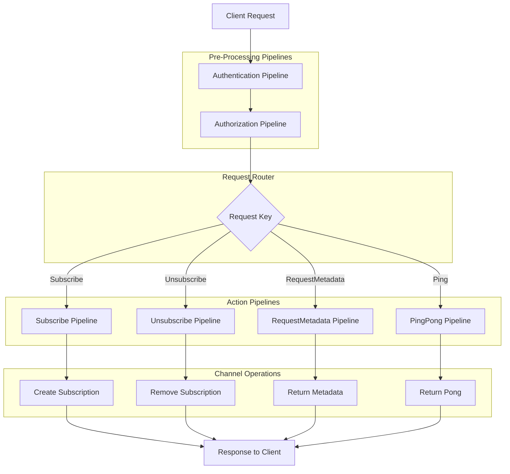
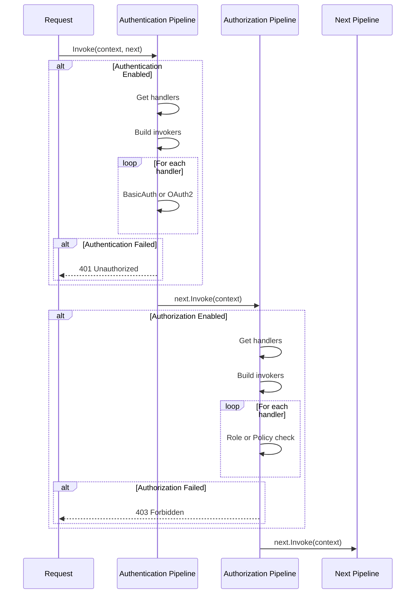
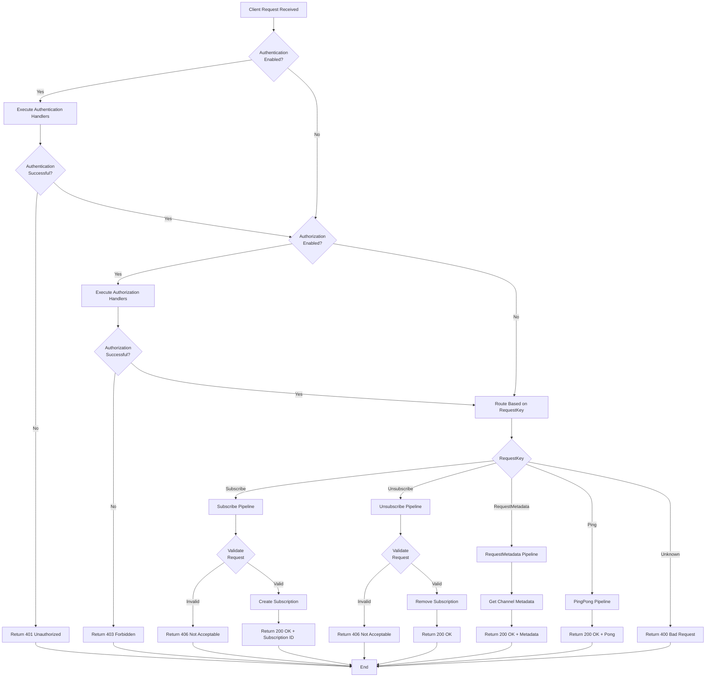

# Receivers Pipelines - Infrastructure Layer

## Table of Contents
- [Overview](#overview)
- [Pipeline Catalog](#pipeline-catalog)
- [Files Summary](#files-summary)
- [Architecture](#architecture)
- [Pipeline Execution Order](#pipeline-execution-order)
- [Request Routing Flow](#request-routing-flow)
- [Examples](#examples)
- [See Also](#see-also)

## Overview

The Receivers Pipelines module implements concrete middleware-style pipelines for processing incoming client requests in the ThunderPropagator system. These pipelines handle authentication, authorization, subscriptions, unsubscriptions, metadata queries, and health checks. Each pipeline inherits from `AbstractReceivePipeline<TChannel>` and processes requests through a delegate chain, enabling modular request handling with cross-cutting concerns.

## Pipeline Catalog

| Pipeline | Request Key | Purpose | Authentication | Authorization | Status Codes |
|----------|-------------|---------|----------------|---------------|--------------|
| **[Authentication](Authentication/README.md)** | N/A (Pre-pipeline) | Validates user credentials via Basic or OAuth2 | N/A | N/A | 401 Unauthorized |
| **[Authorization](Authorization/README.md)** | N/A (Pre-pipeline) | Checks user roles and policies | Required | N/A | 403 Forbidden |
| **[Subscribe](Subscribe/README.md)** | `Subscribe` | Creates channel subscriptions | Optional | Optional | 200 OK, 406 Not Acceptable |
| **[Unsubscribe](Unsubscribe/README.md)** | `Unsubscribe` | Removes channel subscriptions | Optional | Optional | 200 OK, 406 Not Acceptable |
| **[RequestMetadata](RequestMetadata/README.md)** | `RequestMetadata` | Returns channel metadata | Optional | Optional | 200 OK |
| **[PingPong](PingPong/README.md)** | `Ping` | Health check endpoint | No | No | 200 OK |

## Files Summary

### By Pipeline Type

| Pipeline Category | Files | Total LOC | Description |
|------------------|-------|-----------|-------------|
| **Authentication** | 11 | 428 | Basic and OAuth2 authentication with handlers and exceptions |
| **Authorization** | 10 | 349 | Role-based and policy-based authorization |
| **Subscribe** | 6 | 310 | Subscription creation with field/key filtering |
| **Unsubscribe** | 4 | 220 | Subscription removal and cleanup |
| **RequestMetadata** | 2 | 78 | Channel metadata queries |
| **PingPong** | 2 | 75 | Health check responses |
| **Total** | **39** | **1,460** | All pipeline files |

### Complete File List

<details>
<summary>Click to expand complete file list with LOC</summary>

#### Authentication (11 files, 428 LOC)
- `AuthenticationReceivePipeline.cs` (65 LOC)
- `AuthenticationReceivePipelineHandlerInvoker.cs` (70 LOC)
- `AuthenticationReceivePipelinesManager.cs` (33 LOC)
- `AuthenticationReceivePipelineHandlers/IAuthenticationReceivePipelineHandler.cs` (13 LOC)
- `AuthenticationReceivePipelineHandlers/BasicAuthenticationReceivePipelineHandler.cs` (92 LOC)
- `AuthenticationReceivePipelineHandlers/OAuth2AuthenticationReceivePipelineHandler.cs` (56 LOC)
- `Exceptions/UnauthenticatedException.cs` (17 LOC)
- `Exceptions/UnauthenticatedTokenException.cs` (15 LOC)
- `Exceptions/UnauthenticatedUserException.cs` (15 LOC)

#### Authorization (10 files, 349 LOC)
- `AuthorizationReceivePipeline.cs` (67 LOC)
- `AuthorizationReceivePipelineHandlerInvoker.cs` (70 LOC)
- `AuthorizationReceivePipelinesManager.cs` (33 LOC)
- `AuthorizationReceivePipelineHandlers/IAuthorizationReceivePipelineHandler.cs` (13 LOC)
- `AuthorizationReceivePipelineHandlers/RoleBasedAuthorizationReceivePipelineHandler.cs` (45 LOC)
- `AuthorizationReceivePipelineHandlers/PolicyBasedAuthorizationReceivePipelineHandler.cs` (48 LOC)
- `Exceptions/UnauthorizedException.cs` (12 LOC)
- `Exceptions/UnauthorizedUserException.cs` (13 LOC)
- `Exceptions/InvalidRoleException.cs` (13 LOC)
- `Exceptions/PolicyEvaluationException.cs` (18 LOC)

#### Subscribe (6 files, 310 LOC)
- `SubscribeReceivePipeline.cs` (89 LOC)
- `SubscribeReceivePipelineRequestDto.cs` (111 LOC)
- `SubscribeReceivePipelineResponseDto.cs` (13 LOC)
- `SubscribingKeysCollection.cs` (51 LOC)
- `SubscribingFieldsCollection.cs` (17 LOC)
- `UnsubscribableAttribute.cs` (11 LOC)
- `Exceptions/SubscribingKeysRequiredException.cs` (18 LOC)

#### Unsubscribe (4 files, 220 LOC)
- `UnsubscribeChannelReceivePipeline.cs` (83 LOC)
- `UnsubscribeChannelReceivePipelineRequestDto.cs` (80 LOC)
- `UnsubscribeChannelReceivePipelineResponseDto.cs` (13 LOC)
- `SubscribedKeysCollection.cs` (24 LOC)
- `Exceptions/SubscriptionIdsRequiredException.cs` (20 LOC)

#### RequestMetadata (2 files, 78 LOC)
- `RequestMetadataReceivePipeline.cs` (64 LOC)
- `RequestMetadataReceivePipelineResponseDto.cs` (14 LOC)

#### PingPong (2 files, 75 LOC)
- `PingPongReceivePipeline.cs` (62 LOC)
- `PingPongReceivePipelineResponseDto.cs` (13 LOC)

</details>

## Architecture



## Pipeline Execution Order

### 1. Pre-Processing Phase (Always Executed)



### 2. Routing Phase (Conditional Execution)

```csharp
// Pseudo-code for pipeline routing
if (context.Request.IsRequestKey("Subscribe"))
{
    await subscribeReceivePipeline.Invoke(channelInfo, context, next, cancellationToken);
}
else if (context.Request.IsRequestKey("Unsubscribe"))
{
    await unsubscribeChannelReceivePipeline.Invoke(channelInfo, context, next, cancellationToken);
}
else if (context.Request.IsRequestKey("RequestMetadata"))
{
    await requestMetadataReceivePipeline.Invoke(channelInfo, context, next, cancellationToken);
}
else if (context.Request.IsRequestKey("Ping"))
{
    await pingPongReceivePipeline.Invoke(channelInfo, context, next, cancellationToken);
}
else
{
    await next(context, cancellationToken); // Unknown request key
}
```

## Request Routing Flow



## Examples

### Complete Pipeline Chain Registration

```csharp
// In ThunderPropagatorExtensions.cs
public static IServiceCollection AddReceiversPipelinesFeatures<TChannel>(
    this IServiceCollection services,
    IConfiguration configuration)
    where TChannel : class, IChannel
{
    // Pre-processing pipelines (always execute)
    services.TryAddSingleton<AuthenticationReceivePipeline<TChannel>>();
    services.TryAddSingleton<AuthenticationReceivePipelinesManager<TChannel>>();
    services.TryAddSingleton<IAuthenticationReceivePipelineHandler<TChannel>, BasicAuthenticationReceivePipelineHandler<TChannel>>();
    services.TryAddSingleton<IAuthenticationReceivePipelineHandler<TChannel>, OAuth2AuthenticationReceivePipelineHandler<TChannel>>();
    
    services.TryAddSingleton<AuthorizationReceivePipeline<TChannel>>();
    services.TryAddSingleton<AuthorizationReceivePipelinesManager<TChannel>>();
    services.TryAddSingleton<IAuthorizationReceivePipelineHandler<TChannel>, RoleBasedAuthorizationReceivePipelineHandler<TChannel>>();
    services.TryAddSingleton<IAuthorizationReceivePipelineHandler<TChannel>, PolicyBasedAuthorizationReceivePipelineHandler<TChannel>>();
    
    // Action pipelines (conditional execution)
    services.TryAddSingleton<SubscribeReceivePipeline<TChannel>>();
    services.TryAddSingleton<UnsubscribeChannelReceivePipeline<TChannel>>();
    services.TryAddSingleton<RequestMetadataReceivePipeline<TChannel>>();
    services.TryAddSingleton<PingPongReceivePipeline<TChannel>>();
    
    return services;
}
```

### Building Pipeline Chain

```csharp
// In ChannelManager.BuildReceivePipelinesHierarchyInvoker
private ReceiveInvoker? BuildReceivePipelinesHierarchyInvoker(
    ChannelInfo channelInfo,
    IServiceScope serviceScope,
    ReceiveContext receiveContext)
{
    var pipelineBuilder = new ReceivePipelineBuilder<TChannel>();
    
    // Pre-processing pipelines (always included)
    pipelineBuilder.Use<AuthenticationReceivePipeline<TChannel>>();
    pipelineBuilder.Use<AuthorizationReceivePipeline<TChannel>>();
    
    // Action pipelines (router pattern)
    pipelineBuilder.Use<SubscribeReceivePipeline<TChannel>>();
    pipelineBuilder.Use<UnsubscribeChannelReceivePipeline<TChannel>>();
    pipelineBuilder.Use<RequestMetadataReceivePipeline<TChannel>>();
    pipelineBuilder.Use<PingPongReceivePipeline<TChannel>>();
    
    var pipeline = pipelineBuilder.Build();
    return new ReceiveInvoker(pipeline, channelInfo, receiveContext, serviceScope);
}
```

### Client Request Examples

#### Subscribe Request (Authenticated)
```json
{
  "RequestKey": "Subscribe",
  "Username": "admin",
  "Password": "encrypted_password_base64",
  "SubscribingKeys": {
    "sub-1": { "Symbol": "AAPL", "Exchange": "NASDAQ" },
    "sub-2": { "Symbol": "GOOGL", "Exchange": "NASDAQ" }
  },
  "SubscribingFields": ["LastPrice", "Volume", "Timestamp"],
  "SubscriptionMode": "Incremental"
}
```

**Response (200 OK)**:
```json
{
  "Message": "Subscribed",
  "Subscriptions": [
    {
      "SubscriptionId": "sub-1",
      "ConnectionId": "conn-123",
      "Keys": { "Symbol": "AAPL", "Exchange": "NASDAQ" },
      "Fields": ["LastPrice", "Volume", "Timestamp"]
    },
    {
      "SubscriptionId": "sub-2",
      "ConnectionId": "conn-123",
      "Keys": { "Symbol": "GOOGL", "Exchange": "NASDAQ" },
      "Fields": ["LastPrice", "Volume", "Timestamp"]
    }
  ]
}
```

#### Unsubscribe Request
```json
{
  "RequestKey": "Unsubscribe",
  "SubscribedKeys": {
    "sub-1": {}
  }
}
```

**Response (200 OK)**:
```json
{
  "Message": "Unsubscribed"
}
```

#### RequestMetadata Request
```json
{
  "RequestKey": "RequestMetadata"
}
```

**Response (200 OK)**:
```json
{
  "Metadata": {
    "ChannelName": "StockChannel",
    "ChannelType": "RealTimeStock",
    "Authentication": {
      "IsEnabled": true,
      "AuthenticationType": "Basic"
    },
    "Authorization": {
      "IsEnabled": true,
      "Roles": ["Trader", "Admin"]
    },
    "Fields": [
      { "Name": "Symbol", "Type": "string", "Required": true },
      { "Name": "LastPrice", "Type": "decimal", "Required": true },
      { "Name": "Volume", "Type": "long", "Required": false }
    ]
  }
}
```

#### Ping Request
```json
{
  "RequestKey": "Ping"
}
```

**Response (200 OK)**:
```json
{
  "Message": "Pong",
  "Timestamp": "2025-12-28T10:30:00Z"
}
```

### Error Handling Example

```csharp
public class GlobalExceptionHandlerMiddleware
{
    public async Task InvokeAsync(HttpContext context, RequestDelegate next)
    {
        try
        {
            await next(context);
        }
        catch (UnauthenticatedException ex)
        {
            context.Response.StatusCode = (int)HttpStatusCode.Unauthorized;
            await context.Response.WriteAsJsonAsync(new { Error = ex.Message });
        }
        catch (UnauthorizedException ex)
        {
            context.Response.StatusCode = (int)HttpStatusCode.Forbidden;
            await context.Response.WriteAsJsonAsync(new { Error = ex.Message });
        }
        catch (SubscribingKeysRequiredException ex)
        {
            context.Response.StatusCode = (int)HttpStatusCode.NotAcceptable;
            await context.Response.WriteAsJsonAsync(new { Error = ex.Message });
        }
    }
}
```

## See Also

- [Authentication Pipeline](Authentication/README.md) - Basic and OAuth2 authentication
- [Authorization Pipeline](Authorization/README.md) - Role and policy-based authorization
- [Subscribe Pipeline](Subscribe/README.md) - Subscription creation and management
- [Unsubscribe Pipeline](Unsubscribe/README.md) - Subscription removal
- [RequestMetadata Pipeline](RequestMetadata/README.md) - Channel metadata queries
- [PingPong Pipeline](PingPong/README.md) - Health check endpoint
- [Application Pipelines](../../../Application/Pipelines/README.md) - Base pipeline abstractions
- [Receivers](../README.md) - Receivers infrastructure overview
- [Channels](../../../Application/Channels/README.md) - Channel architecture
