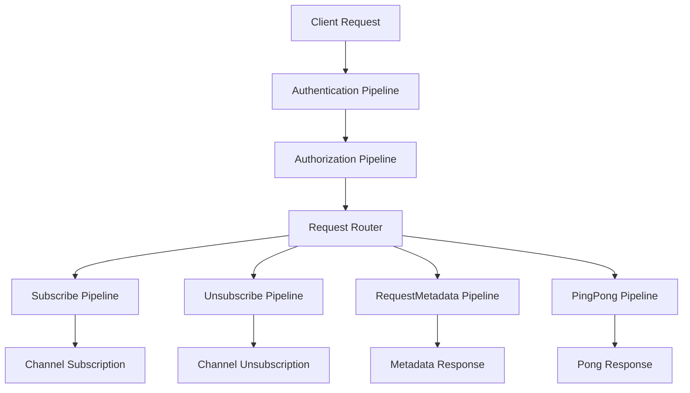
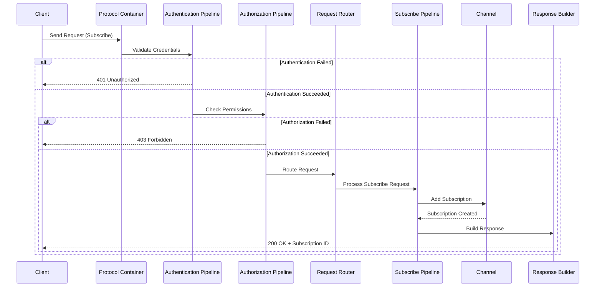

# Receivers - Infrastructure Layer

## Table of Contents
- [Overview](#overview)
- [Files](#files)
- [Types](#types)
- [Type Details](#type-details)
  - [AddReceiversPipelinesFeatures](#addreceiverspipelinesfeatures)
  - [AddReceiversEventsFeature](#addreceiverseventsfeature)
- [Pipeline Architecture](#pipeline-architecture)
- [Pipeline Chain Flow](#pipeline-chain-flow)
- [Examples](#examples)
- [See Also](#see-also)

## Overview

The Receivers module provides infrastructure-level support for processing incoming client requests through a sophisticated pipeline architecture. It enables event-driven request handling with authentication, authorization, subscriptions, and metadata queries. The module implements middleware-style pipelines that process requests sequentially, supporting real-time data streaming protocols (WebSocket, MQTT, QUIC, WebTransport).

## Files

| File | LOC | Description |
|------|-----|-------------|
| [AddReceiversPipelinesFeatures.cs](../../src/ThunderPropagator.Infrastructure/Receivers/AddReceiversPipelinesFeatures.cs) | 14 | Feature flag enabling receiver pipeline infrastructure |
| [AddReceiversEventsFeature.cs](../../src/ThunderPropagator.Infrastructure/Receivers/AddReceiversEventsFeature.cs) | 14 | Feature flag enabling receiver event-driven processing |

**Total Infrastructure Files**: 2 (28 LOC)  
**Pipeline Files**: 39 files (see [Pipelines README](Pipelines/README.md))

## Types

| Type | Kind | Summary | Implements |
|------|------|---------|------------|
| `AddReceiversPipelinesFeatures` | Class | Enables receiver pipelines for real-time data processing and reception through event-driven mechanisms | `IFeature` |
| `AddReceiversEventsFeature` | Class | Enables event-driven receivers for reception and processing of real-time events | `IFeature` |

## Type Details

### AddReceiversPipelinesFeatures

**Purpose**: Feature flag that enables the receiver pipeline infrastructure when licensed.

**Characteristics**:
- Internal sealed class (non-sealed in DEBUG)
- Implements `IFeature` for license management
- Decorated with `Description` attribute for metadata

**Usage Recipe**:
```csharp
// Feature is auto-registered via ThunderPropagatorExtensions
services.AddThunderPropagator(configuration.GetSection("ThunderPropagator"));

// License manager checks this feature before enabling pipelines
if (LicenseManagerInterop.IsAllowed(typeof(AddReceiversPipelinesFeatures)))
{
    // Pipelines are enabled
}
```

### AddReceiversEventsFeature

**Purpose**: Feature flag enabling event-driven receiver processing.

**Characteristics**:
- Internal sealed class (non-sealed in DEBUG)
- Implements `IFeature` for license management
- Enables reception and processing of real-time events

**Usage Recipe**:
```csharp
// Automatically checked during DI registration
services.AddThunderPropagator(configuration);

// Events are processed after pipeline completion
// See ChannelManager.BuildReceiveEventsInvoker for implementation
```

## Pipeline Architecture

The Receivers module implements a **middleware-style pipeline pattern** for processing incoming requests:



### Pipeline Types

| Pipeline | Purpose | Request Key | Authentication | Authorization |
|----------|---------|-------------|----------------|---------------|
| **Authentication** | Validates user credentials | N/A (Pre-pipeline) | N/A | N/A |
| **Authorization** | Checks user permissions | N/A (Pre-pipeline) | ✓ | N/A |
| **Subscribe** | Handles subscription requests | `Subscribe` | ✓ | ✓ |
| **Unsubscribe** | Handles unsubscription requests | `Unsubscribe` | ✓ | ✓ |
| **RequestMetadata** | Returns channel metadata | `RequestMetadata` | Optional | Optional |
| **PingPong** | Health check endpoint | `Ping` | ✗ | ✗ |

## Pipeline Chain Flow



## Examples

### Basic Pipeline Registration

```csharp
// In ThunderPropagatorExtensions.cs
services.AddReceiversPipelinesFeatures<StockChannel>(configuration);

// Registers:
// - AuthenticationReceivePipeline<StockChannel>
// - AuthorizationReceivePipeline<StockChannel>
// - SubscribeReceivePipeline<StockChannel>
// - UnsubscribeChannelReceivePipeline<StockChannel>
// - RequestMetadataReceivePipeline<StockChannel>
// - PingPongReceivePipeline<StockChannel>
```

### Channel Configuration with Authentication

```csharp
public class StockChannelConfiguration : AbstractChannelConfiguration
{
    public StockChannelConfiguration()
    {
        Metadata.Authentication.IsEnabled = true;
        Metadata.Authentication.AuthenticationType = AuthenticationType.Basic;
        Metadata.Authentication.BasicUsersConfiguration = new[]
        {
            new BasicUserConfiguration
            {
                Username = "admin",
                Password = "SecurePassword123",
                Roles = new[] { "Admin", "Trader" }
            }
        };
        
        Metadata.Authorization.IsEnabled = true;
        Metadata.Authorization.Roles = new[] { "Trader" };
    }
}
```

### Processing Incoming Subscribe Request

```csharp
// Client sends:
// {
//   "RequestKey": "Subscribe",
//   "Username": "admin",
//   "Password": "SecurePassword123",
//   "SubscribingKeys": {
//     "subscription-1": { "Symbol": "AAPL", "Exchange": "NASDAQ" }
//   },
//   "SubscribingFields": ["LastPrice", "Volume", "Timestamp"],
//   "SubscriptionMode": "Incremental"
// }

// Pipeline flow:
// 1. AuthenticationReceivePipeline validates credentials
// 2. AuthorizationReceivePipeline checks roles
// 3. SubscribeReceivePipeline processes request
// 4. Channel creates subscription and adds to collection
// 5. Response sent: { "Message": "Subscribed", "Subscriptions": [...] }
```

### Custom Pipeline Extension

```csharp
public class RateLimitReceivePipeline<TChannel> : AbstractReceivePipeline<TChannel>
    where TChannel : class, IChannel
{
    public override string RequestKey => RequestContextHelper.NoRequestKey;
    
    public async Task Invoke(ChannelInfo channelInfo,
        ReceiveContext context,
        ReceivePipelineDelegate next,
        CancellationToken cancellationToken = default)
    {
        // Check rate limit
        if (!await _rateLimiter.AllowRequestAsync(context.Request.ConnectionId))
        {
            context.Response.ResponseCode = 429;
            context.Response.ResponseContent = new { Message = "Rate limit exceeded" };
            return;
        }
        
        await next(context, cancellationToken);
    }
}

// Register before authentication
services.TryAddSingleton<RateLimitReceivePipeline<StockChannel>>();
```

## See Also

- [Pipelines Documentation](Pipelines/README.md) - Detailed pipeline implementations
- [Authentication Pipelines](Pipelines/Authentication/README.md) - Authentication handlers
- [Authorization Pipelines](Pipelines/Authorization/README.md) - Authorization strategies
- [Subscribe Pipeline](Pipelines/Subscribe/README.md) - Subscription management
- [Application Pipelines](../../Application/Pipelines/README.md) - Base pipeline abstractions
- [Channels](../../Application/Channels/README.md) - Channel architecture
- [Protocol Containers](../Protocols/README.md) - Protocol implementations
