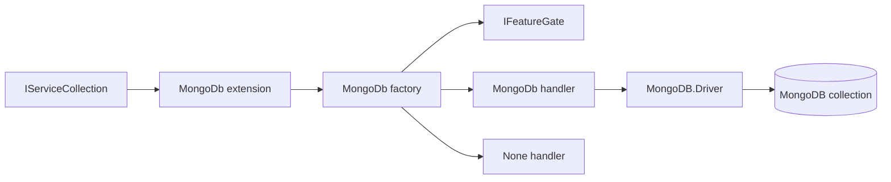
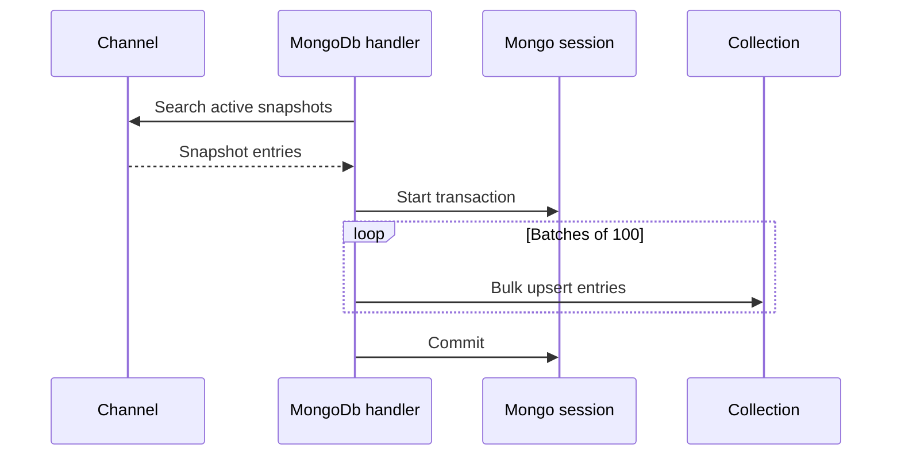

# MongoDb Recovery Handler

## Contents

- [Overview](#overview)
- [Files](#files)
- [Types and members](#types-and-members)
- [Serialization and contracts](#serialization-and-contracts)
- [Validation and constraints](#validation-and-constraints)
- [Performance notes](#performance-notes)
- [Package dependencies](#package-dependencies)
- [Diagrams](#diagrams)
- [Example](#example)
- [See also](#see-also)

## Overview

The MongoDb assembly persists active channel snapshots in a MongoDB collection named after the channel. It registers a storage-specific factory, maps `SnapshotEntry` for BSON, uses transactional bulk upserts for backups, and supports full or hash-key-specific restore, cleanup, and hibernation operations.

The handler is internal; applications integrate through `AddMongoDbRecoveryHandler()`. Feature gating determines whether the factory creates the MongoDB handler or returns the built-in `NoneRecoveryHandler`.

## Files

| File | Primary type(s)/symbol(s) | LOC (approx) | Responsibility |
|---|---|---:|---|
| `AssemblyInfo.cs` | Assembly attributes | 5 | Enables preview APIs and test friend access |
| `Features.cs` | `MongoDbRecoveryStorageFeature` | 13 | Declares the licensed MongoDB storage capability |
| `MongoDbRecoveryHandler.cs` | `MongoDbRecoveryHandler` | 105 | Implements MongoDB persistence operations and BSON mapping |
| `MongoDbRecoveryHandlerExtensions.cs` | `MongoDbRecoveryHandlerExtensions` | 15 | Exposes dependency-injection registration |
| `MongoDbRecoveryHandlerFactory.cs` | `MongoDbRecoveryHandlerFactory` | 19 | Selects and creates the MongoDB recovery handler |
| `ThunderPropagator.RecoveryHandler.MongoDb.csproj` | Assembly manifest | 8 | Declares the MongoDB driver and SharedKernel reference |

## Types and members

| Type | Kind | Summary | Inherits/Implements | Key members |
|---|---|---|---|---|
| `MongoDbRecoveryHandlerExtensions` | Public static partial class | Registers the factory and feature | Static class | `AddMongoDbRecoveryHandler` |
| `MongoDbRecoveryStorageFeature` | Internal class | License feature marker | `IFeature` | Description metadata |
| `MongoDbRecoveryHandlerFactory` | Internal sealed class | Matches MongoDB-configured channels and applies feature gating | `IRecoveryHandlerFactory` | `CanHandle`, `Create` |
| `MongoDbRecoveryHandler` | Internal partial class | Persists snapshots in MongoDB | `AbstractRecoveryHandler` | Backup, restore, cleanup, hibernate |

### MongoDbRecoveryHandlerExtensions

- **Kind:** Public static partial class
- **Namespace:** `ThunderPropagator.RecoveryHandler.MongoDb`
- **Thread safety:** Intended for application-startup registration.
- **Serialization:** Not applicable.

```csharp
public static IServiceCollection AddMongoDbRecoveryHandler(
    this IServiceCollection services)
```

Registers `MongoDbRecoveryHandlerFactory` as a singleton `IRecoveryHandlerFactory`, registers `MongoDbRecoveryStorageFeature`, and returns the same service collection.

#### Usage recipe

```csharp
using ThunderPropagator.RecoveryHandler.MongoDb;

services.AddMongoDbRecoveryHandler();
```

Configure the channel's snapshot metadata with `RecoveryStorage.MongoDb`, a MongoDB connection string containing a database name, and a valid channel name.

### MongoDbRecoveryStorageFeature

- **Kind:** Internal feature marker; sealed outside Debug builds
- **Namespace:** `ThunderPropagator.RecoveryHandler.MongoDb`
- **Implements:** `IFeature`
- **Attributes:** `DescriptionAttribute`
- **State:** Immutable and stateless

The fully qualified feature type is used by `IFeatureGate` to decide whether MongoDB recovery is licensed.

### MongoDbRecoveryHandlerFactory

- **Kind:** Internal sealed class
- **Implements:** `IRecoveryHandlerFactory`
- **Constructor dependencies:** `IServiceProvider`, `NoneRecoveryHandler`, `IFeatureGate`
- **Thread safety:** Immutable after construction; the singleton factory only reads its dependencies.

Key methods:

- `bool CanHandle(IChannel channel)` — returns `true` when the channel selects `RecoveryStorage.MongoDb`.
- `IRecoveryHandler Create(IChannel channel)` — creates `MongoDbRecoveryHandler` when the feature gate allows it; otherwise returns the injected no-op handler.

### MongoDbRecoveryHandler

- **Kind:** Internal partial class; sealed outside Debug builds
- **Inherits:** `AbstractRecoveryHandler`
- **Constructor:** Accepts `IServiceProvider` and `IChannel`.
- **State:** Holds a `MongoUrl`, `MongoClient`, and typed `IMongoCollection<SnapshotEntry>`.
- **Thread safety:** Uses the MongoDB driver's thread-safe client. Lifecycle and concurrent operation guarantees otherwise follow `AbstractRecoveryHandler`.

Key operations:

- Backup searches active snapshots and bulk-upserts batches of 100 inside a client session transaction.
- Full restore streams active entries with a cursor batch size of 100 and overwrites in-memory snapshots.
- Targeted restore returns the first entry matching a hash key.
- Cleanup deletes the whole collection contents or one hash key.
- Hibernate upserts a complete entry or merges a supplied snapshot into an existing entry.
- Backup failures abort the transaction and emit logger event `10001`.

[↑ Back to top](#contents)

## Serialization and contracts

The constructor registers a BSON class map for `SnapshotEntry` once per process:

- `HashKey` is the BSON identifier.
- `Keys`, `CastType`, `State`, `LastFetchDateTime`, and `Snapshot` are explicitly mapped.
- Unknown BSON fields are ignored for forward/backward document compatibility.
- Materialization calls the recovery base class's snapshot-entry factory.

## Validation and constraints

- The connection string must be non-null and non-whitespace.
- The MongoDB URL must include a usable database name.
- The channel name becomes the collection name.
- Only active entries are included in full backup and restore.
- Transactions require a MongoDB deployment topology that supports transactions.
- Cancellation tokens are propagated through asynchronous driver operations.

## Performance notes

- Backup batches contain up to 100 snapshots and use unordered work within a single transaction boundary.
- Full restore reads with a cursor batch size of 100 instead of materializing the entire collection first.
- `MongoClient` is created once per handler; avoid repeatedly constructing handlers outside the framework-managed lifecycle.
- Full cleanup uses `DeleteMany` rather than dropping the collection, preserving collection metadata and indexes.

## Package dependencies

| Package | Version | Description | License / authors | Links |
|---|---:|---|---|---|
| `MongoDB.Driver` | 3.10.0 | Official MongoDB .NET driver | Apache-2.0; MongoDB Inc. | [NuGet](https://www.nuget.org/packages/MongoDB.Driver/3.10.0) · [Repository](https://github.com/mongodb/mongo-csharp-driver) |
| `ThunderPropagator` | 1.0.1-beta.176 | Channel, snapshot, recovery, feature-gate, and logging contracts | Apache-2.0; ThunderPropagator | [Repository](https://github.com/KiarashMinoo/ThunderPropagator) |
| `SharedKernel` | Project reference | Shared feature-registration bridge | Repository package | [Documentation](../SharedKernel/README.md#thunderpropagatorextensions) |

## Diagrams

### Components



The public extension wires the factory; runtime channel selection and feature gating decide which handler is returned.

### Backup sequence



If a write fails, the transaction is aborted and the failure is logged instead of being rethrown by the internal transaction block.

[↑ Back to top](#contents)

## Example

```csharp
services.AddMongoDbRecoveryHandler();

// In channel metadata:
// RecoveryStorage = RecoveryStorage.MongoDb
// ConnectionString = "mongodb://localhost:27017/thunder"
```

Registration is global; storage selection and connection details remain channel-specific.

## See also

- [Documentation portal](../README.md)
- [Postgresql backend](../Postgresql/README.md)
- [Redis backend](../Redis/README.md)
- [SharedKernel](../SharedKernel/README.md)

[↑ Back to top](#contents)
