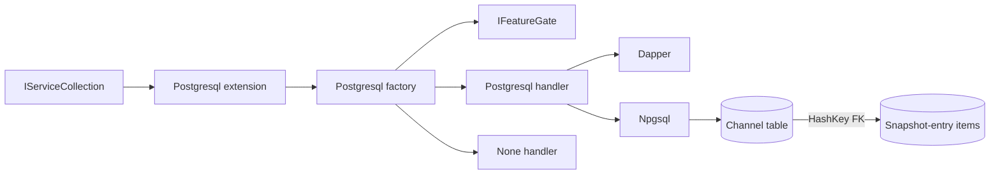
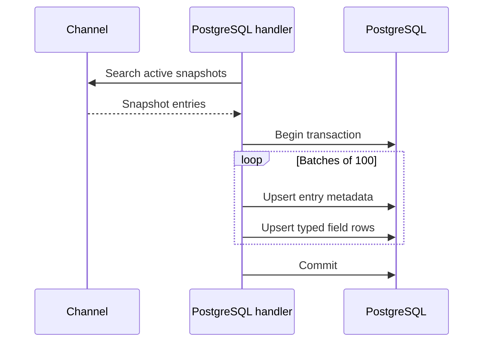
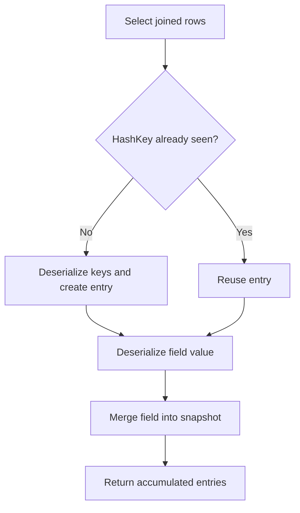

# PostgreSQL Recovery Handler

## Contents

- [Overview](#overview)
- [Files](#files)
- [Types and members](#types-and-members)
- [Serialization and contracts](#serialization-and-contracts)
- [Validation and constraints](#validation-and-constraints)
- [Performance notes](#performance-notes)
- [Package dependencies](#package-dependencies)
- [Diagrams](#diagrams)
- [Example](#example)
- [See also](#see-also)

## Overview

The PostgreSQL assembly persists channel recovery state in a normalized pair of tables under the `Snapshots` schema. It creates the target database and schema when needed, upserts active entries transactionally, reconstructs typed snapshot dictionaries through Dapper multi-mapping, and supports full or hash-key-specific restore, cleanup, and hibernation.

Applications register the backend through `AddPostgresqlRecoveryHandler()`. An internal factory matches PostgreSQL-configured channels and uses the feature gate to select either the database-backed handler or `NoneRecoveryHandler`.

## Files

| File | Primary type(s)/symbol(s) | LOC (approx) | Responsibility |
|---|---|---:|---|
| `AssemblyInfo.cs` | Assembly attributes | 5 | Enables preview APIs and test friend access |
| `Features.cs` | `PostgresqlRecoveryStorageFeature` | 13 | Declares the licensed PostgreSQL storage capability |
| `PostgresqlRecoveryHandler.Backup.cs` | `InternalBackupAsync` | 43 | Batch-upserts active entries and their snapshot items |
| `PostgresqlRecoveryHandler.Cleanup.cs` | Cleanup overrides | 35 | Truncates channel tables or deletes one entry |
| `PostgresqlRecoveryHandler.cs` | `PostgresqlRecoveryHandler` | 103 | Validates identifiers, builds SQL, opens connections, and coordinates transactions |
| `PostgresqlRecoveryHandler.DatabaseSetup.cs` | Initialization helpers | 66 | Creates the database, schema, and tables |
| `PostgresqlRecoveryHandler.Hibernate.cs` | Hibernate overrides | 62 | Upserts full or partial hibernated snapshots |
| `PostgresqlRecoveryHandler.Restore.cs` | Restore overrides | 73 | Loads relational rows and rebuilds snapshot entries |
| `PostgresqlRecoveryHandlerExtensions.cs` | `PostgresqlRecoveryHandlerExtensions` | 15 | Exposes dependency-injection registration |
| `PostgresqlRecoveryHandlerFactory.cs` | `PostgresqlRecoveryHandlerFactory` | 19 | Selects and creates the PostgreSQL recovery handler |
| `PostgresqlSnapshotTypeMapper.cs` | `PostgresqlSnapshotTypeMapper` | 49 | Converts snapshot values to and from text plus type metadata |
| `ThunderPropagator.RecoveryHandler.Postgresql.csproj` | Assembly manifest | 10 | Declares database packages and SharedKernel reference |

## Types and members

| Type | Kind | Summary | Inherits/Implements | Key members |
|---|---|---|---|---|
| `PostgresqlRecoveryHandlerExtensions` | Public static partial class | Registers the factory and feature | Static class | `AddPostgresqlRecoveryHandler` |
| `PostgresqlRecoveryStorageFeature` | Internal class | License feature marker | `IFeature` | Description metadata |
| `PostgresqlRecoveryHandlerFactory` | Internal sealed class | Matches PostgreSQL channels and applies feature gating | `IRecoveryHandlerFactory` | `CanHandle`, `Create` |
| `PostgresqlRecoveryHandler` | Internal partial class | Implements relational recovery persistence | `AbstractRecoveryHandler` | Initialize, backup, restore, cleanup, hibernate |
| `PostgresqlSnapshotTypeMapper` | Internal static class | Preserves runtime value types in text columns | Static class | `Serialize`, `Deserialize` |

### PostgresqlRecoveryHandlerExtensions

- **Kind:** Public static partial class
- **Namespace:** `ThunderPropagator.RecoveryHandler.Postgresql`
- **Thread safety:** Intended for application-startup registration.

```csharp
public static IServiceCollection AddPostgresqlRecoveryHandler(
    this IServiceCollection services)
```

Registers `PostgresqlRecoveryHandlerFactory` as a singleton, registers `PostgresqlRecoveryStorageFeature`, and returns the original service collection.

#### Usage recipe

```csharp
using ThunderPropagator.RecoveryHandler.Postgresql;

services.AddPostgresqlRecoveryHandler();
```

Select `RecoveryStorage.Postgresql` in channel metadata and supply an Npgsql connection string with a database name.

### PostgresqlRecoveryStorageFeature

- **Kind:** Internal feature marker; sealed outside Debug builds
- **Implements:** `IFeature`
- **Attributes:** `DescriptionAttribute`
- **State:** Immutable and stateless

The feature gate uses this type to authorize PostgreSQL-backed recovery.

### PostgresqlRecoveryHandlerFactory

- **Kind:** Internal sealed class
- **Implements:** `IRecoveryHandlerFactory`
- **Constructor dependencies:** `IServiceProvider`, `NoneRecoveryHandler`, `IFeatureGate`
- **Thread safety:** Immutable after singleton construction.

Key methods:

- `bool CanHandle(IChannel channel)` — matches `RecoveryStorage.Postgresql`.
- `IRecoveryHandler Create(IChannel channel)` — creates a PostgreSQL handler when licensed; otherwise returns the no-op handler.

### PostgresqlRecoveryHandler

- **Kind:** Internal partial class; sealed outside Debug builds
- **Inherits:** `AbstractRecoveryHandler`
- **Constructor:** Accepts `IServiceProvider` and `IChannel`, validates the channel name, derives table names, stores the connection string, and prepares reusable upsert SQL.
- **State:** Immutable schema, table, connection-string, and SQL fields.
- **Thread safety:** Each operation creates and disposes its own `NpgsqlConnection`; shared fields are read-only. Higher-level lifecycle sequencing follows the base handler.

Key operations:

- `InternalInitializeAsync` creates the database if absent, then creates the `Snapshots` schema and both channel tables.
- `InternalBackupAsync` searches active entries and upserts batches of 100 in a transaction.
- Full restore selects active entries; targeted restore can include inactive entries for one hash key.
- Cleanup truncates both tables or deletes one entry and its detail rows.
- Hibernate upserts an entry or marks an existing entry hibernated before writing supplied fields.
- Transaction failures are rolled back and logged with the operation-specific error message.

### PostgresqlSnapshotTypeMapper

- **Kind:** Internal static class
- **Namespace:** `ThunderPropagator.RecoveryHandler.Postgresql`
- **Thread safety:** Stateless.
- **Serialization:** Primitive values use `TypeCode` names and invariant-looking textual representations supplied by the runtime; enums and other objects use their assembly-qualified type plus NJson.

Key methods:

```csharp
internal static (string Type, string? Value) Serialize(object? value)
internal static object? Deserialize(string type, string value)
```

Supported direct `TypeCode` branches include Boolean, Char, all integral types, Single, Double, Decimal, DateTime, String, Empty, and DBNull. Other types are deserialized through the resolved runtime `Type`.

#### Usage recipe

The handler uses the mapper automatically. A custom snapshot value should be serializable by ThunderPropagator's NJson helpers and its assembly-qualified type must remain resolvable during restore.

[↑ Back to top](#contents)

## Serialization and contracts

The main table stores entry metadata:

| Column | PostgreSQL type | Contract |
|---|---|---|
| `HashKey` | `INT` | Primary key |
| `Keys` | `TEXT` | NJson dictionary |
| `CastType` | `INT` | Numeric `CastType` value |
| `State` | `INT` | Numeric `SnapshotEntryState` value |

The detail table stores one row per snapshot field:

| Column | PostgreSQL type | Contract |
|---|---|---|
| `HashKey` | `INT` | Foreign key to the main table with cascade delete |
| `Key` | `VARCHAR(256)` | Snapshot field name |
| `Type` | `TEXT` | `TypeCode` name or assembly-qualified type |
| `Value` | `TEXT` | Primitive text or NJson |

The composite primary key is `(HashKey, Key)`. Dapper splits joined rows at the aliased `hk` column and merges repeated rows into one `SnapshotEntry`.

## Validation and constraints

- Channel names and database names must match `^[\w\-]+$`.
- A missing or whitespace channel name raises `ArgumentNullException`.
- Invalid channel or database identifiers raise `ArgumentException`.
- The connection string must contain a database name.
- Snapshot keys must fit within 256 characters.
- SQL identifiers are quoted; values are parameterized.
- Initialization requires permission to connect to the `postgres` database and create the configured database.
- Runtime object types stored by assembly-qualified name must remain loadable during restore.
- Cancellation tokens flow into connection, command, transaction, and query operations.

## Performance notes

- Backup splits active entries into batches of 100 and executes one metadata upsert plus one detail upsert per batch.
- Each public recovery operation opens a fresh pooled Npgsql connection.
- Restore joins main and detail tables and accumulates entries in a dictionary keyed by `HashKey`.
- Full cleanup uses `TRUNCATE`; targeted cleanup uses two parameterized `DELETE` statements.
- The `Type` and `Value` text representation favors flexible snapshot contracts over compact binary storage.
- Transaction exceptions are logged after rollback rather than rethrown by the transaction helper, so callers should monitor logs for persistence failures.

## Package dependencies

| Package | Version | Description | License / authors | Links |
|---|---:|---|---|---|
| `Dapper` | 2.1.79 | High-performance micro-ORM used for commands and multi-mapping | Apache-2.0; Sam Saffron, Marc Gravell, Nick Craver | [NuGet](https://www.nuget.org/packages/Dapper/2.1.79) · [Repository](https://github.com/DapperLib/Dapper) |
| `Npgsql` | 8.0.9 (net8.0), 9.0.5 (net9.0), 10.0.3 (net10.0) | Open-source ADO.NET provider for PostgreSQL | PostgreSQL license; Npgsql contributors | [NuGet](https://www.nuget.org/packages/Npgsql) · [Repository](https://github.com/npgsql/npgsql) |
| `Pluralize.NET.Core` | 1.0.0 | Pluralizes `SnapshotEntry` for the detail-table suffix | MIT; Blake Embrey, Sarath KCM, Ricky Vega | [NuGet](https://www.nuget.org/packages/Pluralize.NET.Core/1.0.0) · [Repository](https://github.com/rvegajr/Pluralize.NET.Core) |
| `ThunderPropagator` | 1.0.1-beta.176 | Channel, snapshot, recovery, feature-gate, serialization, and enum contracts | Apache-2.0; ThunderPropagator | [Repository](https://github.com/KiarashMinoo/ThunderPropagator) |
| `SharedKernel` | Project reference | Shared feature-registration bridge | Repository package | [Documentation](../SharedKernel/README.md#thunderpropagatorextensions) |

## Diagrams

### Components and schema



The factory controls selection; the handler maps one logical snapshot entry across a metadata row and multiple detail rows.

### Backup sequence



Any exception inside the transaction triggers rollback and an error log.

### Restore activity



Joined rows are grouped by hash key and reconstructed incrementally.

[↑ Back to top](#contents)

## Example

```csharp
services.AddPostgresqlRecoveryHandler();

// In channel metadata:
// RecoveryStorage = RecoveryStorage.Postgresql
// ConnectionString = "Host=localhost;Database=thunder;Username=app;Password=secret"
```

Use a restricted database principal in production after the database and schema have been provisioned. Automatic initialization requires broader create permissions.

## See also

- [Documentation portal](../README.md)
- [MongoDb backend](../MongoDb/README.md)
- [Redis backend](../Redis/README.md)
- [SharedKernel](../SharedKernel/README.md)

[↑ Back to top](#contents)
