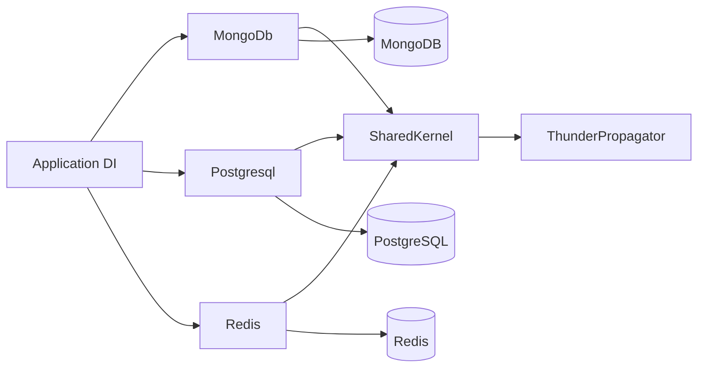

# Recovery Handlers Documentation

## Contents

- [Overview](#overview)
- [Areas](#areas)
- [Architecture](#architecture)
- [Package dependencies](#package-dependencies)
- [Coverage audit](#coverage-audit)
- [Build and verification](#build-and-verification)

## Overview

This portal documents the four production assemblies in the recovery-handlers solution. The storage-specific packages persist ThunderPropagator channel snapshots in MongoDB, PostgreSQL, or Redis, while SharedKernel centralizes feature registration.

Documentation paths are canonicalized by dropping `src` and the shared `ThunderPropagator.RecoveryHandler` project prefix. Test projects and build artifacts are excluded.

## Areas

| Area | Public types | Files | Diagrams | Purpose |
|---|---:|---:|:---:|---|
| [MongoDb](./MongoDb/README.md) | 1 | 6 | ✓ | Transactional MongoDB snapshot persistence |
| [Postgresql](./Postgresql/README.md) | 1 | 12 | ✓ | Relational snapshot persistence and schema setup |
| [Redis](./Redis/README.md) | 1 | 6 | ✓ | Low-latency Redis hash persistence |
| [SharedKernel](./SharedKernel/README.md) | 1 | 3 | ✓ | Shared feature-registration bridge |

## Architecture



Each backend depends on SharedKernel and the ThunderPropagator contracts, but the backend assemblies do not depend on one another.

[↑ Back to top](#contents)

## Package dependencies

Only direct repository dependencies are listed here; framework and transitive dependencies remain governed by central package management.

| Package | Configured/resolved version | Description | License | Used by |
|---|---:|---|---|---|
| [Dapper](https://www.nuget.org/packages/Dapper/2.1.79) | 2.1.79 | Micro-ORM used to execute parameterized PostgreSQL commands | Apache-2.0 | [Postgresql](./Postgresql/README.md#package-dependencies) |
| [MongoDB.Driver](https://www.nuget.org/packages/MongoDB.Driver/3.10.0) | 3.10.0 | Official MongoDB .NET driver | Apache-2.0 | [MongoDb](./MongoDb/README.md#package-dependencies) |
| [Npgsql](https://www.nuget.org/packages/Npgsql) | 8.0.9 / 9.0.5 / 10.0.3 | ADO.NET data provider for PostgreSQL | PostgreSQL | [Postgresql](./Postgresql/README.md#package-dependencies) |
| [Pluralize.NET.Core](https://www.nuget.org/packages/Pluralize.NET.Core/1.0.0) | 1.0.0 | English pluralization for snapshot table naming | MIT | [Postgresql](./Postgresql/README.md#package-dependencies) |
| [StackExchange.Redis](https://www.nuget.org/packages/StackExchange.Redis/3.0.17) | 3.0.17 | High-performance Redis client | MIT | [Redis](./Redis/README.md#package-dependencies) |
| `ThunderPropagator` | 1.0.1-beta.176 | Recovery contracts, channel abstractions, feature gates, and shared helpers | Apache-2.0 | All areas |

[↑ Back to top](#contents)

## Coverage audit

The generator completed each folder on the first pass; no path collisions or heuristic-only documents were required.

| Traversed folder | Status | Required sections | Retry count | Canonicalization notes |
|---|:---:|---|---:|---|
| MongoDb | ✅ | Complete, including Mermaid diagrams | 0 | Common project prefix removed |
| Postgresql | ✅ | Complete, including Mermaid diagrams | 0 | Common project prefix removed |
| Redis | ✅ | Complete, including Mermaid diagrams | 0 | Common project prefix removed |
| SharedKernel | ✅ | Complete, including Mermaid diagram | 0 | Common project prefix removed |

Excluded: `Tests`, `.git`, `.github`, `.idea`, `bin`, `obj`, caches, and the generated `docs` tree itself.

## Build and verification

```bash
dotnet restore
dotnet build -c Release
dotnet test -c Release
```

See the repository [README](../README.md#package-sources) for NuGet source configuration.

[↑ Back to top](#contents)
