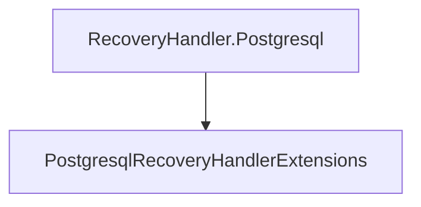

# RecoveryHandler.Postgresql

## Contents

- [Overview](#overview)
- [Files](#files)
- [Types and Members](#types-and-members)
- [Serialization and Contracts](#serialization-and-contracts)
- [Validation and Constraints](#validation-and-constraints)
- [Package Dependencies](#package-dependencies)
- [Diagrams](#diagrams)
- [Examples](#examples)
- [See Also](#see-also)

## Overview

The **RecoveryHandler.Postgresql** area groups 1 documented type, including `PostgresqlRecoveryHandlerExtensions`. It provides the contracts and implementation used by this part of ThunderPropagator.RecoveryHandlers.

## Files

| File | Primary type(s)/symbol(s) | LOC (approx.) | Responsibility |
|---|---|---:|---|
| `AssemblyInfo.cs` | — | 6 | Contains the assembly info implementation or configuration. |
| `Features.cs` | `PostgresqlRecoveryStorageFeature` | 15 | Defines PostgresqlRecoveryStorageFeature and its related behavior. |
| `PostgresqlRecoveryHandler.Backup.cs` | `PostgresqlRecoveryHandler` | 47 | Defines PostgresqlRecoveryHandler and its related behavior. |
| `PostgresqlRecoveryHandler.Cleanup.cs` | `PostgresqlRecoveryHandler` | 37 | Defines PostgresqlRecoveryHandler and its related behavior. |
| `PostgresqlRecoveryHandler.cs` | `PostgresqlRecoveryHandler`, `Log` | 129 | Defines PostgresqlRecoveryHandler, Log and its related behavior. |
| `PostgresqlRecoveryHandler.DatabaseSetup.cs` | `PostgresqlRecoveryHandler` | 80 | Defines PostgresqlRecoveryHandler and its related behavior. |
| `PostgresqlRecoveryHandler.Hibernate.cs` | `PostgresqlRecoveryHandler` | 67 | Defines PostgresqlRecoveryHandler and its related behavior. |
| `PostgresqlRecoveryHandler.Restore.cs` | `PostgresqlRecoveryHandler` | 84 | Defines PostgresqlRecoveryHandler and its related behavior. |
| `PostgresqlRecoveryHandlerExtensions.cs` | `PostgresqlRecoveryHandlerExtensions` | 17 | Defines PostgresqlRecoveryHandlerExtensions and its related behavior. |
| `PostgresqlRecoveryHandlerFactory.cs` | `PostgresqlRecoveryHandlerFactory` | 22 | Defines PostgresqlRecoveryHandlerFactory and its related behavior. |
| `PostgresqlSnapshotTypeMapper.cs` | `PostgresqlSnapshotTypeMapper` | 61 | Defines PostgresqlSnapshotTypeMapper and its related behavior. |
| `ThunderPropagator.RecoveryHandler.Postgresql.csproj` | — | 10 | Defines project build targets, dependencies, and package metadata. |

## Types and Members

| Type | Kind | Summary | Inherits/Implements | Key Members |
|---|---|---|---|---|
| [`PostgresqlRecoveryHandlerExtensions`](#postgresqlrecoveryhandlerextensions) | class | Represents the PostgresqlRecoveryHandlerExtensions class. | — | `AddPostgresqlRecoveryHandler(…)` |

### PostgresqlRecoveryHandlerExtensions

- **Kind:** class
- **Namespace:** `ThunderPropagator.RecoveryHandler.Postgresql`
- **Inherits/implements:** None declared
- **Attributes:** None detected
- **Key members:** `AddPostgresqlRecoveryHandler(…)`
- **Summary:** Represents the PostgresqlRecoveryHandlerExtensions class.
- **Thread safety:** Follow the lifetime and concurrency guarantees of the owning component; no additional guarantee is inferred.

**Usage recipe**

```csharp
// Resolve PostgresqlRecoveryHandlerExtensions from the configured service container or construct it with its declared dependencies.
```

[↑ Back to top](#contents)

## Serialization and Contracts

Serialization behavior is part of the public wire or persistence contract in this area. Preserve field names, ordering rules, content negotiation, and backward-compatibility expectations when changing these types.

## Validation and Constraints

Inputs are validated at component boundaries. Callers should provide non-null required values and handle domain or argument exceptions without retrying invalid requests unchanged.

## Package Dependencies

| Package | Version | Description | Links |
|---|---|---|---|
| `Dapper` | `2.1.79` | External dependency used by the repository. | [Registry](https://www.nuget.org/packages/Dapper) |
| `MongoDB.Driver` | `3.10.0` | External dependency used by the repository. | [Registry](https://www.nuget.org/packages/MongoDB.Driver) |
| `Npgsql` | `10.*` | External dependency used by the repository. | [Registry](https://www.nuget.org/packages/Npgsql) |
| `Pluralize.NET.Core` | `1.0.0` | External dependency used by the repository. | [Registry](https://www.nuget.org/packages/Pluralize.NET.Core) |
| `StackExchange.Redis` | `3.0.17` | External dependency used by the repository. | [Registry](https://www.nuget.org/packages/StackExchange.Redis) |

## Diagrams

### Component overview



The diagram shows the direct components documented by the **RecoveryHandler.Postgresql** area.

## Examples

Start with `PostgresqlRecoveryHandlerExtensions` as the primary entry point for this folder, then follow its linked contracts and collaborators.

## See Also

- [Documentation home](../README.md)
- [RecoveryHandler.MongoDb](../RecoveryHandler.MongoDb/README.md)
- [RecoveryHandler.Redis](../RecoveryHandler.Redis/README.md)
- [RecoveryHandler.SharedKernel](../RecoveryHandler.SharedKernel/README.md)

[↑ Back to top](#contents)
