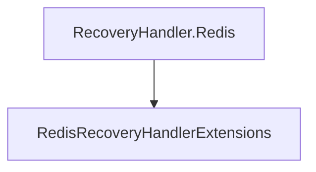

# RecoveryHandler.Redis

## Contents

- [Overview](#overview)
- [Files](#files)
- [Types and Members](#types-and-members)
- [Serialization and Contracts](#serialization-and-contracts)
- [Validation and Constraints](#validation-and-constraints)
- [Performance Notes](#performance-notes)
- [Package Dependencies](#package-dependencies)
- [Diagrams](#diagrams)
- [Examples](#examples)
- [See Also](#see-also)

## Overview

The **RecoveryHandler.Redis** area groups 1 documented type, including `RedisRecoveryHandlerExtensions`. It provides the contracts and implementation used by this part of ThunderPropagator.RecoveryHandlers.

## Files

| File | Primary type(s)/symbol(s) | LOC (approx.) | Responsibility |
|---|---|---:|---|
| `AssemblyInfo.cs` | — | 6 | Contains the assembly info implementation or configuration. |
| `Features.cs` | `RedisRecoveryStorageFeature` | 15 | Defines RedisRecoveryStorageFeature and its related behavior. |
| `RedisConnectionMultiplexerCache.cs` | `RedisConnectionMultiplexerCache` | 94 | Defines RedisConnectionMultiplexerCache and its related behavior. |
| `RedisRecoveryHandler.cs` | `RedisRecoveryHandler`, `Log` | 108 | Defines RedisRecoveryHandler, Log and its related behavior. |
| `RedisRecoveryHandlerExtensions.cs` | `RedisRecoveryHandlerExtensions` | 20 | Defines RedisRecoveryHandlerExtensions and its related behavior. |
| `RedisRecoveryHandlerFactory.cs` | `RedisRecoveryHandlerFactory` | 22 | Defines RedisRecoveryHandlerFactory and its related behavior. |
| `ThunderPropagator.RecoveryHandler.Redis.csproj` | — | 8 | Defines project build targets, dependencies, and package metadata. |

## Types and Members

| Type | Kind | Summary | Inherits/Implements | Key Members |
|---|---|---|---|---|
| [`RedisRecoveryHandlerExtensions`](#redisrecoveryhandlerextensions) | class | Represents the RedisRecoveryHandlerExtensions class. | — | `AddRedisRecoveryHandler(…)` |

### RedisRecoveryHandlerExtensions

- **Kind:** class
- **Namespace:** `ThunderPropagator.RecoveryHandler.Redis`
- **Inherits/implements:** None declared
- **Attributes:** None detected
- **Key members:** `AddRedisRecoveryHandler(…)`
- **Summary:** Represents the RedisRecoveryHandlerExtensions class.
- **Thread safety:** Follow the lifetime and concurrency guarantees of the owning component; no additional guarantee is inferred.

**Usage recipe**

```csharp
// Resolve RedisRecoveryHandlerExtensions from the configured service container or construct it with its declared dependencies.
```

[↑ Back to top](#contents)

## Serialization and Contracts

Serialization behavior is part of the public wire or persistence contract in this area. Preserve field names, ordering rules, content negotiation, and backward-compatibility expectations when changing these types.

## Validation and Constraints

Inputs are validated at component boundaries. Callers should provide non-null required values and handle domain or argument exceptions without retrying invalid requests unchanged.

## Performance Notes

This area contains performance-sensitive constructs such as pooled buffers, spans, asynchronous value types, or concurrent collections. Avoid unnecessary allocations and blocking calls on streaming or message-processing paths.

## Package Dependencies

| Package | Version | Description | Links |
|---|---|---|---|
| `Dapper` | `2.1.79` | External dependency used by the repository. | [Registry](https://www.nuget.org/packages/Dapper) |
| `MongoDB.Driver` | `3.10.0` | External dependency used by the repository. | [Registry](https://www.nuget.org/packages/MongoDB.Driver) |
| `Npgsql` | `10.*` | External dependency used by the repository. | [Registry](https://www.nuget.org/packages/Npgsql) |
| `Pluralize.NET.Core` | `1.0.0` | External dependency used by the repository. | [Registry](https://www.nuget.org/packages/Pluralize.NET.Core) |
| `StackExchange.Redis` | `3.0.17` | External dependency used by the repository. | [Registry](https://www.nuget.org/packages/StackExchange.Redis) |

## Diagrams

### Component overview



The diagram shows the direct components documented by the **RecoveryHandler.Redis** area.

## Examples

Start with `RedisRecoveryHandlerExtensions` as the primary entry point for this folder, then follow its linked contracts and collaborators.

## See Also

- [Documentation home](../README.md)
- [RecoveryHandler.MongoDb](../RecoveryHandler.MongoDb/README.md)
- [RecoveryHandler.Postgresql](../RecoveryHandler.Postgresql/README.md)
- [RecoveryHandler.SharedKernel](../RecoveryHandler.SharedKernel/README.md)

[↑ Back to top](#contents)
