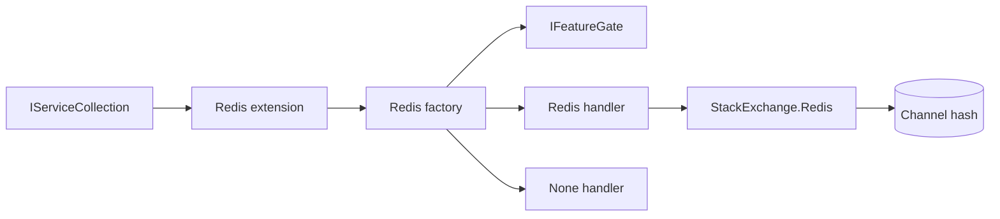
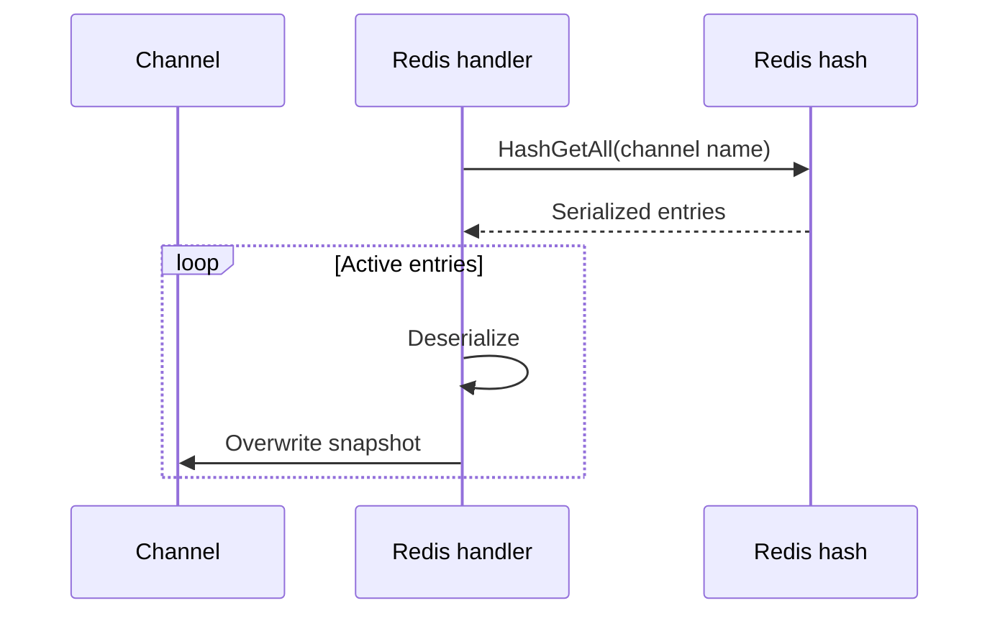

# Redis Recovery Handler

## Contents

- [Overview](#overview)
- [Files](#files)
- [Types and members](#types-and-members)
- [Serialization and contracts](#serialization-and-contracts)
- [Validation and constraints](#validation-and-constraints)
- [Performance notes](#performance-notes)
- [Package dependencies](#package-dependencies)
- [Diagrams](#diagrams)
- [Example](#example)
- [See also](#see-also)

## Overview

The Redis assembly stores each channel's recovery state in a Redis hash whose key is the channel name. Hash fields use snapshot hash keys, and values contain the serialized `SnapshotEntry`.

Applications integrate through `AddRedisRecoveryHandler()`. An internal factory matches Redis-configured channels and returns either the Redis handler or the built-in no-op handler according to the feature gate.

## Files

| File | Primary type(s)/symbol(s) | LOC (approx) | Responsibility |
|---|---|---:|---|
| `AssemblyInfo.cs` | Assembly attributes | 5 | Enables preview APIs and test friend access |
| `Features.cs` | `RedisRecoveryStorageFeature` | 13 | Declares the licensed Redis storage capability |
| `RedisRecoveryHandler.cs` | `RedisRecoveryHandler` | 69 | Implements hash-based snapshot persistence |
| `RedisRecoveryHandlerExtensions.cs` | `RedisRecoveryHandlerExtensions` | 15 | Exposes dependency-injection registration |
| `RedisRecoveryHandlerFactory.cs` | `RedisRecoveryHandlerFactory` | 19 | Selects and creates the Redis recovery handler |
| `ThunderPropagator.RecoveryHandler.Redis.csproj` | Assembly manifest | 8 | Declares the Redis client and SharedKernel reference |

## Types and members

| Type | Kind | Summary | Inherits/Implements | Key members |
|---|---|---|---|---|
| `RedisRecoveryHandlerExtensions` | Public static partial class | Registers the factory and feature | Static class | `AddRedisRecoveryHandler` |
| `RedisRecoveryStorageFeature` | Internal class | License feature marker | `IFeature` | Description metadata |
| `RedisRecoveryHandlerFactory` | Internal sealed class | Matches Redis channels and applies feature gating | `IRecoveryHandlerFactory` | `CanHandle`, `Create` |
| `RedisRecoveryHandler` | Internal class | Stores snapshots in a Redis hash | `AbstractRecoveryHandler` | Backup, restore, cleanup, hibernate, dispose |

### RedisRecoveryHandlerExtensions

- **Kind:** Public static partial class
- **Namespace:** `ThunderPropagator.RecoveryHandler.Redis`
- **Thread safety:** Intended for application-startup registration.

```csharp
public static IServiceCollection AddRedisRecoveryHandler(
    this IServiceCollection services)
```

Registers `RedisRecoveryHandlerFactory` as a singleton, registers the Redis storage feature, and returns the same collection.

#### Usage recipe

```csharp
using ThunderPropagator.RecoveryHandler.Redis;

services.AddRedisRecoveryHandler();
```

Select `RecoveryStorage.Redis` and provide a StackExchange.Redis-compatible connection string in the channel snapshot metadata.

### RedisRecoveryStorageFeature

- **Kind:** Internal feature marker; sealed outside Debug builds
- **Implements:** `IFeature`
- **Attributes:** `DescriptionAttribute`
- **State:** Immutable and stateless

### RedisRecoveryHandlerFactory

- **Kind:** Internal sealed class
- **Implements:** `IRecoveryHandlerFactory`
- **Constructor dependencies:** `IServiceProvider`, `NoneRecoveryHandler`, `IFeatureGate`
- **Thread safety:** Immutable after singleton construction.

Key methods:

- `CanHandle` matches channels configured with `RecoveryStorage.Redis`.
- `Create` checks `RedisRecoveryStorageFeature` and returns either a new Redis handler or the no-op handler.

### RedisRecoveryHandler

- **Kind:** Internal class; sealed outside Debug builds
- **Inherits:** `AbstractRecoveryHandler`
- **Constructor:** Connects synchronously through `ConnectionMultiplexer.Connect`, selects the default database, and uses the channel name as the Redis hash key.
- **State:** Holds one connection multiplexer and database handle.
- **Thread safety:** `ConnectionMultiplexer` is designed for concurrent reuse. Recovery lifecycle sequencing follows the base handler.

Key operations:

- Backup writes all active snapshots with one `HashSetAsync` call.
- Full restore reads all hash entries, deserializes them, and restores only active entries.
- Targeted restore reads one hash field.
- Full cleanup deletes the channel key; targeted cleanup deletes one hash field.
- Hibernate upserts a complete entry or merges a partial snapshot into an existing stored entry.
- Async disposal closes the connection multiplexer.

[↑ Back to top](#contents)

## Serialization and contracts

Snapshot entries are serialized and deserialized with ThunderPropagator's `ToNJson` and `FromNJson` helpers. Redis stores:

- **Redis key:** `channel.Metadata.ChannelName`
- **Hash field:** `SnapshotEntry.HashKey`
- **Hash value:** Serialized `SnapshotEntry`

Missing fields return `null` during targeted restore. Deserialized null or inactive entries are ignored during full restore.

## Validation and constraints

- The connection string must be non-null and non-whitespace.
- A Redis connection is opened during handler construction; connectivity failures surface immediately.
- Channel names share the selected Redis database namespace, so they must be unique within that database.
- Backup does not explicitly skip the write when the active-snapshot set is empty.
- Cancellation tokens cannot cancel StackExchange.Redis calls that do not expose token parameters.

## Performance notes

- A single multiplexer is retained per handler and disposed with it.
- Backup sends all active entries in one hash-set request; very large channels may create a large temporary `HashEntry[]`.
- Full restore uses `HashGetAll`, which materializes the entire channel hash. Prefer PostgreSQL or MongoDB when recovery datasets exceed practical Redis hash sizes.
- Targeted restore, cleanup, and hibernation remain constant-key hash operations.

## Package dependencies

| Package | Version | Description | License / authors | Links |
|---|---:|---|---|---|
| `StackExchange.Redis` | 3.0.17 | High-performance synchronous and asynchronous Redis client | MIT; Stack Exchange, Marc Gravell, Nick Craver | [NuGet](https://www.nuget.org/packages/StackExchange.Redis/3.0.17) · [Repository](https://github.com/StackExchange/StackExchange.Redis) |
| `ThunderPropagator` | 1.0.1-beta.176 | Channel, snapshot, recovery, feature-gate, and serialization contracts | Apache-2.0; ThunderPropagator | [Repository](https://github.com/KiarashMinoo/ThunderPropagator) |
| `SharedKernel` | Project reference | Shared feature-registration bridge | Repository package | [Documentation](../SharedKernel/README.md#thunderpropagatorextensions) |

## Diagrams

### Components



### Restore sequence



The restore path ignores invalid, null, or inactive serialized entries.

[↑ Back to top](#contents)

## Example

```csharp
services.AddRedisRecoveryHandler();

// In channel metadata:
// RecoveryStorage = RecoveryStorage.Redis
// ConnectionString = "localhost:6379"
```

## See also

- [Documentation portal](../README.md)
- [MongoDb backend](../MongoDb/README.md)
- [Postgresql backend](../Postgresql/README.md)
- [SharedKernel](../SharedKernel/README.md)

[↑ Back to top](#contents)
