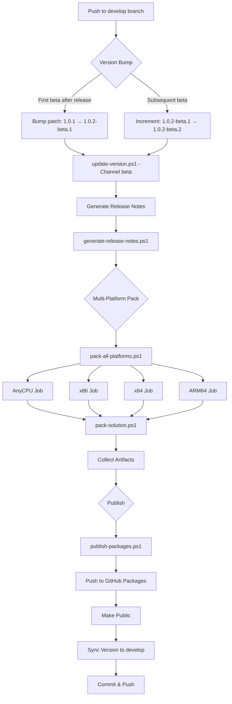
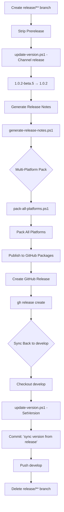
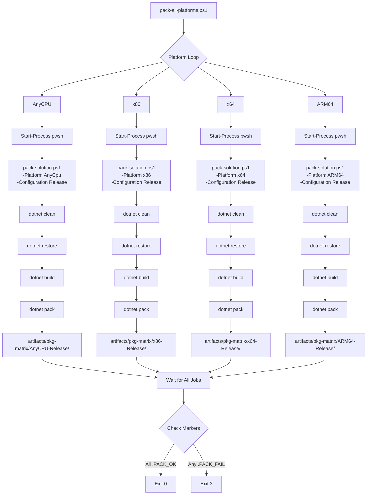
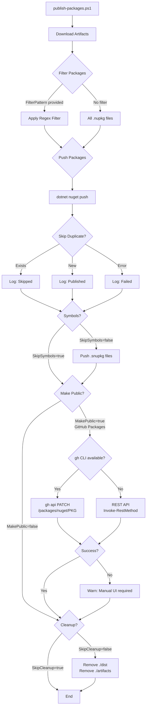
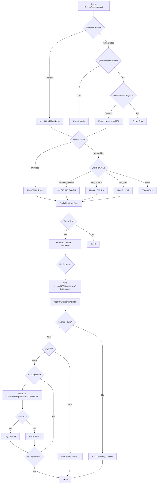

# PowerShell Automation Scripts

## Contents

- [Overview](#overview)
- [Scripts Summary](#scripts-summary)
- [Script Details](#script-details)
  - [Delete-GitHubPackages.ps1](#delete-githubpackagesps1)
  - [Generate-Changelog.ps1](#generate-changelogps1)
  - [Generate-ReleaseNotes.ps1](#generate-releasenotesps1)
  - [generate-release-notes.ps1](#generate-release-notesps1-simple)
  - [pack-all-platforms.ps1](#pack-all-platformsps1)
  - [pack-solution.ps1](#pack-solutionps1)
  - [publish-packages.ps1](#publish-packagesps1)
  - [update-version.ps1](#update-versionps1)
- [CI/CD Workflow Diagrams](#cicd-workflow-diagrams)
  - [Beta Release Flow](#beta-release-flow)
  - [Production Release Flow](#production-release-flow)
  - [Multi-Platform Package Build](#multi-platform-package-build)
  - [Package Publishing Flow](#package-publishing-flow)
  - [Package Cleanup Flow](#package-cleanup-flow)
- [Execution Guidance](#execution-guidance)
- [See Also](#see-also)

---

## Overview

This directory contains PowerShell automation scripts for ThunderPropagator's CI/CD pipeline. These scripts orchestrate version management, multi-platform NuGet package builds, GitHub Packages publishing, release notes generation, and package cleanup operations. All scripts are designed for **PowerShell 5.1+ compatibility** to ensure broad CI/CD runner support (Windows PowerShell and PowerShell Core/7+).

The automation follows a dual-channel versioning strategy:
- **Beta Channel**: Continuous releases from `develop` branch with auto-incrementing beta suffixes (e.g., `1.0.1-beta.1`, `1.0.1-beta.2`)
- **Release Channel**: Stable releases from `release/**` branches that strip prerelease tags (e.g., `1.0.1-beta.5` → `1.0.1`)

Multi-platform support targets `AnyCPU`, `x86`, `x64`, and `ARM64` with parallel build execution for optimal CI performance.

---

## Scripts Summary

| Script | Type | Synopsis | Requires | Notes |
|--------|------|----------|----------|-------|
| [Delete-GitHubPackages.ps1](#delete-githubpackagesps1) | Script | Clean up GitHub Packages using GitHub API | `git`, GitHub PAT | Supports wildcard filtering |
| [Generate-Changelog.ps1](#generate-changelogps1) | Script | Generate Keep-a-Changelog format from git tags | `git` | Supports conventional commits |
| [Generate-ReleaseNotes.ps1](#generate-releasenotesps1) | Script | Comprehensive release notes with diff analysis | `git` | Advanced filtering, stats, diffs |
| [generate-release-notes.ps1](#generate-release-notesps1-simple) | Script | Simple release notes for GitHub Actions | `git` | Used in CI workflows |
| [pack-all-platforms.ps1](#pack-all-platformsps1) | Script | Parallel multi-platform pack orchestrator | `.NET SDK`, [pack-solution.ps1](#pack-solutionps1) | Spawns background jobs |
| [pack-solution.ps1](#pack-solutionps1) | Script | Build and pack .NET solution for single platform | `.NET SDK` | Core pack worker script |
| [publish-packages.ps1](#publish-packagesps1) | Script | Publish NuGet packages to feeds | `.NET SDK`, `gh` CLI (optional) | Supports GitHub Packages visibility |
| [update-version.ps1](#update-versionps1) | Script | Bump version in Directory.Build.props | `git` (optional) | Beta/release channel logic |

---

## Script Details

### Delete-GitHubPackages.ps1

**Synopsis**: Delete GitHub Packages by name filter using GitHub REST API.

**Description**: This script automates cleanup of GitHub Packages (NuGet, npm, container, etc.) by querying the GitHub API and deleting packages matching a wildcard pattern. Supports dry-run mode for safety validation. Automatically detects GitHub username from git configuration or remote URL, and retrieves authentication tokens from environment variables. Includes preflight token validation to prevent accidental deletions with invalid credentials.

#### Parameters

| Name | Type | Mandatory | Position | Pipeline | Default | Validation |
|------|------|-----------|----------|----------|---------|------------|
| `GitHubUserName` | `string` | No | Named | No | _(auto-detected from git)_ | None |
| `GitHubToken` | `string` | No | Named | No | _(from env: `GITHUB_TOKEN`, `GH_TOKEN`, `GH_PAT`)_ | None |
| `PackageNameFilter` | `string` | No | Named | No | `'ThunderPropagator.BuildingBlocks*'` | None |
| `PackageTypes` | `string[]` | No | Named | No | `@('nuget')` | None |
| `PageSize` | `int` | No | Named | No | `1000` | None |
| `SinglePass` | `switch` | No | Named | No | `$false` | None |
| `DryRun` | `switch` | No | Named | No | `$false` | None |

#### Examples

```powershell
# Dry-run to preview what would be deleted
.\Delete-GitHubPackages.ps1 -PackageNameFilter 'ThunderPropagator*' -DryRun

# Delete all BuildingBlocks packages (uses default filter)
.\Delete-GitHubPackages.ps1

# Delete specific packages with explicit credentials
.\Delete-GitHubPackages.ps1 -GitHubUserName 'KiarashMinoo' -GitHubToken $env:GH_PAT -PackageNameFilter 'MyPackage*'

# Clean all user packages (dangerous!)
.\Delete-GitHubPackages.ps1 -PackageNameFilter '*' -PackageTypes @('nuget', 'npm')
```

#### Notes

- **Execution Policy**: Requires `RemoteSigned` or `Bypass`
- **Prerequisites**: 
  - Git installed and repository configured with `remote.origin.url`
  - GitHub Personal Access Token with `delete:packages` and `read:packages` scopes
  - Set `GITHUB_TOKEN`, `GH_TOKEN`, or `GH_PAT` environment variable
- **Safety**: Always test with `-DryRun` first
- **API Rate Limits**: GitHub API imposes rate limits; script handles pagination automatically

---

### Generate-Changelog.ps1

**Synopsis**: Generate Keep-a-Changelog format markdown from git history grouped by tags.

**Description**: This script produces a standardized changelog using the [Keep a Changelog](https://keepachangelog.com/) format. It walks git history by tags, groups commits using Conventional Commits syntax (feat, fix, docs, etc.), and generates compare/commit links. Supports incremental updates with managed block replacement, path filtering (include/exclude globs), and persistent state tracking per branch to avoid duplicate processing.

#### Parameters

| Name | Type | Mandatory | Position | Pipeline | Default | Validation |
|------|------|-----------|----------|----------|---------|------------|
| `Repo` | `string` | No | Named | No | `"."` | None |
| `Output` | `string` | No | Named | No | `"CHANGELOG.md"` | None |
| `IncludeUnreleased` | `switch` | No | Named | No | `$true` | None |
| `TagFilter` | `string` | No | Named | No | `'^v?\d+\.(Q\d+|\d+)\.\d+$'` | Regex pattern |
| `Title` | `string` | No | Named | No | `"Changelog"` | None |
| `MaxHighlights` | `int` | No | Named | No | `6` | None |
| `IncludeFiles` | `switch` | No | Named | No | `$true` | None |
| `FileLimit` | `int` | No | Named | No | `5` | None |
| `PathInclude` | `string` | No | Named | No | `''` | Glob pattern |
| `PathExclude` | `string` | No | Named | No | `''` | Glob pattern |
| `SkipTypes` | `string` | No | Named | No | `''` | CSV list |
| `ResetAll` | `switch` | No | Named | No | `$false` | None |
| `Refresh` | `switch` | No | Named | No | `$false` | None |
| `State` | `string` | No | Named | No | `".github/release-notes.state.json"` | None |
| `ShowProgress` | `switch` | No | Named | No | `$false` | None |

#### Examples

```powershell
# Generate changelog with default settings
.\Generate-Changelog.ps1

# Include only src/ directory changes
.\Generate-Changelog.ps1 -PathInclude 'src/**' -PathExclude 'src/**/obj/**,src/**/bin/**'

# Skip CI/build commits and show progress
.\Generate-Changelog.ps1 -SkipTypes 'ci,build' -ShowProgress

# Reset state and regenerate from scratch
.\Generate-Changelog.ps1 -ResetAll

# Custom output and limit highlights per section
.\Generate-Changelog.ps1 -Output 'HISTORY.md' -MaxHighlights 10 -IncludeFiles $false
```

#### Notes

- **Execution Policy**: Requires `RemoteSigned` or `Bypass`
- **Prerequisites**: Git repository with tags (e.g., `v1.0.0`, `v1.1.0`)
- **Conventional Commits**: Best results when commits follow `type(scope): description` format
- **Managed Block**: Uses `<!-- BEGIN/END AUTO-RELEASE-NOTES -->` markers for incremental updates
- **State File**: Tracks last processed SHA per branch to enable incremental regeneration

---

### Generate-ReleaseNotes.ps1

**Synopsis**: Generate comprehensive release notes with statistics, contributors, diff analysis, and optional code snippets.

**Description**: This advanced script produces detailed release notes grouped by git tags. It includes commit summaries, contributor statistics, diff stats (files/insertions/deletions), conventional commit grouping (Breaking, Added, Fixed, Changed, etc.), noise filtering to exclude version bumps and CI churn, and optional diff snippets. Supports GitHub and GitLab compare/commit links, issue reference linking, and configurable noise patterns. Ideal for official release documentation.

#### Parameters

| Name | Type | Mandatory | Position | Pipeline | Default | Validation |
|------|------|-----------|----------|----------|---------|------------|
| `Repo` | `string` | No | Named | No | `"."` | None |
| `Output` | `string` | No | Named | No | `"RELEASE_NOTES.md"` | None |
| `IncludeMerges` | `bool` | No | Named | No | `$false` | None |
| `MaxCommits` | `int` | No | Named | No | `0` (unlimited) | None |
| `SinceTag` | `string` | No | Named | No | `''` | None |
| `UntilTag` | `string` | No | Named | No | `''` | None |
| `ShowProgress` | `switch` | No | Named | No | `$false` | None |
| `ExcludeRegex` | `string[]` | No | Named | No | `@()` | Additional patterns |
| `CollapseRegex` | `string[]` | No | Named | No | `@()` | Additional patterns |
| `MaxContributors` | `int` | No | Named | No | `10` | None |
| `IncludeNoise` | `switch` | No | Named | No | `$false` | None |
| `ShowAuthorAndDate` | `switch` | No | Named | No | `$false` | None |
| `MaxHighlights` | `int` | No | Named | No | `0` (unlimited) | None |
| `IncludeFiles` | `switch` | No | Named | No | `$false` | None |
| `FileLimit` | `int` | No | Named | No | `5` | None |
| `IncludeSnippets` | `switch` | No | Named | No | `$false` | None |
| `ContentsMode` | `string` | No | Named | No | `'none'` | ValidateSet: `'none'`, `'diff-hunks'`, `'added-lines'` |
| `HunkLimit` | `int` | No | Named | No | `2` | None |
| `LinesPerHunk` | `int` | No | Named | No | `40` | None |
| `LinesPerCommit` | `int` | No | Named | No | `300` | None |

#### Examples

```powershell
# Basic release notes for all tags
.\Generate-ReleaseNotes.ps1

# Release notes with progress indicator
.\Generate-ReleaseNotes.ps1 -ShowProgress

# Show top 5 contributors and include file lists
.\Generate-ReleaseNotes.ps1 -MaxContributors 5 -IncludeFiles -FileLimit 10

# Include diff snippets (added lines only)
.\Generate-ReleaseNotes.ps1 -IncludeSnippets -ContentsMode 'added-lines' -LinesPerCommit 500

# Generate notes between specific tags
.\Generate-ReleaseNotes.ps1 -SinceTag 'v1.0.0' -UntilTag 'v2.0.0'

# Limit commits and show author/date
.\Generate-ReleaseNotes.ps1 -MaxCommits 100 -ShowAuthorAndDate

# Disable noise filtering (show everything)
.\Generate-ReleaseNotes.ps1 -IncludeNoise

# Custom exclude pattern (skip all test commits)
.\Generate-ReleaseNotes.ps1 -ExcludeRegex @('^\s*test:', '^\s*wip:')
```

#### Notes

- **Execution Policy**: Requires `RemoteSigned` or `Bypass`
- **Prerequisites**: Git repository with annotated or lightweight tags
- **Performance**: Processing 1000+ commits may take minutes; use `-MaxCommits` or `-ShowProgress`
- **Noise Filtering**: Default patterns exclude beta bumps, NuGet updates, CI tweaks, docs churn
- **Collapse Patterns**: Groups repetitive commits (e.g., "Beta bumps: 15 changes")
- **Conventional Commits**: Supports `feat`, `fix`, `perf`, `refactor`, `docs`, `chore`, `build`, `ci`, `test`, `style`, `revert`, `deps`, `other`
- **Emojis**: Adds visual indicators (✨ feat, 🐛 fix, 💥 breaking, etc.)

---

### generate-release-notes.ps1 (Simple)

**Synopsis**: Generate simple release notes for GitHub Actions workflows.

**Description**: Lightweight script optimized for CI/CD workflows. Extracts commit messages between two commits, filters out merge commits and version bump messages, and formats as markdown bullet list. Supports writing directly to `GITHUB_ENV` for Actions integration. Used by beta and release workflows to generate package release notes.

#### Parameters

| Name | Type | Mandatory | Position | Pipeline | Default | Validation |
|------|------|-----------|----------|----------|---------|------------|
| `Before` | `string` | No | Named | No | `''` (last 50 commits) | None |
| `After` | `string` | No | Named | No | `'HEAD'` | None |
| `OutputFile` | `string` | No | Named | No | `'release-notes.txt'` | None |
| `SetGitHubEnv` | `switch` | No | Named | No | `$false` | None |

#### Examples

```powershell
# Generate notes for last 50 commits
.\generate-release-notes.ps1

# Generate notes between two commits
.\generate-release-notes.ps1 -Before 'abc123def' -After 'HEAD'

# Generate and set GITHUB_ENV variable for Actions
.\generate-release-notes.ps1 -SetGitHubEnv

# Custom output file
.\generate-release-notes.ps1 -OutputFile 'RELEASE.txt'
```

#### Notes

- **Execution Policy**: Requires `RemoteSigned` or `Bypass`
- **Prerequisites**: Git repository
- **Filtering**: Automatically excludes commits matching `packageversion`, `bump version`, `beta bump`
- **GitHub Actions**: Use `-SetGitHubEnv` to export `REL_NOTES` variable
- **Fallback**: Outputs "No user-facing changes" if no commits match filters
- **Line Breaks**: Escapes newlines as `\n` for GitHub Actions multi-line support

---

### pack-all-platforms.ps1

**Synopsis**: Orchestrate parallel multi-platform .NET solution packaging.

**Description**: Convenience script for reproducing GitHub Actions pack matrix locally or in CI runners. Launches one background process per platform/configuration combination using `pack-solution.ps1` as the worker. Monitors job progress, collects per-leg logs in separate directories, and validates success via marker files or package presence. Supports throttling via `ParallelLimit` to prevent resource exhaustion. Essential for multi-platform NuGet package generation (AnyCPU, x86, x64, ARM64).

#### Parameters

| Name | Type | Mandatory | Position | Pipeline | Default | Validation |
|------|------|-----------|----------|----------|---------|------------|
| `Platforms` | `string[]` | No | Named | No | `@('AnyCpu', 'x86', 'x64', 'ARM64')` | None |
| `Configurations` | `string[]` | No | Named | No | `@('Debug', 'Release')` | None |
| `SolutionPath` | `string` | No | Named | No | `''` (auto-discover) | None |
| `OutputRoot` | `string` | No | Named | No | `'artifacts/pkg-matrix'` | None |
| `ParallelLimit` | `int` | No | Named | No | `[Environment]::ProcessorCount` | None |
| `SkipClean` | `switch` | No | Named | No | `$false` | None |
| `SkipRestore` | `switch` | No | Named | No | `$false` | None |
| `SkipBuild` | `switch` | No | Named | No | `$false` | None |
| `ReleaseNotes` | `string` | No | Named | No | `''` | None |

#### Examples

```powershell
# Pack all platforms/configurations in parallel
.\pack-all-platforms.ps1

# Pack only Release configuration for AnyCPU and x64
.\pack-all-platforms.ps1 -Platforms 'AnyCpu','x64' -Configurations 'Release'

# Limit parallelism to 2 jobs and specify solution
.\pack-all-platforms.ps1 -ParallelLimit 2 -SolutionPath 'MySolution.sln'

# Fast smoke test (skip clean/restore/build)
.\pack-all-platforms.ps1 -SkipClean -SkipRestore -SkipBuild

# Include release notes in packages
.\pack-all-platforms.ps1 -ReleaseNotes "Bug fixes and performance improvements"

# Custom output directory
.\pack-all-platforms.ps1 -OutputRoot 'build/packages'
```

#### Notes

- **Execution Policy**: Requires `RemoteSigned` or `Bypass`
- **Prerequisites**: 
  - `.NET SDK` installed
  - [pack-solution.ps1](#pack-solutionps1) in same directory
  - PowerShell Core (`pwsh`) or Windows PowerShell (`powershell.exe`)
- **Per-Leg Logs**: Each platform/config writes to `{OutputRoot}/{Platform}-{Configuration}/pack.log`
- **Success Markers**: Creates `.PACK_OK` or `.PACK_FAIL` files for validation
- **Exit Codes**: Returns `3` if any leg fails, `0` on full success
- **Performance**: Default parallelism uses all CPU cores; adjust with `-ParallelLimit`

---

### pack-solution.ps1

**Synopsis**: Build and pack .NET solution for a single platform/configuration.

**Description**: Core worker script for NuGet package creation. Handles solution discovery, platform normalization (e.g., `AnyCpu` → `"Any CPU"`), clean/restore/build/pack operations, and artifact organization. Embeds release notes into package metadata and creates success/failure markers for orchestration scripts. Used directly by CI workflows and invoked by `pack-all-platforms.ps1` for local multi-platform builds.

#### Parameters

| Name | Type | Mandatory | Position | Pipeline | Default | Validation |
|------|------|-----------|----------|----------|---------|------------|
| `Configuration` | `string` | **Yes** | Named | No | _(required)_ | ValidateSet: `'Debug'`, `'Release'` |
| `Platform` | `string` | **Yes** | Named | No | _(required)_ | ValidateSet: `'AnyCpu'`, `'x86'`, `'x64'`, `'ARM64'` |
| `SolutionPath` | `string` | No | Named | No | `''` (auto-discover `.sln`) | None |
| `OutputDir` | `string` | No | Named | No | `'artifacts/pkg'` | None |
| `SkipClean` | `switch` | No | Named | No | `$false` | None |
| `SkipRestore` | `switch` | No | Named | No | `$false` | None |
| `SkipBuild` | `switch` | No | Named | No | `$false` | None |
| `ReleaseNotes` | `string` | No | Named | No | `''` | None |

#### Examples

```powershell
# Pack Release AnyCPU (standard CI usage)
.\pack-solution.ps1 -Configuration Release -Platform AnyCpu

# Pack Debug x64 to custom directory
.\pack-solution.ps1 -Configuration Debug -Platform x64 -OutputDir 'dist/debug'

# Pack with explicit solution path
.\pack-solution.ps1 -Configuration Release -Platform ARM64 -SolutionPath 'src/MyProject.sln'

# Fast pack (skip clean/restore/build for testing)
.\pack-solution.ps1 -Configuration Release -Platform AnyCpu -SkipClean -SkipRestore -SkipBuild

# Pack with release notes
.\pack-solution.ps1 -Configuration Release -Platform x86 -ReleaseNotes "Critical security fixes"
```

#### Notes

- **Execution Policy**: Requires `RemoteSigned` or `Bypass`
- **Prerequisites**: 
  - `.NET SDK` installed (version matching solution target frameworks)
  - Solution file at repository root (or specify via `-SolutionPath`)
- **Platform Normalization**: Converts `AnyCpu` parameter to `"Any CPU"` for MSBuild compatibility
- **Success Markers**: Creates `.PACK_OK` file on success, `.PACK_FAIL` on failure
- **GitHub Actions Integration**: Sets `GITHUB_OUTPUT` variables `platform_sol` and `artifact_suffix`
- **Release Notes Sanitization**: Removes newlines and quotes from release notes to prevent MSBuild parsing errors
- **Exit Codes**: Returns non-zero on any step failure

---

### publish-packages.ps1

**Synopsis**: Publish NuGet packages and symbols to feed with optional GitHub Packages visibility control.

**Description**: Comprehensive package publishing script supporting NuGet feeds (nuget.org, GitHub Packages, Azure Artifacts, etc.). Publishes `.nupkg` packages and `.snupkg` symbol packages with skip-duplicate logic. For GitHub Packages targets, optionally makes packages public using GitHub CLI (`gh`) or REST API. Supports regex filtering to publish only specific packages (e.g., Release builds only). Includes cleanup of downloaded artifacts post-publish.

#### Parameters

| Name | Type | Mandatory | Position | Pipeline | Default | Validation |
|------|------|-----------|----------|----------|---------|------------|
| `NuGetSource` | `string` | **Yes** | Named | No | _(required)_ | None |
| `NuGetApiKey` | `string` | **Yes** | Named | No | _(required)_ | None |
| `PackagesPath` | `string` | No | Named | No | `'./dist/packages'` | None |
| `SymbolsPath` | `string` | No | Named | No | `'./dist/symbols'` | None |
| `SkipSymbols` | `switch` | No | Named | No | `$false` | None |
| `SkipCleanup` | `switch` | No | Named | No | `$false` | None |
| `ReplaceIfExists` | `switch` | No | Named | No | `$false` | None |
| `MakePublic` | `switch` | No | Named | No | `$false` | None |
| `GitHubApiToken` | `string` | No | Named | No | `''` | Required if `MakePublic` |
| `GitHubOwner` | `string` | No | Named | No | `'yanis_1984'` | None |
| `FilterPattern` | `string` | No | Named | No | `''` | Regex pattern |

#### Examples

```powershell
# Publish all packages to nuget.org
.\publish-packages.ps1 -NuGetSource 'https://api.nuget.org/v3/index.json' -NuGetApiKey $env:NUGET_API_KEY

# Publish to GitHub Packages and make public
.\publish-packages.ps1 -NuGetSource 'https://nuget.pkg.github.com/KiarashMinoo/index.json' -NuGetApiKey $env:GITHUB_TOKEN -MakePublic -GitHubApiToken $env:GITHUB_TOKEN

# Publish only Release AnyCPU packages (exclude Debug, ARM64, x86, x64)
.\publish-packages.ps1 -NuGetSource $env:NUGET_SOURCE -NuGetApiKey $env:NUGET_API_KEY -FilterPattern '.*(?<!Debug|ARM64|x86|x64)\.\d+$'

# Skip symbol packages and cleanup
.\publish-packages.ps1 -NuGetSource $env:FEED_URL -NuGetApiKey $env:FEED_KEY -SkipSymbols -SkipCleanup

# Replace existing packages (delete + push)
.\publish-packages.ps1 -NuGetSource $env:NUGET_SOURCE -NuGetApiKey $env:NUGET_API_KEY -ReplaceIfExists

# Custom paths and owner
.\publish-packages.ps1 -NuGetSource $env:FEED_URL -NuGetApiKey $env:FEED_KEY -PackagesPath './output/nupkg' -SymbolsPath './output/snupkg' -GitHubOwner 'MyOrg'
```

#### Notes

- **Execution Policy**: Requires `RemoteSigned` or `Bypass`
- **Prerequisites**: 
  - `.NET SDK` installed
  - `gh` CLI (optional, for GitHub Packages visibility via CLI)
  - API key with push permissions for target feed
- **Skip Duplicate**: Uses `--skip-duplicate` to avoid re-push errors
- **GitHub Packages Limitation**: Packages with dots in IDs cannot have visibility changed via API; requires manual change in web UI
- **Filter Pattern**: Use regex to select packages (e.g., `'.*(?<!Debug)'` excludes Debug builds)
- **Cleanup**: Removes `./dist` and `./artifacts` directories unless `-SkipCleanup` specified
- **Exit Codes**: Returns `0` on success, `1` on validation failure

---

### update-version.ps1

**Synopsis**: Bump project version in Directory.Build.props for beta or release channels.

**Description**: Core version management script for ThunderPropagator's dual-channel CI/CD. Handles beta version incrementing (patch bump + beta.N suffix) and release version stripping (removes prerelease tag). Supports explicit version setting for branch synchronization. Parses XML with namespace handling, validates version formats (3 or 4-part SemVer with optional prerelease), and optionally commits/tags changes. Used by GitHub Actions workflows to automate version bumps.

#### Parameters

| Name | Type | Mandatory | Position | Pipeline | Default | Validation |
|------|------|-----------|----------|----------|---------|------------|
| `Channel` | `string` | No* | Named | No | `''` | ValidateSet: `'release'`, `'beta'`, `''` |
| `SetVersion` | `string` | No* | Named | No | `''` | None |
| `PropsPath` | `string` | No | Named | No | `'Directory.Build.props'` | None |
| `CommitAndTag` | `switch` | No | Named | No | `$false` | None |
| `CommitMessage` | `string` | No | Named | No | `'chore: bump version to {VERSION} [skip ci]'` | None |
| `TagPrefix` | `string` | No | Named | No | `'v'` | None |
| `TagMessage` | `string` | No | Named | No | `'Release {TAG}'` | None |

_* Either `Channel` or `SetVersion` must be provided (mutually exclusive)_

#### Examples

```powershell
# Beta bump: 1.0.1 → 1.0.2-beta.1 (first beta after release)
.\update-version.ps1 -Channel beta

# Beta bump: 1.0.2-beta.1 → 1.0.2-beta.2 (subsequent beta)
.\update-version.ps1 -Channel beta

# Release: 1.0.2-beta.5 → 1.0.2 (strip prerelease)
.\update-version.ps1 -Channel release

# Set explicit version (for branch sync)
.\update-version.ps1 -SetVersion '2.0.0'

# Set version and commit with tag
.\update-version.ps1 -SetVersion '2.1.0' -CommitAndTag

# Custom props path
.\update-version.ps1 -Channel beta -PropsPath 'build/Version.props'

# CI usage (outputs to GITHUB_OUTPUT)
.\update-version.ps1 -Channel release
# Reads output: $env:GITHUB_OUTPUT contains "version=1.0.2"
```

#### Notes

- **Execution Policy**: Requires `RemoteSigned` or `Bypass`
- **Prerequisites**: 
  - `Directory.Build.props` with `<Version>` element
  - Git installed (if using `-CommitAndTag`)
- **Version Formats**: Supports `1.2.3` or `1.2.3.4` with optional `-prerelease.N` suffix
- **Beta Logic**: 
  - No prerelease → bump patch + `-beta.1`
  - Has prerelease → increment beta number only
- **Release Logic**: Strips prerelease suffix without version bump
- **GitHub Actions**: Writes `version=X.Y.Z` to `GITHUB_OUTPUT` for downstream steps
- **Commit Message**: Use `{VERSION}` placeholder for substitution
- **Tag**: Created only if `-CommitAndTag` specified and tag doesn't exist
- **Exit Codes**: Returns `0` on success, `1-5` on validation/parsing errors

---

## CI/CD Workflow Diagrams

### Beta Release Flow



### Production Release Flow



### Multi-Platform Package Build



### Package Publishing Flow



### Package Cleanup Flow



---

## Execution Guidance

### Safe Invocation

All scripts are designed for **PowerShell 5.1+** compatibility. To execute safely:

```powershell
# Option 1: Bypass execution policy for single script
powershell.exe -NoProfile -ExecutionPolicy Bypass -File .\.github\scripts\<script-name>.ps1 [parameters]

# Option 2: Set execution policy for current session
Set-ExecutionPolicy -Scope Process -ExecutionPolicy Bypass
.\.github\scripts\<script-name>.ps1 [parameters]

# Option 3: PowerShell Core (cross-platform)
pwsh -NoProfile -ExecutionPolicy Bypass -File .\.github\scripts\<script-name>.ps1 [parameters]
```

### Common Pitfalls

1. **Version Script Parameter Binding**: Always use explicit `-Channel` or `-SetVersion`; avoid relying on default empty strings
2. **Platform Capitalization**: Use `AnyCpu` (not `AnyCPU` or `anycpu`) for parameter values
3. **Release Notes Newlines**: Script sanitizes newlines for MSBuild; don't pre-escape
4. **GitHub Token Permissions**: Ensure PAT has `write:packages`, `delete:packages`, `read:packages` scopes
5. **Git Remote URL**: Scripts expect `remote.origin.url` to be set for username/origin detection
6. **Parallel Limits**: Default uses all CPU cores; may overwhelm CI runners with limited resources

### Debugging

```powershell
# Enable verbose output
$VerbosePreference = 'Continue'
.\.github\scripts\<script-name>.ps1 [parameters]

# Capture errors
$ErrorActionPreference = 'Stop'
try {
    .\.github\scripts\<script-name>.ps1 [parameters]
} catch {
    $_ | Format-List * -Force
}

# Per-leg logs for pack-all-platforms
Get-Content artifacts/pkg-matrix/AnyCPU-Release/pack.log

# Check success markers
Test-Path artifacts/pkg-matrix/*/'.PACK_OK'
Test-Path artifacts/pkg-matrix/*/'.PACK_FAIL'
```

### CI/CD Integration

**GitHub Actions Variable Export**:
```yaml
- name: Update Version
  id: version
  run: |
    pwsh .github/scripts/update-version.ps1 -Channel beta
    
- name: Use Version
  run: echo "New version is ${{ steps.version.outputs.version }}"
```

**Pass Release Notes**:
```yaml
- name: Generate Release Notes
  run: pwsh .github/scripts/generate-release-notes.ps1 -SetGitHubEnv
  
- name: Pack with Notes
  run: |
    pwsh .github/scripts/pack-solution.ps1 `
      -Configuration Release `
      -Platform AnyCpu `
      -ReleaseNotes "${{ env.REL_NOTES }}"
```

---

## See Also

- **CI/CD Workflows**:
  - [arc-beta-ci.yml](../.github/workflows/arc-beta-ci.yml) — Beta release pipeline (`develop` branch)
  - [arc-release-ci.yml](../.github/workflows/arc-release-ci.yml) — Production release pipeline (`release/**` branches)
  - [arc-cleanup-packages.yml](../.github/workflows/arc-cleanup-packages.yml) — Package cleanup automation
- **Build Configuration**:
  - [Directory.Build.props](../../Directory.Build.props) — Centralized version and build properties
  - [Directory.Packages.props](../../Directory.Packages.props) — Central package management
- **Documentation**:
  - [Project README](../../README.md) — ThunderPropagator overview
  - [Copilot Instructions](../.github/copilot-instructions.md) — Development guidelines
  - [Architecture Docs](../../docs/README.md) — Component documentation

---

**Script Count**: 8 PowerShell scripts  
**Diagrams**: 5 Mermaid flowcharts (Beta/Release flows, Multi-Platform build, Publishing, Cleanup)  
**Total Lines Documented**: ~2,500+ lines of PowerShell code  
**Last Updated**: 2025-12-28
